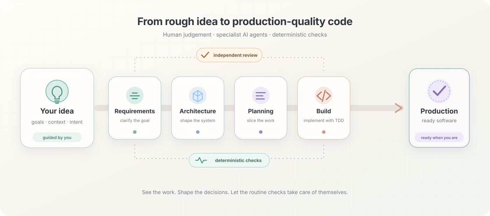

# Agent Factory

**Turn a rough idea into production-quality code—with an AI engineering team you can inspect, guide, and trust.**

Agent Factory equips your AI coding CLI with specialist agents, proven engineering methods, repeatable playbooks, and automated quality gates. You approve the important decisions; the factory does the structured work.

[Get started](factory/README.md) · [Read the beginner's guide](docs/arc42/beginner-intro.md) · [See how it works](docs/arc42/concepts.md)



## AI can write code. Agent Factory helps it engineer software.

One long prompt is not a development process. Agent Factory turns AI-assisted coding into a sequence of focused jobs, independent reviews, and mechanical checks.

- **Specialists, not one generalist** — requirements, architecture, planning, implementation, and QA each have a dedicated agent.
- **Independent review** — authors and reviewers work in separate sessions, so an agent never approves its own work.
- **Deterministic quality gates** — scripts catch structural defects before AI judgement or human review is spent on them.
- **Proven methods** — Cockburn use cases, arc42, Structurizr, ATAM, INVEST, TDD, Fagan inspection, and OWASP are built into the workflow.
- **You stay in control** — human approval gates protect the decisions that shape the product.

## From idea to production

```text
Requirements ↔ Review → Architecture ↔ Review → Planning → Implementation → Reconciliation ↔ QA
```

The full workflow takes a project through five engineering phases. Each phase produces inspectable artifacts and creates a stronger foundation for the next.

You do not need the full chain for every task. Included playbooks provide shorter routes for prototypes, bug fixes, new features, existing codebases, and research.

## Choose your starting point

| I want to…                                   | Start here                                              |
| -------------------------------------------- | ------------------------------------------------------- |
| Understand the idea without running commands | [Beginner's introduction](docs/arc42/beginner-intro.md) |
| Install Agent Factory in a project           | [Factory quick start](factory/README.md)                |
| See the agents, gates, and design principles | [How Agent Factory works](docs/arc42/concepts.md)       |
| Explore the toolset itself                   | [`factory/`](factory/README.md)                         |
| Understand the architecture                  | [Architecture documentation](docs/README.md)            |
| Try automated workflow execution             | [`orchestrator/`](orchestrator/README.md)               |

## What you get

### Specialist agents

Dedicated agents interview stakeholders, write and review specifications, design architecture, plan delivery, implement stories with TDD, reconcile documentation, and inspect quality and security.

### Reusable skills

Each skill captures a focused engineering technique. Skills keep agent sessions short, precise, and grounded in repeatable practice instead of improvised prompting.

### Situation-specific playbooks

Pick a recipe that fits the work: explore an idea, build a greenfield product, change an existing system, fix a bug, or conduct falsification-driven research.

### Automated checks

Formatting, schemas, traceability, architecture consistency, tests, and phase-entry rules are checked by deterministic scripts. Failures are reproducible and actionable.

### Safety by design

Project-local resources take precedence, dangerous Git operations are guarded, and installation is idempotent and reversible. Agent Factory adds tooling without taking ownership of your repository.

## Quick start

Install the factory into a new or existing project:

```bash
git clone <agent-factory-repo-url> agent_factory
mkdir my-project && cd my-project
../agent_factory/factory/scripts/init-factory
```

Then open your supported AI coding CLI in `my-project` and choose a playbook. For prerequisites, supported CLIs, removal, and the complete walkthrough, see the [Factory quick start](factory/README.md).

For the fastest first experiment, try the [`poc-spike`](factory/playbooks/poc-spike.md) playbook. It turns one idea into a runnable prototype without requiring the full production workflow.

## Built around a simple principle

> Creation is agentic. Validation is deterministic. Decisions remain human.

Agent Factory uses AI where interpretation and synthesis matter. It uses scripts where correctness can be checked mechanically. It asks you to approve choices whose consequences belong to you.

The result is not autonomous software development. It is a disciplined collaboration between human judgement, specialist AI agents, and reproducible engineering controls.

## Repository map

- **[`factory/`](factory/README.md)** — the installable toolset: agents, skills, playbooks, rulebooks, scripts, and checks. Start here to use Agent Factory.
- **[`orchestrator/`](orchestrator/README.md)** — the optional CLI for driving playbooks automatically. It is under active development.
- **[`docs/`](docs/arc42/concepts.md)** — concepts, specifications, decisions, reviews, and arc42 architecture documentation.
- **`backlog/`, `config/`** — this repository's own planning and configuration, maintained with Agent Factory.

## Project status

The core factory toolset is usable today. The optional orchestrator is still a work in progress, and its interfaces may evolve.

Agent Factory is licensed under the [MIT License](LICENSE). Created by [Matthias Daues](AUTHORS.md).
