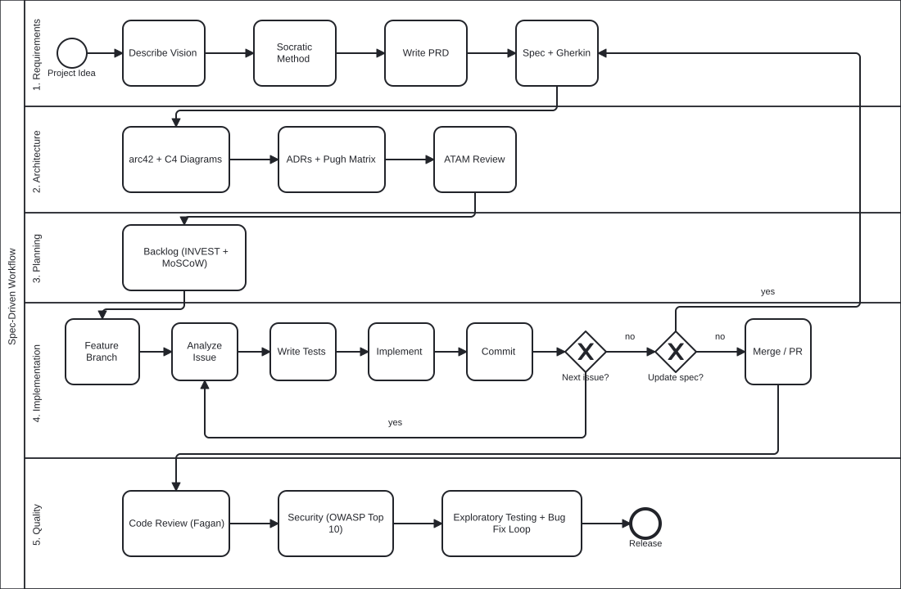

# Agent Factory

Agent Factory is a structured, AI-assisted software development workflow. It takes a project from a rough idea to production-quality code. It is built on [Semantic Anchors — Spec Driven Development](https://llm-coding.github.io/Semantic-Anchors/spec-driven-development) by Ralf D. Müller, adapted for [arc42](https://arc42.org/) architecture documentation and [Structurizr](https://structurizr.com/) DSL.



## Purpose

Agent Factory is a toolset of **agents**, **skills**, and **deterministic gates**. Together they drive an AI coding CLI through a full development lifecycle:

1. **Requirements** — interview, PRD, Cockburn use cases, supplementary specs
2. **Architecture** — arc42 documentation, Structurizr C4 model, ADRs, ATAM review
3. **Planning** — backlog with INVEST stories, MoSCoW prioritisation, dependency links
4. **Implementation** — TDD per issue, spec feedback loop, spec reconciliation
5. **Quality** — Fagan inspection, OWASP security review, exploratory bug hunt

Each phase has an **author agent** and a **reviewer agent**. The author produces artifacts. The reviewer evaluates them independently, in a separate session. The pair loops until the review is clean. This is the same principle as not reviewing your own pull request.

```
requirements ↔ spec-review → architecture ↔ architecture-review → planning → implementation → reconciliation ↔ qa
```

### Key ideas

- **Semantic anchors** steer the AI toward well-known engineering methods — Cockburn, EARS, ATAM, Fagan, TDD — instead of ad-hoc prompts.
- **Deterministic gates** catch provable defects before an LLM spends judgement on them. They are cheap, reproducible, and free of false positives. See below.
- **Session isolation.** Run each agent in its own session. A reviewer should never see the author's reasoning.
- **Eichhorst's Principle.** An LLM is a noisy channel. Short transmissions with error correction — compiler, tests, review — beat one long, unchecked prompt. Each skill is one short transmission.

### Deterministic gates

In manual mode, the review agents invoke these linters directly, as their first step.

| Gate                           | Fires at                        | What it checks                                                                                                                      |
| ------------------------------ | ------------------------------- | ----------------------------------------------------------------------------------------------------------------------------------- |
| `factory/scripts/spec-lint`    | Phase 1 → 2 boundary            | Use-case coverage, traceability links between PRD → actor-goals → use cases → supplementary specs, ID uniqueness, required sections |
| `factory/scripts/arch-lint`    | Phase 2 → 3 boundary            | arc42 chapters exist and cross-reference the Structurizr DSL, ADR index consistency, diagram file references                        |
| `factory/scripts/backlog-lint` | Phase 3 → 4 boundary            | YAML frontmatter schema, dependency graph acyclicity, priority and status values                                                    |
| `factory/scripts/matrix-lint`  | `config/model-matrix.conf` edit | `config/model-matrix.conf` syntax, required fields, valid tier/model mappings                                                       |

These scripts live in `factory/scripts/`. They are stdlib-only Python and run standalone:

```bash
factory/scripts/spec-lint docs/spec/
factory/scripts/arch-lint --docs-dir docs/
factory/scripts/backlog-lint backlog/
factory/scripts/matrix-lint config/model-matrix.conf
```

______________________________________________________________________

## Prerequisites

You need five tools. Skip any line you already have.

| Tool                 | What it does                                                                                                    | Install                                                                                                            |
| -------------------- | --------------------------------------------------------------------------------------------------------------- | ------------------------------------------------------------------------------------------------------------------ |
| **Git**              | Version control                                                                                                 | macOS: `xcode-select --install`. Linux: `sudo apt install git` (Debian/Ubuntu) or `sudo dnf install git` (Fedora). |
| **Python ≥ 3.10**    | Runs the lint scripts and the init script                                                                       | macOS: `brew install python@3.12`. Linux: `sudo apt install python3.12` or equivalent.                             |
| **uv**               | Runs `mdformat`, `ruff`, and `pre-commit` on demand, via `uvx` — nothing else to install for linting/formatting | `curl -LsSf https://astral.sh/uv/install.sh \| sh` ([docs](https://docs.astral.sh/uv/))                            |
| **Docker**           | Runs Structurizr, for diagram export only                                                                       | [Install Docker](https://docs.docker.com/get-docker/)                                                              |
| **An AI coding CLI** | The agent runtime                                                                                               | See below                                                                                                          |

You do not need to separately install `ruff`, `mdformat`, or `pre-commit`. Every gate script and hook runs them through `uvx`. This matches the zero-local-install pattern `factory/scripts/structurizr` already uses for Docker.

### Pick an AI coding CLI

Install one, or more. This README's examples use GitHub Copilot CLI.

| CLI                                                           | Install docs                                 |
| ------------------------------------------------------------- | -------------------------------------------- |
| [GitHub Copilot CLI](https://docs.github.com/en/copilot)      | Requires a Copilot subscription and `gh` CLI |
| [Claude Code](https://docs.anthropic.com/en/docs/claude-code) | `npm install -g @anthropic-ai/claude-code`   |

### Verify everything is ready

```bash
git --version      # ≥ 2.x
python3 --version  # ≥ 3.10
uvx --version       # bundled with uv
docker info         # daemon running
```

______________________________________________________________________

## Quick Start

This sets up a brand-new project from scratch.

```bash
# 1. Clone Agent Factory somewhere on disk. You only do this once per machine.
git clone <agent-factory-repo-url> agent_factory

# 2. Create your project directory (or use one you already made).
mkdir my-project && cd my-project

# 3. Run the init script against it.
../agent_factory/factory/scripts/init-factory
```

`init-factory` does the rest of the work: it runs `git init` if needed, copies `factory/` into your project, symlinks its content into `.claude/` and `.github/`, copies `config/model-matrix.conf` in as an editable starter, wires up `.pre-commit-config.yaml`, and runs `pre-commit install`. It is a plain, standalone Python script. **It needs no AI to run it** — a shell is enough.

Check it worked:

```bash
git status                        # .pre-commit-config.yaml and config/ are now untracked, ready to commit
git add -A && git commit -m "init: wire up Agent Factory"
```

The first commit may modify a few files (`mdformat`/`ruff` auto-fixing formatting). If it does, re-stage and commit again — see [Troubleshooting](#troubleshooting).

Open your AI coding CLI in `my-project` and greet it. It should read `.claude/CLAUDE.md` (or `.github/copilot-instructions.md`) and confirm it understands the local-first rule.

______________________________________________________________________

## Use in an Already Existing Repo

`init-factory` works the same way against a repo that already has its own history, its own `.gitignore`, and its own `.pre-commit-config.yaml`. Run it from inside that repo:

```bash
cd /path/to/existing-project
/path/to/agent_factory/factory/scripts/init-factory
```

What it does differently here, compared to a fresh project:

- **`.gitignore`** — appends only the lines Agent Factory needs (`.claude`, `.github`, and so on). It never rewrites or duplicates what is already there.
- **`.pre-commit-config.yaml`** — if the file does not exist, it is symlinked in, exactly as in a fresh project. If it already exists as a real file, `init-factory` hands off to `factory/scripts/merge-precommit-config`, which splices Agent Factory's hooks into your existing `repos:` list. Your existing hooks are left untouched.
- **Everything else** — `docs/`, your own scripts, your own configuration — is left alone. `init-factory` never touches a file or directory it did not create.

The script is idempotent. Run it again at any time; anything already correctly in place is skipped, not redone. If it finds something it cannot safely work around — a real file already sitting where a symlink needs to go, or a `.pre-commit-config.yaml` shape it does not recognize — it stops immediately and names the exact path. It never partially applies a run.

To trigger the same script conversationally instead of from a shell, use the `init-factory` skill (`factory/skills/init-factory/SKILL.md`). It confirms the target with you, runs the script, and relays its output. On the very first run in a project, there is no installed skill yet to call by name — point the CLI at the file directly: "read `factory/skills/init-factory/SKILL.md` in the agent_factory checkout and follow it."

______________________________________________________________________

## Troubleshooting

**`init-factory: STOPPED — <path> already exists and is not a symlink to <dest>`**
Something real is already at that path — not one of Agent Factory's own symlinks. Move, rename, or remove it, then re-run `init-factory`. The script never overwrites a file it does not recognize as its own.

**`merge-precommit-config` reports it cannot merge your `.pre-commit-config.yaml`**
This happens when the file has no top-level `repos:` list in block style, or when its existing hooks are indented differently than 2 spaces. Merge Agent Factory's hooks in by hand: copy the `- repo: local` block from `factory/config/pre-commit-config.yaml` into your own file's `repos:` list.

**`uvx: command not found`**
Install `uv` — see [Prerequisites](#prerequisites). Every gate, and `pre-commit` itself, runs through `uvx`.

**`docker info` fails, or Structurizr export fails**
Start Docker Desktop (macOS) or the Docker daemon (Linux). This only blocks diagram export (`factory/scripts/structurizr`) — nothing else in Agent Factory needs Docker.

**Your first commit fails, or modifies files you did not touch**
Expected. The `mdformat` and `ruff` hooks auto-fix formatting on commit. Re-stage the files they changed and commit again:

```bash
git add -u
git commit -m "<same message>"
```

**`factory/` looks out of date after you update the agent_factory checkout**
`init-factory` only copies `factory/` in once — if it already exists in your project, it is left alone. There is no update script yet. For now, delete your project's `factory/` directory and re-run `init-factory` to refresh it.

**Symlinks do not work on Windows**
Agent Factory targets macOS and Linux only. Both rely on native, git-tracked symlinks (`git` stores a symlink as a blob of mode `120000`), which Windows does not support the same way.

______________________________________________________________________

## Project Directory Tree

**Orchestrator** is a permanent, nested sub-project that provides the Python CLI driving agent sessions. It has its own `src/`, `tests/`, `docs/`, `backlog/`, and `pyproject.toml`. Unlike `factory/` (which is copied wholesale into consumer projects by `init-factory`), `orchestrator/` is not distributed — `init-factory` does not touch it.

```
agent_factory/
├── factory/                          # Canonical content. Copied wholesale into any project; never hand-edited there.
│   ├── agents/                       # One .md file per agent
│   ├── skills/                       # One folder per skill, each holding a SKILL.md
│   ├── playbooks/                    # End-to-end flows for common scenarios (bug fix, feature addition, ...)
│   ├── rulebooks/                    # Cross-cutting conventions: commit format, cross-references, ADR style, ...
│   ├── scripts/                      # Deterministic gates (*-lint) plus setup tooling (init-factory, mdformat, ...)
│   ├── config/                       # Templates: AGENTS.md, pre-commit-config.yaml, model-matrix.conf
│   └── INDEX.md                      # Generated catalog of every agent and skill — regenerate with index-lint
├── orchestrator/                     # Python CLI that drives agent sessions (run-step, run-phase, etc.) — nested sub-project, not distributed by init-factory
│   ├── src/                          # CLI source code
│   ├── tests/                        # CLI tests
│   ├── docs/                         # CLI documentation
│   ├── backlog/                      # CLI backlog and stories
│   └── pyproject.toml                # CLI package configuration
├── docs/                             # This project's own specification and architecture, not Agent Factory's
│   ├── spec/                         # PRD, use cases, supplementary specs, todo.md — created lazily, as needed
│   ├── adr/                          # Architecture Decision Records — created lazily, as needed
│   ├── findings/                     # Review findings, one file per finding
│   └── assets/                       # Diagrams and exported images
├── config/                           # This project's own copy of model-matrix.conf — diverges from factory/
│   └── model-matrix.conf
├── .claude/                          # Local only, gitignored. Symlinks into factory/, for Claude Code.
├── .github/                          # Local only, gitignored. Symlinks into factory/, for GitHub Copilot CLI.
├── .pre-commit-config.yaml           # Symlink to factory/config/pre-commit-config.yaml
├── .gitignore
└── README.md
```
