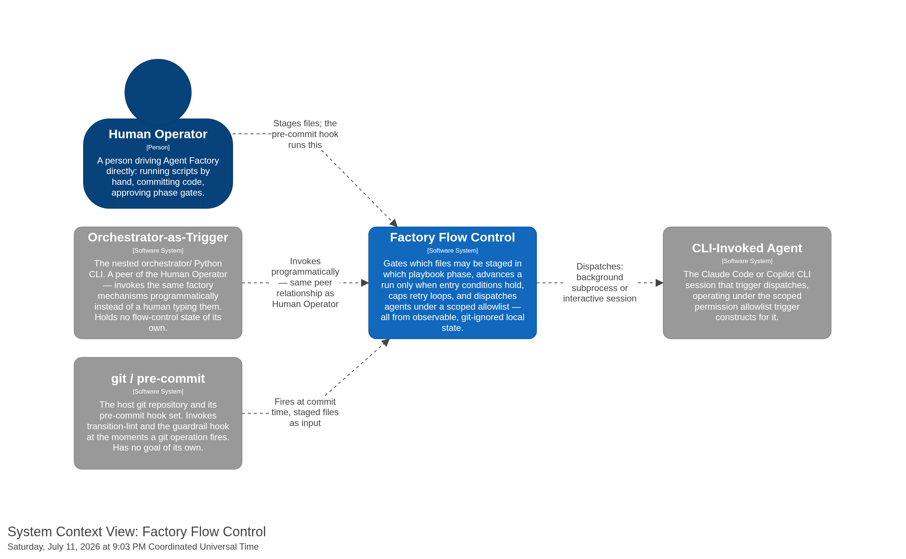

[back to index](README.md)

# 3. System Scope and Context

## 3.1 Business Context

Factory Flow Control gates, advances, caps, and dispatches a playbook run. It has one primary actor with two peer forms — a person and a program — plus one secondary actor it dispatches, and one supporting actor that invokes it at fixed moments.

| Actor                       | Relationship to the system                                                                                                                                                                                                                             |
| --------------------------- | ------------------------------------------------------------------------------------------------------------------------------------------------------------------------------------------------------------------------------------------------------ |
| **Human Operator**          | Runs `transition-lint`, `phase advance`/`retry`, `trigger`, and the `run-step` skill by hand.                                                                                                                                                          |
| **Orchestrator-as-Trigger** | The nested `orchestrator/` Python CLI. Invokes `phase` and `trigger` programmatically — a peer of the Human Operator, not their replacement. Holds no flow-control state of its own; see [09_architecture_decisions.md](09_architecture_decisions.md). |
| **CLI-Invoked Agent**       | The Claude Code or Copilot CLI session `trigger` dispatches, operating under a scoped permission allowlist `trigger` builds for it.                                                                                                                    |
| **git / pre-commit**        | Invokes `transition-lint` and `block-dangerous-git.sh` at the moments a git operation or shell command fires. Has no goal of its own.                                                                                                                  |

Full actor descriptions: [docs/spec/actor-goal-list.md § Actors](spec/actor-goal-list.md#actors).

## 3.2 Technical Context

| Channel                          | Direction         | Payload                                                                                                                                  |
| -------------------------------- | ----------------- | ---------------------------------------------------------------------------------------------------------------------------------------- |
| Shell invocation                 | Actor → mechanism | CLI flags and arguments (`transition-lint`, `phase advance`/`retry`, `trigger`, `index-lint`)                                            |
| `PreToolUse` hook, JSON on stdin | CLI → hook script | `.tool_input.command` (Claude Code) or `.toolArgs.command` (Copilot CLI)                                                                 |
| Marker file                      | mechanism ↔ disk  | `.agent-factory/playbook-state.yml` — flat `key: value` YAML, git-ignored                                                                |
| FSM file                         | mechanism ← disk  | `factory/playbooks/<name>.fsm.yml` — states, gate/entry/halt conditions                                                                  |
| Catalog file                     | mechanism ↔ disk  | `factory/INDEX.yaml` — generated, never hand-edited                                                                                      |
| Findings                         | mechanism ← disk  | `docs/findings/<TAG>-NNNN.md` — YAML frontmatter `status: open\|resolved`                                                                |
| Subprocess exit code             | mechanism ← CLI   | The dispatched CLI's raw exit code — no failure classification (see [T-01](spec/todos.md#t-01-no-cli-failure-classification-in-trigger)) |

Full interface contracts, including exit codes per mechanism: [docs/spec/supplementary_specs/interface-contracts.md](spec/supplementary_specs/interface-contracts.md).

## 3.3 Scope boundary

What Factory Flow Control explicitly does **not** do — full detail: [docs/spec/prd.md § 2 Non-Goals](spec/prd.md#2-goals-and-non-goals).

- **Not a re-implementation of `orchestrator/`'s `PhaseRunner`.** `orchestrator/` may call these mechanisms; factory does not duplicate its run-state model (`RUN`, `RUN_LOCK`, single-active-run invariant) — `orchestrator/` keeps that bookkeeping for its own concerns.
- **Not a general CI system.** `pre-commit` and the CLIs do the work; these scripts sequence and gate them.
- **No CLI-failure classification.** A non-zero exit from `trigger` means: read the output, do not auto-retry. Named gap: [T-01](spec/todos.md#t-01-no-cli-failure-classification-in-trigger).
- **No state machine for every playbook.** Only `greenfield-development.fsm.yml` exists today; the harness is opt-in per playbook.
- **No run lock or single-active-run invariant across concurrent operators.** The marker is a single flat file; two operators racing it is out of scope. Named gap: [T-02](spec/todos.md#t-02-no-concurrent-operator-lock-on-the-marker).

## Referenced from

- [docs/spec/prd.md § 3 Target Actors](spec/prd.md#3-target-actors)
- [docs/spec/supplementary_specs/interface-contracts.md](spec/supplementary_specs/interface-contracts.md)
