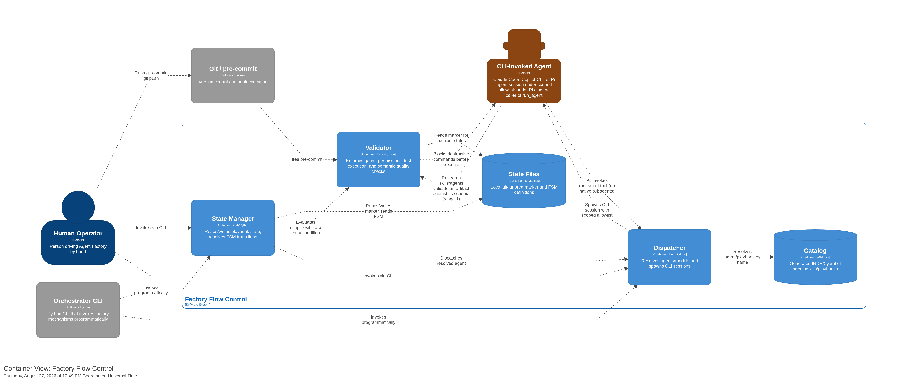

[back to index](README.md)

# 5. Building Block View

## 5.1 Level 1: Container View

Factory Flow Control consists of three primary containers:

| Container         | Responsibility                                                                                   | Technology     |
| ----------------- | ------------------------------------------------------------------------------------------------ | -------------- |
| **State Manager** | Reads/writes playbook state marker, resolves FSM transitions, drives phases                      | Bash, Python   |
| **Validator**     | Enforces gates, permissions, test execution via unavoidable hooks                                | Bash, Python   |
| **Dispatcher**    | Resolves agents/models from catalog, spawns CLI sessions with scoped permits                     | Bash, Python   |
| State Files       | Local git-ignored marker (`.agent-factory/playbook-state.yml`) and FSM defs                      | YAML (storage) |
| Catalog           | Generated `factory/INDEX.yaml` from agent/skill/playbook/rulebook frontmatter, with token counts | YAML (storage) |

## 5.2 Level 2: Component View — Validator

The **Validator** container enforces three kinds of deterministic gates:

| Component               | Trigger Point                  | What it validates                                   | Exit codes                           |
| ----------------------- | ------------------------------ | --------------------------------------------------- | ------------------------------------ |
| **transition-lint**     | Pre-commit hook (git commit)   | Staged files match current phase's `outputs:` globs | 0 (pass), 1 (findings)               |
| **block-dangerous-git** | PreToolUse hook (both CLIs)    | Shell command not in deny list                      | 0 (allow), 2 (deny)                  |
| **run-tests**           | Pre-commit, pre-push, FSM gate | Project tests pass via auto-detected framework      | 0 (pass), 1 (fail), 2 (no framework) |

### 5.2.1 run-tests — Test Execution Component

**Purpose**: Framework-agnostic test runner invoked by unavoidable hooks. Agents cannot run tests; only hooks can.

**Interfaces**:

- **IN (CLI)**: `--changed-only` (pre-commit fast subset), `--full` (pre-push, phase advance), `--staged` (agent iteration on staged files)
- **OUT (stdout)**: JSON summary `{"passed": N, "failed": M, "skipped": K, "duration_ms": T}`
- **OUT (stderr)**: Framework-native test output (failures, errors, progress)
- **OUT (exit code)**: 0 (pass), 1 (test failures), 2 (framework detection/config error)

**Behavior**:

1. **Framework Detection** (BR-023): Scans project structure for all framework markers:
   - `pyproject.toml` + pytest → `uv run pytest`
   - `package.json` + jest/npm test → `npm test`
   - `go.mod` → `go test ./...`
   - `Cargo.toml` → `cargo test`
   - Multiple frameworks detected → exit 2 with error listing all found markers (monorepo multi-framework not yet supported)
   - None found → exit 2 with error listing checked markers
2. **Mode Selection**:
   - `--changed-only`: Fast subset (pytest `--lf`, jest `--onlyChanged`, go/cargo per-package filter)
   - `--full`: Complete suite, no filtering
   - `--staged`: Tests on staged files only (agent iteration mode, no commit required)
3. **Invocation**: Runs detected command, streams stderr for real-time progress
4. **Result**: Emits JSON summary on stdout, exits with framework's exit code

**Integration Points**:

- **Pre-commit hook**: Fires on `git commit`, runs `--changed-only` mode. Fast feedback. Bypassable via `--no-verify` (discouraged).
- **Pre-push hook**: Fires on `git push`, runs `--full` mode. "Ready to share" gate. No bypass.
- **Phase advance FSM gate**: Evaluated as `script_exit_zero: factory/scripts/run-tests --full` entry condition. Phase refuses to advance if tests fail.
- **Agent iteration**: `factory/scripts/run-tests --staged` runs tests on staged files without committing. Agents can stage test files and verify before commit. Included in agent allowlist (BR-024).
- **Agent prohibition**: Bare test commands (`pytest`, `npm test`, etc.) are denied by `block-dangerous-git.sh` at PreToolUse. Agents see exit 2 with message directing them to `run-tests --staged` or hook output.

**Referenced Specifications**:

- [UC-09 — Run Tests via Hook](spec/use_cases/UC-09-run-tests-via-hook.md)
- [PRD § FR-I — Test Execution](spec/prd.md#fr-i--test-execution-run-tests)
- [validation-rules.md § Test execution (BR-023..BR-027)](spec/supplementary_specs/validation-rules.md#test-execution-run-tests-br-023-br-024-br-025-br-026-br-027)

## 5.3 Level 2: Component View — State Manager

| Component          | What it does                                                          | Reads                        | Writes               |
| ------------------ | --------------------------------------------------------------------- | ---------------------------- | -------------------- |
| **phase advance**  | Advances marker to next state when entry conditions met               | Marker, FSM, gate results    | Marker               |
| **phase retry**    | Retries current phase's author step, capped by FSM `halt_conditions`  | Marker, FSM                  | Marker (iteration++) |
| **run-step skill** | Derives "what's next" from observable state (fresh, resume, escalate) | Marker, FSM, outputs on disk | (none — read-only)   |

All three read the same marker (`.agent-factory/playbook-state.yml`) and FSM (e.g., `greenfield-development.fsm.yml`). Single source of truth.

## 5.4 Level 2: Component View — Dispatcher

| Component      | What it does                                                                              | Reads      | Writes     |
| -------------- | ----------------------------------------------------------------------------------------- | ---------- | ---------- |
| **trigger**    | Resolves agent/model, spawns CLI session with scoped permits                              | INDEX.yaml | (none)     |
| **index-lint** | Generates INDEX.yaml from frontmatter with token budget counts; `--check` validates drift | source .md | INDEX.yaml |

## 5.5 Interfaces Summary

Every building block's entry point, invoked how, and by whom:

| Script / Component     | Invoked by                              | Entry point                                              | Exit codes                                   |
| ---------------------- | --------------------------------------- | -------------------------------------------------------- | -------------------------------------------- |
| transition-lint        | Pre-commit hook                         | `factory/scripts/transition-lint`                        | 0 (pass), 1 (findings)                       |
| run-tests              | Pre-commit, pre-push, phase advance     | `factory/scripts/run-tests [--changed-only\|--full]`     | 0 (pass), 1 (fail), 2 (no framework)         |
| block-dangerous-git.sh | PreToolUse hook (both CLIs)             | stdin: JSON with command, stdout: empty, exit 0 or 2     | 0 (allow), 2 (deny)                          |
| phase advance          | Human, orchestrator                     | `factory/scripts/phase advance`                          | 0 (advanced), 1 (conditions unmet), 2 (misc) |
| phase retry            | Human, orchestrator                     | `factory/scripts/phase retry [--default-max-iterations]` | 0 (retried), 2 (cap exceeded)                |
| trigger                | Human, orchestrator, run-step skill     | `factory/scripts/trigger agent <name> [--background]`    | 0 (dispatched), 1+ (error)                   |
| index-lint             | Pre-commit hook, CI                     | `factory/scripts/index-lint [--check]`                   | 0 (fresh), 1 (stale)                         |
| run-step skill         | Claude Code, Copilot CLI (LLM-executed) | Skill markdown invoked by AI                             | (N/A — skill is prose)                       |

## Referenced from

- [06_runtime_view.md § 6.2](06_runtime_view.md#62-test-execution-flow)
- [09_architecture_decisions.md](09_architecture_decisions.md)
