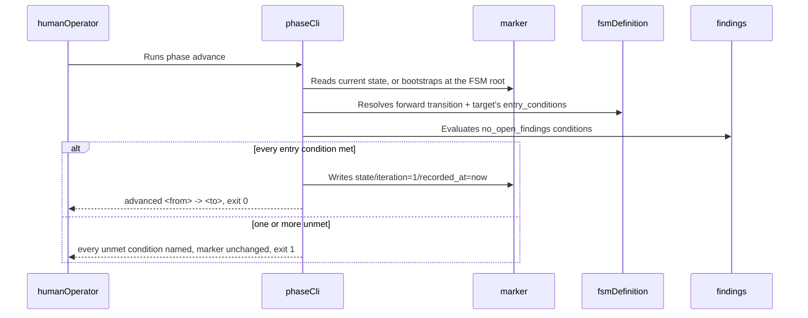
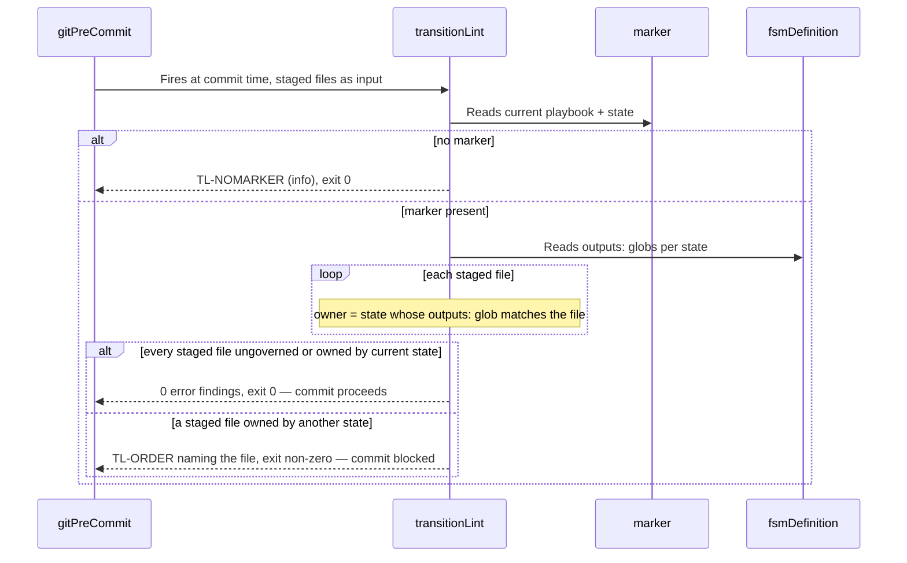
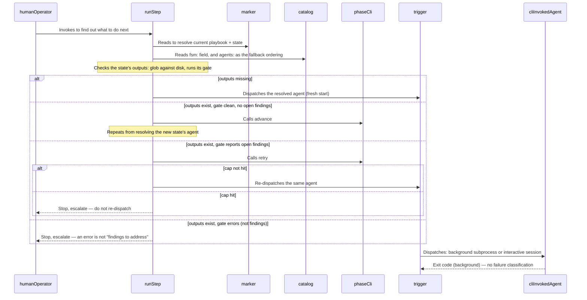
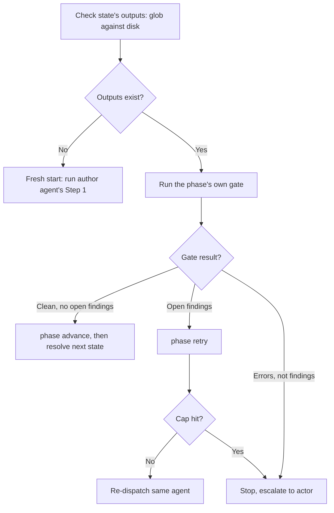

[back to index](README.md)

# 6. Runtime View

## 6.1 Advance a playbook phase (UC-01)

Derived from dynamic view `PhaseAdvance` in [`architecture.dsl`](architecture.dsl).



Full scenario, extensions, and business rules: [docs/spec/use_cases/UC-01-advance-a-playbook-phase.md](spec/use_cases/UC-01-advance-a-playbook-phase.md).

## 6.2 Block an out-of-phase commit (UC-02)

Derived from dynamic view `BlockOutOfPhaseCommit` in [`architecture.dsl`](architecture.dsl).



Full scenario, extensions, and business rules: [docs/spec/use_cases/UC-02-block-an-out-of-phase-commit.md](spec/use_cases/UC-02-block-an-out-of-phase-commit.md).

## 6.3 Retry a phase within the iteration cap (UC-03)

Short sequence — no dedicated DSL dynamic view; `phase retry` uses the same `phaseCli` → `marker`/`fsmDefinition` relationships as §6.1, just a different subcommand.

```mermaid
sequenceDiagram
    participant Actor as humanOperator or orchestratorAsTrigger
    participant PC as phaseCli
    participant MK as marker
    participant FS as fsmDefinition

    Actor->>PC: Runs phase retry
    PC->>MK: Reads current state
    PC->>FS: Resolves loop-back target (else transition, or current state)
    PC->>FS: Resolves iteration limit (halt_conditions, or --default-max-iterations)
    Note over PC: iteration += 1
    alt iteration <= limit
        PC->>MK: Writes iteration + fresh recorded_at
        PC-->>Actor: "<state>: retry <n>/<limit> recorded", exit 0
    else iteration > limit
        PC-->>Actor: cap reached + declared message, exit 2 — marker NOT written
    end
```

Full scenario, extensions, and business rules: [docs/spec/use_cases/UC-03-retry-a-phase-within-the-iteration-cap.md](spec/use_cases/UC-03-retry-a-phase-within-the-iteration-cap.md).

## 6.4 Resume and dispatch (UC-05, UC-04)

Derived from dynamic view `ResumeAndDispatch` in [`architecture.dsl`](architecture.dsl). This is the mechanism that makes a crashed session, a closed terminal, or a fresh session safe to resume: every fact is re-derived from disk, never trusted from a persisted status.



Full scenario, extensions, and business rules: [docs/spec/use_cases/UC-05-resume-an-interrupted-playbook-run.md](spec/use_cases/UC-05-resume-an-interrupted-playbook-run.md), [docs/spec/use_cases/UC-04-dispatch-an-agent-via-trigger.md](spec/use_cases/UC-04-dispatch-an-agent-via-trigger.md).

## 6.5 Gate outcome decision (flowchart)

Not a DSL view — a decision table rendered as a flowchart, matching [`run-step` § Step 3](../factory/skills/run-step/SKILL.md#step-3-decide-fresh-start-resume-mid-step-or-already-done).



## Referenced from

- [docs/spec/use_cases/system-use-cases.md](spec/use_cases/system-use-cases.md)
