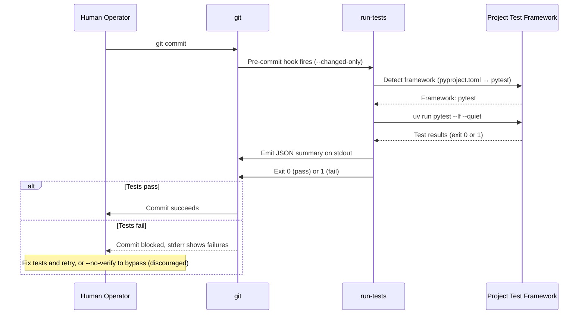
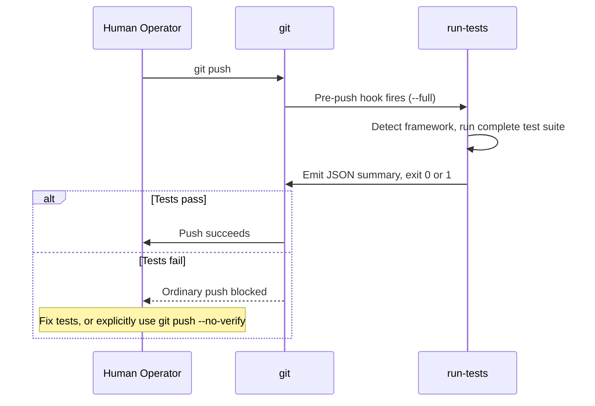
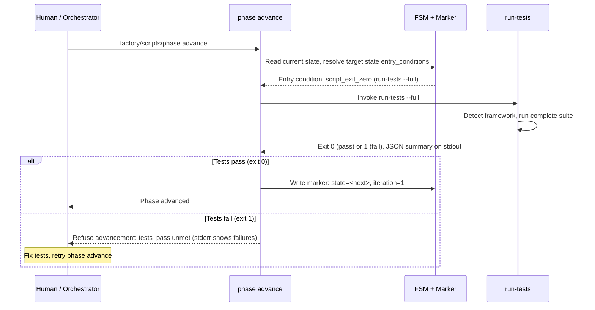
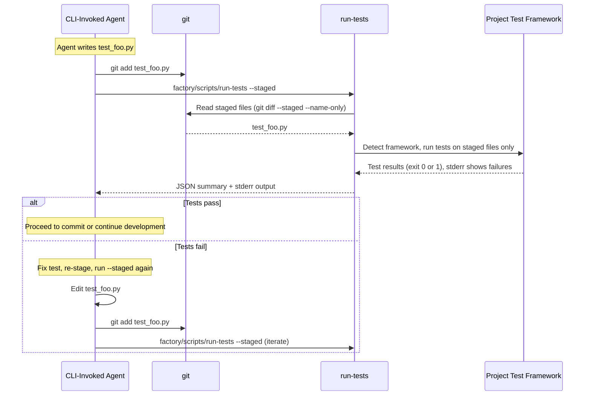
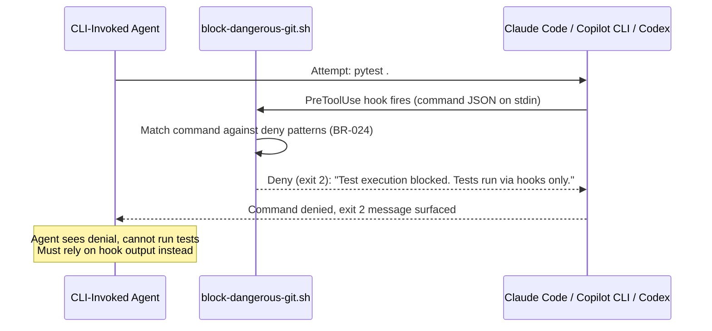

[back to index](README.md)

# 6. Runtime View

## 6.1 Overview

This chapter describes key interaction sequences, focusing on **test execution** — the newest flow and the one most central to the "Agentic Creation, Deterministic Validation" principle. Other runtime scenarios (phase advance, agent dispatch, retry loops) are documented here as needed for context but are not exhaustive; see use cases in [`spec/use_cases/`](spec/use_cases/) for full flows.

## 6.2 Test Execution Flow

Derived from dynamic view `TestExecutionFlow` in [`architecture.dsl`](architecture.dsl).

Test execution happens via three mechanically triggered integration points, never via bare agent-commanded shell execution. Agents can write test files; Factory guardrails require them to use the staged test runner for iteration.

### 6.2.1 Sequence: Pre-Commit Hook (Changed Files Only)

**Key Points**:

- **Fast feedback**: `--changed-only` mode uses framework-specific fast filters (pytest `--lf`, jest `--onlyChanged`)
- **Bypassable**: Human can use `git commit --no-verify` for WIP commits (not recommended)
- **Agent path**: If agent commits, same hook fires; agent sees hook output (pass/fail) but cannot bypass

### 6.2.2 Sequence: Pre-Push Hook (Full Suite)

**Key Points**:

- **Complete validation**: `--full` mode runs entire test suite, no filtering
- **Default ready-to-share gate**: Ordinary pushes run the full suite and stop on failure
- **Client-side boundary**: A human can bypass the hook with `git push --no-verify`; repository-wide enforcement requires a server-side or required-CI gate

### 6.2.3 Sequence: Phase Advance Gate Evaluation

**Key Points**:

- **FSM-driven**: Test execution is an entry condition (`script_exit_zero: factory/scripts/run-tests --full`)
- **Blocks phase transition**: Phase cannot advance while tests are red
- **Exhaustive reporting**: All unmet conditions listed (not short-circuited)

### 6.2.4 Sequence: Agent Iteration with Staged Mode

**Key Points**:

- **Tight feedback loop**: Agent can iterate on tests without committing
- **Same validation path**: Uses `run-tests` script, not bare test commands
- **Staged scope only**: Tests only what's staged, fast iteration
- **Agent allowlist**: `factory/scripts/run-tests --staged` permitted (BR-024); bare `pytest` still blocked
- **Pre-commit still runs**: When agent commits, hook runs `--changed-only` authoritatively

### 6.2.5 Sequence: Agent Blocked from Running Tests

**Key Points**:

- **Preventive**: Command blocked *before* execution (PreToolUse hook, not post-facto)
- **Three native-hook CLIs**: Claude Code, Copilot CLI, and Codex invoke the
  shared shell guardrail; Pi enforces the same deny list through its
  project-local extension
- **No workaround**: Agent has no shell access that bypasses PreToolUse; bare test commands are unavailable
- **Allowed alternative**: `factory/scripts/run-tests --staged` is permitted for agent iteration
- **Deny patterns (BR-024)**: The canonical list is maintained in
  `factory/config/hooks/block-dangerous-git.sh`; representative entries include
  `pytest`, package-manager test scripts, `jest`, `vitest`, `mocha`, `go test`,
  `cargo test`, and Python/uv pytest invocations.

## 6.3 Other Runtime Scenarios (Summary)

Full sequences for these flows are in their respective use cases:

- **Phase advance with multiple entry conditions** → [UC-01](spec/use_cases/UC-01-advance-a-playbook-phase.md)
- **Retry loop with iteration cap** → [UC-03](spec/use_cases/UC-03-retry-a-phase-within-the-iteration-cap.md)
- **Agent dispatch (interactive vs. background)** → [UC-04](spec/use_cases/UC-04-dispatch-an-agent-via-trigger.md)
- **Resume after interruption** → [UC-05](spec/use_cases/UC-05-resume-an-interrupted-playbook-run.md)
- **Transition-lint blocking out-of-phase commit** → [UC-02](spec/use_cases/UC-02-block-an-out-of-phase-commit.md)

## Referenced from

- [05_building_block_view.md § 5.2.1](05_building_block_view.md#521-run-tests--test-execution-component)
- [08_crosscutting_concepts.md § 8.1](08_crosscutting_concepts.md#81-agentic-creation-deterministic-validation)
- [09_architecture_decisions.md](09_architecture_decisions.md)
