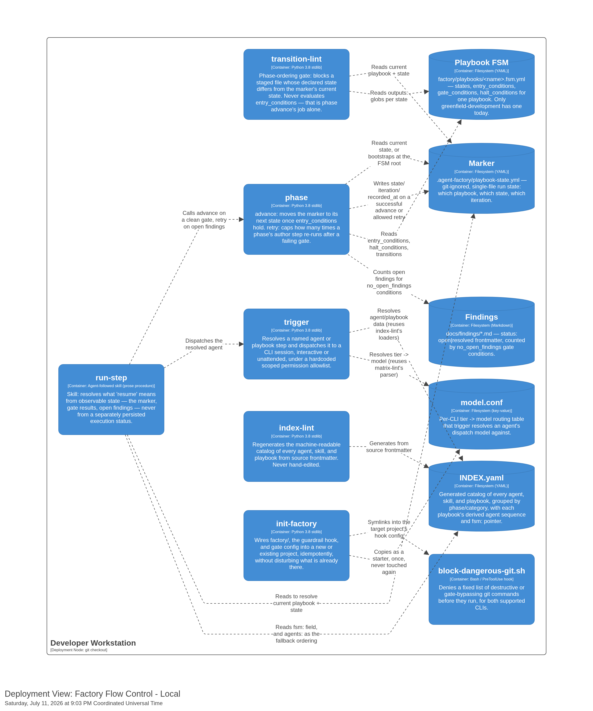

[back to index](README.md)

# 7. Deployment View

## 7.1 Infrastructure

Factory Flow Control has no server, no network service, and no deployment pipeline of its own. Every mechanism is a script or shell hook that runs directly inside a developer's local git checkout, on macOS or Linux (see [02_architecture_constraints.md § 2.1](02_architecture_constraints.md#21-technical-constraints)).

| Node                      | Hosts                                                                                                                                                                                                                       | Notes                                                                                          |
| ------------------------- | --------------------------------------------------------------------------------------------------------------------------------------------------------------------------------------------------------------------------- | ---------------------------------------------------------------------------------------------- |
| **Developer Workstation** | Every script (`transition-lint`, `phase`, `trigger`, `index-lint`, `init-factory`), the `block-dangerous-git.sh` hook, the `run-step` skill, and every flat-file data store (marker, FSM, catalog, `model.conf`, findings). | One process per invocation — a short-lived Python or Bash process, not a long-running service. |

## 7.2 Invocation topology

- **Human Operator** and **Orchestrator-as-Trigger** both run these scripts as direct child processes of their own shell or CLI session — there is no intermediary server between either actor and the mechanism it calls.
- **`trigger`** spawns the target CLI (`claude` or `copilot`) as its own child subprocess, in background (`-p`/print mode, captured output, exit code returned) or interactive (a live session handed to the terminal) mode. The dispatched CLI session is a peer process on the same workstation, not a remote call.
- **`block-dangerous-git.sh`** runs synchronously inside the calling CLI's own `PreToolUse` hook lifecycle — it blocks the tool call, not a separate process the CLI waits on indefinitely.
- The marker, the FSM files, `INDEX.yaml`, and `model.conf` are ordinary files in the same checkout every invocation reads and writes — no database, no cache to invalidate, no network round trip.

## 7.3 What this deliberately excludes

`docs/spec/prd.md`'s vision of a future `Factory API` — a server connecting `run-step`/`trigger` invocations to a web interface — is out of scope for this deployment view. See [docs/CONTEXT-MAP.md § Contexts](CONTEXT-MAP.md#contexts): "Factory API" is a vision-stub only, not scheduled for implementation, and has no bearing on how Factory Flow Control deploys today.

## Referenced from

- [docs/spec/prd.md § 5 Constraints](spec/prd.md#5-constraints)
