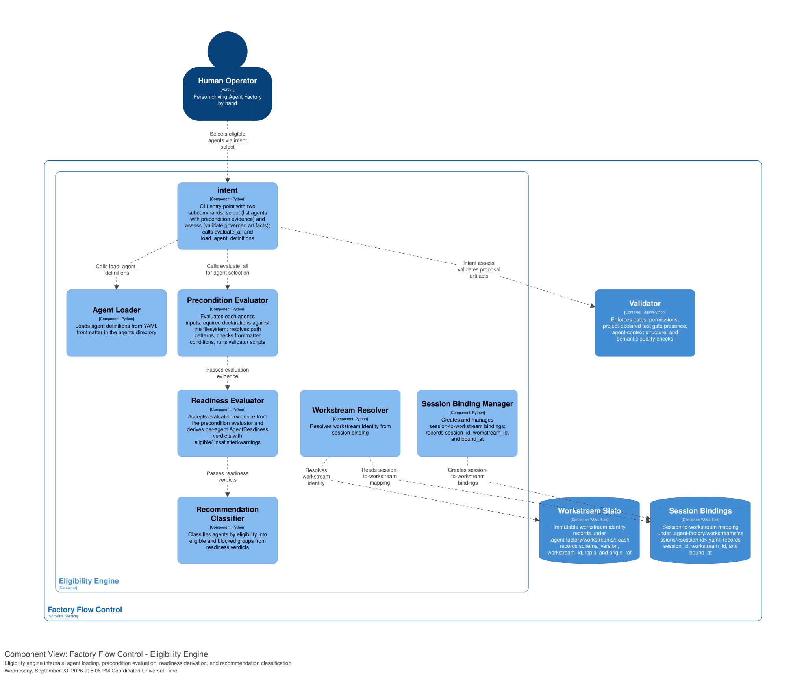
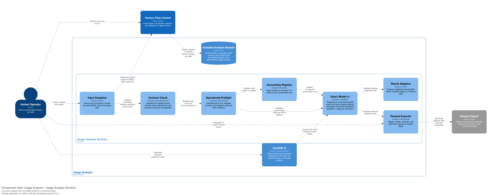

[back to index](../README.md)

# 5. Building Block View

## 5.1 Level 1: Container View

Factory Flow Control produces usage evidence and distributes the opt-in Usage
Analysis system. The two systems share only the Factory-owned record contract
and local JSONL spool.

| Container                  | Responsibility                                                                                                                               | Technology                |
| -------------------------- | -------------------------------------------------------------------------------------------------------------------------------------------- | ------------------------- |
| **Eligibility Engine**     | Evaluates agent preconditions against the repository, derives per-agent readiness, and classifies agents by eligibility                      | Python 3.10+              |
| **Validator**              | Enforces gates, permissions, project-declared test gate presence, agent-context structure, and semantic quality checks                       | Bash, Python              |
| **Dispatcher**             | Resolves agents/models from catalog, spawns CLI sessions with scoped permits                                                                 | Bash, Python              |
| **Usage Capture**          | Normalizes CLI transcripts and appends canonical runtime usage records with optional workstream context                                      | Python, shell, TypeScript |
| **Distribution**           | Installs, updates, removes, and reports opt-in components without coupling them to Factory core                                              | Bash, Python              |
| Workstream State           | Immutable workstream identity records under `.agent-factory/workstreams/`; each records schema_version, workstream_id, topic, and origin_ref | YAML (storage)            |
| Session Bindings           | Session-to-workstream mapping under `.agent-factory/workstreams/sessions/<session-id>.yaml`; records session_id, workstream_id, and bound_at | YAML (storage)            |
| State Files                | Local git-ignored dispatch ledgers and quality-gate reports                                                                                  | YAML/JSON (storage)       |
| Catalog                    | Generated `.agent-factory/factory/INDEX.yaml` from agent/skill/playbook/rulebook frontmatter, with token counts                              | YAML (storage)            |
| Usage Record Contract      | Factory-owned record schema and producer-consumer compatibility policy; v1 schema includes optional workstream and origin fields             | JSON Schema, YAML         |
| Raw Usage Spool            | Authoritative append-only records under `.agent-factory/usage/`                                                                              | JSONL (storage)           |
| Install Manifest           | Records installed CLI integrations and opt-in components                                                                                     | JSON (storage)            |
| **Usage Analysis Runtime** | Reads a snapshotted input set and publishes versioned local DuckDB views                                                                     | Python, DuckDB, PyArrow   |
| DuckDB UI                  | Optional ephemeral localhost exploration of the published views                                                                              | DuckDB bundled UI         |
| Installed Analysis Module  | Locked executable package, SQL, registry, and contract copy under `.agent-factory/usage-analysis/`                                           | Files (storage)           |

## 5.2 Level 2: Component View -- Validator

The **Validator** container enforces deterministic gates. Two are hook-triggered -- they fire mechanically on a git or CLI event, so an agent cannot skip them:

| Component                  | Trigger Point               | What it validates                                                              | Exit codes          |
| -------------------------- | --------------------------- | ------------------------------------------------------------------------------ | ------------------- |
| **block-dangerous-git.sh** | Native hook or Pi extension | Shell command not in deny list; charter-declared test commands are allowlisted | 0 (allow), 2 (deny) |

One is a structural validator for project knowledge files, running both as a pre-commit hook and on demand:

| Component        | Trigger Point              | What it validates                                                                                                                                              | Exit codes              |
| ---------------- | -------------------------- | -------------------------------------------------------------------------------------------------------------------------------------------------------------- | ----------------------- |
| **concern-lint** | Pre-commit hook, on-demand | Concern-oriented agent context: category headings, `Read:`/`Boundary:` path resolution, story concern vocabulary, absence of legacy YAML files (`CTX-*` codes) | 0 (pass), 1+ (findings) |

Two more -- `schema-validate` and `policy-validate` -- are on-demand validators invoked by the research skills and agents (and from the CLI) rather than by a hook. They are described in [section 5.2.2](#522-research-artifact-validators-schema-validate-policy-validate).

Three additional on-demand validators enforce semantic code quality and architecture routing. Two are invoked by the implementation-agent dispatcher (not by hooks) and are described in [section 5.2.3](#523-semantic-quality-gates-crap-score-mutation-analysis-dependency-check); one determines whether a feature needs the architecture phase:

| Component              | Trigger Point                                   | What it validates                                          | Exit codes                       |
| ---------------------- | ----------------------------------------------- | ---------------------------------------------------------- | -------------------------------- |
| **crap-score**         | Dispatcher, after developer-agent commit        | CRAP score (cyclomatic complexity x coverage) per function | 0 (pass), 1 (fail)               |
| **dependency-check**   | Dispatcher, after developer-agent commit        | Imports conform to architecture.dsl dependency rules       | 0 (pass), 1 (violations)         |
| **module-graph-check** | Orchestrating session, at architecture boundary | Feature touches no new modules or inverted dependencies    | 0 (skip architecture), 1 (enter) |

### 5.2.1 Project-Owned Test Gates via Charter Declaration

**Purpose**: Factory ensures test gates exist; the project decides what runs inside them. Testing is project-owned infrastructure declared in `testing.yaml` (at `docs/testing.yaml`). Factory's guardrails and eligibility preconditions read that declaration. Factory does not own test execution, framework detection, or structured test output.

**Test configuration** (`testing.yaml`, resolved via format detection):

- `test_command` (required) -- full test suite command, used by precondition evaluation
- `test_staged_command` (optional) -- command for TDD iteration on staged files, allowlisted for agents
- `test_changed_command` (optional) -- command for fast feedback on changed files
- `layers` (optional) -- layer bindings mapping Factory layer names to project-specific tooling, infrastructure, entry points, anti-patterns, and fidelity declarations

**Gate contract**: exit-code-only. Zero means pass, nonzero means fail. Factory does not parse structured test output (BR-027).

**Integration Points**:

- **Precondition evaluation**: The Eligibility Engine's precondition evaluator checks agent `inputs.required` declarations against the filesystem. Agents that require passing tests declare `testing.yaml` as a required input. Blocks when the test configuration is absent or `test_command` is missing.
- **Agent allowlist** (BR-024): `block-dangerous-git.sh` reads all declared command fields from `testing.yaml` (via format detection) and allowlists them with exact-string matching. Bare test commands remain blocked for agents.
- **Onboarding**: The `detect-test-regime` skill scans for existing test entrypoints during `init-factory` and populates `testing.yaml`. When multiple entrypoints are detected, it asks for disambiguation.
- **Project hooks**: Factory does not inject test hooks into `.pre-commit-config.yaml`. Test hooks are project-owned infrastructure.

**Referenced Specifications**:

- [UC-09 -- Ensure Project-Owned Test Gates Exist](../~archive/spec/use_cases/UC-09-run-tests-via-hook.md)
- [ADR-0003 -- Test execution via mechanically triggered gates](../adr/0003-test-execution-via-hooks.md)
- [test-gate-presence.feature](../spec/test-gate-presence.feature)
- [validation-rules.md section Test execution (BR-023..BR-029)](../spec/supplementary_specs/validation-rules.md#project-owned-test-gates-testingyaml-br-023-br-024-br-025-br-026-br-027-br-028-br-029)

### 5.2.2 Research artifact validators (schema-validate, policy-validate)

The falsification-driven research feature validates its JSON artifacts through a fixed three-stage order -- **schema, policy, semantic** -- that splits validation by whether a machine can decide it. The first two stages are deterministic scripts in this container; the third is human or agent judgment, outside it. Unlike the hook gates above, these are invoked on demand by the research skills and agents, and from the CLI.

| Component           | Stage       | What it validates                                                                                                                        | Exit codes                                        |
| ------------------- | ----------- | ---------------------------------------------------------------------------------------------------------------------------------------- | ------------------------------------------------- |
| **schema-validate** | 1 -- schema | One JSON artifact against one JSON Schema: required fields, types, enums, identifier patterns, timestamps, array minimums                | 0 (conforms), 1 (violations), 2 (operational)     |
| **policy-validate** | 2 -- policy | The enforceable half of the four research policies across related artifacts: role separation, references, quorum, current claim versions | 0 (pass), 1 (policy/schema fail), 2 (operational) |

**Behavior**:

- Both are stdlib-only Python (3.8+), no third-party dependencies -- the same zero-install pattern as `spec-lint` and `arch-lint`.
- `schema-validate <artifact-file> <schema-file>` is stage 1, the load-bearing gate every later stage assumes. It implements only the JSON-Schema keyword subset the research schemas need, not a full Draft implementation.
- `policy-validate <artifact-or-dir>...` is stage 2. Its `--pipeline` mode runs stage 1 then stage 2 in order and stops at the first failing stage.
- Semantic judgment -- evidence support, source independence in substance, test severity, claim atomicity -- is stage 3, deliberately left to a qualified human or agent reviewer. No script decides it.
- The schemas the validators read live in `.agent-factory/factory/rulebooks/schemas/research-*.schema.json`, a rulebook category of JSON-Schema data contracts that is intentionally absent from `INDEX.yaml` (which catalogs Markdown only).

**Referenced Specifications**:

- [ADR-0006 -- Research: flat storage and validation pipeline](../adr/0006-research-flat-storage-and-validation-pipeline.md)
- [factory/playbooks/research-topic.md section The Validation Gate](../../.agent-factory/factory/playbooks/research-topic.md)

### 5.2.3 Semantic quality gates (crap-score, mutation-analysis, dependency-check)

Two deterministic scripts enforce semantic code quality after each developer-agent commit, owned by the implementation-agent dispatcher. They extend the "Agentic Creation, Deterministic Validation" principle from syntactic checks (formatting, phase gating) to code meaning (complexity and dependency direction). See [ADR-0012](../adr/0012-dispatcher-owned-semantic-gate-loop.md) for the execution model decision.

| Component            | What it checks                                                                                                                                   | Inputs                                      | Outputs                                                           |
| -------------------- | ------------------------------------------------------------------------------------------------------------------------------------------------ | ------------------------------------------- | ----------------------------------------------------------------- |
| **crap-score**       | CRAP score per function: `comp(m)^2 x (1 - cov(m)/100)^3 + comp(m)`. Threshold: CRAP \<= 8 (Bob Martin default, overridable in `house-rules.md`) | Source files, coverage data                 | JSON report per function, logged to `.current-work/crap-score/`   |
| **dependency-check** | Validates that module import directions match declarations in `architecture.dsl`                                                                 | `docs/arc42/architecture.dsl`, source files | JSON report per rule, logged to `.current-work/dependency-check/` |

Mutation testing is project-owned infrastructure. Factory encourages it: the `mutation-analysis` skill provides setup guidance, and the kit-manager carries it as an open question during charter setup until settled in `testing.yaml`. See [ADR-0012 section Amended](../adr/0012-dispatcher-owned-semantic-gate-loop.md#amended).

**Invocation model:**

1. The developer-agent writes code and tests, commits.
2. The implementation-agent dispatcher runs each gate script on the committed artifacts.
3. If any gate fails, the dispatcher spawns a fresh developer agent with only the gate reports and affected files as input.
4. The fresh developer fixes, commits. Back to step 2 (maximum three iterations).
5. When all gates pass, the dispatcher proceeds to `premerge-check` and merge.

The developer agent never runs the gates. Each fix iteration starts with a clean context. This separation prevents context contamination and enforces the trust boundary.

**Story-level gate configuration:** The `quality-gates` field in the story template declares which gates apply. Precedence: story field > `house-rules.md` project default > Factory hardcoded default (both gates: `crap-score`, `dependency-check`). Excluding a gate requires justification in the story's `notes:` field.

### 5.2.4 Module-graph check

A deterministic script that replaces manual architecture-change declarations with mechanical detection. It reads the current module map from `architecture.dsl` and compares it against concept outputs (`interface-contracts.md`, `entity-model.md`) to determine whether the feature changes module boundaries, dependency directions, or public interfaces.

**Interfaces:**

- **IN:** `docs/arc42/architecture.dsl`, `docs/spec/supplementary_specs/interface-contracts.md`, `docs/spec/supplementary_specs/entity-model.md`
- **OUT (exit code):** 0 (no module-graph change, skip architecture), 1 (module-graph change detected, enter architecture)
- **OUT (side effect):** Updates the proposal's `impact.architecture_change` field in frontmatter

**Override semantics:**

- Prior `false`, machine says `true`: machine wins, field updated and annotated `# mechanical detection`.
- Prior `true`, machine says `false`: human declaration respected conservatively; machine result logged but field unchanged.
- Human explicit override: recorded as a comment on the field.

**Referenced Specifications:**

- [ADR-0012 -- Dispatcher-owned semantic gate loop](../adr/0012-dispatcher-owned-semantic-gate-loop.md)
- [Proposal: Agentic Quality Gates and Requirements Consolidation](../proposals/implemented/agentic-quality-gates-and-specification-consolidation.md)

### 5.2.5 Agent context validation (concern-lint)

`concern-lint` validates the concern-oriented agent context (`docs/agent-context.md`). It replaced the four-file YAML `context-lint` (`CX-*` codes) in 0.9.0. All findings are errors.

| Code           | Condition                                                                                                                                                  |
| -------------- | ---------------------------------------------------------------------------------------------------------------------------------------------------------- |
| `CTX-SECTIONS` | A required category heading is absent, or a concern section lacks a description or `Read:` path                                                            |
| `CTX-PATHS`    | A repository-relative path or glob on a `Read:` or `Boundary:` line has no match                                                                           |
| `CTX-REFS`     | A technical or domain concern name in a story's `concerns:` frontmatter has no matching heading in `docs/agent-context.md`                                 |
| `CTX-LEGACY`   | `docs/agent-context.md` exists beside legacy YAML agent-context files or `docs/charter/`; `docs/testing.yaml` is the only accepted test-configuration path |

The three required category headings are `## Always (cross-cutting)`, `## Technical concerns`, and `## Domain concerns`. Cross-cutting concerns are always active; technical and domain concern names form a controlled vocabulary confirmed by the planning maintainer.

**Concern routing** is shared across all factory consumers: agents discover project knowledge through concern sections in `docs/agent-context.md`, each carrying `Read:` paths to the relevant documents. `testing.yaml` path resolution is independent (`docs/testing.yaml`). See [section 8.11](08_crosscutting_concepts.md#811-agent-context-as-cross-cutting-concern).

**Referenced Specifications:**

- [agent-context.feature](../spec/agent-context.feature)
- [interface-contracts.md section concern-lint](../spec/supplementary_specs/interface-contracts.md#agent-factoryfactoryscriptsconcern-lint)
- [validation-rules.md section Concern registry validation](../spec/supplementary_specs/validation-rules.md#concern-registry-validation-concern-lint-ctx--codes)

## 5.3 Level 2: Component View -- Eligibility Engine

The **Eligibility Engine** is a pure domain-logic container. It evaluates agent preconditions against the repository, derives per-agent readiness, and classifies agents by eligibility. It never writes state, acquires locks, or imports scripts, configuration, or agent definitions. The dependency direction is inward: adapters call the engine, never the reverse.

| Component                     | What it does                                                                                                                                                | Reads                             | Returns                                   |
| ----------------------------- | ----------------------------------------------------------------------------------------------------------------------------------------------------------- | --------------------------------- | ----------------------------------------- |
| **intent**                    | CLI entry point with two subcommands: `select` (list agents with precondition evidence) and `assess` (validate governed artifacts); calls `evaluate_all`    | CLI arguments                     | Formatted agent list or assessment report |
| **Agent Loader**              | Loads agent definitions from YAML frontmatter in the agents directory                                                                                       | Agent definition files            | Parsed agent definitions                  |
| **Precondition Evaluator**    | Evaluates each agent's `inputs.required` declarations against the filesystem: resolves path patterns, checks frontmatter conditions, runs validator scripts | Agent definitions, filesystem     | Per-agent evaluation evidence             |
| **Readiness Evaluator**       | Accepts evaluation evidence from the Precondition Evaluator and derives per-agent readiness verdicts with eligible/unsatisfied/warnings                     | Evaluation evidence               | AgentReadiness verdicts                   |
| **Recommendation Classifier** | Classifies agents by eligibility into eligible and blocked groups from readiness verdicts                                                                   | Readiness verdicts                | Eligible and blocked agent groups         |
| **Workstream Resolver**       | Resolves workstream identity from session binding                                                                                                           | Session binding, workstream state | Resolved workstream identity              |

All components are stateless functions. The engine receives its inputs and returns results; it has no side effects. This separation ensures the engine can be tested in isolation with no filesystem or lock dependencies.

## 5.4 Level 2: Component View -- Dispatcher

| Component                        | What it does                                                                                                                      | Reads                 | Writes                |
| -------------------------------- | --------------------------------------------------------------------------------------------------------------------------------- | --------------------- | --------------------- |
| **trigger**                      | Resolves agent/model, spawns CLI session with scoped permits                                                                      | INDEX.yaml            | (none)                |
| **index-lint**                   | Generates INDEX.yaml from frontmatter with token budget counts; `--check` validates drift                                         | source .md            | INDEX.yaml            |
| **run-agent** (Pi extension)     | Pi model-callable tool: spawns a separate `pi` session to run one factory agent                                                   | agent .md, model.conf | (none)                |
| **dispatch-wave** (Pi extension) | Pi model-callable tool: runs a parallel wave of agents, each in its own git worktree, integrating `premerge-check` before merging | agent .md, model.conf | git worktrees, merges |
| **openrouter-discover**          | Curation tool: queries the OpenRouter catalog to curate/validate `pi.*` tier rows in model.conf, offline of the runtime path      | OpenRouter API        | (none)                |

## 5.5 Interfaces Summary

Every building block's entry point, invoked how, and by whom:

| Script / Component           | Invoked by                             | Entry point                                                                        | Exit codes                                    |
| ---------------------------- | -------------------------------------- | ---------------------------------------------------------------------------------- | --------------------------------------------- |
| intent                       | Human                                  | `.agent-factory/factory/scripts/intent select\|assess`                             | 0 (result), 1+ (error)                        |
| block-dangerous-git.sh       | Claude, Copilot, Codex native hook     | stdin: CLI-specific command JSON, stdout: empty, exit 0 or 2                       | 0 (allow), 2 (deny)                           |
| trigger                      | Human                                  | `.agent-factory/factory/scripts/trigger agent <name> [--background]`               | 0 (dispatched), 1+ (error)                    |
| usage-capture                | Native CLI hooks and Pi extensions     | `.agent-factory/factory/scripts/usage-capture --cli ... --transcript ...`          | 0 (captured or best-effort no-op)             |
| index-lint                   | Pre-commit hook, CI                    | `.agent-factory/factory/scripts/index-lint [--check]`                              | 0 (fresh), 1 (stale)                          |
| run-agent (Pi extension)     | Pi session (via `run_agent` tool call) | `.pi/extensions/run-agent.ts` spawns `pi ... -p <task>`                            | (tool result: text + usage, or error)         |
| dispatch-wave (Pi extension) | Pi session (via `dispatch_wave` call)  | `.pi/extensions/dispatch-wave.ts` spawns worktree + merge/item                     | (tool result: per-item status, or error)      |
| openrouter-discover          | User, CI (`--check`)                   | `.agent-factory/factory/scripts/openrouter-discover [--list\|--suggest\|--check]`  | 0 (ok), 1 (drift)                             |
| schema-validate              | Research skills/agents, CLI            | `.agent-factory/factory/scripts/schema-validate <artifact-file> <schema-file>`     | 0 (conforms), 1 (violations), 2 (operational) |
| policy-validate              | Research skills/agents, CLI            | `.agent-factory/factory/scripts/policy-validate [--pipeline] <artifact-or-dir>...` | 0 (pass), 1 (fail), 2 (operational)           |
| crap-score                   | Implementation-agent dispatcher        | `.agent-factory/factory/scripts/crap-score [--story-id <id>]`                      | 0 (pass), 1 (fail)                            |
| dependency-check             | Implementation-agent dispatcher        | `.agent-factory/factory/scripts/dependency-check [--story-id <id>]`                | 0 (pass), 1 (violations)                      |
| concern-lint                 | Pre-commit hook, validate skill        | `.agent-factory/factory/scripts/concern-lint [--root DIR] [--format text\|json]`   | 0 (pass), 1+ (CTX-\* findings)                |
| module-graph-check           | Orchestrating session                  | `.agent-factory/factory/scripts/module-graph-check <proposal-path>`                | 0 (no change), 1 (change detected)            |
| init-factory                 | Human                                  | `factory/scripts/init-factory [--update] <path>`                                   | 0 (installed/updated), 1+ (error)             |
| update-factory               | Human                                  | `factory/scripts/update-factory`                                                   | 0 (updated), 1+ (error)                       |
| remove-factory               | Human                                  | `factory/scripts/remove-factory`                                                   | 0 (removed), 1+ (error)                       |
| usage-query                  | Human (operator)                       | `uv run --project .agent-factory/usage-analysis usage-query <view>`                | 0 (result), 1+ (preflight/error)              |
| Input Snapshot               | usage-query (internal)                 | Python module                                                                      | (internal)                                    |
| Contract Check               | usage-query (internal)                 | Python module                                                                      | (internal)                                    |
| Operational Preflight        | usage-query (internal)                 | Python module                                                                      | (internal)                                    |
| Accounting Registry          | usage-query (internal)                 | Python module                                                                      | (internal)                                    |
| Query Model v1               | usage-query (internal)                 | DuckDB SQL views                                                                   | (internal)                                    |
| Result Adapters              | usage-query (internal)                 | Python module                                                                      | (internal)                                    |
| Parquet Exporter             | usage-query (internal)                 | Python module                                                                      | (internal)                                    |

## 5.6 Level 2: Component View -- Usage Capture

| Component         | Responsibility                                                                                                              |
| ----------------- | --------------------------------------------------------------------------------------------------------------------------- |
| **usage-capture** | Normalize one CLI-native transcript and append a canonical usage record to the raw spool, with optional workstream context. |

`usage-capture` is a CLI-agnostic pipeline with two adapter seams. A
CLI-specific normalizer maps Claude Code, Copilot, Codex, or Pi events into
ordered input/output text and nullable provider usage. The fixed
`cl100k_base` tokenizer produces comparable `normalized_*` counts. A JSONL
logging adapter appends the canonical record beneath `.agent-factory/usage/`
and persists the exact tokenized transcript copy referenced by the record.

When a session binding exists for the current CLI and session, the
workstream adapter reads the workstream identifier and workstream origin
from it and includes them in the usage record. These fields are optional
and nullable. Usage capture does not import the Eligibility Engine.

Native lifecycle adapters own invocation: Claude `Stop`/`SubagentStop`,
Copilot `agentStop`/`subagentStop`, Codex `Stop`/`SubagentStop`, and Pi
`session_shutdown` plus inline child capture. Each adapter fires exactly
once per session. See
[ADR-0007](../adr/0007-normalize-runtime-usage-through-cli-adapters.md).

## 5.7 Level 2: Component View -- Usage Analysis Runtime

Usage Analysis is a separate bounded context and depends on Factory's published
usage-record contract. Factory capture has no dependency on analysis.

| Component                 | Responsibility                                                                                                                          |
| ------------------------- | --------------------------------------------------------------------------------------------------------------------------------------- |
| **Input Snapshot**        | Select and normalize a sorted list of top-level JSONL files once at query start.                                                        |
| **Contract Check**        | Validate the installed contract, every selected line, cross-field invariants, and version compatibility.                                |
| **Operational Preflight** | Classify every line, validate the rooted run graph, and register query-scoped valid and failure relations.                              |
| **Accounting Registry**   | Map exactly `claude-code`, `copilot`, `codex`, and `pi` to their conservation rule.                                                     |
| **Query Model v1**        | Publish `raw_usage_snapshots`, `latest_run_snapshots`, `session_usage`, `usage_by_dimension`, `cache_efficiency`, and `capture_health`. |
| **Result Adapters**       | Project one published view as a table, JSON, DuckDB relation, or PyArrow table without reimplementing accounting.                       |
| **Parquet Exporter**      | Stage, verify, attribute, and atomically replace an explicit Parquet export.                                                            |

The valid and failure relations live only for the query process. When preflight
finds a failure, `capture_health` remains available while the other five stable
views refuse partial results. Raw JSONL remains authoritative; DuckDB state,
Parquet files, and UI state are disposable.

## 5.8 Level 2: Component View -- Distribution

| Component          | Responsibility                                                                    |
| ------------------ | --------------------------------------------------------------------------------- |
| **init-factory**   | Install, update, or remove the usage component and maintain the install manifest. |
| **update-factory** | Update Factory core and report installed components without changing them.        |
| **remove-factory** | Perform complete Factory removal, including analysis and raw usage data.          |

## Referenced from

- [06_runtime_view.md section 6.3](06_runtime_view.md#63-test-gate-presence)
- [07_deployment_view.md](07_deployment_view.md)
- [09_architecture_decisions.md](09_architecture_decisions.md)
- [ADR-0015 -- Query authoritative JSONL with ephemeral DuckDB views](../adr/0015-query-authoritative-jsonl-with-ephemeral-duckdb-views.md)
