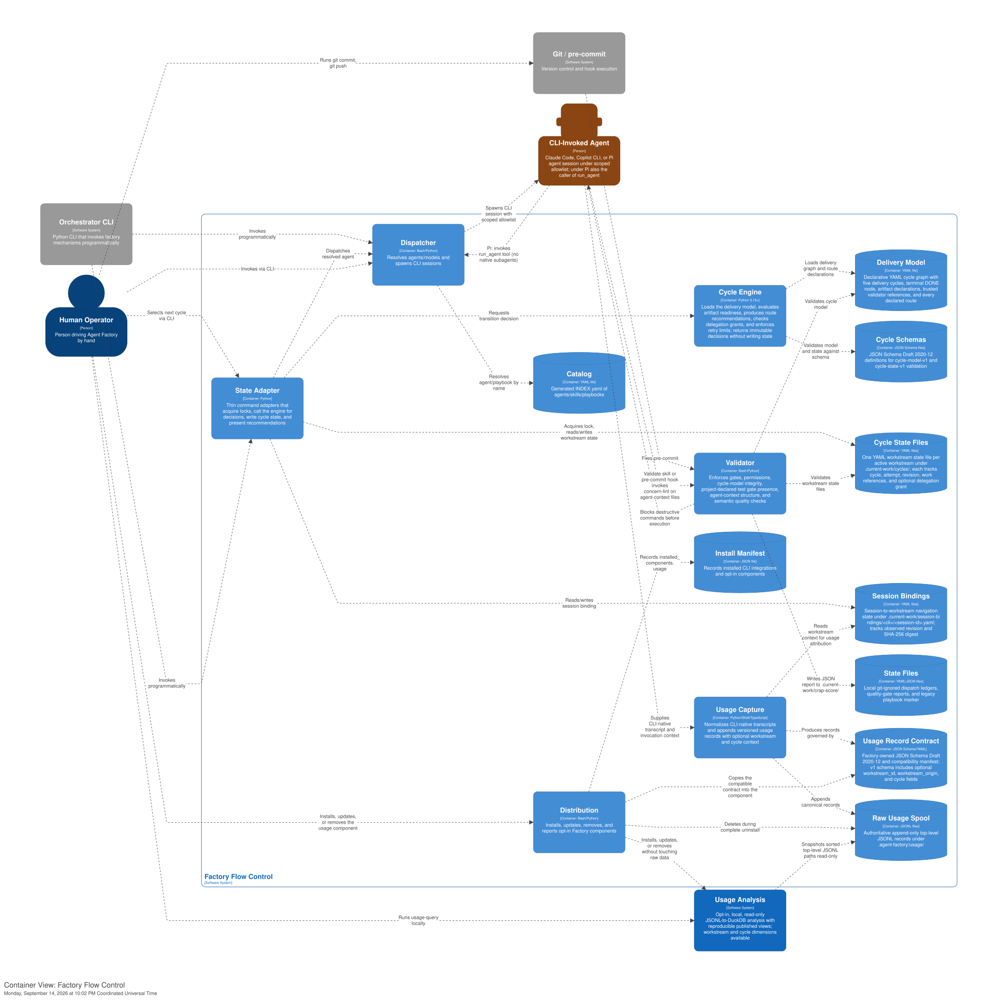

[back to index](../README.md)

# 5. Building Block View

## 5.1 Level 1: Container View

Factory Flow Control consists of three primary containers:

| Container         | Responsibility                                                                                   | Technology                |
| ----------------- | ------------------------------------------------------------------------------------------------ | ------------------------- |
| **State Manager** | Reads/writes playbook state marker, resolves FSM transitions, drives phases                      | Bash, Python              |
| **Validator**     | Enforces gates, permissions, charter-declared test gate presence, and semantic quality checks    | Bash, Python              |
| **Dispatcher**    | Resolves agents/models from catalog, spawns CLI sessions with scoped permits                     | Bash, Python              |
| **Usage Capture** | Normalizes CLI transcripts and appends canonical runtime usage records                           | Python, shell, TypeScript |
| State Files       | Local git-ignored marker (`.current-work/playbook-state.yml`) and FSM defs                       | YAML (storage)            |
| Catalog           | Generated `factory/INDEX.yaml` from agent/skill/playbook/rulebook frontmatter, with token counts | YAML (storage)            |

## 5.2 Level 2: Component View — Validator

The **Validator** container enforces deterministic gates. Two are hook-triggered — they fire mechanically on a git or CLI event, so an agent cannot skip them:

| Component                  | Trigger Point                | What it validates                                                              | Exit codes             |
| -------------------------- | ---------------------------- | ------------------------------------------------------------------------------ | ---------------------- |
| **transition-lint**        | Pre-commit hook (git commit) | Staged files match current phase's `outputs:` globs                            | 0 (pass), 1 (findings) |
| **block-dangerous-git.sh** | Native hook or Pi extension  | Shell command not in deny list; charter-declared test commands are allowlisted | 0 (allow), 2 (deny)    |

Two more — `schema-validate` and `policy-validate` — are on-demand validators invoked by the research skills and agents (and from the CLI) rather than by a hook. They are described in §5.2.2.

Three additional on-demand validators enforce semantic code quality and architecture phase routing. Two are invoked by the implementation-agent dispatcher (not by hooks) and are described in §5.2.3; one routes between phases:

| Component              | Trigger Point                                     | What it validates                                          | Exit codes                          |
| ---------------------- | ------------------------------------------------- | ---------------------------------------------------------- | ----------------------------------- |
| **crap-score**         | Dispatcher, after developer-agent commit          | CRAP score (cyclomatic complexity x coverage) per function | 0 (pass), 1 (fail)                  |
| **dependency-check**   | Dispatcher, after developer-agent commit          | Imports conform to architecture.dsl dependency rules       | 0 (pass), 1 (violations)            |
| **module-graph-check** | Orchestrating session, Phase 1 / Phase 3 boundary | Feature touches no new modules or inverted dependencies    | 0 (skip Phase 2), 1 (enter Phase 2) |

### 5.2.1 Project-Owned Test Gates via Charter Declaration

**Purpose**: Factory ensures test gates exist; the project decides what runs inside them. Testing is project-owned infrastructure declared in `docs/charter/testing.yaml`. Factory's guardrails and FSM gates read that declaration. Factory does not own test execution, framework detection, or structured test output.

**Charter declaration** (`docs/charter/testing.yaml`):

- `test_command` (required) — full test suite command, used by FSM `script_exit_zero` gate conditions
- `test_staged_command` (optional) — command for TDD iteration on staged files, allowlisted for agents
- `test_changed_command` (optional) — command for fast feedback on changed files
- `layers` (optional) — layer bindings mapping Factory layer names to project-specific tooling, infrastructure, entry points, anti-patterns, and fidelity declarations

**Gate contract**: exit-code-only. Zero means pass, nonzero means fail. Factory does not parse structured test output (BR-027).

**Integration Points**:

- **FSM phase advance gate**: The `tests_pass` condition uses `script_exit_zero` with `charter:test_command`, resolving the actual command from `docs/charter/testing.yaml`. Blocks when the charter is absent or `test_command` is missing.
- **Agent allowlist** (BR-024): `block-dangerous-git.sh` reads all declared command fields from the charter and allowlists them with exact-string matching. Bare test commands remain blocked for agents.
- **Onboarding**: The `detect-test-regime` skill scans for existing test entrypoints during `init-factory` and populates the charter. When multiple entrypoints are detected, it asks for disambiguation.
- **Project hooks**: Factory does not inject test hooks into `.pre-commit-config.yaml`. Test hooks are project-owned infrastructure.

**Referenced Specifications**:

- [UC-09 — Ensure Project-Owned Test Gates Exist](../spec/use_cases/UC-09-run-tests-via-hook.md)
- [ADR-0003 — Test execution via mechanically triggered gates](../adr/0003-test-execution-via-hooks.md)
- [test-gate-presence.feature](../spec/test-gate-presence.feature)
- [validation-rules.md § Test execution (BR-023..BR-029)](../spec/supplementary_specs/validation-rules.md#project-owned-test-gates-testingyaml-br-023-br-024-br-025-br-026-br-027-br-028-br-029)

### 5.2.2 Research artifact validators (schema-validate, policy-validate)

The falsification-driven research feature validates its JSON artifacts through a fixed three-stage order — **schema → policy → semantic** — that splits validation by whether a machine can decide it. The first two stages are deterministic scripts in this container; the third is human or agent judgment, outside it. Unlike the hook gates above, these are invoked on demand by the research skills and agents, and from the CLI.

| Component           | Stage      | What it validates                                                                                                                        | Exit codes                                        |
| ------------------- | ---------- | ---------------------------------------------------------------------------------------------------------------------------------------- | ------------------------------------------------- |
| **schema-validate** | 1 — schema | One JSON artifact against one JSON Schema: required fields, types, enums, identifier patterns, timestamps, array minimums                | 0 (conforms), 1 (violations), 2 (operational)     |
| **policy-validate** | 2 — policy | The enforceable half of the four research policies across related artifacts: role separation, references, quorum, current claim versions | 0 (pass), 1 (policy/schema fail), 2 (operational) |

**Behavior**:

- Both are stdlib-only Python (3.8+), no third-party dependencies — the same zero-install pattern as `spec-lint` and `arch-lint`.
- `schema-validate <artifact-file> <schema-file>` is stage 1, the load-bearing gate every later stage assumes. It implements only the JSON-Schema keyword subset the research schemas need, not a full Draft implementation.
- `policy-validate <artifact-or-dir>...` is stage 2. Its `--pipeline` mode runs stage 1 then stage 2 in order and stops at the first failing stage.
- Semantic judgment — evidence support, source independence in substance, test severity, claim atomicity — is stage 3, deliberately left to a qualified human or agent reviewer. No script decides it.
- The schemas the validators read live in `factory/rulebooks/schemas/research-*.schema.json`, a rulebook category of JSON-Schema data contracts that is intentionally absent from `INDEX.yaml` (which catalogs Markdown only).

**Referenced Specifications**:

- [ADR-0006 — Research: flat storage and validation pipeline](../adr/0006-research-flat-storage-and-validation-pipeline.md)
- [factory/playbooks/research-topic.md § The Validation Gate](../../factory/playbooks/research-topic.md)

### 5.2.3 Semantic quality gates (crap-score, mutation-analysis, dependency-check)

Two deterministic scripts enforce semantic code quality after each developer-agent commit, owned by the implementation-agent dispatcher. They extend the "Agentic Creation, Deterministic Validation" principle from syntactic checks (formatting, phase gating) to code meaning (complexity and dependency direction). See [ADR-0012](../adr/0012-dispatcher-owned-semantic-gate-loop.md) for the execution model decision.

| Component            | What it checks                                                                                                                                 | Inputs                                      | Outputs                                                           |
| -------------------- | ---------------------------------------------------------------------------------------------------------------------------------------------- | ------------------------------------------- | ----------------------------------------------------------------- |
| **crap-score**       | CRAP score per function: `comp(m)^2 x (1 - cov(m)/100)^3 + comp(m)`. Threshold: CRAP ≤ 8 (Bob Martin default, overridable in `house-rules.md`) | Source files, coverage data                 | JSON report per function, logged to `.current-work/crap-score/`   |
| **dependency-check** | Validates that module import directions match declarations in `architecture.dsl`                                                               | `docs/arc42/architecture.dsl`, source files | JSON report per rule, logged to `.current-work/dependency-check/` |

Mutation testing is project-owned infrastructure. Factory encourages it: the `mutation-analysis` skill provides setup guidance, and VIRGIL carries it as an open question during charter setup until settled in `testing.yaml`. See [ADR-0012 § Amended](../adr/0012-dispatcher-owned-semantic-gate-loop.md#amended).

**Invocation model:**

1. The developer-agent writes code and tests, commits.
2. The implementation-agent dispatcher runs each gate script on the committed artifacts.
3. If any gate fails, the dispatcher spawns a fresh developer agent with only the gate reports and affected files as input.
4. The fresh developer fixes, commits. Back to step 2 (maximum three iterations).
5. When all gates pass, the dispatcher proceeds to `premerge-check` and merge.

The developer agent never runs the gates. Each fix iteration starts with a clean context. This separation prevents context contamination and enforces the trust boundary.

**Story-level gate configuration:** The `quality-gates` field in the story template declares which gates apply. Precedence: story field > `house-rules.md` project default > Factory hardcoded default (both gates: `crap-score`, `dependency-check`). Excluding a gate requires justification in the story's `notes:` field.

### 5.2.4 Module-graph check

A deterministic script that replaces the manual `impact.architecture_change` declaration with mechanical detection. It reads the current module map from `architecture.dsl` and compares it against Phase 1 outputs (`interface-contracts.md`, `entity-model.md`) to determine whether the feature changes module boundaries, dependency directions, or public interfaces.

**Interfaces:**

- **IN:** `docs/arc42/architecture.dsl`, `docs/spec/supplementary_specs/interface-contracts.md`, `docs/spec/supplementary_specs/entity-model.md`
- **OUT (exit code):** 0 (no module-graph change, skip Phase 2), 1 (module-graph change detected, enter Phase 2)
- **OUT (side effect):** Updates the proposal's `impact.architecture_change` field in frontmatter

**Override semantics:**

- Prior `false`, machine says `true`: machine wins, field updated and annotated `# mechanical detection`.
- Prior `true`, machine says `false`: human declaration respected conservatively; machine result logged but field unchanged.
- Human explicit override: recorded as a comment on the field.

**Referenced Specifications:**

- [ADR-0012 — Dispatcher-owned semantic gate loop](../adr/0012-dispatcher-owned-semantic-gate-loop.md)
- [Proposal: Agentic Quality Gates and Requirements Consolidation](../proposals/implemented/agentic-quality-gates-and-specification-consolidation.md)

## 5.3 Level 2: Component View — State Manager

| Component          | What it does                                                          | Reads                        | Writes               |
| ------------------ | --------------------------------------------------------------------- | ---------------------------- | -------------------- |
| **phase advance**  | Advances marker to next state when entry conditions met               | Marker, FSM, gate results    | Marker               |
| **phase retry**    | Retries current phase's author step, capped by FSM `halt_conditions`  | Marker, FSM                  | Marker (iteration++) |
| **run-step skill** | Derives "what's next" from observable state (fresh, resume, escalate) | Marker, FSM, outputs on disk | (none — read-only)   |

All three read the same marker (`.current-work/playbook-state.yml`) and FSM (e.g., `greenfield-development.fsm.yml`). Single source of truth.

## 5.4 Level 2: Component View — Dispatcher

| Component                        | What it does                                                                                                                      | Reads                 | Writes                |
| -------------------------------- | --------------------------------------------------------------------------------------------------------------------------------- | --------------------- | --------------------- |
| **trigger**                      | Resolves agent/model, spawns CLI session with scoped permits                                                                      | INDEX.yaml            | (none)                |
| **index-lint**                   | Generates INDEX.yaml from frontmatter with token budget counts; `--check` validates drift                                         | source .md            | INDEX.yaml            |
| **run-agent** (Pi extension)     | Pi model-callable tool: spawns a separate `pi` session to run one factory agent                                                   | agent .md, model.conf | (none)                |
| **dispatch-wave** (Pi extension) | Pi model-callable tool: runs a parallel wave of agents, each in its own git worktree, integrating `premerge-check` before merging | agent .md, model.conf | git worktrees, merges |
| **openrouter-discover**          | Operator aid: queries the OpenRouter catalog to curate/validate `pi.*` tier rows in model.conf, offline of the runtime path       | OpenRouter API        | (none)                |

## 5.5 Interfaces Summary

Every building block's entry point, invoked how, and by whom:

| Script / Component           | Invoked by                                                | Entry point                                                         | Exit codes                                    |
| ---------------------------- | --------------------------------------------------------- | ------------------------------------------------------------------- | --------------------------------------------- |
| transition-lint              | Pre-commit hook                                           | `factory/scripts/transition-lint`                                   | 0 (pass), 1 (findings)                        |
| block-dangerous-git.sh       | Claude, Copilot, Codex native hook                        | stdin: CLI-specific command JSON, stdout: empty, exit 0 or 2        | 0 (allow), 2 (deny)                           |
| phase advance                | Human, orchestrator (not yet operational)                 | `factory/scripts/phase advance`                                     | 0 (advanced), 1 (conditions unmet), 2 (misc)  |
| phase retry                  | Human, orchestrator (not yet operational)                 | `factory/scripts/phase retry [--default-max-iterations]`            | 0 (retried), 2 (cap exceeded)                 |
| trigger                      | Human, orchestrator (not yet operational), run-step skill | `factory/scripts/trigger agent <name> [--background]`               | 0 (dispatched), 1+ (error)                    |
| usage-capture                | Native CLI hooks and Pi extensions                        | `factory/scripts/usage-capture --cli ... --transcript ...`          | 0 (captured or best-effort no-op)             |
| index-lint                   | Pre-commit hook, CI                                       | `factory/scripts/index-lint [--check]`                              | 0 (fresh), 1 (stale)                          |
| run-step skill               | Any supported CLI (LLM-executed)                          | Skill markdown invoked by AI                                        | (N/A — skill is prose)                        |
| run-agent (Pi extension)     | Pi session (via `run_agent` tool call)                    | `.pi/extensions/run-agent.ts` → spawns `pi ... -p <task>`           | (tool result: text + usage, or error)         |
| dispatch-wave (Pi extension) | Pi session (via `dispatch_wave` call)                     | `.pi/extensions/dispatch-wave.ts` → worktree + spawn + merge/item   | (tool result: per-item status, or error)      |
| openrouter-discover          | Human operator, CI (`--check`)                            | `factory/scripts/openrouter-discover [--list\|--suggest\|--check]`  | 0 (ok), 1 (drift)                             |
| schema-validate              | Research skills/agents, CLI                               | `factory/scripts/schema-validate <artifact-file> <schema-file>`     | 0 (conforms), 1 (violations), 2 (operational) |
| policy-validate              | Research skills/agents, CLI                               | `factory/scripts/policy-validate [--pipeline] <artifact-or-dir>...` | 0 (pass), 1 (fail), 2 (operational)           |
| crap-score                   | Implementation-agent dispatcher                           | `factory/scripts/crap-score [--story-id <id>]`                      | 0 (pass), 1 (fail)                            |
| dependency-check             | Implementation-agent dispatcher                           | `factory/scripts/dependency-check [--story-id <id>]`                | 0 (pass), 1 (violations)                      |
| module-graph-check           | Orchestrating session                                     | `factory/scripts/module-graph-check <proposal-path>`                | 0 (no change), 1 (change detected)            |

## 5.6 Level 2: Runtime Usage Capture

`usage-capture` is a CLI-agnostic pipeline with two adapter seams. A
CLI-specific normalizer maps Claude Code, Copilot, Codex, or Pi events into
ordered input/output text and nullable provider usage. The fixed
`cl100k_base` tokenizer produces comparable `normalized_*` counts. A JSONL
logging adapter appends the canonical record beneath `.agent-factory/usage/`
and persists the exact tokenized transcript copy referenced by the record.

Native lifecycle adapters own invocation: Claude `Stop`/`SubagentStop`,
Copilot `agentStop`/`subagentStop`, Codex `Stop`/`SubagentStop`, and Pi
`session_shutdown` plus inline child capture. The orchestrator never writes a
second record. See
[ADR-0007](../adr/0007-normalize-runtime-usage-through-cli-adapters.md).

## Referenced from

- [06_runtime_view.md § 6.2](06_runtime_view.md#62-test-gate-presence)
- [09_architecture_decisions.md](09_architecture_decisions.md)
