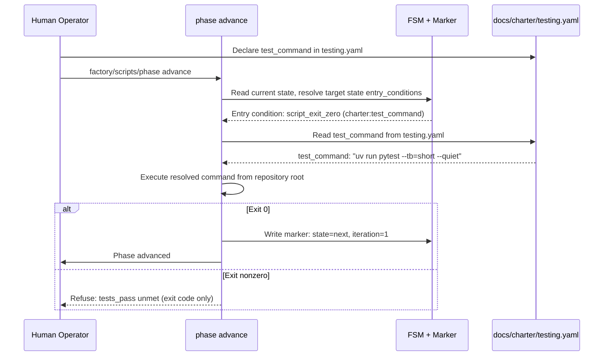
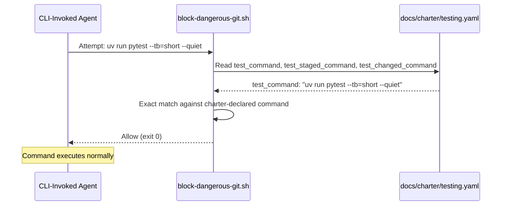
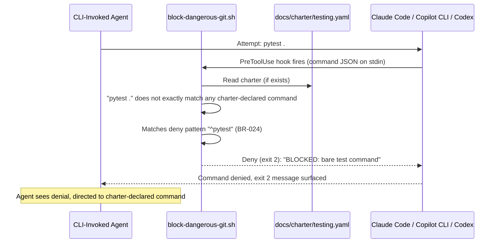
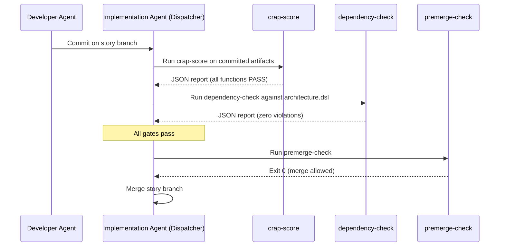
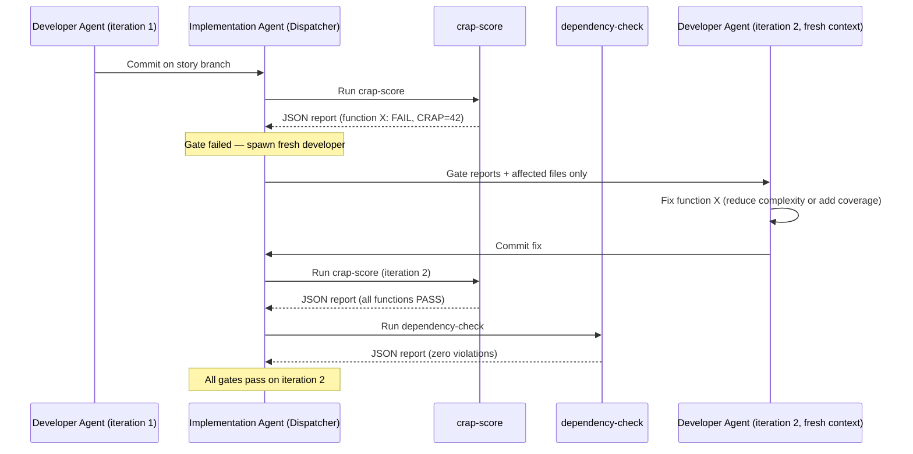
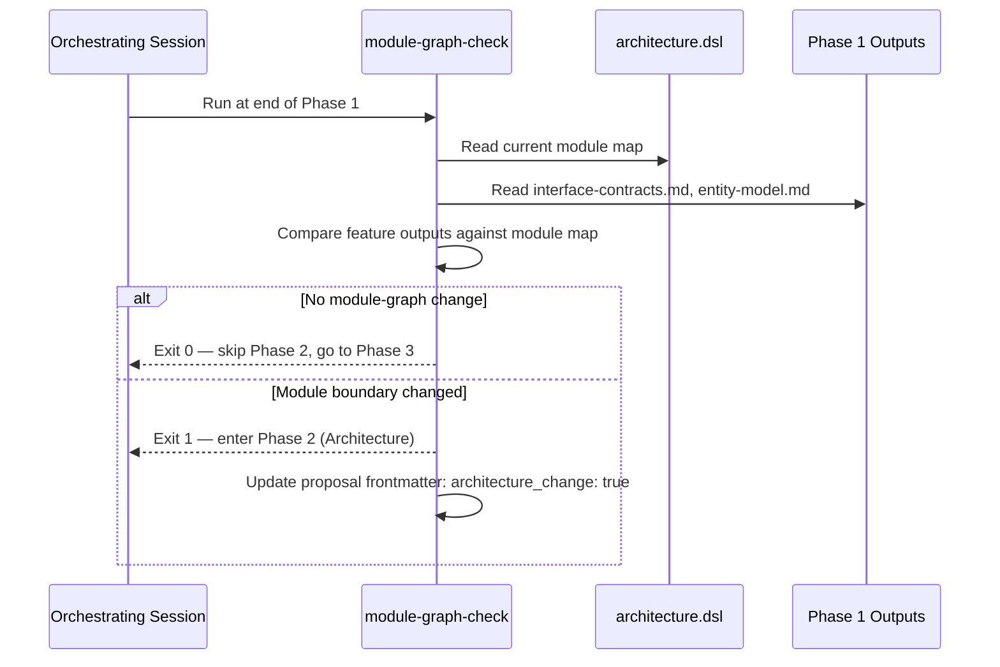
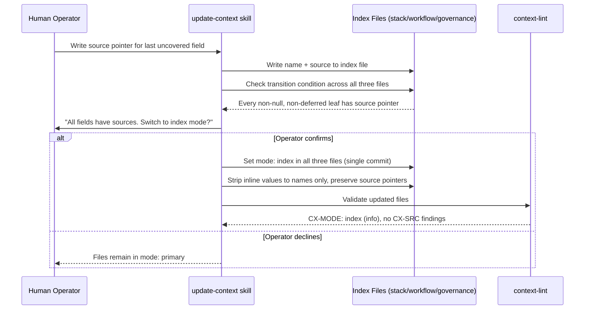
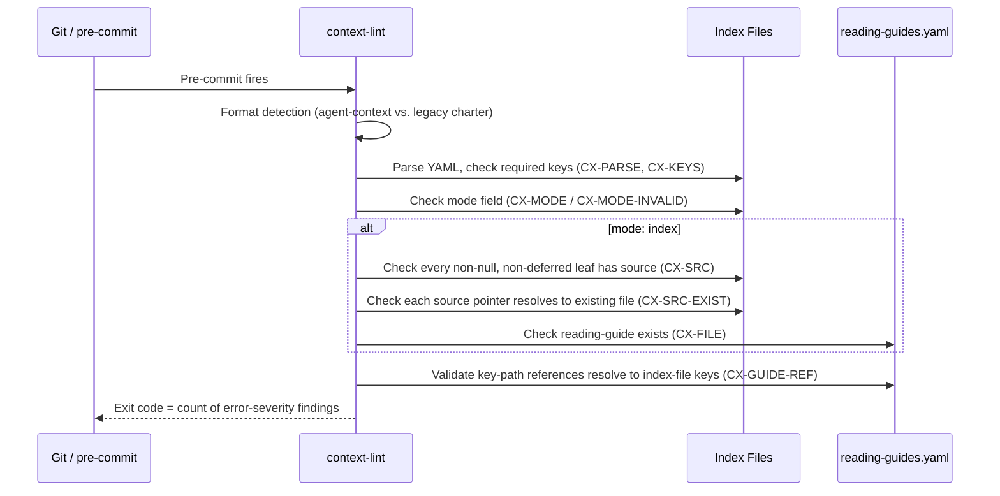

[back to index](../README.md)

# 6. Runtime View

## 6.1 Overview

This chapter describes key interaction sequences, focusing on **test gate presence** — the pattern where Factory ensures test gates exist while the project owns what runs inside them — and the **semantic gate loop** that the dispatcher runs after each developer-agent commit. Other runtime scenarios (phase advance, agent dispatch, retry loops) are documented here as needed for context but are not exhaustive; see use cases in [`spec/use_cases/`](../~archive/spec/use_cases/) for full flows.

## 6.2 Test Gate Presence

Derived from dynamic view `TestGatePresence` in [`architecture.dsl`](architecture.dsl).

Factory ensures test gates exist; the project decides what runs inside them. Testing is project-owned infrastructure declared in `docs/charter/testing.yaml`. Factory's guardrails and FSM gates read that declaration. Factory does not own test execution, framework detection, or structured test output.

### 6.2.1 Sequence: Charter Declaration and Phase Advance Gate

**Key Points**:

- **Charter-driven**: FSM gate resolves `test_command` from `docs/charter/testing.yaml`, not a hardcoded script
- **Exit-code-only contract**: Factory reads only the exit code; structured test output is the project's concern (BR-027)
- **Blocks on missing charter**: When `testing.yaml` is absent or `test_command` is missing, the gate blocks with a clear message
- **Exhaustive reporting**: All unmet conditions listed (not short-circuited)

### 6.2.2 Sequence: Agent Uses Charter-Declared Test Command

### 6.2.3 Sequence: Agent Blocked from Bare Test Command

**Key Points**:

- **Preventive**: Command blocked *before* execution (PreToolUse hook, not post-facto)
- **Exact match only**: Charter-declared commands are allowlisted with exact-string matching; no prefix matching (BR-024)
- **Three native-hook CLIs**: Claude Code, Copilot CLI, and Codex invoke the shared shell guardrail; Pi enforces the same deny list through its project-local extension
- **No charter means no agent test commands**: When `testing.yaml` does not exist, no agent test commands are allowlisted; bare test commands remain blocked
- **Deny patterns (BR-024)**: The canonical list is maintained in `factory/config/hooks/block-dangerous-git.sh`; representative entries include `pytest`, package-manager test scripts, `jest`, `vitest`, `go test`, `cargo test`, and Python/uv pytest invocations

## 6.3 Semantic Gate Loop

Derived from dynamic view `SemanticGateLoop` in [`architecture.dsl`](architecture.dsl).

The semantic gate loop runs after each developer-agent commit, before merge. The implementation-agent dispatcher owns execution. The developer agent never runs the gates; it only receives gate reports when a fix iteration is needed. See [ADR-0012](../adr/0012-dispatcher-owned-semantic-gate-loop.md).

### 6.3.1 Sequence: Gate Pass (All Gates Succeed)

### 6.3.2 Sequence: Gate Failure with Fix Iteration

**Key Points:**

- Each fix iteration spawns a fresh developer agent. No context contamination from prior gate output.
- Maximum three fix iterations per tier (configurable in `house-rules.md`). After the cap, the story escalates or is marked blocked.
- The two gates run in sequence: CRAP, dependency. All must pass before `premerge-check`. Mutation testing is project-owned infrastructure that Factory encourages via the `mutation-analysis` skill.
- Gate reports are written to `.current-work/<gate-name>/<story-id>.json` for traceability.

### 6.3.3 Sequence: Module-Graph Check (Phase Routing)

**Key Points:**

- Runs once per feature, at the Phase 1 / Phase 3 boundary. Not per story, not per commit.
- Tests module-graph topology only: new modules, changed public interfaces, inverted dependency directions. A new entity in an existing module does not trigger Phase 2.
- The orchestrating session (hosting the `feature-addition` playbook) owns the check. It is not a hook or a dispatcher gate.

## 6.4 Agent Context Mode Transition

The agent-context index files have a two-mode lifecycle: `mode: primary` (greenfield, values written directly) and `mode: index` (mature, every non-null, non-deferred leaf has a `source:` pointer). The transition is one-directional and atomic. See [ADR-0014](../adr/0014-two-layer-routing-with-two-mode-lifecycle.md) and [state-machines.md § Agent Context Mode Lifecycle](../spec/supplementary_specs/state-machines.md#agent-context-mode-lifecycle).

### 6.4.1 Sequence: Mode Transition via update-context

### 6.4.2 Sequence: context-lint Validates Mode Compliance

**Key Points:**

- The transition condition is mechanically testable: `context-lint` reports `CX-SRC` findings for fields missing source pointers when mode is index.
- `testing.yaml` is exempt from mode checks -- it receives `CX-PARSE` validation only.
- Format detection routes to either `CX-*` codes (YAML agent-context) or `CH-*` codes (legacy markdown charter), never both.

## 6.5 Other Runtime Scenarios (Summary)

Full sequences for these flows are in their respective use cases:

- **Phase advance with multiple entry conditions** → [UC-01](../~archive/spec/use_cases/UC-01-advance-a-playbook-phase.md)
- **Retry loop with iteration cap** → [UC-03](../~archive/spec/use_cases/UC-03-retry-a-phase-within-the-iteration-cap.md)
- **Agent dispatch (interactive vs. background)** → [UC-04](../~archive/spec/use_cases/UC-04-dispatch-an-agent-via-trigger.md)
- **Resume after interruption** → [UC-05](../~archive/spec/use_cases/UC-05-resume-an-interrupted-playbook-run.md)
- **Transition-lint blocking out-of-phase commit** → [UC-02](../~archive/spec/use_cases/UC-02-block-an-out-of-phase-commit.md)

## Referenced from

- [05_building_block_view.md § 5.2.1](05_building_block_view.md#521-project-owned-test-gates-via-charter-declaration)
- [05_building_block_view.md § 5.2.3](05_building_block_view.md#523-semantic-quality-gates-crap-score-mutation-analysis-dependency-check)
- [08_crosscutting_concepts.md § 8.1](08_crosscutting_concepts.md#81-agentic-creation-deterministic-validation)
- [09_architecture_decisions.md](09_architecture_decisions.md)
