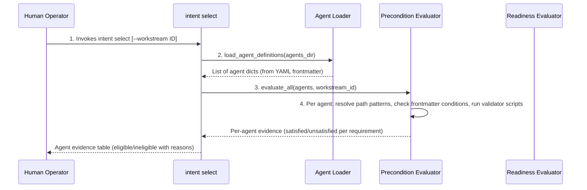
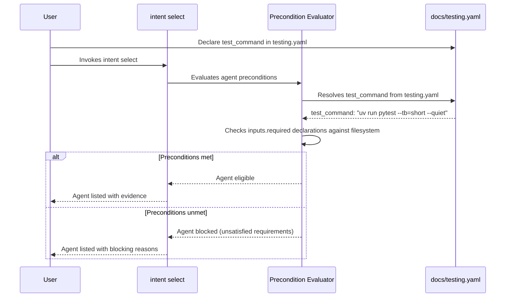
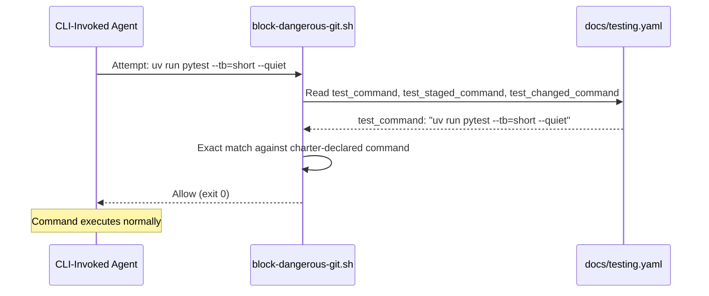
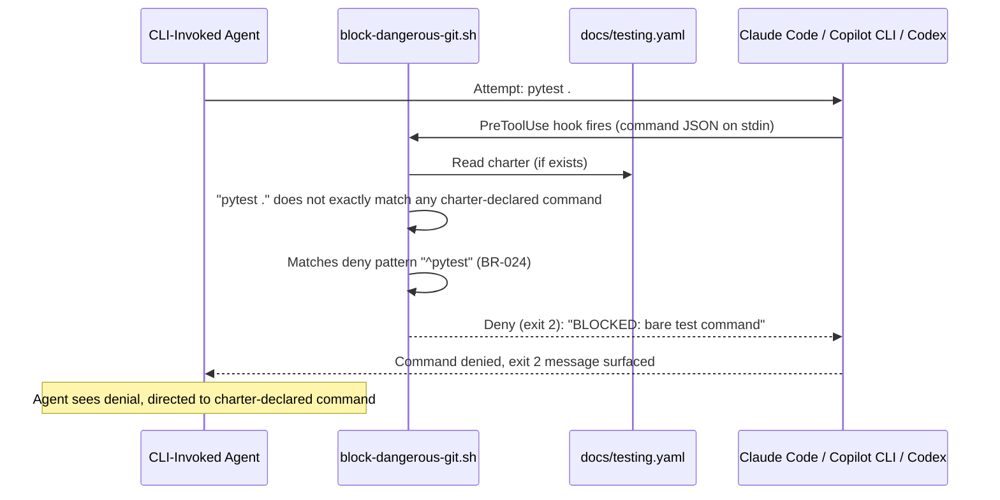
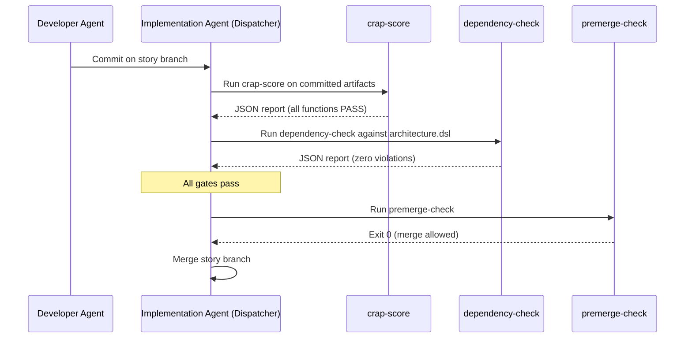
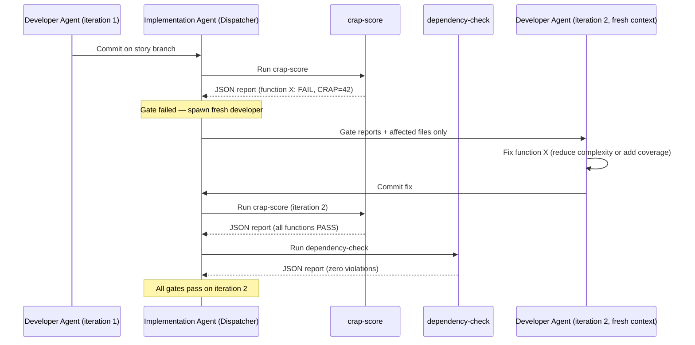
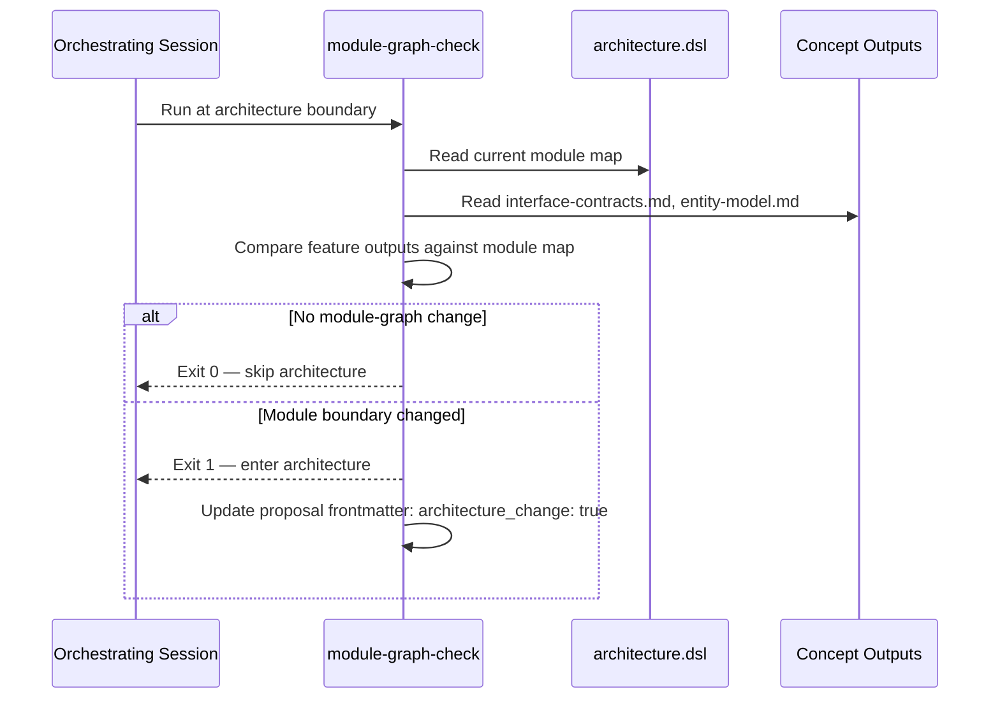
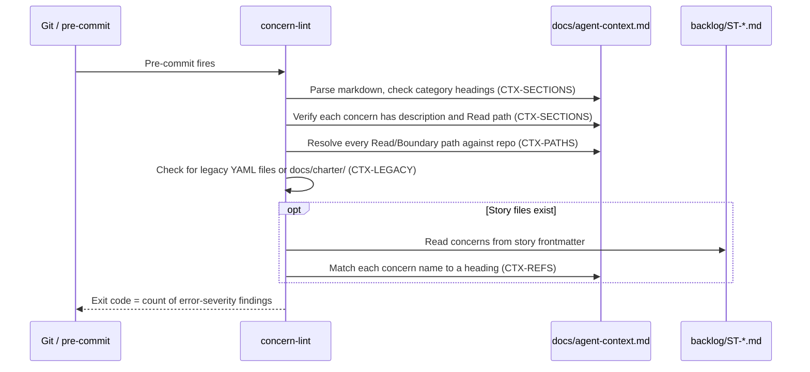
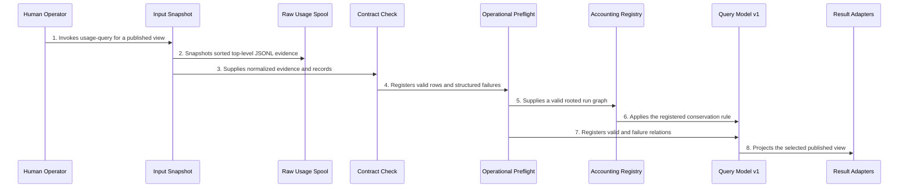
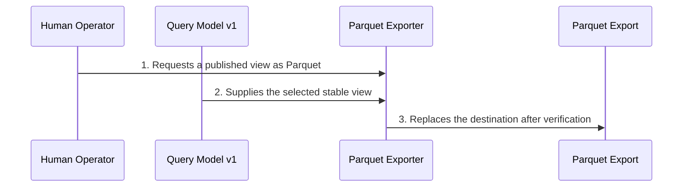

[back to index](../README.md)

# 6. Runtime View

## 6.1 Overview

This chapter describes key interaction sequences for Factory gates,
eligibility evaluation, and local usage analysis. Dynamic views in
[`architecture.dsl`](architecture.dsl) own the canonical step order.

## 6.2 Agent Selection

Derived from dynamic view `AgentSelection` in [`architecture.dsl`](architecture.dsl).

Agent selection is the primary routing operation. The `intent select` command loads agent definitions, evaluates each agent's declared preconditions against the repository, and presents per-agent eligibility evidence. The eligibility engine never writes state.

### 6.2.1 Sequence: Human Runs `intent select`

**Key Points**:

- **Precondition-based**: Each agent declares `inputs.required` in its YAML frontmatter. The evaluator resolves each requirement's `path_pattern` against the filesystem, optionally filtering by workstream scope and checking frontmatter conditions or validator scripts.
- **Engine is read-only**: The eligibility engine reads agent definitions and the repository. It returns immutable evidence. It does not write state, acquire locks, or produce side effects.
- **Workstream scoping**: When `--workstream` is passed, candidates are filtered by the `scope` field in their frontmatter (matching the workstream ID or `"global"`). Files without a scope declaration are included.
- **Readiness derivation**: `derive_readiness()` accepts evaluation results and produces `AgentReadiness` dataclasses with `eligible`, `unsatisfied`, and `warnings` fields.

## 6.3 Test Gate Presence

Factory ensures test gates exist; the project decides what runs inside them. Testing is project-owned infrastructure declared in `docs/testing.yaml`. Factory's guardrails and eligibility preconditions read that declaration. Factory does not own test execution, framework detection, or structured test output.

### 6.3.1 Sequence: Precondition Evaluation with Test Gate

### 6.3.2 Sequence: Agent Uses Charter-Declared Test Command

### 6.3.3 Sequence: Agent Blocked from Bare Test Command

**Key Points**:

- **Preventive**: Command blocked *before* execution (PreToolUse hook, not post-facto)
- **Exact match only**: Charter-declared commands are allowlisted with exact-string matching; no prefix matching (BR-024)
- **Three native-hook CLIs**: Claude Code, Copilot CLI, and Codex invoke the shared shell guardrail; Pi enforces the same deny list through its project-local extension
- **No charter means no agent test commands**: When `testing.yaml` does not exist, no agent test commands are allowlisted; bare test commands remain blocked
- **Deny patterns (BR-024)**: The canonical list is maintained in `.agent-factory/factory/config/hooks/block-dangerous-git.sh`; representative entries include `pytest`, package-manager test scripts, `jest`, `vitest`, `go test`, `cargo test`, and Python/uv pytest invocations

## 6.4 Semantic Gate Loop

Derived from dynamic view `SemanticGateLoop` in [`architecture.dsl`](architecture.dsl).

The semantic gate loop runs after each developer-agent commit, before merge. The implementation-agent dispatcher owns execution. The developer agent never runs the gates; it only receives gate reports when a fix iteration is needed. See [ADR-0012](../adr/0012-dispatcher-owned-semantic-gate-loop.md).

### 6.4.1 Sequence: Gate Pass (All Gates Succeed)

### 6.4.2 Sequence: Gate Failure with Fix Iteration

**Key Points:**

- Each fix iteration spawns a fresh developer agent. No context contamination from prior gate output.
- Maximum three fix iterations per tier (configurable in `house-rules.md`). After the cap, the story escalates or is marked blocked.
- The two gates run in sequence: CRAP, dependency. All must pass before `premerge-check`. Mutation testing is project-owned infrastructure that Factory encourages via the `mutation-analysis` skill.
- Gate reports are written to `.current-work/<gate-name>/<story-id>.json` for traceability.

### 6.4.3 Sequence: Module-Graph Check (Architecture Routing)

**Key Points:**

- Runs once per feature, at the architecture boundary. Not per story, not per commit.
- Tests module-graph topology only: new modules, changed public interfaces, inverted dependency directions. A new entity in an existing module does not trigger the architecture check.
- The orchestrating session owns the check. It is not a hook or a dispatcher gate.

## 6.5 Agent Context Validation

The concern-oriented agent context (`docs/agent-context.md`) is a single markdown file that replaced the four-file YAML model in 0.9.0. The team maintains the file directly; `update-context` is retired. See [section 8.11](08_crosscutting_concepts.md#811-agent-context-as-cross-cutting-concern).

### 6.5.1 Sequence: concern-lint Validates Agent Context

**Key Points:**

- All `CTX-*` findings are errors. A single finding fails the gate.
- The three required categories are `## Always (cross-cutting)`, `## Technical concerns`, and `## Domain concerns`.
- `docs/testing.yaml` is the only accepted test-configuration path and is not validated by `concern-lint`.
- `CTX-LEGACY` rejects mixed formats: the concern-oriented file must not coexist with YAML agent-context files or a `docs/charter/` directory.

## 6.6 Local Usage Query

Derived from dynamic view `UsageQuery` in
[`architecture.dsl`](architecture.dsl).

The query snapshots its input once. Every selected line becomes either a valid
row or a structured failure. `capture_health` remains queryable when failures
exist; all other stable views refuse partial output. Empty input is valid and
returns each view's declared typed empty result.

## 6.7 Explicit Parquet Export

Derived from dynamic view `UsageParquetExport` in
[`architecture.dsl`](architecture.dsl).

The exporter writes a temporary sibling, verifies logical rows and schema, and
records query-model and input-set provenance before replacement. Any failure
leaves an existing destination unchanged. No scheduled refresh exists.

## 6.8 Other Runtime Scenarios (Summary)

Full sequences for these flows are in their respective use cases:

- **Agent dispatch (interactive vs. background)** -- [UC-04](../~archive/spec/use_cases/UC-04-dispatch-an-agent-via-trigger.md)

## Referenced from

- [05_building_block_view.md section 5.2.1](05_building_block_view.md#521-project-owned-test-gates-via-charter-declaration)
- [05_building_block_view.md section 5.2.3](05_building_block_view.md#523-semantic-quality-gates-crap-score-mutation-analysis-dependency-check)
- [08_crosscutting_concepts.md section 8.1](08_crosscutting_concepts.md#81-agentic-creation-deterministic-validation)
- [09_architecture_decisions.md](09_architecture_decisions.md)
