[back to index](../README.md)

# 6. Runtime View

## 6.1 Overview

This chapter describes key interaction sequences for Factory gates, cycle
transitions, and local usage analysis. Dynamic views in
[`architecture.dsl`](architecture.dsl) own the canonical step order.

## 6.2 Cycle Transition

Derived from dynamic view `CycleTransition` in [`architecture.dsl`](architecture.dsl).

A cycle transition is the primary routing operation. The human operator selects the next cycle for a workstream. The State Adapter acquires the workstream lock, validates the session binding against the current workstream state, calls the Cycle Engine for a transition decision, and writes the new state. The engine never writes state itself.

### 6.2.1 Sequence: Human Selects a Cycle

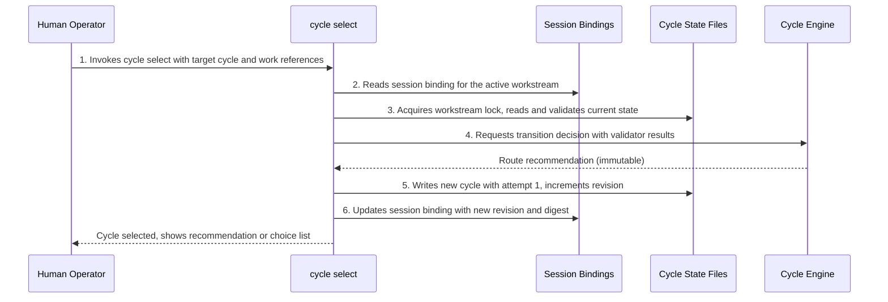

**Key Points**:

- **Lock protocol**: The adapter acquires an OS-level exclusive lock under `.current-work/cycles/.locks/` before reading state. Concurrent sessions on the same workstream detect stale state rather than overwriting silently.
- **Revision and digest validation**: The adapter compares the session binding's `observed_revision` and SHA-256 digest against the workstream state file. A mismatch means another session modified the state; the command exits 1 (conflict).
- **Engine is read-only**: The Cycle Engine receives the delivery model, validator results, and current state. It returns an immutable decision object. It does not write state, acquire locks, or produce side effects.
- **Work references**: The `--work` flag attaches artifact references (proposals, epic sections, story files) to the new cycle entry in the workstream state.

### 6.2.2 Sequence: Delegated Cycle Transition (Agent-Driven)

When the operator has issued a delegation grant for a workstream, the `run-step` skill and dispatched agent may advance through cycles without pausing for human approval at each boundary, up to the grant's limits.

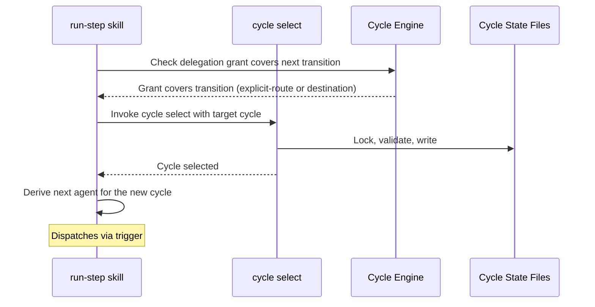

**Key Points**:

- **Two grant forms**: An explicit-route grant lists an ordered sequence of cycles; a destination grant names only the target cycle and delegates routing until the workstream reaches it.
- **Pause conditions**: Explicit-route grants pause when the agent recommends a cycle not in the ordered list. Destination grants pause when the engine cannot recommend a single route.
- **Retry limits**: Each cycle declares a `delegated_attempt_limit`. When the limit is reached, the delegation pauses regardless of grant form, returning control to the human.

## 6.3 Test Gate Presence

Factory ensures test gates exist; the project decides what runs inside them. Testing is project-owned infrastructure declared in `docs/testing.yaml`. Factory's guardrails and cycle gates read that declaration. Factory does not own test execution, framework detection, or structured test output.

### 6.3.1 Sequence: Charter Declaration and Cycle Gate

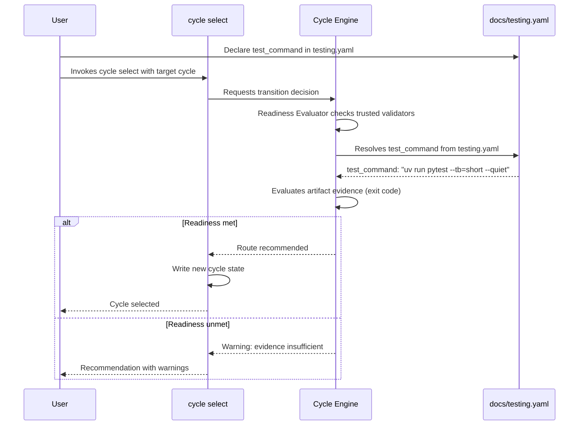

### 6.3.2 Sequence: Agent Uses Charter-Declared Test Command

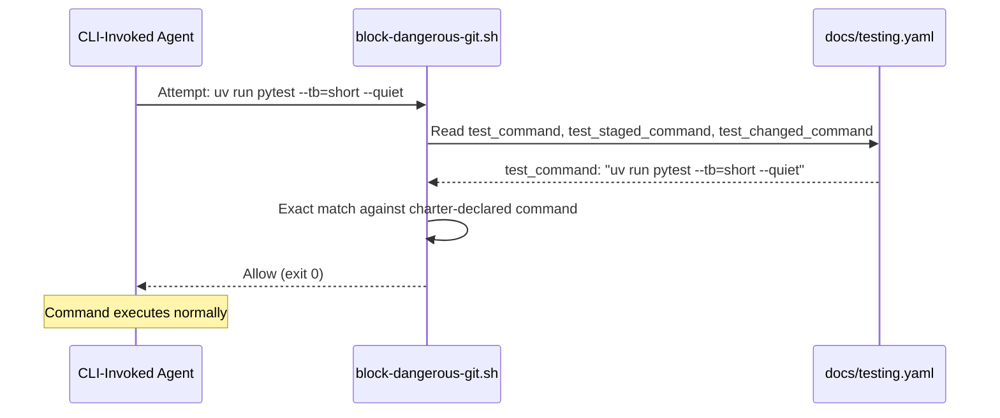

### 6.3.3 Sequence: Agent Blocked from Bare Test Command

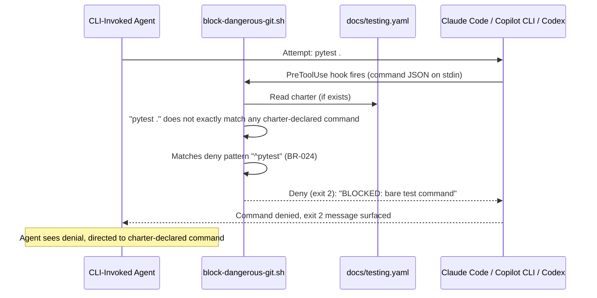

**Key Points**:

- **Preventive**: Command blocked *before* execution (PreToolUse hook, not post-facto)
- **Exact match only**: Charter-declared commands are allowlisted with exact-string matching; no prefix matching (BR-024)
- **Three native-hook CLIs**: Claude Code, Copilot CLI, and Codex invoke the shared shell guardrail; Pi enforces the same deny list through its project-local extension
- **No charter means no agent test commands**: When `testing.yaml` does not exist, no agent test commands are allowlisted; bare test commands remain blocked
- **Deny patterns (BR-024)**: The canonical list is maintained in `factory/config/hooks/block-dangerous-git.sh`; representative entries include `pytest`, package-manager test scripts, `jest`, `vitest`, `go test`, `cargo test`, and Python/uv pytest invocations

## 6.4 Semantic Gate Loop

Derived from dynamic view `SemanticGateLoop` in [`architecture.dsl`](architecture.dsl).

The semantic gate loop runs after each developer-agent commit, before merge. The implementation-agent dispatcher owns execution. The developer agent never runs the gates; it only receives gate reports when a fix iteration is needed. See [ADR-0012](../adr/0012-dispatcher-owned-semantic-gate-loop.md).

### 6.4.1 Sequence: Gate Pass (All Gates Succeed)

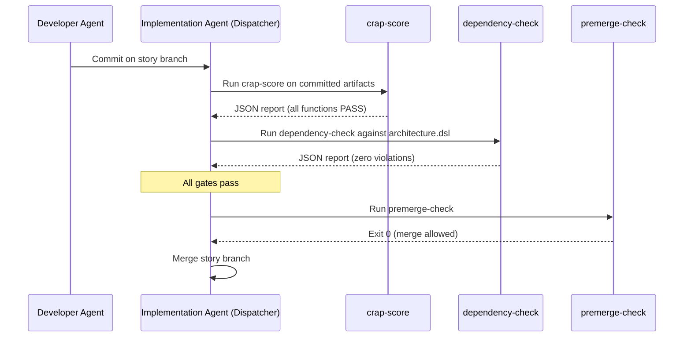

### 6.4.2 Sequence: Gate Failure with Fix Iteration

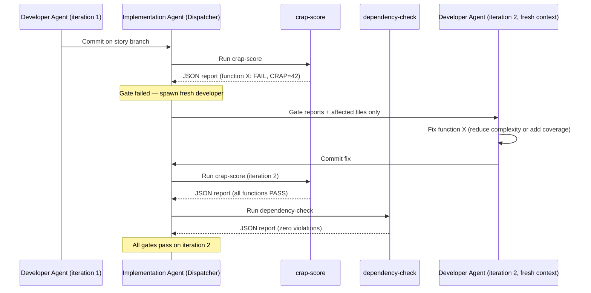

**Key Points:**

- Each fix iteration spawns a fresh developer agent. No context contamination from prior gate output.
- Maximum three fix iterations per tier (configurable in `house-rules.md`). After the cap, the story escalates or is marked blocked.
- The two gates run in sequence: CRAP, dependency. All must pass before `premerge-check`. Mutation testing is project-owned infrastructure that Factory encourages via the `mutation-analysis` skill.
- Gate reports are written to `.current-work/<gate-name>/<story-id>.json` for traceability.

### 6.4.3 Sequence: Module-Graph Check (Architecture Routing)

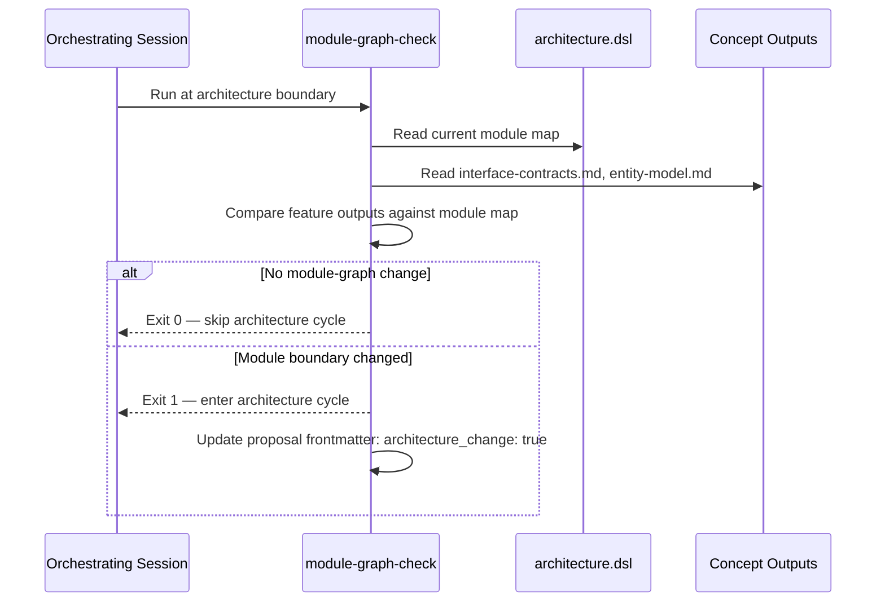

**Key Points:**

- Runs once per feature, at the architecture boundary. Not per story, not per commit.
- Tests module-graph topology only: new modules, changed public interfaces, inverted dependency directions. A new entity in an existing module does not trigger the architecture cycle.
- The orchestrating session owns the check. It is not a hook or a dispatcher gate.

## 6.5 Agent Context Mode Transition

The agent-context index files have a two-mode lifecycle: `mode: primary` (greenfield, values written directly) and `mode: index` (mature, every non-null, non-deferred leaf has a `source:` pointer). The transition is one-directional and atomic. See [ADR-0014](../adr/0014-two-layer-routing-with-two-mode-lifecycle.md) and [state-machines.md section Concern Registry Lifecycle](../spec/supplementary_specs/state-machines.md#concern-registry-lifecycle).

### 6.5.1 Sequence: Mode Transition via update-context

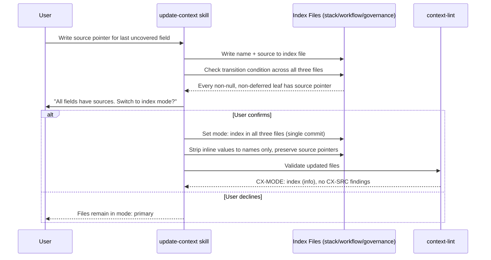

### 6.5.2 Sequence: context-lint Validates Mode Compliance

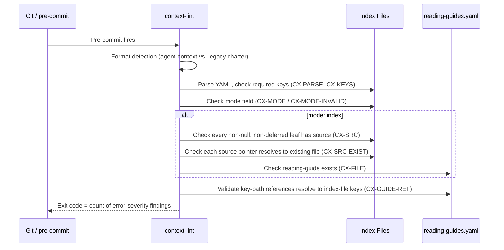

**Key Points:**

- The transition condition is mechanically testable: `context-lint` reports `CX-SRC` findings for fields missing source pointers when mode is index.
- `testing.yaml` is exempt from mode checks -- it receives `CX-PARSE` validation only.
- Format detection routes to either `CX-*` codes (YAML agent-context) or `CH-*` codes (legacy markdown charter), never both.

## 6.6 Local Usage Query

Derived from dynamic view `UsageQuery` in
[`architecture.dsl`](architecture.dsl).

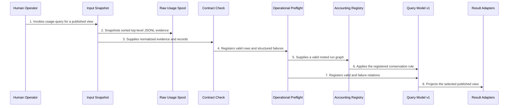

The query snapshots its input once. Every selected line becomes either a valid
row or a structured failure. `capture_health` remains queryable when failures
exist; all other stable views refuse partial output. Empty input is valid and
returns each view's declared typed empty result.

## 6.7 Explicit Parquet Export

Derived from dynamic view `UsageParquetExport` in
[`architecture.dsl`](architecture.dsl).

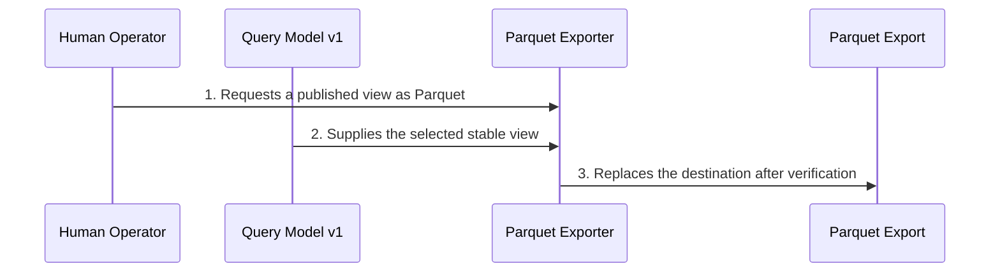

The exporter writes a temporary sibling, verifies logical rows and schema, and
records query-model and input-set provenance before replacement. Any failure
leaves an existing destination unchanged. No scheduled refresh exists.

## 6.8 Other Runtime Scenarios (Summary)

Full sequences for these flows are in their respective use cases:

- **Phase advance with multiple entry conditions** (legacy) -- [UC-01](../~archive/spec/use_cases/UC-01-advance-a-playbook-phase.md)
- **Retry loop with iteration cap** (legacy) -- [UC-03](../~archive/spec/use_cases/UC-03-retry-a-phase-within-the-iteration-cap.md)
- **Agent dispatch (interactive vs. background)** -- [UC-04](../~archive/spec/use_cases/UC-04-dispatch-an-agent-via-trigger.md)
- **Resume after interruption** -- [UC-05](../~archive/spec/use_cases/UC-05-resume-an-interrupted-playbook-run.md)
- **Transition-lint blocking out-of-phase commit** (legacy) -- [UC-02](../~archive/spec/use_cases/UC-02-block-an-out-of-phase-commit.md)

## Referenced from

- [05_building_block_view.md section 5.2.1](05_building_block_view.md#521-project-owned-test-gates-via-charter-declaration)
- [05_building_block_view.md section 5.2.3](05_building_block_view.md#523-semantic-quality-gates-crap-score-mutation-analysis-dependency-check)
- [08_crosscutting_concepts.md section 8.1](08_crosscutting_concepts.md#81-agentic-creation-deterministic-validation)
- [09_architecture_decisions.md](09_architecture_decisions.md)
