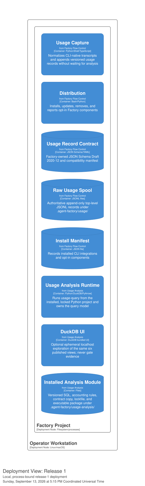

[back to index](../README.md)

# 7. Deployment View

## 7.1 Release 1: Local Operator Workstation

Release 1 runs inside one project checkout on one operator workstation. There
is no database server, container, daemon, remote service, or cloud resource.

The project checkout contains three independent runtime boundaries:

- **Workstream state** under `.agent-factory/workstreams/` holds immutable
  workstream identity files. Session bindings under
  `.agent-factory/workstreams/sessions/<session-id>.yaml` record
  session-to-workstream mappings. The Eligibility Engine reads agent
  definitions and the repository; it has no separate model file.
- **`.agent-factory/usage/`** holds Factory-owned, append-only JSONL evidence.
  Capture writes here whether or not analysis is installed.
- **`.agent-factory/usage-analysis/`** is the opt-in component installed by
  `init-factory`. It contains the Python package, locked DuckDB and PyArrow
  dependencies, SQL query model, accounting registry, and installed copy of
  the usage-record contract.

The Eligibility Engine runs in-process within the `intent select` command
invocation. It evaluates agent preconditions against the repository and
returns immutable readiness verdicts. There is no long-running engine process
and no state written by the engine.

The operator starts a query with
`uv run --project .agent-factory/usage-analysis usage-query`. The embedded
DuckDB runtime and all registered relations live in that process. A complete
dependency cache supports network-disabled execution after dependencies have
been cached. The optional DuckDB UI is an ephemeral localhost process and may
fetch its own assets when the operator opens it; it is outside deterministic
analysis and gate execution.

An explicit Parquet destination may be anywhere the operator selects. It is a
verified, attributable export and remains outside the authoritative
`.agent-factory/usage/` evidence boundary.

## 7.2 Lifecycle Boundaries

`init-factory --with-usage` and `init-factory --add usage` install the analysis
module without changing raw evidence. `init-factory --update usage` replaces
only a compatible component. `init-factory --remove usage` removes only the
component and its manifest entry. `update-factory` updates Factory core and
reports component presence without updating components.

`remove-factory` remains the complete-uninstall operation: it removes both the
analysis module and the raw usage data beneath `.agent-factory/`.

Workstream state files under `.agent-factory/workstreams/` are local,
git-ignored working state. They survive Factory updates and are removed only
by explicit operator action or `remove-factory`.

## Referenced from

- [architecture.dsl](architecture.dsl) -- canonical `Deployment` view
- [ADR-0015 -- Query authoritative JSONL with ephemeral DuckDB views](../adr/0015-query-authoritative-jsonl-with-ephemeral-duckdb-views.md)
- [Interface contracts section Usage-analysis component lifecycle](../spec/supplementary_specs/interface-contracts.md#usage-analysis-component-lifecycle)
