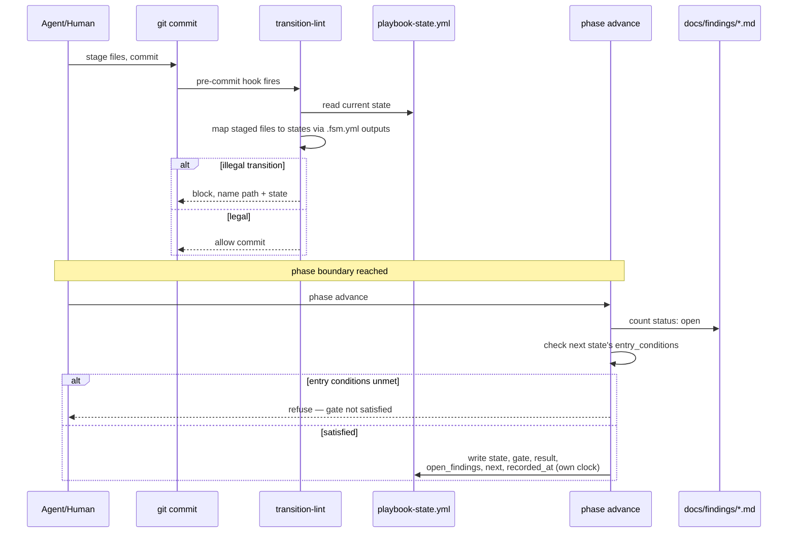

# Structured Playbooks as a Deterministic Harness

**Status: proposal, not adopted; a proof of concept now exists.** Recommends a direction and a first step; decides nothing. The [Proof of concept](#proof-of-concept) below implements the smallest viable slice — it proves the mechanism but does not turn the gate chain on for every project.

## Problem

Playbooks in [`factory/playbooks/`](../../factory/playbooks/) are prose runbooks: a human reads one, opens an AI-CLI session per step, and drives the phase chain — requirements → spec-review → architecture → architecture-review → planning → implementation → reconciliation → qa — by hand. The deterministic gates ([`spec-lint`](../../factory/scripts/spec-lint), [`arch-lint`](../../factory/scripts/arch-lint), [`backlog-lint`](../../factory/scripts/backlog-lint)) check whether an artifact is *valid*, not *which phase the run is in*. Nothing catches an out-of-order move — architecture artifacts committed before the spec gate passes, for example. Ordering is enforced only by the human following the prose.

[`greenfield-development.fsm.yml`](../../factory/playbooks/greenfield-development.fsm.yml) already declares states, gate conditions, and legal transitions in YAML — but nothing reads it at commit time. This memo proposes making one such file *authoritative*, enforced by a hook, with no external orchestrator, for a human driving one session at a time.

## 1. State-transition control via pre-commit

A hook cannot enforce ordering without knowing the run's current state. Track it in one local file, `.agent-factory/playbook-state.yml`, git-ignored — the same hidden namespace as the [session log](session-log-addendum.md#2-where-the-log-lives-and-how-scripts-write-to-it):

```yaml
playbook: greenfield-development
state: PHASE_1_GATE
```

A new pre-commit hook, `transition-lint`:

1. Reads the playbook YAML and the marker to learn the current state and its legal successors.
2. Maps each staged file to the state that declares it, via the `outputs:` globs already in the `.fsm.yml`.
3. Blocks the commit if a staged file belongs to a state that is neither current nor a legal, entry-condition-satisfied successor — naming the offending path.

A human advances the marker with one command, `factory/scripts/phase advance` (subcommand style, like `structurizr validate`) — or the phase's reviewer agent triggers it as its last workflow step. `phase advance` checks the target state's `entry_conditions` in `.fsm.yml` before writing — the same check `transition-lint` runs against staged files — and refuses if they are unmet. Without this, hand-editing the marker past a failing gate would defeat the whole scheme. The hook fires on every `git commit`; no daemon, no running process.

The existing gates are untouched: `transition-lint` governs ordering *between* phases, `spec-lint` and friends govern validity *within* one.

**Notation.** [state-machine-notation.md](../../factory/rulebooks/conventions/state-machine-notation.md) governs state machines embedded in spec prose (pseudocode as source of truth). A playbook is a different artifact class — workflow orchestration, not spec content — and keeps the `.fsm.yml` YAML shape instead. If the project disagrees, reconcile this boundary before adopting.

## 2. Parseable handover artifacts

Today a phase hands off through free prose — spec-review-agent's [`## Handoff`](../../factory/agents/spec-review-agent.md) section reads *"Spec review found N open findings. Address them."* A hook cannot parse that.

Do not invent a parallel handover format, and do not overload findings frontmatter with it. The [finding frontmatter](../../factory/rulebooks/templates/finding.md#frontmatter) already owns the one fact that decides a review phase's exit — how many findings are open. It stays the authority on defects; a finding is about an artifact, not a run.

So the handover artifact is the run-state marker from §1, extended with a few fields:

```yaml
playbook: greenfield-development
state: PHASE_1_GATE
gate: spec-lint
result: pass          # pass | fail
open_findings: 0      # derived by counting docs/findings/SPEC-*.md with status: open
next: PHASE_2_ARCHITECTURE
recorded_by: spec-review-agent
recorded_at: 2026-07-11T14:32:07Z   # from `phase advance`'s own process clock — never agent-written, see the session log's [timestamp note](session-log-addendum.md#1-log-entry-schema)
```

`open_findings` is derived from the findings files, never a second copy — one source of truth per fact.

The prose `## Handoff` sentence stays; it is for the human. The marker is a small machine-readable byproduct, not a replacement.

Because the marker is git-ignored, it carries no audit trail in git history. That is a deliberate YAGNI trade-off, not an oversight — track it explicitly later if a history of transitions turns out to matter.

## Sequence: one phase transition



## 3. What changes, and the smallest first step

Authors: the `.fsm.yml` already carries `states`, `outputs`, `entry_conditions`, and `transitions`; the only new discipline is keeping `outputs:` globs honest, since the hook maps staged files through them. Users: one new habit — run `phase advance` at each phase boundary. The prose playbook stays hand-drivable without it.

**Smallest viable first step:** don't convert every playbook. Make the existing [`greenfield-development.fsm.yml`](../../factory/playbooks/greenfield-development.fsm.yml) enforcing for exactly one rule — architecture artifacts cannot be committed while the spec gate is unpassed — with the marker file and `phase advance` command. Run one real greenfield pass by hand. If the guardrail holds, extend to the remaining transitions, then to other playbooks. If it's fussy, the cost was one hook and one small file, not a rewrite of every runbook.

## Proof of concept

The smallest viable slice from §3 is implemented and tested against [`greenfield-development.fsm.yml`](../../factory/playbooks/greenfield-development.fsm.yml):

- [`transition-lint`](../../factory/scripts/transition-lint) — the pre-commit hook. It reads the marker, maps each staged file to the state whose `outputs:` globs it matches, and blocks any file that belongs to a state other than the current one. It does not evaluate `entry_conditions`; unlocking the next state is `phase advance`'s job. When the marker is absent the hook is a no-op. Wired as an always-run local hook in both [`factory/config/pre-commit-config.yaml`](../../factory/config/pre-commit-config.yaml) and the repo's own `.pre-commit-config.yaml`.
- [`phase advance`](../../factory/scripts/phase) — the marker-advance command. It finds the current state's forward transition, checks the target state's `entry_conditions` against the `gate_conditions` library (`file_exists`, `files_exist`, `no_open_findings` implemented; `script_exit_zero` stubbed as passing), and refuses if any is unmet — closing the hand-advance loophole. On success it writes the extended marker of §2, with `recorded_at` taken from the process clock, never agent-supplied.

Tests: [`test_transition_lint.py`](../../tests/orchestrator/test_transition_lint.py) and [`test_phase_advance.py`](../../tests/orchestrator/test_phase_advance.py) prove the one rule end to end — architecture artifacts are blocked while a `SPEC-*` finding is open, the gate refuses to advance, and both lift once the finding is resolved.

## Alternatives weighed

| Concern              | Recommended                                            | Alternative                                           | Why recommended wins                                     |
| -------------------- | ------------------------------------------------------ | ----------------------------------------------------- | -------------------------------------------------------- |
| Ordering enforcement | YAML states + local marker + `transition-lint` hook    | Convention only — human tracks phase in session notes | Convention cannot *block* a commit; blocking is the ask. |
| Handover format      | One marker, `open_findings` derived from findings      | A separate structured handover file per phase         | One schema, one path; no duplicated defect count.        |
| Rollout              | Make one existing `.fsm.yml` enforcing, one rule first | Convert every playbook to enforced YAML up front      | Proves the mechanism for the cost of one hook.           |

## Recommendation

Adopt a git-ignored run-state marker plus a `transition-lint` pre-commit hook, driven by the YAML shape `.fsm.yml` already established. Make the handover artifact that same marker, extended with gate result and next state; derive `open_findings` from the existing [finding](../../factory/rulebooks/templates/finding.md#frontmatter) contract, never duplicate it. Prove it on one playbook, one transition, before touching the rest.

## Referenced from

- [session-log-addendum.md § 2. Where the log lives, and how scripts write to it](session-log-addendum.md#2-where-the-log-lives-and-how-scripts-write-to-it)
- [factory-guide.md § Playbook phase gates](../../factory/docs/factory-guide.md#playbook-phase-gates)
