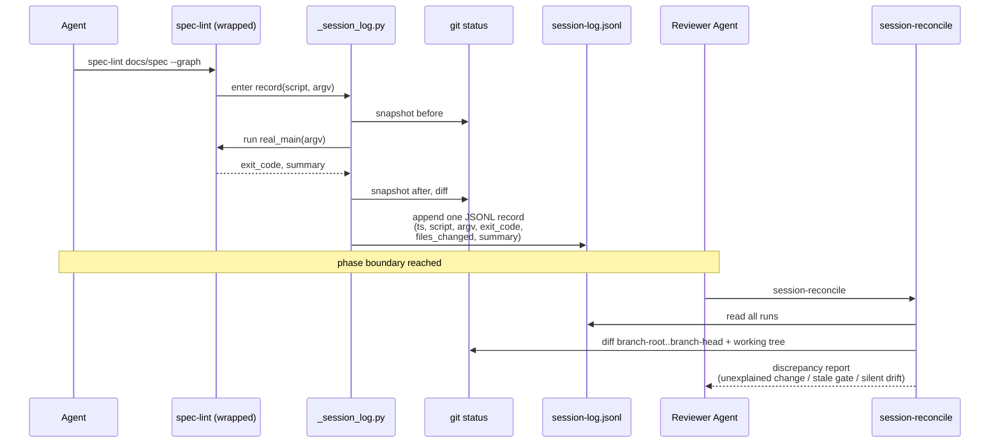

# Session Log Addendum

**Status: proposal, not adopted — a proof-of-concept now exists.** The §5 first slice (instrument `spec-lint` only) is built and tested; see [§6 Proof-of-concept](#6-proof-of-concept). The mechanism is still not adopted as a default-on gate: it stays inert unless a session exports `AF_SESSION_LOG`, and no gate other than `spec-lint` is instrumented.

## Problem

An AI CLI session runs several `factory/scripts/*` gates over a phase, and narrates the work in prose ("I created `docs/spec/prd.md`, wrote the traceability graph, and ran `spec-lint` clean"). Nothing checks that narration against reality. The gates print to the transcript and exit; no run leaves a durable, parseable trace. So we cannot tell whether a file the agent claims to have written actually changed, whether a gate it claims to have run clean actually exited 0, or whether something it never mentioned changed anyway.

The fix is a **session log**: every gate run appends one structured record to a logfile, and a reconciliation step at phase end compares that machine-captured record against the agent's stated claims.

## 1. Log entry schema

One record per run, as a single [JSON Lines](https://jsonlines.org/) object. The fields:

| Field           | Source                        | Why it is needed                                                           |
| --------------- | ----------------------------- | -------------------------------------------------------------------------- |
| `ts`            | script process clock (UTC)    | When the run ended. See the timestamp note below.                          |
| `script`        | script basename               | Which gate ran.                                                            |
| `argv`          | the invocation arguments      | What it ran against (`docs/spec`, `--graph`, ...).                         |
| `exit_code`     | the process exit status       | Clean or not — for `spec-lint`, the error count (see the script's header). |
| `files_changed` | `git status --porcelain` diff | What actually moved on disk around the run — the ground truth (see §3).    |
| `summary`       | the script's own JSON output  | Structured detail the record can carry cheaply, when the gate emits it.    |

Line order in the file is the total order of runs — no separate sequence field is needed to break ties on equal timestamps.

**Format.** JSON Lines, not YAML or a JSON array. Appending a run is one `open(..., "a")` write of one line — no whole-file reparse, no rewriting a closing bracket. Each line parses independently, so an interrupted run leaves every earlier line valid. Consuming it is `json.loads` per line, stdlib only.

**The timestamp note.** An agent cannot read a wall clock; it sees only the date injected into its context, so any time an agent writes down is untrustworthy. `ts` comes from the gate's own process clock (`datetime.now(timezone.utc)`) at the moment the run ends — a fact the agent cannot forge. That is the whole point of the log: it records what the machine observed, not what the agent said.

A real record, grounded in [`spec-lint`](../../scripts/spec-lint) run with `--graph` (which writes `traceability.json` and exits on the error count):

```json
{"ts":"2026-07-11T14:32:07Z","script":"spec-lint","argv":["docs/spec","--graph"],"exit_code":0,"files_changed":[{"path":"docs/spec/traceability.json","status":"M"}],"summary":{"error":0,"warning":2,"info":1}}
```

The `summary` here is `spec-lint --format json`'s own `summary` block, captured as-is. Gates with no JSON mode omit the field.

## 2. Where the log lives, and how scripts write to it

**One unified logfile per session**, not one per script with an index. Reconciliation reads it in a single pass; a per-script scheme would buy nothing and cost an index to keep in sync.

**Path: `.agent-factory/session-log.jsonl`, git-ignored.** The raw log is ephemeral machine telemetry, not a reviewed deliverable — the same class as the git-ignored `session-scratchpad.md`, so it belongs in a hidden namespace, not in `docs/`. The reconciliation *report* (§4) is human-facing and can land in `docs/reviews/` alongside the retrospective; the log itself does not. The sibling [playbook-harness proposal](playbook-structured-harness-strategy.md#1-state-transition-control-via-pre-commit)'s run-state marker lives in the same `.agent-factory/` namespace.

**Mechanism: one shared helper, `factory/scripts/_session_log.py`**, stdlib only (`json`, `os`, `subprocess`, `datetime`). The leading underscore marks it an importable helper, not a callable gate. It exposes a context manager that snapshots git before and after, times the run, and appends — the Python gates wrap their `main()` in it:

```python
with session_log.record("spec-lint", argv):
    return real_main(argv)
```

`record` reads the log path from an env var (`AF_SESSION_LOG`); when unset, it is a no-op. Logging is transparent — the agent still calls `spec-lint docs/spec/` unchanged and cannot forget to log it — yet pre-commit and CI stay silent unless the session opts in by exporting the path once at session start. The two bash scripts (`mdformat`, `scratchpad`) and `structurizr` reach the same helper through a thin CLI mode on `_session_log.py`, added only when their turn comes (§5).

## 3. The "actually happened" inventory

The exit code and args say what ran; they do not say what changed on disk. Two ways to capture that:

- **Self-reporting** — each script reports the paths it touched. Precise, but it must be added to every script, and most gates touch nothing: `spec-lint`, `arch-lint`, and the rest are read-only linters. Self-reported paths would be empty for almost every run, and would still miss the files the *agent* wrote by hand between runs — exactly what reconciliation exists to catch.
- **External git diff** — the helper snapshots `git status --porcelain` before and after the run and records the delta. No per-script change beyond the wrap. It catches every filesystem effect git tracks, including the agent's own edits that happen to fall in the run's window.

**Recommendation: the git-diff snapshot, in the shared helper.** It is the only option that catches the agent's hand-edits, and it costs no per-script logic. Where a gate already emits structured output — `spec-lint --format json` — the helper folds that into `summary` for free, so we get the precision of self-reporting for the gates that offer it, without asking the read-only ones to invent it.

## 4. The reconciliation step

A new deterministic script, `factory/scripts/session-reconcile`, callable exactly the way [`spec-lint`](../factory-guide.md#linting-and-gating) is. It reads two machine facts and compares them: the session log (every run, its exit code, and the tree delta around it), and the phase's real git state — `git diff --name-only` over the invocation's branch-root→branch-head range, per [branching-policy.md § Two SHAs Tracked Per Invocation](../../rulebooks/conventions/branching-policy.md#two-shas-tracked-per-invocation), plus the current working tree.

It flags, with no LLM and no prose-parsing:

- working-tree or committed changes that **no logged run and no commit accounts for** — an unexplained change;
- a **required phase-boundary gate that never ran**, or last ran before the final edit to what it checks — a stale clean;
- files a run's `files_changed` shows touched that are **neither staged nor committed** — silent drift.

Its output is a discrepancy report (text, plus `--format json`); blocking discrepancies become findings, filed per [finding-format.md § When to file](../../rulebooks/conventions/finding-format.md#when-to-file).

The agent's *prose* claims — from the phase review report and the commit messages — are the harder half. A deterministic script cannot judge whether "I updated the traceability graph" is true prose. So reconciliation splits: `session-reconcile` establishes the machine facts and their internal contradictions; the **phase reviewer agent** reads that report as evidence and judges the narration against it — the same way it already runs `spec-lint` first at a phase boundary.

## Sequence: one gate run, then reconciliation



## 5. Migration path

Instrument one gate end to end before touching the rest: **`spec-lint` first.** It already emits structured JSON, it writes a file under `--graph` (so it exercises the git-diff path, unlike the pure read-only gates), and it guards a real phase boundary. The smallest viable slice:

1. Add `_session_log.py` with the `record` context manager and the `AF_SESSION_LOG` env gate.
2. Wrap `spec-lint`'s `main()` in it — two lines.
3. Prove it: run `spec-lint --graph` in a session, confirm one correct JSONL line lands; then run `session-reconcile` against a deliberately false claim and confirm it flags.

Only then roll the same two-line wrap out to the other Python gates (`arch-lint`, `backlog-lint`, `matrix-lint`, `statemachine-lint`, `index-lint`), then the bash scripts via the CLI shim. `init-factory` is one-shot setup, outside any phase loop — instrument it last, or not at all.

## 6. Proof-of-concept

The §5 first slice is built:

- [`factory/scripts/_session_log.py`](../../scripts/_session_log.py) — the `record` context manager and the `AF_SESSION_LOG` gate.
- [`factory/scripts/spec-lint`](../../scripts/spec-lint) — its `main()` is wrapped (import, call-site wrap, one `set_summary` line).
- [`factory/scripts/session-reconcile`](../../scripts/session-reconcile) — the reconciliation script.
- Tests: [`orchestrator/tests/test_session_log.py`](../../../orchestrator/tests/test_session_log.py) and [`orchestrator/tests/test_session_reconcile.py`](../../../orchestrator/tests/test_session_reconcile.py) prove both acceptance scenarios.

One design gap in this addendum had to be closed. The sketch in [§2](#2-where-the-log-lives-and-how-scripts-write-to-it) —

```python
with session_log.record("spec-lint", argv):
    return real_main(argv)
```

cannot capture the exit code: a `return` inside a bare `with` block never passes its value through the context manager, so the record could never learn whether the run was clean. The PoC closes this by having `record()` yield a small `Recorder` whose `.exit_code` the caller assigns through the call itself (`rec.exit_code = main()`), which captures every return path including early error returns. The `summary` block is folded in out-of-band via `set_summary`, a no-op when logging is inactive.

Deferred, as §5 intends: the other Python gates and the bash-script CLI shim; and in `session-reconcile`, the full branch-root -> branch-head range (the PoC takes `--base`/`--head` and falls back to the working tree) and the "gate ran before the last edit" half of the stale check.

## Referenced from

- [playbook-structured-harness-strategy.md § 1. State-transition control via pre-commit](playbook-structured-harness-strategy.md#1-state-transition-control-via-pre-commit)
- [playbook-structured-harness-strategy.md § 2. Parseable handover artifacts](playbook-structured-harness-strategy.md#2-parseable-handover-artifacts)
- [factory-guide.md § Session logging](../factory-guide.md#session-logging)
