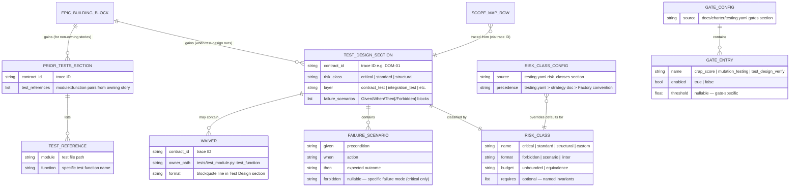
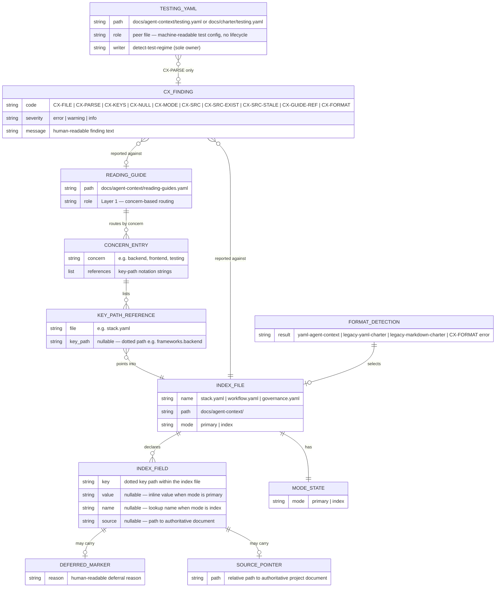

# Entity Model — Factory Flow Control

The entities `factory/scripts/transition-lint`, `factory/scripts/phase`, `factory/scripts/trigger`, and `factory/scripts/index-lint` read, write, or generate, and how they relate. Applying **SOLID** (Single Responsibility): each entity owns one concern of the run's state — the marker owns *where a run is*, the FSM definition owns *what the run's phases are*, the catalog owns *what agents/skills/playbooks/rulebooks exist*.

## Notes

- **FSM_DEFINITION** is one `factory/playbooks/<name>.fsm.yml` file. Only `greenfield-development` has one today — see [PRD § NG4](../prd.md#non-goals). `phase advance`, `phase retry`, and `transition-lint` each parse it independently with the same minimal, indentation-based subset parser (block mappings, block sequences including sequences of multi-key mappings, inline comments, scalars) — not a general YAML library, matching this repo's zero-dependency convention.
- **STATE_DEFINITION.outputs** is a list of glob patterns (`*` within a segment, `**` across segments, `?` one non-separator character) that `transition-lint` matches staged file paths against, and `run-step` matches on-disk files against, to decide state ownership.
- **GATE_CONDITION.type = script_exit_zero** is stubbed to always pass in the current implementation — a named, deferred gap. See [T-03](../todos.md#t-03-script_exit_zero-condition-type-is-stubbed--partially-resolved).
- **HALT_CONDITION** of type `max_iterations` is the only type `phase retry` currently enforces; `script_failure` and `circular_dependency` are declared in `greenfield-development.fsm.yml` but have no enforcing script yet — see [T-04](../todos.md#t-04-halt_conditions-types-other-than-max_iterations-are-unenforced).
- **PLAYBOOK_STATE_MARKER** is the single source of truth for "where is this run" — one flat file at `.current-work/playbook-state.yml`, git-ignored. Full field-level rules in [validation-rules.md](validation-rules.md).
- **FINDING.status** is read from the finding file's YAML frontmatter (a `---`-delimited block whose first line is exactly `---`); `no_open_findings` conditions count files matching a glob whose `status` is exactly `open`. Filing conventions: [finding-format.md § When to file](../../../factory/rulebooks/conventions/finding-format.md#when-to-file).
- **CATALOG** is `factory/INDEX.yaml` — one file holding four entry types (agents, skills, playbooks, rulebooks). It is generated wholesale on every `index-lint` run; there is no per-entry incremental update. Every entry carries a `tokens` field; agents and playbooks also carry `total_tokens`.
- **AGENT_ENTRY.tier** and **MODEL_MATRIX_ENTRY.tier** share the same three-value vocabulary (`economy | standard | strong`); `trigger` resolves an agent's dispatch model by looking up `<cli>.<tier>` in `config/model.conf`.
- **HANDOFF** is the restart contract between two phases. It owns phase continuity; **REPOSITORY_STATE** owns the exact revision and validation evidence, and **ARTIFACT_REFERENCE** names durable information instead of embedding it in a transcript. **HANDOFF_SEMANTIC_REVIEW** records the separate human/agent judgment that the mechanically valid handoff omitted or distorted no material fact.
- **DISPATCH_LEDGER** is the script-owned dispatch record at `.current-work/<feature-branch>/dispatch-ledger.yaml`; each story entry tracks lifecycle fields including `tier`, `attempts`, and the pre-spawn `prepared` state, and each `WaveCloseout` entry records a wave summary (`number`, `completed`, `blocked`, `failed`, `next_ready`, `branch_head`).
- **CHILD_RESULT_ENVELOPE** is deliberately smaller than the tracked result it references. **SESSION_USAGE_SIGNAL** is retrospective evidence qualified by CLI/provider, never live workflow state.
- **SCOPE_MAP_ROW** is one row in `docs/spec/scope-map.md`. The table always has five columns: Rule, Status, Confidence, Sources, Feature Link. `confidence` is populated by the `reverse-map` skill during brownfield onboarding; rows created by `derive-feature` or `scope-map-migration` leave it empty. `sources` names the spec or evidence origin (UC file, .feature file, test file). `feature_link` anchors the conceptual rule to the implementing code — the bridge between the specification plane and the codebase. It is empty when the rule is `specified` (not yet implemented) or when the implementing code has not been identified; the `reconciliation-agent` fills it after implementation. The confidence hierarchy follows a forensic evidence model: passing tests are `verified`, code entry points are `high`, external docs are progressively lower. See [newcomer-onboarding.feature](../newcomer-onboarding.feature).
- **ANCHOR_FILE_SET** is the minimum prerequisite for `feature-addition` after brownfield-lite onboarding. The three files are checked by file existence, not by a gate marker. Their presence signals readiness for feature work; their absence suggests running `brownfield-onboarding` first.

## Test-Design Entities

The test-design skill introduces entities that bridge the specification plane (`.feature` contracts, scope map) to the planning plane (`backlog/epics.md`, story files). These entities are document structures within `backlog/epics.md` and `backlog/ST-NNNN.md`, not database records.

### Notes

- **RISK_CLASS** has three Factory convention defaults (`critical`, `standard`, `structural`). Projects may add custom classes in `docs/charter/testing.yaml`'s `risk_classes:` section. Precedence: `testing.yaml` inline > project-linked strategy document > Factory convention defaults.
- **TEST_DESIGN_SECTION** is a markdown section (`#### Test Design`) within a story's building-block entry in `backlog/epics.md`. It is carried verbatim into the corresponding `backlog/ST-NNNN.md` by `create-backlog-stories`.
- **PRIOR_TESTS_SECTION** is a markdown section (`#### Prior Tests`) for non-owning stories. The developer-agent runs these tests first and must keep them green.
- **WAIVER** is a blockquote line within the `#### Test Design` section: `> Waiver: DOM-01 — owned by tests/test_domain.py::test_entity_uniqueness`. The `test-design-verify` gate parses these and validates the named test module exists.
- **GATE_CONFIG** is a new section in `docs/charter/testing.yaml` that centralizes gate configuration. It does not define gate execution ordering — [ADR-0012](../../adr/0012-dispatcher-owned-semantic-gate-loop.md) owns the dispatcher's gate sequence.
- **GATE_ENTRY** configures an individual gate. `test_design_verify` is implicitly enabled when test-design output exists in the story and skipped otherwise.

## Agent Context Entities

The agent context is the factory-facing interface to project knowledge. It replaces the charter as the structured contract between factory agents and the project's self-determined practices. The two-layer architecture (reading guide over index files) and two-mode lifecycle (primary then index) are modeled below.

### Notes

- **READING_GUIDE** is Layer 1 of the agent context. It routes by work-type concern (backend, frontend, testing, architecture, packaging, and project-specific additions) to sections in the Layer 2 index files. It carries no `source:` pointers — only key-path references. It does not participate in the two-mode lifecycle. It is absent in greenfield projects until the first `source:` pointer is written.
- **KEY_PATH_REFERENCE** uses the notation `<file>#<dotted.key.path>` (e.g. `stack.yaml#frameworks.backend`). A bare file reference (`stack.yaml`) means the entire file. `context-lint` validates these references via `CX-GUIDE-REF` by confirming the key path exists in the target file's YAML structure — key existence only, not value content.
- **INDEX_FILE** is one of the three Layer 2 files (`stack.yaml`, `workflow.yaml`, `governance.yaml`). Each covers a distinct domain of project knowledge. They carry `source:` pointers to authoritative project documents and participate in the two-mode lifecycle.
- **INDEX_FIELD** has different shapes depending on mode. In `mode: primary`, a field may be a scalar value, `null`, or a `deferred:` mapping. In `mode: index`, a field carries `name:` and `source:` together. The `deferred:` mapping replaces the entire field value — `deferred` is the sole key; any coexisting `name`/`source` key is a `CX-KEYS` error.
- **MODE_STATE** is one of `primary` (greenfield — index files are the upstream source) or `index` (mature — index files are downstream routing tables). The transition from `primary` to `index` is one-directional and atomic across all three index files. See [state-machines.md](state-machines.md).
- **TESTING_YAML** is a peer file outside the two-mode lifecycle. It is written by `detect-test-regime`, not by `update-context`. `context-lint` validates it with `CX-PARSE` only — no `CX-SRC`, `CX-MODE`, or `CX-NULL` checks apply. Format detection resolves its path independently: `docs/agent-context/testing.yaml` first, `docs/charter/testing.yaml` as fallback, with no `CX-FORMAT` error for the split location.
- **FORMAT_DETECTION** is a shared subfunction used by all factory consumers. It walks a three-step chain: `docs/agent-context/stack.yaml` → `docs/charter/tech-stack.yaml` → `docs/charter/tech-stack.md`. Files in more than one location produce a `CX-FORMAT` error. `testing.yaml` is resolved independently and does not trigger mixed-location errors.
- **CX_FINDING** replaces the charter-lint `CH-*` codes for YAML agent-context validation. Legacy markdown charter projects continue to use the existing `CH-*` codes.

## Referenced from

- [actor-goal-list.md](../../~archive/spec/actor-goal-list.md)
- [UC-01](../../~archive/spec/use_cases/UC-01-advance-a-playbook-phase.md)
- [test-design.feature](../test-design.feature)
- [agent-context.feature](../agent-context.feature)
