# Entity Model — Factory Specification

The entities the Factory's flow-control scripts and architecture modeling pipeline read, write, or generate, and how they relate. Applying **SOLID** (Single Responsibility): each entity owns one concern — the marker owns *where a run is*, the FSM definition owns *what the run's phases are*, the catalog owns *what agents/skills/playbooks/rulebooks exist*, the architecture model owns *what architectural elements exist and how they connect*.

```mermaid
erDiagram
    FSM_DEFINITION ||--o{ STATE_DEFINITION : declares
    FSM_DEFINITION ||--o{ HALT_CONDITION : declares
    FSM_DEFINITION ||--o{ GATE_CONDITION : "gate_conditions library"
    STATE_DEFINITION ||--o{ GATE_CONDITION : "entry_conditions reference"
    HALT_CONDITION }o--|| STATE_DEFINITION : caps
    PLAYBOOK_STATE_MARKER }o--|| FSM_DEFINITION : "instance of (by playbook name)"
    PLAYBOOK_STATE_MARKER }o--|| STATE_DEFINITION : "currently at (by state name)"
    GATE_CONDITION ||--o{ FINDING : "no_open_findings counts"
    CATALOG ||--o{ AGENT_ENTRY : lists
    CATALOG ||--o{ SKILL_ENTRY : lists
    CATALOG ||--o{ PLAYBOOK_ENTRY : lists
    CATALOG ||--o{ RULEBOOK_ENTRY : lists
    PLAYBOOK_ENTRY ||--o| FSM_DEFINITION : "fsm field points at"
    PLAYBOOK_ENTRY ||--o{ AGENT_ENTRY : "agents sequence"
    AGENT_ENTRY ||--o| MODEL_MATRIX_ENTRY : "tier resolves via"
    HANDOFF ||--o{ ARTIFACT_REFERENCE : names
    HANDOFF ||--|| REPOSITORY_STATE : records
    HANDOFF_SEMANTIC_REVIEW }o--|| HANDOFF : evaluates
    CHILD_RESULT_ENVELOPE ||--o{ ARTIFACT_REFERENCE : points_to
    SESSION_USAGE_SIGNAL }o--|| REPOSITORY_STATE : qualifies_session
    ARCHITECTURE_MODEL ||--o{ ARCHITECTURE_VIEW : defines
    ARCHITECTURE_MODEL ||--o{ ARCHITECTURE_CONSTRAINT : declares
    ARCHITECTURE_MODEL ||--|| ARCHITECTURE_DIAGRAM : "syncs with"
    ARCHITECTURE_MODEL ||--|| SYNC_STATE : "tracked by"
    ARCHITECTURE_VIEW ||--o{ EXPORTED_IMAGE : "rendered to"

    FSM_DEFINITION {
        string playbook
        string version
        string type "workflow-state-machine"
    }
    STATE_DEFINITION {
        string name
        string description
        string agent "nullable — null for a human-approval state"
        string session "stateful or stateless, nullable"
        list   outputs "glob patterns"
        list   entry_conditions "gate_conditions names"
        bool   final "nullable, true on the terminal state"
    }
    GATE_CONDITION {
        string name
        string type "file_exists | files_exist | no_open_findings | script_exit_zero"
        string path "nullable — file_exists"
        list   paths "nullable — files_exist"
        string pattern "nullable — no_open_findings, single glob"
        list   patterns "nullable — no_open_findings, multiple globs"
        string script "nullable — script_exit_zero, stubbed to pass"
    }
    HALT_CONDITION {
        string type "max_iterations | script_failure | circular_dependency"
        string state "nullable — the state max_iterations names"
        string event "nullable"
        int    limit "nullable — max_iterations only"
        string message "nullable — human escalation text"
    }
    PLAYBOOK_STATE_MARKER {
        string playbook
        string state
        string gate "nullable"
        string result "pass, nullable"
        int    open_findings
        string next "nullable — next state name"
        int    iteration
        string recorded_by "human or an agent/CLI identifier"
        string recorded_at "UTC timestamp, ISO 8601, script clock only"
    }
    FINDING {
        string id "TAG-NNNN"
        string status "open | resolved, frontmatter field"
    }
    CATALOG {
        string generated_by "index-lint"
    }
    AGENT_ENTRY {
        string name
        string title
        int    phase "nullable"
        string phase_name "nullable"
        string tier "nullable — economy | standard | strong"
        string description
        string path
        int    tokens "tiktoken cl100k_base body count"
        int    total_tokens "body + skills + rulebooks"
    }
    SKILL_ENTRY {
        string name
        string category "nullable"
        string description
        string path
        int    tokens "tiktoken cl100k_base body count"
    }
    PLAYBOOK_ENTRY {
        string name
        string title
        string category "nullable"
        string description
        string path
        string fsm "nullable — path to the .fsm.yml"
        int    tokens "tiktoken cl100k_base body count"
        int    total_tokens "nullable — body + unique agent totals"
    }
    RULEBOOK_ENTRY {
        string name
        string category "nullable — e.g. conventions"
        string path
        int    tokens "tiktoken cl100k_base body count"
    }
    MODEL_MATRIX_ENTRY {
        string cli "copilot | codex | pi (model.conf row keys. Claude Code resolves its model outside model.conf)"
        string tier "economy | standard | strong"
        string model_id
    }
    HANDOFF {
        string outgoing_phase
        string incoming_phase
        string summary "dense, no information loss"
        string next_action
    }
    HANDOFF_SEMANTIC_REVIEW {
        string reviewer
        string disposition "pass or reject"
        list omissions_or_distortions
    }
    ARTIFACT_REFERENCE {
        string path "canonical tracked path"
        string purpose
    }
    REPOSITORY_STATE {
        string head_sha "exact 40-character SHA"
        string branch
        string upstream
        string gate_result
        string verification_evidence
    }
    CHILD_RESULT_ENVELOPE {
        string disposition
        map finding_counts "by severity"
        string next_action "one to three sentences"
    }
    SESSION_USAGE_SIGNAL {
        string cli
        string provider
        string capability "full-cache | input-only | unavailable"
        int cache_miss_turns "nullable when unavailable"
        int cache_miss_input_tokens "nullable when unavailable"
        float late_early_input_ratio "nullable when unavailable"
    }
    ARCHITECTURE_MODEL {
        string path "docs/arc42/architecture.jsonc"
        string schema "Bausteinsicht JSON Schema URL"
        list elements "systems, containers, components, etc."
        list relationships "source-target with description"
    }
    ARCHITECTURE_DIAGRAM {
        string path "docs/arc42/architecture.drawio"
        string role "layout and visual arrangement"
    }
    SYNC_STATE {
        string path "docs/arc42/.bausteinsicht-sync"
        string role "auto-managed sync checkpoint"
    }
    ARCHITECTURE_VIEW {
        string name "view identifier"
        string type "static or dynamic"
    }
    ARCHITECTURE_CONSTRAINT {
        string description "rule text"
        string scope "elements or relationships it governs"
    }
    EXPORTED_IMAGE {
        string path "docs/assets/images/<view>.<format>"
        string format "png or svg"
    }
```

## Notes

- **FSM_DEFINITION** is one `factory/playbooks/<name>.fsm.yml` file. Only `greenfield-development` has one today — see [PRD § NG4](../prd.md#non-goals). `phase advance`, `phase retry`, and `transition-lint` each parse it independently with the same minimal, indentation-based subset parser (block mappings, block sequences including sequences of multi-key mappings, inline comments, scalars) — not a general YAML library, matching this repo's zero-dependency convention.
- **STATE_DEFINITION.outputs** is a list of glob patterns (`*` within a segment, `**` across segments, `?` one non-separator character) that `transition-lint` matches staged file paths against, and `run-step` matches on-disk files against, to decide state ownership.
- **GATE_CONDITION.type = script_exit_zero** is stubbed to always pass in the current implementation — a named, deferred gap. See [T-03](../todos.md#t-03-script_exit_zero-condition-type-is-stubbed).
- **HALT_CONDITION** of type `max_iterations` is the only type `phase retry` currently enforces; `script_failure` and `circular_dependency` are declared in `greenfield-development.fsm.yml` but have no enforcing script yet — see [T-04](../todos.md#t-04-halt_conditions-types-other-than-max_iterations-are-unenforced).
- **PLAYBOOK_STATE_MARKER** is the single source of truth for "where is this run" — one flat file at `.agent-factory/playbook-state.yml`, git-ignored. Full field-level rules in [validation-rules.md](validation-rules.md).
- **FINDING.status** is read from the finding file's YAML frontmatter (a `---`-delimited block whose first line is exactly `---`); `no_open_findings` conditions count files matching a glob whose `status` is exactly `open`. Filing conventions: [finding-format.md § When to file](../../../factory/rulebooks/conventions/finding-format.md#when-to-file).
- **CATALOG** is `factory/INDEX.yaml` — one file holding four entry types (agents, skills, playbooks, rulebooks). It is generated wholesale on every `index-lint` run; there is no per-entry incremental update. Every entry carries a `tokens` field; agents and playbooks also carry `total_tokens`.
- **AGENT_ENTRY.tier** and **MODEL_MATRIX_ENTRY.tier** share the same three-value vocabulary (`economy | standard | strong`); `trigger` resolves an agent's dispatch model by looking up `<cli>.<tier>` in `config/model.conf`.
- **HANDOFF** is the restart contract between two phases. It owns phase continuity; **REPOSITORY_STATE** owns the exact revision and validation evidence, and **ARTIFACT_REFERENCE** names durable information instead of embedding it in a transcript. **HANDOFF_SEMANTIC_REVIEW** records the separate human/agent judgment that the mechanically valid handoff omitted or distorted no material fact.
- **CHILD_RESULT_ENVELOPE** is deliberately smaller than the tracked result it references. **SESSION_USAGE_SIGNAL** is retrospective evidence qualified by CLI/provider, never live workflow state.
- **ARCHITECTURE_MODEL** is `docs/arc42/architecture.jsonc` — the single source of truth for architectural structure (BR-050). Its `$schema` field points to the Bausteinsicht JSON Schema on GitHub for IDE autocompletion. Agents work in this file exclusively (BR-052).
- **ARCHITECTURE_DIAGRAM** is `docs/arc42/architecture.drawio` — the tracked visual artifact that owns layout and receives forward-synced structural changes. Reverse sync carries back only labels and descriptions (BR-051). Marked as binary in `.gitattributes`.
- **SYNC_STATE** is `docs/arc42/.bausteinsicht-sync` — a dot-file auto-managed by `bausteinsicht sync` to track the synchronization point between model and diagram. Not edited manually.
- **ARCHITECTURE_VIEW** is a named view (static or dynamic) defined in the JSONC model. Each view is rendered to one or more exported images by `bausteinsicht export`.
- **ARCHITECTURE_CONSTRAINT** is a rule declared in the JSONC model's `constraints` array, enforced by `bausteinsicht lint` (BR-056).
- **EXPORTED_IMAGE** is a derived PNG or SVG file in `docs/assets/images/`, rendered from a view by `bausteinsicht export`. Arc42 chapters embed these with relative image references (BR-057).

## Referenced from

- [actor-goal-list.md](../actor-goal-list.md)
- [UC-01](../use_cases/UC-01-advance-a-playbook-phase.md)
