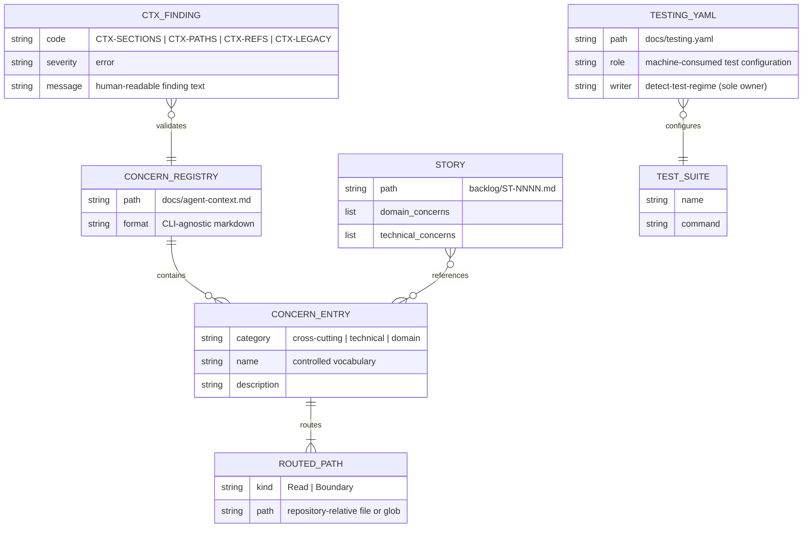
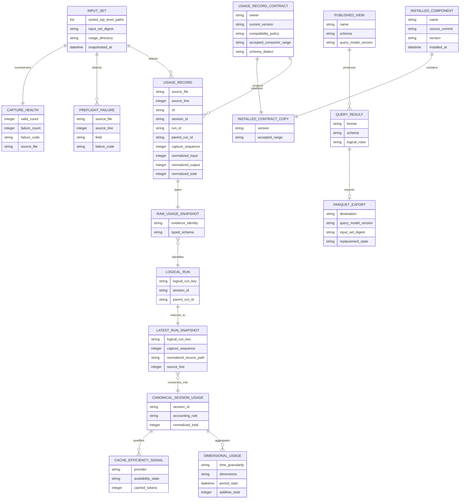
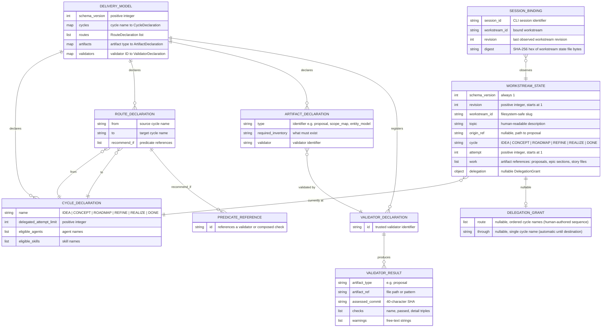

# Entity Model — Factory Flow Control

The entities `factory/scripts/transition-lint`, `factory/scripts/phase`, `factory/scripts/trigger`, and `factory/scripts/index-lint` read, write, or generate, and how they relate. Applying **SOLID** (Single Responsibility): each entity owns one concern of the run's state — the marker owns *where a run is*, the FSM definition owns *what the run's phases are*, the catalog owns *what agents/skills/playbooks/rulebooks exist*.

```mermaid
erDiagram
    FSM_DEFINITION ||--o{ STATE_DEFINITION : declares
    FSM_DEFINITION ||--o{ HALT_CONDITION : declares
    FSM_DEFINITION ||--o{ GATE_CONDITION : "gate_conditions library"
    STATE_DEFINITION ||--o{ GATE_CONDITION : "entry_conditions reference"
    HALT_CONDITION }o--|| STATE_DEFINITION : caps
    PLAYBOOK_STATE_MARKER }o--|| FSM_DEFINITION : "instance of (by playbook name)"
    PLAYBOOK_STATE_MARKER }o--|| STATE_DEFINITION : "currently at (by state name)"
    GATE_CONDITION ||--o{ FINDING : "no_open_findings counts"
    CATALOG ||--o{ AGENT_ENTRY : lists
    CATALOG ||--o{ SKILL_ENTRY : lists
    CATALOG ||--o{ PLAYBOOK_ENTRY : lists
    CATALOG ||--o{ RULEBOOK_ENTRY : lists
    PLAYBOOK_ENTRY ||--o| FSM_DEFINITION : "fsm field points at"
    PLAYBOOK_ENTRY ||--o{ AGENT_ENTRY : "agents sequence"
    AGENT_ENTRY ||--o| MODEL_MATRIX_ENTRY : "tier resolves via"
    HANDOFF ||--o{ ARTIFACT_REFERENCE : names
    HANDOFF ||--|| REPOSITORY_STATE : records
    HANDOFF_SEMANTIC_REVIEW }o--|| HANDOFF : evaluates
    CHILD_RESULT_ENVELOPE ||--o{ ARTIFACT_REFERENCE : points_to
    SESSION_USAGE_SIGNAL }o--|| REPOSITORY_STATE : qualifies_session

    FSM_DEFINITION {
        string playbook
        string version
        string type "workflow-state-machine"
    }
    STATE_DEFINITION {
        string name
        string description
        string agent "nullable — null for a human-approval state"
        string session "stateful or stateless, nullable"
        list   outputs "glob patterns"
        list   entry_conditions "gate_conditions names"
        bool   final "nullable, true on the terminal state"
    }
    GATE_CONDITION {
        string name
        string type "file_exists | files_exist | no_open_findings | script_exit_zero"
        string path "nullable — file_exists"
        list   paths "nullable — files_exist"
        string pattern "nullable — no_open_findings, single glob"
        list   patterns "nullable — no_open_findings, multiple globs"
        string script "nullable — script_exit_zero, stubbed to pass"
    }
    HALT_CONDITION {
        string type "max_iterations | script_failure | circular_dependency"
        string state "nullable — the state max_iterations names"
        string event "nullable"
        int    limit "nullable — max_iterations only"
        string message "nullable — human escalation text"
    }
    PLAYBOOK_STATE_MARKER {
        string playbook
        string state
        string gate "nullable"
        string result "pass, nullable"
        int    open_findings
        string next "nullable — next state name"
        int    iteration
        string recorded_by "human or an agent/CLI identifier"
        string recorded_at "UTC timestamp, ISO 8601, script clock only"
    }
    FINDING {
        string id "TAG-NNNN"
        string status "open | resolved, frontmatter field"
    }
    CATALOG {
        string generated_by "index-lint"
    }
    AGENT_ENTRY {
        string name
        string title
        int    phase "nullable"
        string phase_name "nullable"
        string tier "nullable — economy | standard | strong"
        string description
        string path
        int    tokens "tiktoken cl100k_base body count"
        int    total_tokens "body + skills + rulebooks"
    }
    SKILL_ENTRY {
        string name
        string category "nullable"
        string description
        string path
        int    tokens "tiktoken cl100k_base body count"
    }
    PLAYBOOK_ENTRY {
        string name
        string title
        string category "nullable"
        string description
        string path
        string fsm "nullable — path to the .fsm.yml"
        int    tokens "tiktoken cl100k_base body count"
        int    total_tokens "nullable — body + unique agent totals"
    }
    RULEBOOK_ENTRY {
        string name
        string category "nullable — e.g. conventions"
        string path
        int    tokens "tiktoken cl100k_base body count"
    }
    MODEL_MATRIX_ENTRY {
        string cli "copilot | codex | pi (model.conf row keys. Claude Code resolves its model outside model.conf)"
        string tier "economy | standard | strong"
        string model_id
    }
    HANDOFF {
        string outgoing_phase
        string incoming_phase
        string summary "dense, no information loss"
        string next_action
    }
    HANDOFF_SEMANTIC_REVIEW {
        string reviewer
        string disposition "pass or reject"
        list omissions_or_distortions
    }
    ARTIFACT_REFERENCE {
        string path "canonical tracked path"
        string purpose
    }
    REPOSITORY_STATE {
        string head_sha "exact 40-character SHA"
        string branch
        string upstream
        string gate_result
        string verification_evidence
    }
    CHILD_RESULT_ENVELOPE {
        string disposition
        map finding_counts "by severity"
        string next_action "one to three sentences"
    }
    SESSION_USAGE_SIGNAL {
        string cli
        string provider
        string capability "full-cache | input-only | unavailable"
        int cache_miss_turns "nullable when unavailable"
        int cache_miss_input_tokens "nullable when unavailable"
        float late_early_input_ratio "nullable when unavailable"
    }
    SCOPE_MAP_ROW {
        string rule "behavioral claim — one sentence"
        string status "implemented | specified | deferred"
        string confidence "nullable — verified | flagged | high | medium-high | medium | medium-low | low | lowest | claimed"
        string sources "spec or evidence origin — UC file, .feature file, test file, doc"
        string feature_link "nullable — path to implementing code#59; anchors conceptual rule to codebase"
    }
    ANCHOR_FILE_SET {
        string architecture_dsl "docs/arc42/architecture.dsl"
        string scope_map "docs/spec/scope-map.md"
        string context "docs/CONTEXT.md"
    }
```

## Notes

- **FSM_DEFINITION** is one `factory/playbooks/<name>.fsm.yml` file. Only `greenfield-development` has one today — see [PRD § NG4](../prd.md#non-goals). `phase advance`, `phase retry`, and `transition-lint` each parse it independently with the same minimal, indentation-based subset parser (block mappings, block sequences including sequences of multi-key mappings, inline comments, scalars) — not a general YAML library, matching this repo's zero-dependency convention.
- **STATE_DEFINITION.outputs** is a list of glob patterns (`*` within a segment, `**` across segments, `?` one non-separator character) that `transition-lint` matches staged file paths against, and `run-step` matches on-disk files against, to decide state ownership.
- **GATE_CONDITION.type = script_exit_zero** is stubbed to always pass in the current implementation — a named, deferred gap. See [T-03](../todos.md#t-03-script_exit_zero-condition-type-is-stubbed--partially-resolved).
- **HALT_CONDITION** of type `max_iterations` is the only type `phase retry` currently enforces; `script_failure` and `circular_dependency` are declared in `greenfield-development.fsm.yml` but have no enforcing script yet — see [T-04](../todos.md#t-04-halt_conditions-types-other-than-max_iterations-are-unenforced).
- **PLAYBOOK_STATE_MARKER** is the single source of truth for "where is this run" — one flat file at `.current-work/playbook-state.yml`, git-ignored. Full field-level rules in [validation-rules.md](validation-rules.md).
- **FINDING.status** is read from the finding file's YAML frontmatter (a `---`-delimited block whose first line is exactly `---`); `no_open_findings` conditions count files matching a glob whose `status` is exactly `open`. Filing conventions: [finding-format.md § When to file](../../../factory/rulebooks/conventions/finding-format.md#when-to-file).
- **CATALOG** is `factory/INDEX.yaml` — one file holding four entry types (agents, skills, playbooks, rulebooks). It is generated wholesale on every `index-lint` run; there is no per-entry incremental update. Every entry carries a `tokens` field; agents and playbooks also carry `total_tokens`.
- **AGENT_ENTRY.tier** and **MODEL_MATRIX_ENTRY.tier** share the same three-value vocabulary (`economy | standard | strong`); `trigger` resolves an agent's dispatch model by looking up `<cli>.<tier>` in `config/model.conf`.
- **HANDOFF** is the restart contract between two phases. It owns phase continuity; **REPOSITORY_STATE** owns the exact revision and validation evidence, and **ARTIFACT_REFERENCE** names durable information instead of embedding it in a transcript. **HANDOFF_SEMANTIC_REVIEW** records the separate human/agent judgment that the mechanically valid handoff omitted or distorted no material fact.
- **DISPATCH_LEDGER** is the script-owned dispatch record at `.current-work/<feature-branch>/dispatch-ledger.yaml`; each story entry tracks lifecycle fields including `tier`, `attempts`, and the pre-spawn `prepared` state, and each `WaveCloseout` entry records a wave summary (`number`, `completed`, `blocked`, `failed`, `next_ready`, `branch_head`).
- **CHILD_RESULT_ENVELOPE** is deliberately smaller than the tracked result it references. **SESSION_USAGE_SIGNAL** is retrospective evidence qualified by CLI/provider, never live workflow state.
- **SCOPE_MAP_ROW** is one row in `docs/spec/scope-map.md`. The table always has five columns: Rule, Status, Confidence, Sources, Feature Link. `confidence` is populated by the `reverse-map` skill during brownfield onboarding; rows created by `derive-feature` or `scope-map-migration` leave it empty. `sources` names the spec or evidence origin (UC file, .feature file, test file). `feature_link` anchors the conceptual rule to the implementing code — the bridge between the specification plane and the codebase. It is empty when the rule is `specified` (not yet implemented) or when the implementing code has not been identified; the `reconciliation-agent` fills it after implementation. The confidence hierarchy follows a forensic evidence model: passing tests are `verified`, code entry points are `high`, external docs are progressively lower. See [newcomer-onboarding.feature](../newcomer-onboarding.feature).
- **ANCHOR_FILE_SET** is the minimum prerequisite for `feature-addition` after brownfield-lite onboarding. The three files are checked by file existence, not by a gate marker. Their presence signals readiness for feature work; their absence suggests running `brownfield-onboarding` first.

## Test-Design Entities

The test-design skill introduces entities that bridge the specification plane (`.feature` contracts, scope map) to the planning plane (`backlog/epics.md`, story files). These entities are document structures within `backlog/epics.md` and `backlog/ST-NNNN.md`, not database records.

### Notes

- **RISK_CLASS** has three Factory convention defaults (`critical`, `standard`, `structural`). Projects may add custom classes in `docs/testing.yaml`'s `risk_classes:` section. Precedence: `testing.yaml` inline > project-linked strategy document > Factory convention defaults.
- **TEST_DESIGN_SECTION** is a markdown section (`#### Test Design`) within a story's building-block entry in `backlog/epics.md`. It is carried verbatim into the corresponding `backlog/ST-NNNN.md` by `create-backlog-stories`.
- **PRIOR_TESTS_SECTION** is a markdown section (`#### Prior Tests`) for non-owning stories. The developer-agent runs these tests first and must keep them green.
- **WAIVER** is a blockquote line within the `#### Test Design` section: `> Waiver: DOM-01 — owned by tests/test_domain.py::test_entity_uniqueness`. The `test-design-verify` gate parses these and validates the named test module exists.
- **GATE_CONFIG** is a new section in `docs/testing.yaml` that centralizes gate configuration. It does not define gate execution ordering — [ADR-0012](../../adr/0012-dispatcher-owned-semantic-gate-loop.md) owns the dispatcher's gate sequence.
- **GATE_ENTRY** configures an individual gate. `test_design_verify` is implicitly enabled when test-design output exists in the story and skipped otherwise.

## Agent Context Entities

The concern registry is the factory-facing routing interface to project knowledge. Machine-consumed test configuration remains a separate artifact.

### Notes

- **CONCERN_REGISTRY** has exactly three category headings: Always (cross-cutting), Technical concerns, and Domain concerns.
- **CONCERN_ENTRY** has a description and at least one `Read:` path. `Boundary:` paths are optional. Cross-cutting entries always apply; story frontmatter selects technical and domain entries.
- **STORY.concerns** is advisory and uses only confirmed registry headings. A missing vocabulary entry is proposed and confirmed before use.
- **TESTING_YAML** is not routing content. Factory consumers resolve only `docs/testing.yaml`; there is no legacy-path fallback.
- **CTX_FINDING** is produced by `concern-lint`. Legacy YAML context or `docs/charter/` beside the registry is an error.

## Referenced from

- [actor-goal-list.md](../../~archive/spec/actor-goal-list.md)
- [UC-01](../../~archive/spec/use_cases/UC-01-advance-a-playbook-phase.md)
- [test-design.feature](../test-design.feature)
- [agent-context.feature](../agent-context.feature)

## Local Usage Analysis Entities

The [local usage feature](../local-usage-processing-and-analysis.feature) retains JSONL as evidence and creates query-scoped analytical entities only.

### Entity invariants

- `INPUT_SET` is immutable for one query and contains only sorted, top-level `*.jsonl` paths from the selected usage directory.
- Evidence identity is `(normalized_source_path, source_line)`. The path is relative to the selected usage directory, uses `/` separators, has `.` removed, rejects `..`, absolute paths, invalid UTF-8, and Unicode-normalizes each segment to NFC. Line numbers are one-based positive integers.
- The closed registry keys are exactly `claude-code`, `pi`, `codex`, and `copilot`. Every CLI uses logical-run key `(cli, session_id, run_id)`. For Claude Code and Pi this distinguishes additive child or descendant runs; for Codex and GitHub Copilot CLI it distinguishes inclusive roots from attribution-only descendants. `parent_run_id` establishes ancestry but is not part of identity. Source path, source line, capture sequence, and record content never enter the logical-run key.
- Before `LATEST_RUN_SNAPSHOT` selection, all otherwise valid evidence snapshots for one logical-run key must have exactly one distinct `parent_run_id`, with null treated as a value. Disagreement classifies every snapshot for that key as a `PREFLIGHT_FAILURE` with `USAGE_ANCESTRY_PARENT_CONFLICT`; no evidence snapshot establishes or overrides the logical run's parent.
- Each `(cli, session_id)` partition contains exactly one root with null `parent_run_id`. Every non-root parent resolves to a distinct logical run in the same partition. The parent graph is acyclic, every run is reachable from the root, direct children name the root's `run_id`, and descendants are its transitive closure.
- Missing parents, cross-CLI or cross-session parents, self-links, cycles, and root counts other than one create `PREFLIGHT_FAILURE` rows with the stable `USAGE_ANCESTRY_*` codes and prevent canonical accounting.
- Every selected line produces exactly one `USAGE_RECORD` or `PREFLIGHT_FAILURE` in query scope.
- `normalized_total` equals `normalized_input + normalized_output`; token counters are non-negative.
- `LATEST_RUN_SNAPSHOT` selects the greatest tuple `(capture_sequence, normalized_source_path, source_line)`: capture sequence numerically ascending, normalized path by unsigned UTF-8 byte lexicographic order, and line number numerically ascending. Selection takes the maximum tuple; this makes the later line win within one file and removes source identity after one snapshot remains per logical-run key.
- `CANONICAL_SESSION_USAGE` has one accounting result per session. Its rule is selected from the closed four-CLI registry.
- `CACHE_EFFICIENCY_SIGNAL` distinguishes unavailable, input-only, and measured values; unavailable is not zero.
- A stable `QUERY_RESULT` other than `capture_health` exists only when the input set has zero failures.
- `PARQUET_EXPORT` is derived, attributable, atomic, and rebuildable. It is never authoritative state.
- `INSTALLED_COMPONENT` and `.agent-factory/usage/` have independent lifecycles. Component removal preserves evidence; full Factory removal does not.

## Cycle-Based Orchestration Entities

The cycle engine replaces the linear playbook FSM as the software-delivery routing authority. The entities below describe what the engine loads, what it writes, and what sessions use to bind to workstreams. These entities supersede `PLAYBOOK_STATE_MARKER` and `FSM_DEFINITION` for delivery routing. The superseded entities remain documented above for reference.

Proposal trace: [cycle-based-orchestration.md](../../proposals/cycle-based-orchestration.md)

### Notes

- **DELIVERY_MODEL** is loaded from `packages/factory/engine/models/delivery.yaml` (tracked source) or `factory/engine/models/delivery.yaml` (installed copy). The schema at `packages/factory/engine/schemas/cycle-model-v1.schema.json` rejects direction fields, classification fields, and executable commands in validator references.
- **CYCLE_DECLARATION** names one node in the delivery graph. DONE is the terminal node. Every non-terminal cycle declares a positive `delegated_attempt_limit`.
- **ROUTE_DECLARATION** is one directed edge. It has no direction or classification field. The source and target define the edge. `recommend_if` lists predicate references whose results determine whether the engine recommends this route. Failed predicates produce warnings but do not remove the route from human selection.
- **ARTIFACT_DECLARATION** maps an artifact type to its required inventory and validator. The validator field references a `VALIDATOR_DECLARATION` by identifier. It never contains a shell command.
- **VALIDATOR_RESULT** is immutable once produced. Every result carries the assessed commit SHA, individual check results, and warnings. The engine computes recommendations from these results without writing repository state.
- **WORKSTREAM_STATE** is persisted at `.current-work/cycles/<workstream-id>.yaml`. `revision` increments on every successful mutation. `attempt` starts at 1 on cycle entry or work-list change and increments on each accepted retry. `delegation` is null when no grant is active. The `work` list contains references to existing proposals, epic sections, or story files; it never copies requirements or assessment results.
- **DELEGATION_GRANT** is a value object within `WORKSTREAM_STATE`. It contains exactly one of `route` (an ordered list of human-authored cycle selections) or `through` (a single destination cycle). Only a human can create, replace, or revoke a grant.
- **SESSION_BINDING** is persisted at `.current-work/session-bindings/<cli>/<session-id>.yaml`. Path components use the existing usage-capture filesystem-key encoding. The binding is session-local navigation state, not delivery evidence. A stale binding (digest mismatch) is detected on the next mutation attempt and triggers a refresh.
- **Concurrency model:** Every workstream mutation acquires an exclusive operating-system lock at `.current-work/cycles/.locks/<workstream-id>.lock`. The lock covers only the read, comparison, validation, and replacement sequence. The adapter reads the current state, compares the session binding's `revision` and `digest` against the file on disk, and either writes a temporary sibling file followed by an atomic replacement, or returns a conflict without writing. Different workstreams use separate locks.
