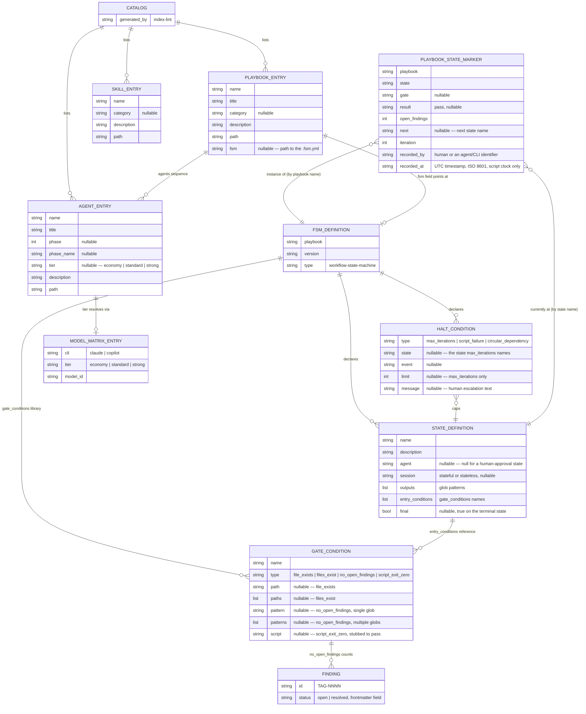

# Entity Model — Factory Flow Control

The entities `factory/scripts/transition-lint`, `factory/scripts/phase`, `factory/scripts/trigger`, and `factory/scripts/index-lint` read, write, or generate, and how they relate. Applying **SOLID** (Single Responsibility): each entity owns one concern of the run's state — the marker owns *where a run is*, the FSM definition owns *what the run's phases are*, the catalog owns *what agents/skills/playbooks exist*.

## Notes

- **FSM_DEFINITION** is one `factory/playbooks/<name>.fsm.yml` file. Only `greenfield-development` has one today — see [PRD § NG4](../prd.md#non-goals). `phase advance`, `phase retry`, and `transition-lint` each parse it independently with the same minimal, indentation-based subset parser (block mappings, block sequences including sequences of multi-key mappings, inline comments, scalars) — not a general YAML library, matching this repo's zero-dependency convention.
- **STATE_DEFINITION.outputs** is a list of glob patterns (`*` within a segment, `**` across segments, `?` one non-separator character) that `transition-lint` matches staged file paths against, and `run-step` matches on-disk files against, to decide state ownership.
- **GATE_CONDITION.type = script_exit_zero** is stubbed to always pass in the current implementation — a named, deferred gap. See [T-03](../todos.md#t-03-script_exit_zero-condition-type-is-stubbed).
- **HALT_CONDITION** of type `max_iterations` is the only type `phase retry` currently enforces; `script_failure` and `circular_dependency` are declared in `greenfield-development.fsm.yml` but have no enforcing script yet — see [T-04](../todos.md#t-04-halt_conditions-types-other-than-max_iterations-are-unenforced).
- **PLAYBOOK_STATE_MARKER** is the single source of truth for "where is this run" — one flat file at `.agent-factory/playbook-state.yml`, git-ignored. Full field-level rules in [validation-rules.md](validation-rules.md).
- **FINDING.status** is read from the finding file's YAML frontmatter (a `---`-delimited block whose first line is exactly `---`); `no_open_findings` conditions count files matching a glob whose `status` is exactly `open`. Filing conventions: [finding-format.md § When to file](../../../factory/rulebooks/conventions/finding-format.md#when-to-file).
- **CATALOG** is `factory/INDEX.yaml` — one file holding all three entry types. It is generated wholesale on every `index-lint` run; there is no per-entry incremental update.
- **AGENT_ENTRY.tier** and **MODEL_MATRIX_ENTRY.tier** share the same three-value vocabulary (`economy | standard | strong`); `trigger` resolves an agent's dispatch model by looking up `<cli>.<tier>` in `config/model.conf`.

## Referenced from

- [actor-goal-list.md](../actor-goal-list.md)
- [UC-01](../use_cases/UC-01-advance-a-playbook-phase.md)
