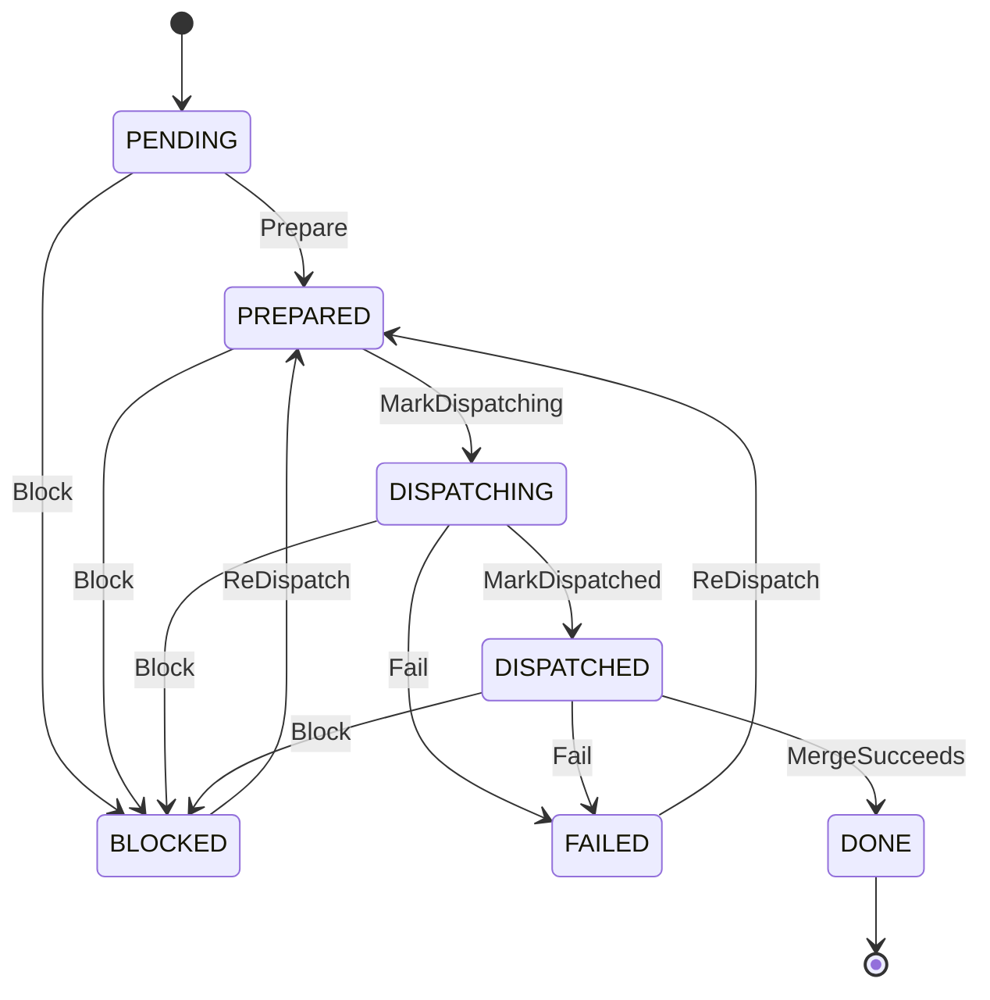

# Mechanized Dispatch and Step Isolation — Behavioral Specification

Origin: [mechanized-dispatch-and-step-isolation.md](../../proposals/implemented/mechanized-dispatch-and-step-isolation.md) (accepted 2026-08-21)

This specification describes the behavioral contracts of the mechanized dispatch system as Gherkin scenarios organized by DDD bounded context. Each Feature covers one aggregate or service boundary. Scenarios within a Feature are disjoint; the set of all Features covers the proposal's scope completely.

**Phase annotations.** Each Feature belongs to a primary phase (1, 2, or 3). When individual scenarios within a Feature belong to a different phase, they are marked with a `# Phase N` comment. Unmarked scenarios belong to the Feature's primary phase.

## Domain Model

### Ubiquitous Language

| Term                   | Definition                                                                                                                     |
| ---------------------- | ------------------------------------------------------------------------------------------------------------------------------ |
| Dispatch               | A coordinated run of one or more stories through the implementation pipeline                                                   |
| Ledger                 | The single YAML file recording every story's lifecycle state within a dispatch                                                 |
| Wave                   | An ordered batch of stories prepared and executed together; wave N gates on wave N−1 completion                                |
| Story Entry            | One story's record in the ledger: status, branch, worktree, base SHA, tier, reason, gate results, attempts, escalation-granted |
| Attempt                | One execution of a story by a subagent: session type, tier, failure class, evidence, SHA, normalized total, tokens             |
| Step Manifest          | A per-worktree YAML file declaring what a step agent may read, write, and how much it may consume                              |
| Step Guard             | A hook-enforced boundary that reads the manifest and allows or denies tool calls                                               |
| Tier                   | Model capability level: economy < standard < strong                                                                            |
| Escalation             | Promoting a story to the next tier after a qualifying failure                                                                  |
| Seams-First            | A two-session strategy: first session writes tests, second session makes them pass                                             |
| Handoff Contract       | The seven-part prompt generated for each subagent                                                                              |
| Normalized Token       | Approximate token count estimated as file size in bytes divided by 4                                                           |
| Re-Dispatch            | Returning a failed or blocked story to prepared state for a new attempt                                                        |
| Safety-Critical Paths  | Glob patterns in `config/project.json` whose match triggers a strong tier suggestion                                           |
| Seam Outputs           | The subset of a seams-first story's outputs that the seam session writes (test files)                                          |
| Implementation Outputs | The subset of a seams-first story's outputs that the implementation session writes (source files)                              |

### Aggregates

**Dispatch Ledger** (aggregate root) owns:

- Story Entries (entities, identified by StoryId)
- Waves (value objects, numbered sequentially)
- Attempts (value objects, nested in Story Entries)

**Step Manifest** (aggregate root) owns:

- Input declarations (gitignore-style globs)
- Output declarations (gitignore-style globs)
- Token budget (max_input_tokens)

**Escalation Record** (within Story Entry) owns:

- Prior attempts list
- Escalation-granted flag (at most once per story)
- Current tier (economy, standard, or strong)

### Story Lifecycle

```text
State: PENDING
On Prepare:
  ChangeState(PREPARED)
On Block:
  ChangeState(BLOCKED)

State: PREPARED
On MarkDispatching:
  ChangeState(DISPATCHING)
On Block:
  ChangeState(BLOCKED)

State: DISPATCHING
On MarkDispatched:
  ChangeState(DISPATCHED)
On Fail:
  ChangeState(FAILED)
On Block:
  ChangeState(BLOCKED)

State: DISPATCHED
On MergeSucceeds:
  ChangeState(DONE)
On Block:
  ChangeState(BLOCKED)
On Fail:
  ChangeState(FAILED)

State: DONE
  # terminal

State: FAILED
On ReDispatch:
  ChangeState(PREPARED)
  # re-dispatch creates a new attempt and re-prepares the story

State: BLOCKED
On ReDispatch:
  ChangeState(PREPARED)
  # operator-initiated recovery after resolving the blocking condition
```



______________________________________________________________________

## Bounded Context 1: Dispatch Orchestration

### Feature: Wave Planning

```gherkin
Feature: Wave Planning
  Phase: 1 (tier suggestion scenario is Phase 3)
  dispatch plan reads stories, builds the dependency graph, computes
  file-overlap sets, and outputs a wave plan as YAML. No state changes.

  Scenario: Stories with no dependencies or overlaps are assigned to wave 1
    Given stories ST-001 and ST-002 have no declared dependencies
    And their output globs expand to disjoint file sets against the working tree
    When the operator runs dispatch plan
    Then both stories are assigned to wave 1
    And both are marked parallel-safe

  Scenario: A dependency chain produces sequential waves
    Given ST-002 declares a dependency on ST-001
    When the operator runs dispatch plan
    Then ST-001 is assigned to wave 1
    And ST-002 is assigned to wave 2

  Scenario: File-overlapping stories within the same wave are serialized
    Given ST-001 and ST-002 have output globs that expand to at least one shared file
    And neither depends on the other
    When the operator runs dispatch plan
    Then ST-001 and ST-002 are in the same wave
    And they are placed in a serial chain

  Scenario: File overlap is computed by expanding globs against the working tree
    Given ST-001 has outputs ["src/module_a/**/*.py"]
    And ST-002 has outputs ["src/module_b/**/*.py"]
    And no concrete file exists under both src/module_a/ and src/module_b/
    When the operator runs dispatch plan
    Then ST-001 and ST-002 are parallel-safe

  Scenario: A glob matching zero files is treated conservatively as its directory prefix
    Given ST-003 has outputs ["src/new_module/**/*.py"]
    And src/new_module/ does not exist yet
    And ST-004 has outputs ["src/new_module/config.py"]
    When the operator runs dispatch plan
    Then ST-003 and ST-004 are serialized
    # Conservative: ambiguous overlap under the same prefix forces serialization

  # Phase 3
  Scenario: Tier suggestion is computed per story from the rubric
    Given stories with varying risk_domains, output spans, and test declarations
    When the operator runs dispatch plan
    Then each story carries a suggested tier derived from the rubric
    And the suggestion is included in the wave plan YAML

  Scenario: The plan includes serial chains and parallel sets per wave
    Given wave 1 contains three stories, two parallel-safe and one serial with a third
    When the operator runs dispatch plan
    Then the output shows the parallel set and the serial chain separately within wave 1
```

### Feature: Dispatch Initialization

```gherkin
Feature: Dispatch Initialization
  Phase: 1 (tier mismatch scenarios are Phase 3)
  dispatch init creates the feature branch, worktree, and ledger.
  It is the entry point for a new dispatch run.

  Scenario: Atomic creation of feature branch, worktree, and ledger
    Given the base branch exists and is clean
    And config/project.json contains a valid test_command
    When the operator runs dispatch init --base dev --stories ST-001,ST-002
    Then a feature branch is created from the base branch tip
    And a worktree is created for the feature branch
    And a dispatch ledger is initialized at .current-work/<feature-branch>/dispatch-ledger.yaml
    And all named stories are recorded as pending

  Scenario: Existing ledger for the target branch blocks initialization
    Given a dispatch ledger exists at .current-work/<target-branch>/dispatch-ledger.yaml
    When the operator runs dispatch init whose target branch resolves to <target-branch>
    Then dispatch exits non-zero
    And reports that a dispatch is already active for this branch

  Scenario: Untracked target directories block initialization
    Given the base branch has untracked files in a directory a story's outputs touch
    And --baseline-commit is not given
    When the operator runs dispatch init
    Then dispatch exits non-zero
    And reports the untracked directory conflict

  Scenario: Baseline commit option commits untracked state before branching
    Given the base branch has untracked files in target directories
    When the operator runs dispatch init --baseline-commit --yes
    Then a baseline commit is created on the base branch
    And the feature branch is cut from the baseline commit

  Scenario: Baseline commit requires confirmation because it mutates a shared branch
    Given the base branch has untracked files in target directories
    When the operator runs dispatch init --baseline-commit without --yes
    Then dispatch prints the base branch name and the files to be committed
    And prompts for interactive confirmation before proceeding
    And exits non-zero if confirmation is denied

  Scenario: Missing test_command blocks initialization
    Given config/project.json does not contain a test_command key
    When the operator runs dispatch init
    Then dispatch exits non-zero

  # Phase 3
  Scenario: Strong tier suggestion against lower declared tier blocks init
    Given a story is suggested as strong by the rubric but declares tier economy
    When the operator runs dispatch init
    Then dispatch exits non-zero
    And reports the blocking tier mismatch

  # Phase 3
  Scenario: Non-blocking tier mismatch produces a warning
    Given a story is suggested as economy but declares tier standard
    When the operator runs dispatch init
    Then dispatch warns about the mismatch
    And initialization proceeds

  Scenario: Existing feature branch is adopted without creating a new one
    Given a branch named feature/my-work exists
    And its tip is reachable from the base branch
    And config/project.json contains a valid test_command
    When the operator runs dispatch init --base main --feature-branch feature/my-work --stories ST-001,ST-002
    Then no new branch is created
    And the dispatch ledger is initialized at .current-work/feature/my-work/dispatch-ledger.yaml
    And all named stories are recorded as pending

  Scenario: Non-existent feature branch is rejected
    Given no branch named feature/missing exists
    When the operator runs dispatch init --base main --feature-branch feature/missing --stories ST-001
    Then dispatch exits non-zero

  Scenario: Feature branch unreachable from base is rejected
    Given a branch named feature/diverged exists
    And its tip is not reachable from the base branch
    When the operator runs dispatch init --base main --feature-branch feature/diverged --stories ST-001
    Then dispatch exits non-zero

  Scenario: Baseline-commit is incompatible with feature-branch
    When the operator runs dispatch init --base main --feature-branch feature/x --baseline-commit --stories ST-001
    Then dispatch exits non-zero
    And reports that --baseline-commit and --feature-branch are mutually exclusive
```

### Feature: Wave Lifecycle

```gherkin
Feature: Wave Lifecycle
  Phase: 1
  dispatch prepare-wave gates on prior-wave completion, prepares all
  parallel-safe stories and serial chain heads. dispatch close-wave
  gates on all stories being terminal.

  Scenario: Wave 1 can be prepared without a prior-wave check
    Given the dispatch has just been initialized with no prior waves
    When the operator runs dispatch prepare-wave 1
    Then the prior-wave gate is satisfied vacuously
    And wave 1 stories are prepared normally

  Scenario: Prior wave must be fully terminal before preparing the next
    Given wave 1 has stories ST-001 (done) and ST-002 (dispatched)
    When the operator runs dispatch prepare-wave 2
    Then dispatch exits non-zero
    And reports ST-002 as non-terminal

  Scenario: Parallel-safe stories each get a branch, worktree, and manifest
    Given wave 1 is fully terminal
    And wave 2 contains parallel-safe stories ST-003 and ST-004
    When the operator runs dispatch prepare-wave 2
    Then each story gets a story branch from the feature branch tip
    And each gets a story worktree
    And the branch-to-worktree mapping is verified via git worktree list --porcelain
    And verify-base passes for each branch
    And a step manifest is written to each worktree
    And each story is recorded as prepared

  Scenario: Serial chain heads are prepared but chain links stay pending
    Given wave 2 contains a serial chain ST-005 then ST-006
    When the operator runs dispatch prepare-wave 2
    Then ST-005 is prepared with a branch, worktree, and manifest
    And ST-006 remains pending

  Scenario: Step manifest is written to the story worktree
    Given ST-003 is being prepared
    When prepare-wave writes the step manifest
    Then the manifest exists at .current-work/<feature-branch>/<story-branch>/current-step.yml
    And it contains the story's inputs, outputs, and max_input_tokens

  Scenario: All stories terminal allows wave closure
    Given wave 1 has stories ST-001 (done) and ST-002 (blocked)
    When the operator runs dispatch close-wave 1
    Then dispatch exits zero

  Scenario: Non-terminal story blocks wave closure
    Given wave 1 has ST-001 (done) and ST-002 (dispatched)
    When the operator runs dispatch close-wave 1
    Then dispatch exits non-zero
```

### Feature: Story Lifecycle

```gherkin
Feature: Story Lifecycle
  Phase: 1 (re-dispatch class constraints and failure-class scenarios are Phase 3)
  The full lifecycle of one story within a dispatch: prepare, dispatch,
  verify, merge, block, fail, or re-dispatch.

  # --- prepare-story (serial chain links) ---

  Scenario: Chain link is prepared after predecessor is done
    Given ST-005 is done and ST-006 depends on ST-005
    When the operator runs dispatch prepare-story ST-006
    Then ST-006's story branch is cut from ST-005's merge commit
    And verify-base runs against that merge commit
    And ST-006 is recorded as prepared

  Scenario: Non-done predecessor blocks preparation
    Given ST-005 is dispatched (not done)
    When the operator runs dispatch prepare-story ST-006
    Then dispatch exits non-zero

  # --- mark-dispatched ---

  Scenario: Prepared story transitions to dispatching
    Given ST-003 is in prepared state
    When the operator runs dispatch mark-dispatching ST-003
    Then the ledger records ST-003 as dispatching

  Scenario: Non-prepared story cannot be marked dispatching
    Given ST-003 is in pending state
    When the operator runs dispatch mark-dispatching ST-003
    Then dispatch exits non-zero
    And reports that mark-dispatching requires a prepared story

  Scenario: Dispatching story transitions to dispatched on spawn confirmation
    Given ST-003 is in dispatching state
    And the subagent spawn returned an acknowledgment
    When the operator runs dispatch mark-dispatched ST-003
    Then the ledger records ST-003 as dispatched

  Scenario: Non-prepared story cannot be marked dispatched
    Given ST-003 is in pending state
    When the operator runs dispatch mark-dispatched ST-003
    Then dispatch exits non-zero
    And reports that mark-dispatched requires a prepared story

  Scenario: Spawn failure from dispatching transitions to failed
    Given ST-003 is in dispatching state
    And the subagent spawn failed or timed out
    When the operator runs dispatch mark-failed ST-003 --class environment --evidence <finding>
    Then the ledger records ST-003 as failed
    And the attempt is recorded with class environment

  # --- mark-blocked (pre-dispatch) ---

  Scenario: Non-terminal story can be blocked
    Given ST-003 is in prepared state
    When the operator runs dispatch mark-blocked ST-003 --reason "design question"
    Then the ledger records ST-003 as blocked with the given reason

  # --- verify-story ---

  Scenario: Valid SHA on correct branch passes verification
    Given ST-003 reports a 40-character commit SHA
    And that SHA exists and is on ST-003's story branch
    When the operator runs dispatch verify-story ST-003 --sha <sha>
    Then the ledger records the verified SHA

  Scenario: Non-existent SHA is rejected
    Given the reported SHA does not exist in the repository
    When the operator runs dispatch verify-story ST-003 --sha <sha>
    Then dispatch exits non-zero

  Scenario: SHA on wrong branch is rejected
    Given the SHA exists but is not on ST-003's story branch
    When the operator runs dispatch verify-story ST-003 --sha <sha>
    Then dispatch exits non-zero

  # --- merge-story ---

  Scenario: Successful merge with green test suite
    Given ST-003 is verified and its story branch is clean
    When the operator runs dispatch merge-story ST-003
    Then premerge-check runs with the story's output globs
    And the story branch is merged into the feature branch
    And the story status is updated to done in the merge commit
    And the test suite runs and passes
    And the story branch and worktree are cleaned up

  Scenario: Merge conflict aborts and marks blocked
    Given ST-003's story branch conflicts with the feature branch
    When the operator runs dispatch merge-story ST-003
    Then the merge is aborted via git merge --abort
    And ST-003 is marked blocked with reason "merge conflict"

  Scenario: Red test suite reverts the merge and marks blocked
    Given ST-003's story branch merges cleanly
    But the test suite fails after the merge commit
    When dispatch merge-story runs the test suite
    Then the merge commit is reverted on the feature branch
    And the feature branch is restored to its pre-merge state
    And ST-003 is marked blocked with reason "post-merge test failure"
    And dispatch exits non-zero

  Scenario: Premerge-check receives output globs for scope matching
    Given ST-003 has outputs ["docs/spec/use_cases/UC-*.md"]
    When dispatch merge-story invokes premerge-check
    Then premerge-check receives the output globs via --scope-glob
    And evaluates changed files using gitignore-style glob semantics

  Scenario: Dry-run reports premerge-check result without merging
    Given ST-003's story branch is ready to merge
    When the operator runs dispatch merge-story ST-003 --dry-run
    Then premerge-check runs and its result is reported
    And no merge commit is created
    And the ledger is not modified
    And the worktree and branch are not cleaned up
    And exit code is zero if premerge-check passes, non-zero if it fails

  Scenario: Premerge-check receives a --max-files threshold scaled from the story's outputs
    Given ST-003 declares 15 entries in its outputs list
    When dispatch merge-story invokes premerge-check
    Then premerge-check receives --max-files 30, i.e. max(20, len(outputs) * 2)
    And a story with few or no declared outputs receives the unscaled default of 20

  Scenario: suggest-merge-args recommends --max-files for the final feature-to-dev merge
    Given the dispatch ledger contains multiple stories, each with a declared outputs count
    When the operator runs dispatch suggest-merge-args
    Then dispatch prints a recommended --max-files value equal to the sum of every story's
      outputs count, floored at the premerge-check default of 20
    And the command only reads the ledger and backlog files; it does not merge or modify state

  # --- mark-blocked ---

  Scenario: Record a blocking condition
    Given ST-003 is in any non-terminal state
    When the operator runs dispatch mark-blocked ST-003 --reason "awaiting design decision"
    Then the ledger records ST-003 as blocked with the given reason

  # --- mark-failed ---

  Scenario: Basic failure transition accepts optional failure metadata
    Given ST-003 is dispatching or dispatched
    When the operator runs dispatch mark-failed ST-003 --class acceptance_unmet --evidence docs/findings/IMPL-0001.md
    Then the ledger records ST-003 as failed
    And the failure-class and evidence flags are accepted but not required in Phase 1

  Scenario: All seven failure classes are accepted
    When the operator runs dispatch mark-failed with each of the following classes
      | class                    | disposition                          |
      | context_missing          | re-dispatch, same tier, amend inputs |
      | contract_violation       | re-dispatch, same tier; terminal on second occurrence |
      | environment              | fix environment, re-dispatch, same tier |
      | spend_death              | re-dispatch, same tier               |
      | seam_defect              | re-dispatch seam session, same tier  |
      | acceptance_unmet         | escalate one tier, then re-dispatch  |
      | contradictory_evidence   | escalate one tier, then re-dispatch  |
    Then each is recorded as a valid failure with its disposition

  Scenario: Unknown failure class is rejected
    When the operator runs dispatch mark-failed ST-003 --class "unknown_class"
    Then dispatch exits non-zero

  Scenario: Untracked evidence path is rejected
    When the operator runs dispatch mark-failed ST-003 --class acceptance_unmet --evidence /tmp/notes.txt
    Then dispatch exits non-zero

  # --- re-dispatch (dispatch re-dispatch <story-id>) ---

  Scenario: Re-dispatch validates story is in failed or blocked state
    Given ST-003 is in dispatched state
    When the operator runs dispatch re-dispatch ST-003
    Then dispatch exits non-zero
    And reports that re-dispatch requires a failed or blocked story

  Scenario: Re-dispatch cleans up old branch and worktree before re-preparing
    Given ST-003 is failed and its story branch and worktree still exist
    When the operator runs dispatch re-dispatch ST-003
    Then the old story worktree is removed
    And the old story branch is deleted
    And a fresh story branch is cut from the current feature branch tip
    And a fresh story worktree is created for the new branch
    And verify-base passes against the feature branch tip
    And ST-003 transitions from failed to prepared

  # Phase 3
  Scenario: context_missing failure re-dispatches at same tier with amended handoff
    Given ST-003 failed with class context_missing
    When the operator runs dispatch re-dispatch ST-003
    Then a new attempt is created at the same tier
    And the handoff contract is regenerated with amended inputs
    And ST-003 transitions from failed to prepared

  # Phase 3
  Scenario: contract_violation first occurrence re-dispatches at same tier
    Given ST-003 failed with class contract_violation for the first time
    When the operator runs dispatch re-dispatch ST-003
    Then a new attempt is created at the same tier
    And ST-003 transitions from failed to prepared

  # Phase 3
  Scenario: contract_violation second occurrence is terminal
    Given ST-003 has two prior attempts both with class contract_violation
    When the operator runs dispatch re-dispatch ST-003
    Then dispatch exits non-zero
    And reports that contract_violation is terminal after two occurrences

  # Phase 3
  Scenario: environment failure re-dispatches after fix at same tier
    Given ST-003 failed with class environment
    And the environment issue has been resolved
    When the operator runs dispatch re-dispatch ST-003
    Then a new attempt is created at the same tier

  # Phase 3
  Scenario: spend_death failure re-dispatches at same tier
    Given ST-003 failed with class spend_death
    When the operator runs dispatch re-dispatch ST-003
    Then a new attempt is created at the same tier

  # Phase 3
  Scenario: seam_defect failure re-dispatches seam session at same tier
    Given ST-003 has strategy seams-first
    And the seam session failed with class seam_defect
    When the operator runs dispatch re-dispatch ST-003
    Then a new seam session attempt is created at the same tier
    And the story's escalation slot is not consumed

  # Phase 3
  Scenario: acceptance_unmet failure requires escalation before re-dispatch
    Given ST-003 failed with class acceptance_unmet
    And ST-003 has not been escalated
    When the operator runs dispatch re-dispatch ST-003
    Then dispatch exits non-zero
    And reports that escalation is required for acceptance_unmet

  # Phase 3
  Scenario: contradictory_evidence failure requires escalation before re-dispatch
    Given ST-003 failed with class contradictory_evidence
    And ST-003 has not been escalated
    When the operator runs dispatch re-dispatch ST-003
    Then dispatch exits non-zero
    And reports that escalation is required for contradictory_evidence

  # --- blocked story recovery ---

  Scenario: Blocked story can be re-dispatched after operator resolves the condition
    Given ST-003 is blocked with reason "merge conflict"
    And the operator has resolved the conflict
    When the operator runs dispatch re-dispatch ST-003
    Then ST-003 transitions from blocked to prepared
    And a new attempt is created

  # --- status ---

  Scenario: Dispatch status renders the current ledger
    Given the ledger contains stories in various states
    When the operator runs dispatch status
    Then a human-readable table is printed showing story ID, wave, status, branch, and SHA
```

### Feature: Subcommand Idempotency

```gherkin
Feature: Subcommand Idempotency
  Phase: 1
  Every dispatch subcommand produces identical results when re-run
  after success and resumes from recorded state after failure.

  Scenario: Re-running a successful subcommand is a no-op
    Given dispatch prepare-wave 2 has already succeeded
    When the operator runs dispatch prepare-wave 2 again
    Then no duplicate branches, worktrees, or ledger entries are created
    And the exit code is zero

  Scenario: Re-running after failure resumes from recorded state
    Given dispatch prepare-wave 2 failed after preparing ST-003 but before ST-004
    When the operator runs dispatch prepare-wave 2 again
    Then ST-003 is recognized as already prepared
    And ST-004 is prepared from scratch
```

______________________________________________________________________

## Bounded Context 2: Step Isolation

### Feature: Step Manifest Lifecycle

```gherkin
Feature: Step Manifest Lifecycle
  Phase: 2
  The step manifest controls tool-call enforcement for one step agent
  in one worktree. Its presence activates guards; its absence deactivates
  them. It lives at .current-work/<feature-branch>/<story-branch>/current-step.yml.

  Scenario: Manifest is written with story declarations
    Given ST-003 has inputs, outputs, and max_input_tokens declared
    When prepare-wave writes the step manifest
    Then .current-work/<feature-branch>/<story-branch>/current-step.yml exists
    And it contains the story's inputs, outputs, and max_input_tokens
    And it contains schema_version, step name, playbook, and phase

  Scenario: Manifest is removed after agent completion
    Given a step manifest exists in the worktree
    When the orchestrator (not yet operational) marks the agent as complete
    Then the manifest file is deleted
    And tool calls in that worktree become unrestricted

  Scenario: Existing manifest blocks a new write (no-supersede)
    Given a step manifest already exists in the worktree
    When prepare-wave attempts to write a new manifest there
    Then the write is blocked and dispatch exits non-zero

  Scenario: Each worktree has an independent manifest
    Given two worktrees exist for ST-003 and ST-004
    And each has its own manifest
    When the manifest for ST-003 is removed
    Then the manifest for ST-004 is unaffected

  Scenario: Stale manifest is cleared by dispatch clear-manifest
    Given a step manifest exists but the agent died without cleanup
    When the operator runs dispatch clear-manifest --force --worktree <path>
    Then the stale manifest is removed
    And a warning is logged
    And the recovery is recorded in the ledger
```

### Feature: Read Guard

```gherkin
Feature: Read Guard
  Phase: 2
  Enforces input boundaries on Read tool calls when a step manifest
  is active. Implemented via factory/scripts/step-guard.

  Scenario: File matching a declared input glob is allowed
    Given the manifest declares inputs ["docs/spec/prd.md"]
    When the agent issues a Read for docs/spec/prd.md
    Then the read is allowed

  Scenario: Glob-matched input is allowed
    Given the manifest declares inputs ["docs/spec/use_cases/UC-*.md"]
    When the agent issues a Read for docs/spec/use_cases/UC-04-dispatch-an-agent-via-trigger.md
    Then the read is allowed

  Scenario: Factory machinery paths are always allowed
    Given the manifest declares inputs ["docs/spec/prd.md"] only
    When the agent issues a Read for factory/rulebooks/rules.md
    Then the read is allowed
    # Always-allowed read prefixes: factory/, .claude/, .github/, .pi/, .codex/, .current-work/

  Scenario: File outside declared inputs and allowed prefixes is denied
    Given the manifest declares inputs ["docs/spec/prd.md"]
    When the agent issues a Read for src/main.py
    Then the read is denied

  Scenario: No enforcement when manifest is absent
    Given no step manifest exists in the worktree
    When the agent issues a Read for any file
    Then the read is allowed
```

### Feature: Write Guard

```gherkin
Feature: Write Guard
  Phase: 2
  Enforces output boundaries on Edit and Write tool calls when a step
  manifest is active. Script-owned state files are always denied
  regardless of output declarations.

  Scenario: File matching a declared output glob is allowed
    Given the manifest declares outputs ["src/module_a/**/*.py"]
    When the agent issues a Write for src/module_a/handler.py
    Then the write is allowed

  Scenario: Finding files are always allowed
    Given the manifest declares outputs ["src/**/*.py"]
    When the agent issues a Write for docs/findings/IMPL-0001.md
    Then the write is allowed

  Scenario: Gate markers are always allowed
    Given any step manifest is active
    When the agent issues a Write for .current-work/verify-base-ok
    Then the write is allowed
    When the agent issues a Write for .current-work/premerge-check-ok
    Then the write is allowed

  Scenario: Dispatch ledger is always denied to step agents
    Given any step manifest is active
    When the agent issues a Write for .current-work/<feature-branch>/dispatch-ledger.yaml
    Then the write is denied

  Scenario: Step manifest file is always denied to step agents
    Given any step manifest is active
    When the agent issues a Write for any current-step.yml under .current-work/
    Then the write is denied

  Scenario: File outside declared outputs and allowed paths is denied
    Given the manifest declares outputs ["src/**/*.py"]
    When the agent issues a Write for docs/spec/prd.md
    Then the write is denied

  Scenario: No enforcement when manifest is absent
    Given no step manifest exists in the worktree
    When the agent issues a Write for any file
    Then the write is allowed
```

### Feature: Bash Guard

```gherkin
Feature: Bash Guard
  Phase: 2
  Best-effort path extraction from common shell commands, checked against
  declared inputs and outputs. Shell syntax is Turing-complete; this
  catches common patterns, not all patterns.

  Scenario: Read-like command with extractable path is checked against inputs
    Given the manifest declares inputs ["docs/spec/prd.md"]
    When the agent runs "cat docs/spec/prd.md"
    Then the bash guard extracts the path and allows the command

  Scenario: Write-like command with extractable path is checked against outputs
    Given the manifest declares outputs ["src/**/*.py"]
    When the agent runs "echo 'x' > src/module_a/new.py"
    Then the bash guard extracts the path and allows the command

  Scenario: Out-of-scope extractable path is denied
    Given the manifest declares outputs ["src/**/*.py"]
    When the agent runs "echo 'x' > docs/spec/prd.md"
    Then the bash guard extracts the path and denies the command

  Scenario: Command with no extractable path passes through
    Given any step manifest is active
    When the agent runs "git status"
    Then the bash guard allows the command
```

### Feature: Context Guard

```gherkin
Feature: Context Guard
  Phase: 2
  Pre-spawn check that sums declared input file sizes and compares
  against the token budget. Runs before the subagent is created.

  Scenario: Input files within budget allow spawn
    Given the manifest declares max_input_tokens 40000
    And the declared input files total 120000 bytes
    When the context guard runs
    Then spawn is allowed (120000 / 4 = 30000 estimated tokens < 40000 budget)

  Scenario: Input files exceeding budget deny spawn
    Given the manifest declares max_input_tokens 40000
    And the declared input files total 200000 bytes
    When the context guard runs
    Then spawn is denied (200000 / 4 = 50000 estimated tokens > 40000 budget)
    And the estimated count and budget are reported

  Scenario: Token estimation uses bytes divided by 4
    Given a single input file of exactly 4000 bytes
    When the context guard estimates its token count
    Then the estimate is 1000 tokens
```

______________________________________________________________________

## Bounded Context 3: Tier-Aware Delegation

### Feature: Tier Rubric

```gherkin
Feature: Tier Rubric
  Phase: 3
  dispatch plan computes a suggested tier per story from frontmatter
  fields. The rubric uses first-match-wins ordering against four rules.

  Scenario: Security risk domain produces strong suggestion
    Given a story has risk_domains ["security"]
    When dispatch plan evaluates the rubric
    Then the story is suggested as strong

  Scenario: Privacy risk domain produces strong suggestion
    Given a story has risk_domains ["privacy"]
    When dispatch plan evaluates the rubric
    Then the story is suggested as strong

  Scenario: Data integrity risk domain produces strong suggestion
    Given a story has risk_domains ["data_integrity"]
    When dispatch plan evaluates the rubric
    Then the story is suggested as strong

  Scenario: Safety-critical output paths produce strong suggestion
    Given a story has outputs matching a path in the safety_critical_paths list from config/project.json
    And no risk_domains matching security, privacy, or data_integrity
    When dispatch plan evaluates the rubric
    Then the story is suggested as strong
    # safety_critical_paths is a list of glob patterns in config/project.json
    # e.g. ["factory/scripts/*", "factory/config/hooks/*", ".claude/settings.json"]
    # An empty or absent list means this rule never fires

  Scenario: Multi-directory outputs produce standard suggestion
    Given a story has outputs spanning two or more top-level directories
    And no condition matching the strong rule
    When dispatch plan evaluates the rubric
    Then the story is suggested as standard

  Scenario: Three or more dependencies produce standard suggestion
    Given a story has deps with three or more entries
    And outputs within one top-level directory
    And no condition matching the strong rule
    When dispatch plan evaluates the rubric
    Then the story is suggested as standard

  Scenario: Single directory with non-empty tests produces economy suggestion
    Given a story has outputs within one top-level directory
    And non-empty tests
    And no condition matching strong or standard rules
    When dispatch plan evaluates the rubric
    Then the story is suggested as economy

  Scenario: No matching condition defaults to standard
    Given a story has no risk_domains, no tests, outputs in one directory, and fewer than 3 deps
    When dispatch plan evaluates the rubric
    Then the story is suggested as standard

  Scenario: First match wins when multiple conditions apply
    Given a story has risk_domains ["security"] and outputs spanning two directories
    When dispatch plan evaluates the rubric
    Then the story is suggested as strong
```

### Feature: Subagent Handoff Contract

```gherkin
Feature: Subagent Handoff Contract
  Phase: 3
  prepare-wave and prepare-story generate a seven-part prompt for each
  subagent. Three legacy clauses are removed. The generated contract
  is budget-capped.

  Scenario: Seven-part contract is generated
    Given a story is being prepared
    When the handoff contract is generated
    Then Part 1 contains Outcome: story ID, title, path to acceptance criteria
    And Part 2 contains Workspace: worktree path, story branch
    And Part 3 contains Allowed writes: story output globs, verbatim
    And Part 4 contains Forbidden actions: merge, push, branch creation, ledger writes, hook bypass
    And Part 5 contains Required checks: test_command from config/project.json
    And Part 6 contains Stop conditions: ambiguous criterion, missing input, out-of-scope write needed, suspect test
    And Part 7 contains Return envelope: status, commit_sha, files_changed, checks, blockers, failure_class

  Scenario: Acceptance criteria are referenced by path, not inlined
    When the handoff contract is generated
    Then Part 1 contains the path to the story file
    And does not inline the acceptance criteria text

  Scenario: Legacy prompt clauses are removed
    When the handoff contract is generated
    Then it does not contain a verify-base preamble
    And it does not contain a sub-agent addressing clause
    And it does not contain a workflow restatement

  Scenario: Generated prompt fits within 800 normalized tokens
    When the handoff contract is generated
    Then the seven-part contract measures at most 800 normalized tokens
```

### Feature: Evidence-Gated Escalation

```gherkin
Feature: Evidence-Gated Escalation
  Phase: 3
  dispatch escalate promotes a story to the next tier. Six conditions
  must all hold. One escalation per story, one per wave.

  Scenario: All six conditions met grants escalation
    Given a story has exactly one prior impl attempt
    And the attempt's failure class is acceptance_unmet
    And the attempt records the commit SHA and normalized total
    And verify-base passes for the story's branch
    And no scope violation exists
    And the story is not already at strong tier
    And no other story in the wave has escalated
    When the operator runs dispatch escalate <story-id>
    Then the escalation is granted
    And the ledger records the new tier (one level above previous)

  Scenario: contradictory_evidence also qualifies for escalation
    Given a story has exactly one prior impl attempt
    And the attempt's failure class is contradictory_evidence
    And the attempt records the commit SHA and normalized total
    And all other escalation conditions are met
    When the operator runs dispatch escalate <story-id>
    Then the escalation is granted

  Scenario: No prior impl attempt blocks escalation
    Given a ledger without an attempts key for the story
    When the operator runs dispatch escalate <story-id>
    Then dispatch exits non-zero

  Scenario: Non-qualifying failure class blocks escalation
    Given a story's prior attempt has failure class context_missing
    When the operator runs dispatch escalate <story-id>
    Then dispatch exits non-zero

  Scenario: Already at strong tier blocks escalation (saturation)
    Given a story is already at strong tier
    When the operator runs dispatch escalate <story-id>
    Then dispatch exits non-zero

  Scenario: Wave escalation slot already taken blocks escalation
    Given another story in the same wave has escalation_granted: true in its ledger entry
    When the operator runs dispatch escalate <story-id>
    Then dispatch exits non-zero
    # The wave escalation predicate scans all story entries in the wave
    # for escalation_granted: true. No separate wave-level counter.

  Scenario: Second escalation for the same story blocks
    Given a story already escalated once
    When the operator runs dispatch escalate <story-id>
    Then dispatch exits non-zero

  Scenario: Verify-base failure blocks escalation
    Given verify-base fails for the story's branch
    When the operator runs dispatch escalate <story-id>
    Then dispatch exits non-zero
    And the ledger is unchanged

  Scenario: Second qualifying failure in wave after escalation slot is taken
    Given another story in the same wave already escalated
    And a story fails with acceptance_unmet
    When the operator attempts to escalate this story
    Then escalation is denied
    And the story is marked blocked with reason "wave_escalation_exhausted"
    And the story is eligible for escalation in a later wave of this or a subsequent dispatch
    # The wave escalation slot resets at wave boundaries. If the story's own
    # one-escalation-per-story limit is not consumed, it may escalate when
    # next prepared in a wave where the slot is free.
```

### Feature: Seams-First Strategy

```gherkin
Feature: Seams-First Strategy
  Phase: 3
  Stories with strategy seams-first run two sessions. The seam session
  writes test files (seam_outputs). The implementation session writes
  source files (impl_outputs) and makes the tests pass.

  Scenario: Seam session receives only seam_outputs in its manifest
    Given a story has strategy seams-first
    And declares seam_outputs ["tests/test_feature.py"]
    And declares impl_outputs ["src/feature.py"]
    When the seam session's manifest is written
    Then the manifest's outputs list contains only ["tests/test_feature.py"]

  Scenario: Implementation session receives only impl_outputs in its manifest
    Given the seam session completed successfully
    When the implementation session's manifest is written
    Then the manifest's outputs list contains only ["src/feature.py"]

  Scenario: Implementation session's inputs include seam session's outputs
    Given a story declares seam_outputs ["tests/test_feature.py"]
    And the story declares inputs ["docs/spec/prd.md"]
    When the implementation session's manifest is written
    Then the manifest's inputs include the story's declared inputs
    And the manifest's inputs include the seam_outputs paths
    # The impl session must read the test files the seam session wrote

  Scenario: Implementation session runs one tier below, floored at economy
    Given a story declares tier standard and strategy seams-first
    When the implementation session is prepared
    Then it runs at tier economy

  Scenario: Tier floor prevents going below economy
    Given a story declares tier economy and strategy seams-first
    When the implementation session is prepared
    Then it runs at tier economy

  Scenario: Seam defect returns to seam session without consuming escalation
    Given the seam session fails with failure class seam_defect
    When dispatch mark-failed is called with class seam_defect
    Then a re-dispatch of the seam session at the same tier is allowed
    And the story's escalation slot is not consumed

  Scenario: backlog-lint rejects overlapping seam and impl outputs
    Given a story declares seam_outputs and impl_outputs that share a path
    When backlog-lint runs
    Then it reports an error: seam_outputs and impl_outputs overlap

  Scenario: backlog-lint validates union of seam and impl outputs matches outputs
    Given a story declares outputs, seam_outputs, and impl_outputs
    And the union of seam_outputs and impl_outputs does not equal outputs
    When backlog-lint runs
    Then it reports an error: partition does not cover all outputs

  Scenario: backlog-lint rejects unknown risk_domains values
    Given a story declares risk_domains ["securty"]
    When backlog-lint runs
    Then it reports an error: unknown risk_domains value "securty"
    # Valid values: security, privacy, data_integrity, compatibility, reliability, operations

  Scenario: backlog-lint rejects unknown strategy values
    Given a story declares strategy "seams"
    When backlog-lint runs
    Then it reports an error: unknown strategy value "seams"
    # Valid values: direct, seams-first
```

______________________________________________________________________

## Cross-Cutting Invariants

### Feature: Ledger Integrity

```gherkin
Feature: Ledger Integrity
  Phase: 1 (pre-Phase-3 ledger scenario is Phase 3)
  Constraints on the dispatch ledger that hold regardless of which
  subcommand is executing.

  Scenario: Write guard denies LLM writes to the ledger
    Given a step agent is executing in a worktree with an active manifest
    When the agent attempts to write .current-work/<feature-branch>/dispatch-ledger.yaml
    Then the write guard denies the write

  # Phase 3
  Scenario: Pre-Phase-3 ledger without attempts key
    Given a ledger created before Phase 3 with no attempts key on any story
    When dispatch escalate is called for a story
    Then dispatch treats the absence as zero attempts and refuses to escalate

  Scenario: Commit SHAs in the ledger are full 40-character hashes
    When any dispatch subcommand records a commit SHA in the ledger
    Then the SHA is exactly 40 hexadecimal characters
```

### Feature: Glob Matching Consistency

```gherkin
Feature: Glob Matching Consistency
  Phase: 2
  A single gitignore-style glob implementation is shared across step-guard
  and premerge-check, preventing semantic mismatches between enforcement
  points.

  Scenario: Step guard and premerge-check use the same matching semantics
    Given a story has outputs ["docs/spec/use_cases/UC-*.md"]
    When step-guard evaluates a write to docs/spec/use_cases/UC-13.md
    And premerge-check evaluates the same path against the same glob
    Then both reach the same allow-or-deny decision

  Scenario: premerge-check accepts --scope-glob for gitignore-style matching
    When dispatch merge-story calls premerge-check
    Then it passes output globs via --scope-glob
    And premerge-check uses gitignore-style matching, not prefix matching
    # --scope (prefix mode) remains for backward compatibility
```

### Feature: Interruption Safety

```gherkin
Feature: Interruption Safety
  Phase: 1
  Every dispatch subcommand either completes atomically or leaves the
  ledger in a state that Subcommand Idempotency can resume from. An
  abort signal is optional — callers may omit it, and callees must not
  assume it exists.

  Scenario: Subcommand interrupted before any ledger write is idempotent on re-run
    Given dispatch prepare-wave 2 is interrupted before writing any ledger entry
    When the operator runs dispatch prepare-wave 2 again
    Then the subcommand runs from scratch and succeeds

  Scenario: Subcommand interrupted after partial ledger writes resumes
    Given dispatch prepare-wave 2 prepared ST-003 but was interrupted before ST-004
    When the operator runs dispatch prepare-wave 2 again
    Then ST-003 is recognized as already prepared
    And ST-004 is prepared from scratch

  Scenario: merge-story interrupted between merge commit and test suite reverts
    Given dispatch merge-story ST-003 created the merge commit
    And was interrupted before the test suite completed
    When the operator runs dispatch merge-story ST-003 again
    Then the prior merge commit is detected
    And the test suite runs against the existing merge
    # The merge is not duplicated

  Scenario: Abort signal is optional for all dispatch subcommands
    When a dispatch subcommand is invoked without an abort signal
    Then the subcommand executes without error
    And does not read from the signal parameter

  Scenario: Active abort signal triggers clean shutdown
    Given a dispatch subcommand is running with an active abort signal
    When the signal fires
    Then the subcommand stops at the next safe point
    And the ledger reflects only completed work
    # A safe point is after a ledger write has committed or before the next begins

  Scenario: Already-aborted signal prevents execution
    Given a dispatch subcommand is invoked with an already-aborted signal
    Then the subcommand exits immediately
    And the ledger is unchanged
```

### Feature: Verification Immutability

```gherkin
Feature: Verification Immutability
  Phase: 1
  Dispatch subcommands that verify state must not modify the working
  tree, index, or HEAD. Verification reads repository state and
  reports; it never stages, checks out, resets, or commits.

  Scenario: verify-story leaves the index unchanged
    Given the working tree and index are in a known state
    When the operator runs dispatch verify-story ST-003 --sha <sha>
    Then git status --porcelain produces the same output as before the command

  Scenario: verify-story leaves the working tree unchanged
    Given the working tree contains uncommitted modifications
    When the operator runs dispatch verify-story ST-003 --sha <sha>
    Then no working-tree file has been added, removed, or modified by the command

  Scenario: premerge-check within merge-story does not stage files
    Given a story branch with changes ready to merge
    When dispatch merge-story invokes premerge-check
    Then premerge-check does not run git add, git checkout, or git reset
    And the index is unchanged after premerge-check returns

  Scenario: Escalation precondition check does not mutate state
    Given a story with a prior failed attempt
    When dispatch escalate evaluates the six conditions
    Then the working tree, index, and HEAD are unchanged after evaluation
```

______________________________________________________________________

## Design Decisions Resolving Review Findings

Each decision below resolves an open finding from the adversarial review of the proposal. The resolution is embedded in the relevant scenarios above; this section traces each finding to its resolution.

| Finding   | Summary                                             | Resolution                                                                                                                                                                                                                            | Scenario                                                                |
| --------- | --------------------------------------------------- | ------------------------------------------------------------------------------------------------------------------------------------------------------------------------------------------------------------------------------------- | ----------------------------------------------------------------------- |
| PROP-0005 | Phantom dependency on `factory/scripts/validate`    | Part 5 of the handoff contract references only `test_command`. The validate skill is the agent's own responsibility per its agent definition, not a script-enforced check.                                                            | Subagent Handoff Contract: "Seven-part contract is generated"           |
| PROP-0006 | Write guard allows `.current-work/` too broadly     | Write guard allows only gate markers (`verify-base-ok`, `premerge-check-ok`) and `docs/findings/*`. Denies `dispatch-ledger.yaml` and `current-step.yml` explicitly.                                                                  | Write Guard: "Dispatch ledger is always denied"                         |
| PROP-0007 | Post-merge test failure leaves branch polluted      | `merge-story` reverts the merge commit on red suite before marking blocked. Feature branch is restored to pre-merge state.                                                                                                            | Story Lifecycle: "Red test suite reverts the merge"                     |
| PROP-0008 | One-escalation-per-wave, no disposition for second  | Second qualifying failure in the same wave is marked blocked with reason `wave_escalation_exhausted`. Wave escalation slot resets at wave boundaries; story may escalate in a later wave if its own one-escalation limit is unused.   | Evidence-Gated Escalation: "Second qualifying failure in wave"          |
| PROP-0009 | File-overlap algorithm unspecified                  | Expand output globs against the working tree to concrete file sets and intersect. Zero-match globs fall back to their literal directory prefix (conservative).                                                                        | Wave Planning: "File overlap is computed by expanding globs"            |
| PROP-0010 | Glob vs. prefix mismatch in premerge-check          | `premerge-check` gains `--scope-glob` using the same gitignore-style matching as `step-guard`. `merge-story` passes raw output globs.                                                                                                 | Glob Matching Consistency: "`premerge-check` accepts `--scope-glob`"    |
| PROP-0011 | Crash recovery flags not assigned to a subcommand   | New subcommand `dispatch clear-manifest --force --worktree <path>` removes a stale manifest, logs a warning, and records recovery in the ledger.                                                                                      | Step Manifest Lifecycle: "Stale manifest is cleared"                    |
| PROP-0012 | Seams-first test file ownership ambiguous           | Stories with `seams-first` declare `seam_outputs` and `impl_outputs` as disjoint subsets of `outputs`. Each session's manifest uses only its own subset.                                                                              | Seams-First Strategy: "Seam session receives only seam_outputs"         |
| PROP-0013 | Spec introduces DISPATCHING state not in proposal   | Reintroduced DISPATCHING so `mark-dispatching` can record the in-flight spawn state before `mark-dispatched` confirms it. `prepared` transitions to `dispatching`; `dispatching` transitions to `dispatched`, `failed`, or `blocked`. | Story Lifecycle: "mark-dispatching"/"mark-dispatched" and state machine |
| PROP-0014 | Phase 3 behavior bleeds into Phase 1 subcommands    | Phase annotations added to every Feature and to individual scenarios that belong to a different phase than their Feature's primary phase.                                                                                             | All Features (Phase: N in description)                                  |
| PROP-0015 | `--baseline-commit` mutates shared branch silently  | `--baseline-commit` now requires `--yes` or interactive confirmation before committing to the base branch.                                                                                                                            | Dispatch Initialization: "Baseline commit requires confirmation"        |
| PROP-0016 | Wave escalation blocks with no recovery path        | Wave escalation slot resets at wave boundaries. Blocked stories may escalate in a later wave of the same dispatch if their one-escalation limit is unused.                                                                            | Evidence-Gated Escalation: "Second qualifying failure in wave"          |
| PROP-0017 | Spec adds re-dispatch subcommand not in proposal    | `dispatch re-dispatch` added to the proposal with phased behavior: Phase 1 basic (any failed/blocked story), Phase 3 class-aware constraints.                                                                                         | Story Lifecycle: "re-dispatch" scenarios                                |
| PROP-0018 | Spec adds clear-manifest subcommand not in proposal | `dispatch clear-manifest --force --worktree <path>` added to the proposal under Phase 2 scope.                                                                                                                                        | Step Manifest Lifecycle: "Stale manifest is cleared"                    |
| PROP-0019 | `safety_critical_paths` config key unspecified      | `safety_critical_paths` added to proposal as a list of gitignore-style globs in `config/project.json`, under Phase 3 scope.                                                                                                           | Tier Rubric: "Safety-critical output paths produce strong"              |
| PROP-0020 | Re-dispatch vs. retry distinction unclear           | Proposal distinguishes: re-dispatch (new attempt, full lifecycle restart, in scope) vs. retry/resume (automatic re-run from interrupted point, deferred).                                                                             | Proposal: Design Details and Explicitly Deferred sections               |
| PROP-0021 | `--feature-branch` can hijack an active dispatch    | `dispatch init` rejects initialization when a dispatch ledger already exists for the target branch under `.current-work/`. Applies to both `--feature-branch` and auto-generated branch paths.                                        | Dispatch Initialization: "Existing ledger blocks initialization"        |

## Traceability — Proposal Sections to Features

| Proposal Section                                 | Feature(s)                                                                                      |
| ------------------------------------------------ | ----------------------------------------------------------------------------------------------- |
| Phase 1 — Dispatch script                        | Wave Planning, Dispatch Initialization, Wave Lifecycle, Story Lifecycle, Subcommand Idempotency |
| Phase 1 — Ledger status lifecycle                | Story Lifecycle (state machine in Domain Model)                                                 |
| Phase 1 — Implementation-agent changes           | Story Lifecycle (all dispatch subcommands replace raw git)                                      |
| Phase 2 — Step manifest                          | Step Manifest Lifecycle                                                                         |
| Phase 2 — Enforcement hooks                      | Read Guard, Write Guard, Bash Guard, Context Guard                                              |
| Phase 2 — CLI wiring                             | Read Guard, Write Guard, Bash Guard (CLI-specific adapters are wiring detail, not behavioral)   |
| Phase 2 — Playbook step declarations             | Step Manifest Lifecycle (manifest content mirrors step declarations)                            |
| Phase 3 — Tier rubric                            | Tier Rubric, Dispatch Initialization (blocking mismatch)                                        |
| Phase 3 — Subagent handoff contract              | Subagent Handoff Contract                                                                       |
| Phase 3 — Evidence-gated escalation              | Evidence-Gated Escalation                                                                       |
| Phase 3 — Seams-then-implement split             | Seams-First Strategy                                                                            |
| Design Details — Idempotency                     | Subcommand Idempotency                                                                          |
| Design Details — Crash recovery                  | Step Manifest Lifecycle (dispatch clear-manifest)                                               |
| Design Details — Tier arithmetic                 | Evidence-Gated Escalation, Seams-First Strategy                                                 |
| Design Details — Evidence paths                  | Story Lifecycle (mark-failed evidence validation, all seven failure classes)                    |
| Phase 3 — Failure class dispositions             | Story Lifecycle (re-dispatch scenarios per class, contract_violation terminal on second)        |
| Design Details — Prompt budget                   | Subagent Handoff Contract (800-token budget)                                                    |
| Design Details — Ledger compatibility            | Ledger Integrity (pre-Phase-3 ledger)                                                           |
| Cross-cutting — Glob consistency                 | Glob Matching Consistency                                                                       |
| Design Details — Abort signal                    | Interruption Safety                                                                             |
| Design Details — Plan/init tier                  | Tier Rubric, Dispatch Initialization                                                            |
| Design Details — Re-dispatch vs retry            | Story Lifecycle (re-dispatch scenarios)                                                         |
| Design Details — Scripts validate, LLM sequences | Story Lifecycle (all dispatch subcommands)                                                      |
