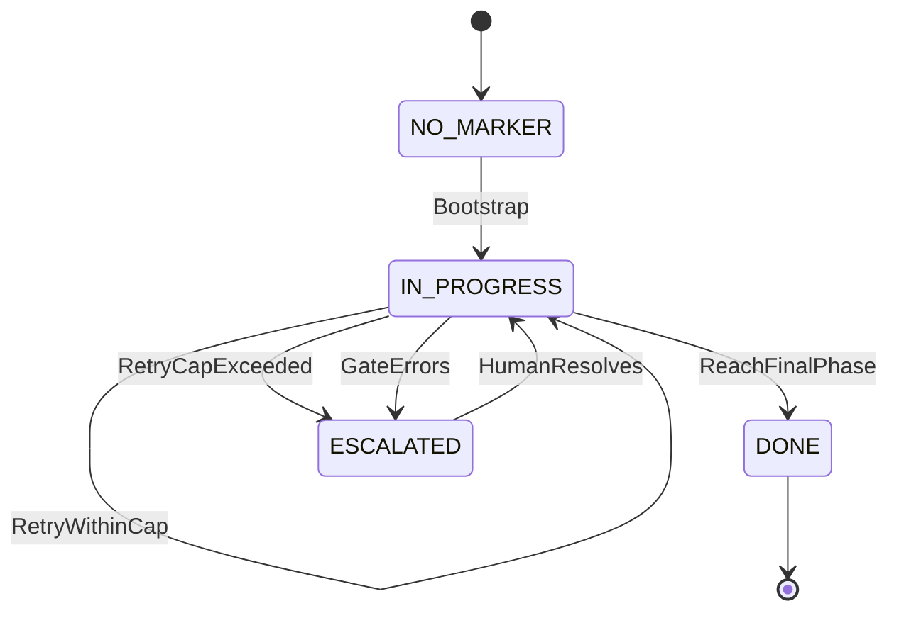
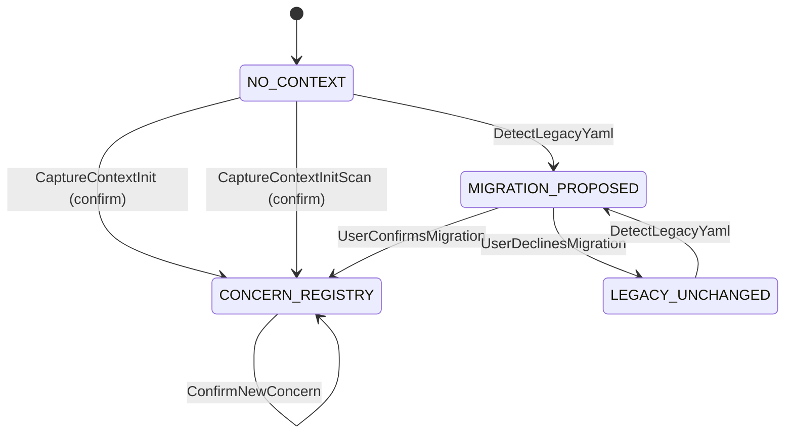
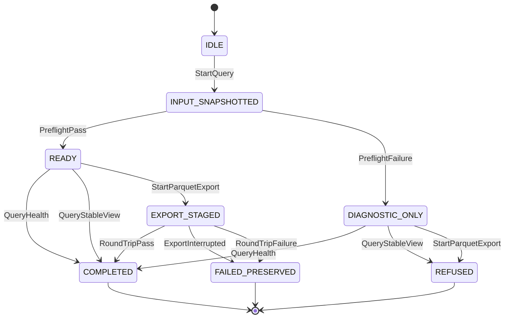
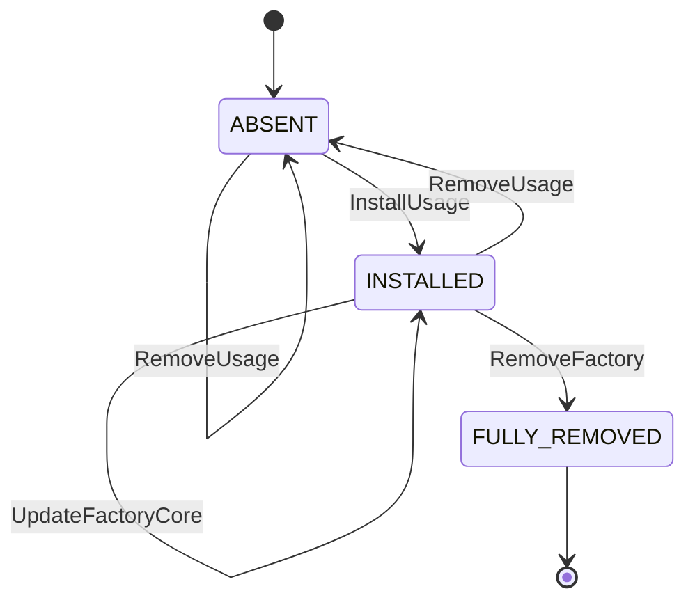
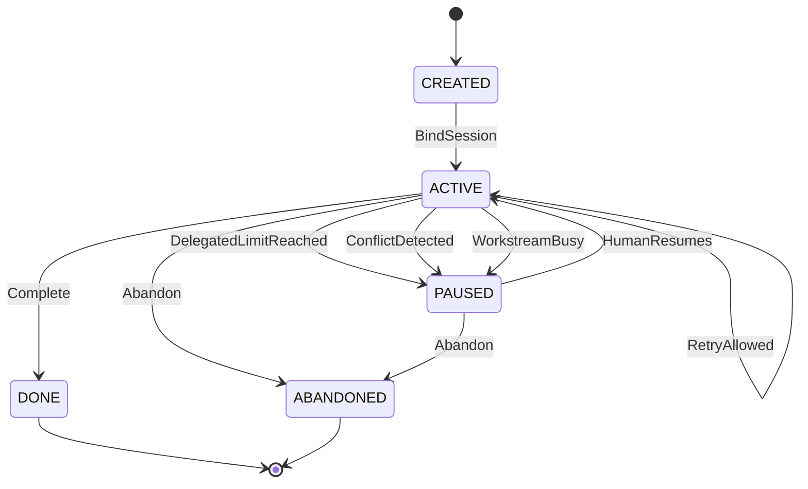
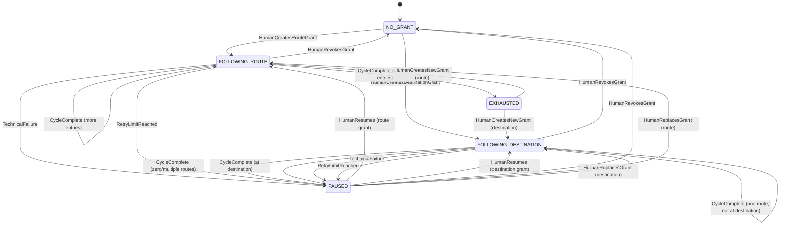
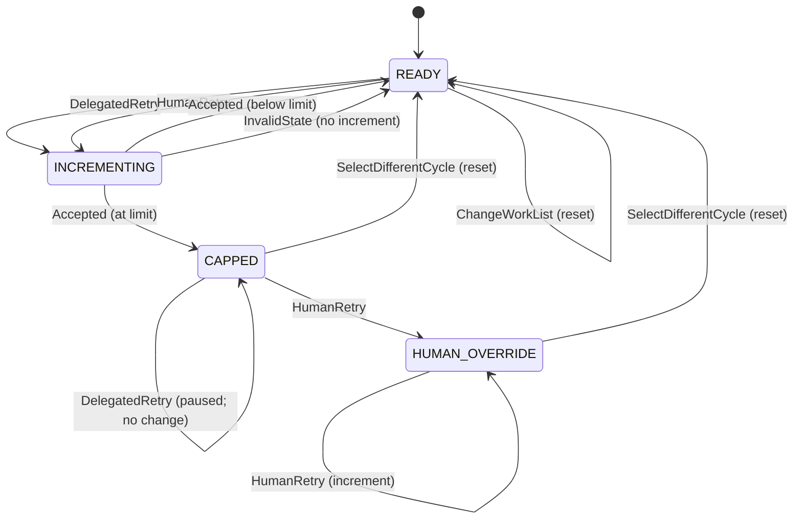

# State Machines — Factory Flow Control

The marker's own lifecycle — common to any playbook that adopts the harness, distinct from a specific playbook's own `.fsm.yml` (e.g. [`greenfield-development.fsm.yml`](../../../factory/playbooks/greenfield-development.fsm.yml), which encodes that playbook's concrete phases and is itself authored per this same convention). Written per [state-machine-notation.md § Canonical Format](../../../factory/rulebooks/conventions/state-machine-notation.md#canonical-format): pseudocode is authoritative, Mermaid is derived.

## Pseudocode

```text
State: NO_MARKER
On Bootstrap:
  ChangeState(IN_PROGRESS)

State: IN_PROGRESS
On AdvancePhase:
  ChangeState(IN_PROGRESS)
On ReachFinalPhase:
  ChangeState(DONE)
On RetryWithinCap:
  ChangeState(IN_PROGRESS)
On RetryCapExceeded:
  ChangeState(ESCALATED)
On GateErrors:
  ChangeState(ESCALATED)

State: ESCALATED
On HumanResolves:
  ChangeState(IN_PROGRESS)

State: DONE
  # terminal — no outbound transitions
```

## Derived Mermaid



## Notes

- **NO_MARKER** covers both "no file exists yet" and, in effect, any playbook whose `.fsm.yml` is absent — `phase advance` treats both as "bootstrap at the root state" (see [UC-01 § Extension 1a](../../~archive/spec/use_cases/UC-01-advance-a-playbook-phase.md#extensions)).
- **`AdvancePhase`** is a self-transition: it collapses every concrete phase-to-phase move in an actual playbook FSM (e.g. `PHASE_1_REQUIREMENTS -> PHASE_1_GATE -> PHASE_2_ARCHITECTURE`) into one abstract step, because this diagram documents the marker's lifecycle *shape*, not any one playbook's concrete phase sequence — that belongs in the playbook's own `.fsm.yml`.
- **`RetryWithinCap`** is likewise a self-transition, standing in for [UC-03](../../~archive/spec/use_cases/UC-03-retry-a-phase-within-the-iteration-cap.md)'s allowed retry, which leaves the marker at the same `state` with an incremented `iteration`.
- **`RetryCapExceeded`** and **`GateErrors`** both lead to `ESCALATED` because [UC-05](../../~archive/spec/use_cases/UC-05-resume-an-interrupted-playbook-run.md) treats them identically at the resume-decision level: stop, do not re-dispatch, tell the actor. They remain distinct events because their causes differ (a capped loop vs. a broken gate script) even though the resulting action is the same.
- **`HumanResolves`** is a helper action standing for whatever out-of-band fix lets the actor safely re-run `run-step` — filing a missing finding, fixing a broken gate script, or manually deciding to proceed. It has no corresponding script; the next `run-step` invocation simply re-evaluates from disk (see [UC-05 § Main Success Scenario](../../~archive/spec/use_cases/UC-05-resume-an-interrupted-playbook-run.md#main-success-scenario)).
- **DONE** is terminal here only in the sense that this generic diagram stops modeling further transitions; a concrete playbook's own final state (e.g. `greenfield-development.fsm.yml`'s `DONE`) may itself require all of its own `entry_conditions` to hold, per that FSM's `final: true` state.

## Concern Registry Lifecycle

The lifecycle of the single `docs/agent-context.md` concern registry. Written per [state-machine-notation.md § Canonical Format](../../../factory/rulebooks/conventions/state-machine-notation.md#canonical-format): pseudocode is authoritative, Mermaid is derived.

### Pseudocode

```text
State: NO_CONTEXT
On CaptureContextInit[user_confirms]:
  ChangeState(CONCERN_REGISTRY)
On CaptureContextInitScan[user_confirms]:
  ChangeState(CONCERN_REGISTRY)
On DetectLegacyYaml:
  ChangeState(MIGRATION_PROPOSED)

State: MIGRATION_PROPOSED
On UserConfirmsMigration:
  ChangeState(CONCERN_REGISTRY)
On UserDeclinesMigration:
  ChangeState(LEGACY_UNCHANGED)

State: CONCERN_REGISTRY
On DirectRegistryEdit:
  ChangeState(CONCERN_REGISTRY)
On ConfirmNewConcern:
  ChangeState(CONCERN_REGISTRY)

State: LEGACY_UNCHANGED
On DetectLegacyYaml:
  ChangeState(MIGRATION_PROPOSED)
```

### Derived Mermaid



### Notes

- **NO_CONTEXT** means the concern registry is absent. Initialization proposes concern batches and writes only after user confirmation.
- **MIGRATION_PROPOSED** preserves all legacy files until the user confirms the proposed mapping.
- **CONCERN_REGISTRY** is the current model. The team edits it directly, and new controlled-vocabulary entries require confirmation.
- **LEGACY_UNCHANGED** records a declined migration. A later bare `capture-context` invocation may propose migration again.
- Confirmed migration moves test configuration to `docs/testing.yaml` and removes legacy routing formats. `concern-lint` validates the resulting single-format state.

## Referenced from

- [entity-model.md](entity-model.md)
- [UC-01](../../~archive/spec/use_cases/UC-01-advance-a-playbook-phase.md)
- [UC-03](../../~archive/spec/use_cases/UC-03-retry-a-phase-within-the-iteration-cap.md)
- [UC-05](../../~archive/spec/use_cases/UC-05-resume-an-interrupted-playbook-run.md)
- [agent-context.feature](../agent-context.feature)

## Usage Query Lifecycle

### Pseudocode

```text
State: IDLE
On StartQuery:
  ChangeState(INPUT_SNAPSHOTTED)

State: INPUT_SNAPSHOTTED
On PreflightPass:
  ChangeState(READY)
On PreflightFailure:
  ChangeState(DIAGNOSTIC_ONLY)

State: READY
On QueryHealth:
  ChangeState(COMPLETED)
On QueryStableView:
  ChangeState(COMPLETED)
On StartParquetExport:
  ChangeState(EXPORT_STAGED)

State: DIAGNOSTIC_ONLY
On QueryHealth:
  ChangeState(COMPLETED)
On QueryStableView:
  ChangeState(REFUSED)
On StartParquetExport:
  ChangeState(REFUSED)

State: EXPORT_STAGED
On RoundTripPass:
  ChangeState(COMPLETED)
On ExportInterrupted:
  ChangeState(FAILED_PRESERVED)
On RoundTripFailure:
  ChangeState(FAILED_PRESERVED)

State: COMPLETED
  # terminal — no outbound transitions

State: REFUSED
  # terminal — no outbound transitions

State: FAILED_PRESERVED
  # terminal — no outbound transitions
```

### Derived Mermaid



`FAILED_PRESERVED` means a pre-existing Parquet destination remains unchanged.

## Usage-Analysis Component Lifecycle

### Pseudocode

```text
State: ABSENT
On InstallUsage:
  ChangeState(INSTALLED)
On RemoveUsage:
  ChangeState(ABSENT)

State: INSTALLED
On InstallUsage:
  ChangeState(INSTALLED)
On UpdateUsage[compatible]:
  ChangeState(INSTALLED)
On UpdateUsage[incompatible]:
  ChangeState(INSTALLED)
On RemoveUsage:
  ChangeState(ABSENT)
On UpdateFactoryCore:
  ChangeState(INSTALLED)
On RemoveFactory:
  ChangeState(FULLY_REMOVED)

State: FULLY_REMOVED
  # terminal — no outbound transitions
```

### Derived Mermaid



The incompatible-update self-transition represents refusal before replacement. `ABSENT` and `INSTALLED` component transitions preserve raw usage evidence. `FULLY_REMOVED` retains the existing complete-removal semantics and does not preserve it.

## Cycle-Based Orchestration State Machines

The state machines below govern the cycle-based orchestration model that supersedes the linear playbook-state marker lifecycle for software-delivery routing. Written per [state-machine-notation.md § Canonical Format](../../../factory/rulebooks/conventions/state-machine-notation.md#canonical-format): pseudocode is authoritative, Mermaid is derived.

Feature trace: [cycle-based-orchestration.feature](../cycle-based-orchestration.feature)

### Workstream Lifecycle

The lifecycle of a single workstream, from creation through to completion or abandonment. The workstream state file does not carry an explicit lifecycle state field. The lifecycle is observable from the cycle field (DONE when the terminal node is reached), the delegation status (paused when a limit is reached or a conflict is detected), and human action (abandoned by human decision). This state machine is therefore conceptual, not persisted.

#### Pseudocode

```text
State: CREATED
On BindSession:
  ChangeState(ACTIVE)

State: ACTIVE
On SelectCycle:
  ChangeState(ACTIVE)
On RetryAllowed:
  ChangeState(ACTIVE)
On DelegatedLimitReached:
  ChangeState(PAUSED)
On ConflictDetected:
  ChangeState(PAUSED)
On WorkstreamBusy:
  ChangeState(PAUSED)
On Complete:
  ChangeState(DONE)
On Abandon:
  ChangeState(ABANDONED)

State: PAUSED
On HumanResumes:
  ChangeState(ACTIVE)
On Abandon:
  ChangeState(ABANDONED)

State: DONE
  # terminal — no outbound transitions

State: ABANDONED
  # terminal — no outbound transitions
```

#### Derived Mermaid



#### Notes

- **CREATED** exists only between the moment the workstream state file is written (session menu option B) and the first session binding. In practice the binding follows immediately.
- **SelectCycle** and **RetryAllowed** are self-transitions on ACTIVE, collapsing every concrete cycle-to-cycle move and allowed retry into one abstract step — the same pattern as `AdvancePhase` in the playbook marker lifecycle.
- **DelegatedLimitReached**, **ConflictDetected**, and **WorkstreamBusy** all lead to PAUSED because the system cannot proceed without human involvement. They remain distinct events because their causes differ (a capped loop, a stale-revision conflict, a lock timeout).
- **HumanResumes** is a helper action covering whatever fix lets the human re-enter the cycle — resolving a conflict, waiting for the lock, or deciding to retry beyond the limit.
- **DONE** and **ABANDONED** are both terminal. DONE means the workstream reached the terminal DONE node in the delivery graph. ABANDONED means the human decided to stop work.

### Delegation Execution

The lifecycle of a delegation grant — the mechanism by which the human pre-authorizes automated cycle transitions. Two grant forms exist: explicit route (an ordered list of cycles) and destination (a target cycle reached by evidence-driven routing).

#### Pseudocode

```text
State: NO_GRANT
On HumanCreatesRouteGrant:
  ChangeState(FOLLOWING_ROUTE)
On HumanCreatesDestinationGrant:
  ChangeState(FOLLOWING_DESTINATION)

State: FOLLOWING_ROUTE
On CycleComplete:
  if more entries in route
    ChangeState(FOLLOWING_ROUTE)
  else
    ChangeState(EXHAUSTED)
On TechnicalFailure:
  ChangeState(PAUSED)
On HumanRevokesGrant:
  ChangeState(NO_GRANT)
On RetryLimitReached:
  ChangeState(PAUSED)

State: FOLLOWING_DESTINATION
On CycleComplete:
  if exactly one route has evidence AND not at destination
    ChangeState(FOLLOWING_DESTINATION)
  if zero or multiple routes have evidence
    ChangeState(PAUSED)
  if at destination
    ChangeState(PAUSED)
On TechnicalFailure:
  ChangeState(PAUSED)
On HumanRevokesGrant:
  ChangeState(NO_GRANT)
On RetryLimitReached:
  ChangeState(PAUSED)

State: PAUSED
On HumanResumes:
  if grant type is route
    ChangeState(FOLLOWING_ROUTE)
  else
    ChangeState(FOLLOWING_DESTINATION)
On HumanRevokesGrant:
  ChangeState(NO_GRANT)
On HumanReplacesGrant:
  if new grant type is route
    ChangeState(FOLLOWING_ROUTE)
  else
    ChangeState(FOLLOWING_DESTINATION)

State: EXHAUSTED
On HumanCreatesNewGrant:
  if new grant type is route
    ChangeState(FOLLOWING_ROUTE)
  else
    ChangeState(FOLLOWING_DESTINATION)
  # terminal until new grant
```

#### Derived Mermaid



#### Notes

- **NO_GRANT** is the default state. The human must explicitly create a grant before delegated execution proceeds. The engine and agents cannot create, extend, or broaden grants.
- **FOLLOWING_ROUTE** processes the grant's ordered cycle list. At each cycle completion the engine advances to the next entry, showing recommendation evidence and warnings.
- **FOLLOWING_DESTINATION** uses evidence-driven routing toward a named target. It continues automatically only when exactly one downstream route has passing evidence and the destination has not yet been reached.
- **PAUSED** captures every condition where the grant cannot proceed without human involvement: technical failure, retry limit, ambiguous routing, or arrival at the destination. The human may resume, revoke, or replace the grant.
- **EXHAUSTED** is a soft terminal — the grant's route list is consumed. The human may create a new grant from this state.
- Failed recommendation evidence does not invalidate the human's recorded route choice. An explicit route grant proceeds to its next entry regardless of evidence status; the evidence is shown but does not gate the transition.

### Retry State

The attempt counter lifecycle within a single cycle, governing how delegated and human retries interact with the per-cycle `delegated_attempt_limit`.

#### Pseudocode

```text
State: READY
  # attempt < limit
On DelegatedRetry:
  ChangeState(INCREMENTING)
On HumanRetry:
  ChangeState(INCREMENTING)
On SelectDifferentCycle:
  Reset attempt to 1
  ChangeState(READY)
On ChangeWorkList:
  Reset attempt to 1
  ChangeState(READY)

State: INCREMENTING
  # transient — attempt increments; once accepted, the increment is permanent
On Accepted:
  if attempt < limit
    ChangeState(READY)
  else
    ChangeState(CAPPED)
On InvalidState:
  # no increment
  ChangeState(READY)

State: CAPPED
  # attempt = limit
On DelegatedRetry:
  Return paused with delegated_attempt_limit_reached
  ChangeState(CAPPED)
On HumanRetry:
  ChangeState(HUMAN_OVERRIDE)
On SelectDifferentCycle:
  Reset attempt to 1
  ChangeState(READY)

State: HUMAN_OVERRIDE
  # attempt > limit, proceeds with warning
On DelegatedRetry:
  Return paused with delegated_attempt_limit_reached
  ChangeState(HUMAN_OVERRIDE)
On HumanRetry:
  Increment attempt
  ChangeState(HUMAN_OVERRIDE)
On SelectDifferentCycle:
  Reset attempt to 1
  ChangeState(READY)
```

#### Derived Mermaid



#### Notes

- **READY** is the normal operating state where `attempt < delegated_attempt_limit`. Both delegated and human retries are accepted.
- **INCREMENTING** is a transient state that exists only during the write. Once the adapter accepts the retry, the attempt counter increments permanently — a subsequent execution failure does not roll back the increment.
- **CAPPED** blocks delegated retries without modifying state, returning `paused` with `delegated_attempt_limit_reached`. The human may still retry, which moves to HUMAN_OVERRIDE with a warning. No override flag or justification is required.
- **HUMAN_OVERRIDE** permits unlimited human retries beyond the limit, each incrementing the attempt counter. The warning is informational.
- **SelectDifferentCycle** resets the attempt counter to 1 and returns to READY, regardless of the current state. **ChangeWorkList** does the same — a changed work list within the same cycle is treated as a fresh attempt sequence.
- The self-transition on CAPPED for DelegatedRetry is a no-op that returns a paused result. It does not modify the state file.

### Referenced from

- [cycle-based-orchestration.feature](../cycle-based-orchestration.feature)
- [entity-model.md](entity-model.md)
- [interface-contracts.md](interface-contracts.md)
