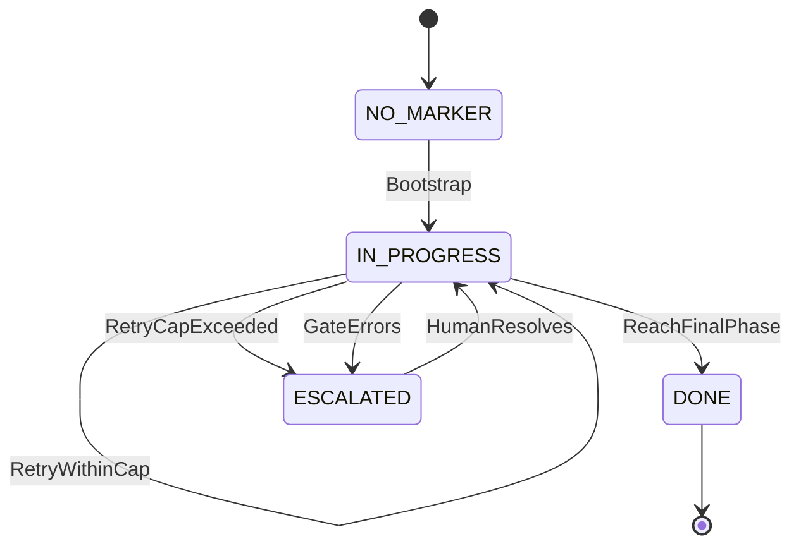
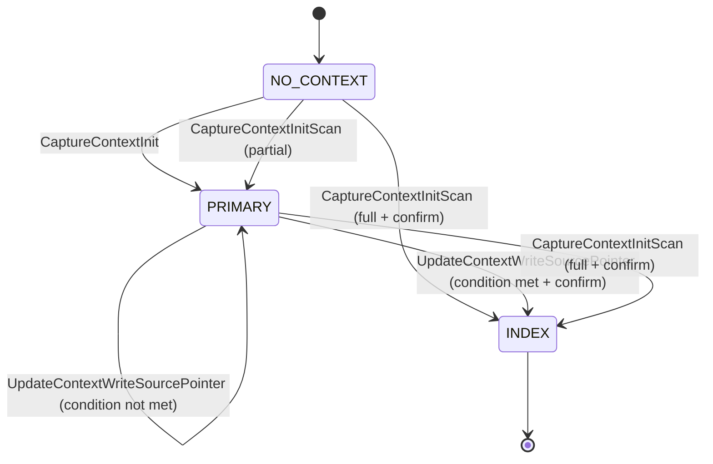

# State Machines — Factory Flow Control

The marker's own lifecycle — common to any playbook that adopts the harness, distinct from a specific playbook's own `.fsm.yml` (e.g. [`greenfield-development.fsm.yml`](../../../factory/playbooks/greenfield-development.fsm.yml), which encodes that playbook's concrete phases and is itself authored per this same convention). Written per [state-machine-notation.md § Canonical Format](../../../factory/rulebooks/conventions/state-machine-notation.md#canonical-format): pseudocode is authoritative, Mermaid is derived.

## Pseudocode

```text
State: NO_MARKER
On Bootstrap:
  ChangeState(IN_PROGRESS)

State: IN_PROGRESS
On AdvancePhase:
  ChangeState(IN_PROGRESS)
On ReachFinalPhase:
  ChangeState(DONE)
On RetryWithinCap:
  ChangeState(IN_PROGRESS)
On RetryCapExceeded:
  ChangeState(ESCALATED)
On GateErrors:
  ChangeState(ESCALATED)

State: ESCALATED
On HumanResolves:
  ChangeState(IN_PROGRESS)

State: DONE
  # terminal — no outbound transitions
```

## Derived Mermaid



## Notes

- **NO_MARKER** covers both "no file exists yet" and, in effect, any playbook whose `.fsm.yml` is absent — `phase advance` treats both as "bootstrap at the root state" (see [UC-01 § Extension 1a](../../~archive/spec/use_cases/UC-01-advance-a-playbook-phase.md#extensions)).
- **`AdvancePhase`** is a self-transition: it collapses every concrete phase-to-phase move in an actual playbook FSM (e.g. `PHASE_1_REQUIREMENTS -> PHASE_1_GATE -> PHASE_2_ARCHITECTURE`) into one abstract step, because this diagram documents the marker's lifecycle *shape*, not any one playbook's concrete phase sequence — that belongs in the playbook's own `.fsm.yml`.
- **`RetryWithinCap`** is likewise a self-transition, standing in for [UC-03](../../~archive/spec/use_cases/UC-03-retry-a-phase-within-the-iteration-cap.md)'s allowed retry, which leaves the marker at the same `state` with an incremented `iteration`.
- **`RetryCapExceeded`** and **`GateErrors`** both lead to `ESCALATED` because [UC-05](../../~archive/spec/use_cases/UC-05-resume-an-interrupted-playbook-run.md) (BR-018) treats them identically at the resume-decision level: stop, do not re-dispatch, tell the actor. They remain distinct events because their causes differ (a capped loop vs. a broken gate script) even though the resulting action is the same.
- **`HumanResolves`** is a helper action standing for whatever out-of-band fix lets the actor safely re-run `run-step` — filing a missing finding, fixing a broken gate script, or manually deciding to proceed. It has no corresponding script; the next `run-step` invocation simply re-evaluates from disk (see [UC-05 § Main Success Scenario](../../~archive/spec/use_cases/UC-05-resume-an-interrupted-playbook-run.md#main-success-scenario)).
- **DONE** is terminal here only in the sense that this generic diagram stops modeling further transitions; a concrete playbook's own final state (e.g. `greenfield-development.fsm.yml`'s `DONE`) may itself require all of its own `entry_conditions` to hold, per that FSM's `final: true` state.

## Agent Context Mode Lifecycle

The lifecycle of the `mode` field across the three index files (`stack.yaml`, `workflow.yaml`, `governance.yaml`). Written per [state-machine-notation.md § Canonical Format](../../../factory/rulebooks/conventions/state-machine-notation.md#canonical-format): pseudocode is authoritative, Mermaid is derived.

### Pseudocode

```text
State: NO_CONTEXT
On CaptureContextInit:
  ChangeState(PRIMARY)
On CaptureContextInitScan[partial_coverage]:
  ChangeState(PRIMARY)
On CaptureContextInitScan[full_coverage, user_confirms]:
  ChangeState(INDEX)

State: PRIMARY
On UpdateContextWriteValue:
  ChangeState(PRIMARY)
On UpdateContextWriteSourcePointer[condition_not_met]:
  ChangeState(PRIMARY)
On UpdateContextWriteSourcePointer[condition_met, user_confirms]:
  ChangeState(INDEX)
On CaptureContextInitScan[full_coverage, user_confirms]:
  ChangeState(INDEX)

State: INDEX
  # terminal — no reverse transition
```

### Derived Mermaid



### Notes

- **NO_CONTEXT** means no `docs/agent-context/` directory exists and no legacy charter is present. `capture-context --init` bootstraps to PRIMARY; `capture-context --init --scan` may go directly to INDEX if the brownfield scan achieves full source coverage and the operator confirms.
- **PRIMARY** is the greenfield mode: index files are the upstream source of project decisions. Values are written directly. No `source:` pointers are required. The reading guide may or may not exist.
- **INDEX** is the mature mode: index files are downstream routing tables. Every non-null, non-deferred leaf field has a `source:` pointer. Hand-editing is forbidden; only `update-context` may write. The reading guide must exist.
- **Transition condition** (PRIMARY → INDEX): every non-null, non-deferred leaf field across all three index files has a `source:` pointer. `context-lint` verifies this via `CX-SRC`. Null fields and `deferred:` mappings are excluded from the condition.
- **Transition atomicity**: all three index files advance together in a single commit. Per-file partial transitions are not supported.
- **No reverse transition**: once in INDEX mode, files do not return to PRIMARY. The transition is one-directional.
- **Operator confirmation**: the transition is never automatic. `update-context` prompts the operator; the operator confirms or declines. Declining leaves all three files in PRIMARY.
- **Legacy charter** projects (markdown or YAML under `docs/charter/`) are not modeled by this state machine. They continue to use `charter-lint` with CH-\* codes until migration.

## Referenced from

- [entity-model.md](entity-model.md)
- [UC-01](../../~archive/spec/use_cases/UC-01-advance-a-playbook-phase.md)
- [UC-03](../../~archive/spec/use_cases/UC-03-retry-a-phase-within-the-iteration-cap.md)
- [UC-05](../../~archive/spec/use_cases/UC-05-resume-an-interrupted-playbook-run.md)
- [agent-context.feature](../agent-context.feature)
