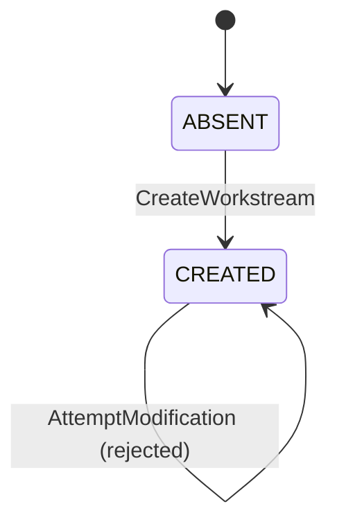
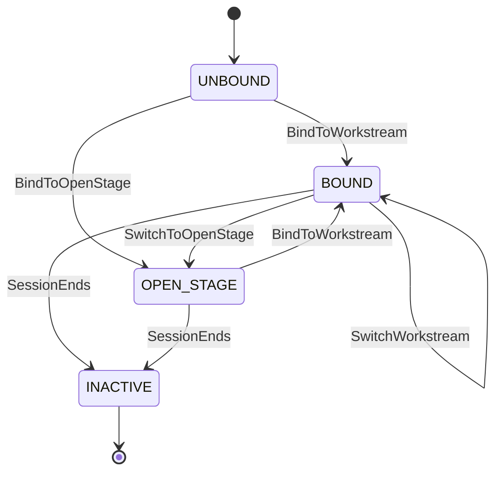
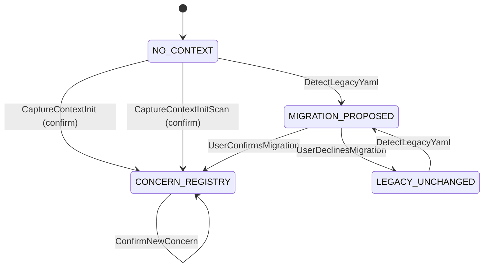
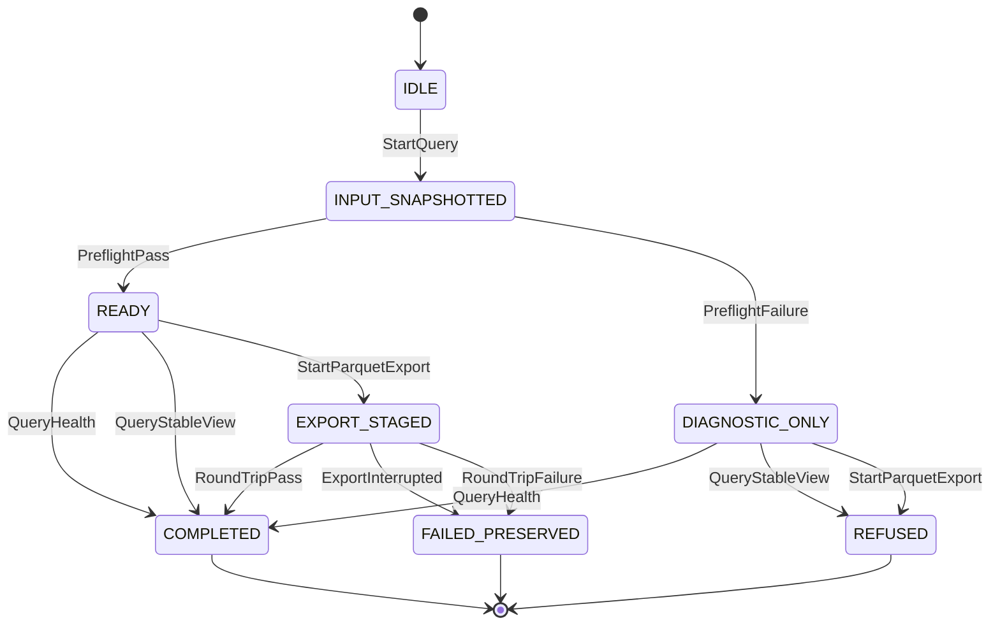
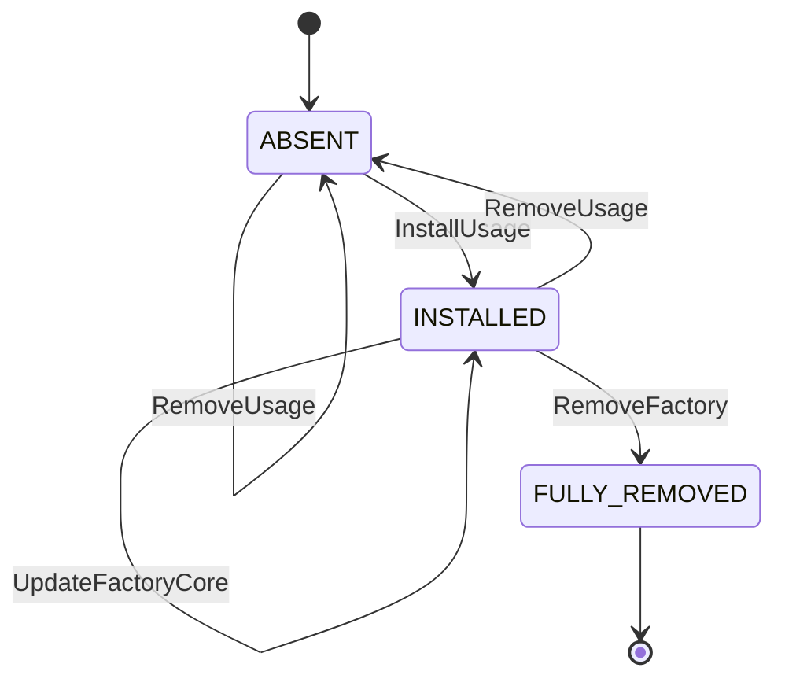
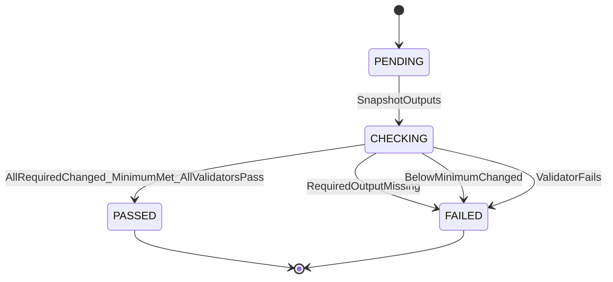
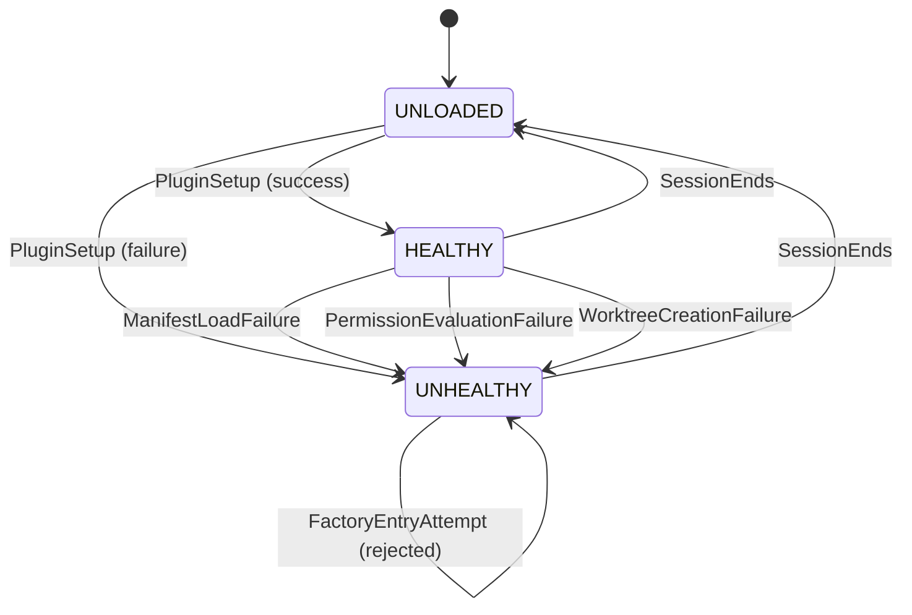
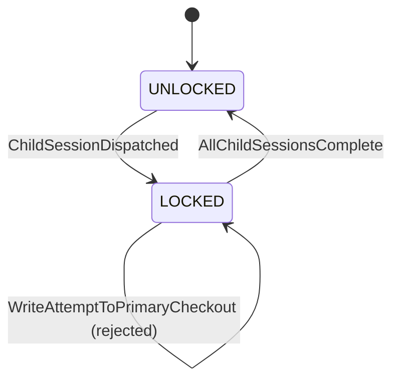
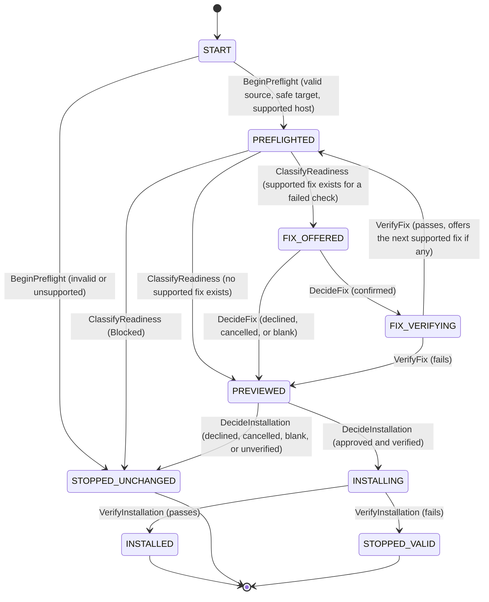
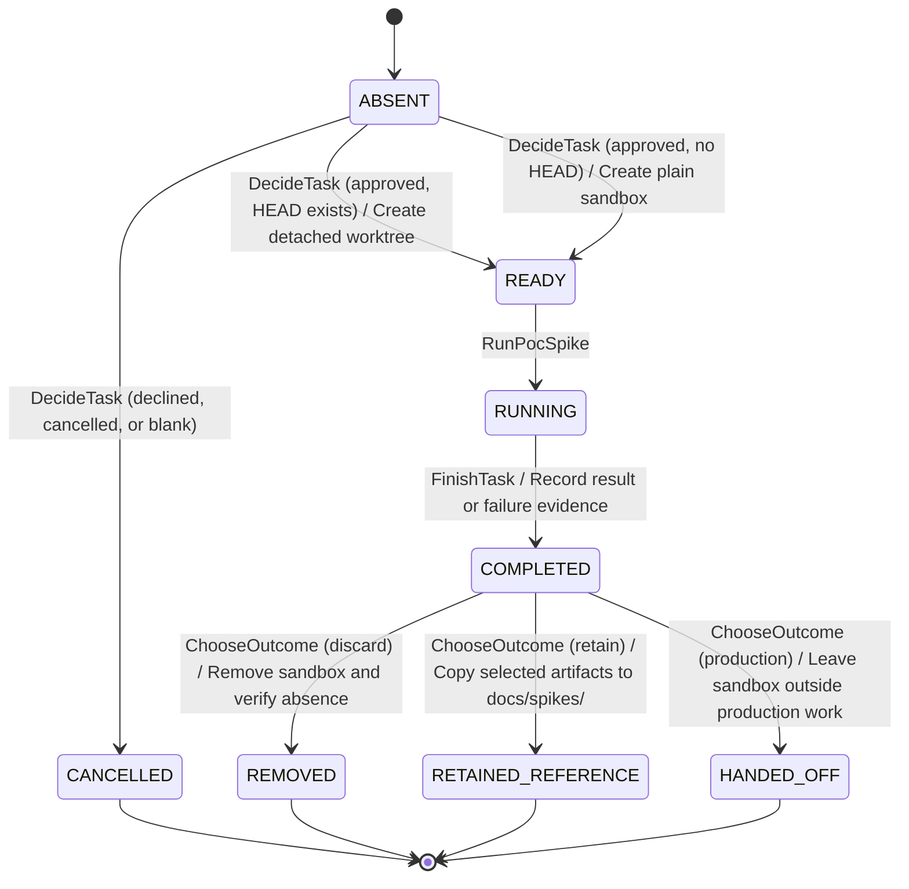

# State Machines — Factory Flow Control

Lifecycles for factory entities. Written per [state-machine-notation.md § Canonical Format](../../../.agent-factory/factory/rulebooks/conventions/state-machine-notation.md#canonical-format): pseudocode is authoritative, Mermaid is derived.

## Workstream State Lifecycle

A workstream state file is immutable after creation. There are no state transitions — only creation.

### Pseudocode

```text
State: ABSENT
On CreateWorkstream:
  ChangeState(CREATED)

State: CREATED
On AttemptModification:
  Reject — file is immutable
  ChangeState(CREATED)
  # no outbound transitions
```

### Derived Mermaid



### Notes

- **ABSENT** means no workstream state file exists for this identifier.
- **CREATED** is the only active state. The file contains `schema_version: 2`, `workstream_id`, `topic`, and `origin_ref`. No other fields exist.
- **AttemptModification** is a self-transition that rejects the write. The state file is never modified after creation. Multiple sessions may bind to the same workstream without modifying its state.

## Session Binding Lifecycle

A session binding is session-scoped state that attaches a session to a workstream. It lives at `.agent-factory/workstreams/sessions/<session-id>.yaml`.

### Pseudocode

```text
State: UNBOUND
On BindToWorkstream:
  ChangeState(BOUND)
On BindToOpenStage:
  ChangeState(OPEN_STAGE)

State: BOUND
On SwitchWorkstream:
  ChangeState(BOUND)
On SwitchToOpenStage:
  ChangeState(OPEN_STAGE)
On SessionEnds:
  ChangeState(INACTIVE)

State: OPEN_STAGE
On BindToWorkstream:
  ChangeState(BOUND)
On SessionEnds:
  ChangeState(INACTIVE)

State: INACTIVE
  # terminal — binding file is no longer active
```

### Derived Mermaid



### Notes

- **UNBOUND** exists before the session binding file is written.
- **BOUND** means `workstream_id` contains a known workstream identifier. Switching workstreams updates `workstream_id` and `bound_at` without modifying any workstream state file.
- **OPEN_STAGE** means `workstream_id` is explicitly `null`. Precondition evaluation skips scope filtering.
- **INACTIVE** is terminal. The next session creates a fresh binding.
- The `workstream_id` key must always be present. A missing key fails validation and the binding is never written.

## Concern Registry Lifecycle

The lifecycle of the single `docs/agent-context.md` concern registry. Written per [state-machine-notation.md § Canonical Format](../../../.agent-factory/factory/rulebooks/conventions/state-machine-notation.md#canonical-format): pseudocode is authoritative, Mermaid is derived.

### Pseudocode

```text
State: NO_CONTEXT
On CaptureContextInit[user_confirms]:
  ChangeState(CONCERN_REGISTRY)
On CaptureContextInitScan[user_confirms]:
  ChangeState(CONCERN_REGISTRY)
On DetectLegacyYaml:
  ChangeState(MIGRATION_PROPOSED)

State: MIGRATION_PROPOSED
On UserConfirmsMigration:
  ChangeState(CONCERN_REGISTRY)
On UserDeclinesMigration:
  ChangeState(LEGACY_UNCHANGED)

State: CONCERN_REGISTRY
On DirectRegistryEdit:
  ChangeState(CONCERN_REGISTRY)
On ConfirmNewConcern:
  ChangeState(CONCERN_REGISTRY)

State: LEGACY_UNCHANGED
On DetectLegacyYaml:
  ChangeState(MIGRATION_PROPOSED)
```

### Derived Mermaid



### Notes

- **NO_CONTEXT** means the concern registry is absent. Initialization proposes concern batches and writes only after user confirmation.
- **MIGRATION_PROPOSED** preserves all legacy files until the user confirms the proposed mapping.
- **CONCERN_REGISTRY** is the current model. The team edits it directly, and new controlled-vocabulary entries require confirmation.
- **LEGACY_UNCHANGED** records a declined migration. A later bare `capture-context` invocation may propose migration again.
- Confirmed migration moves test configuration to `docs/testing.yaml` and removes legacy routing formats. `concern-lint` validates the resulting single-format state.

## Referenced from

- [entity-model.md](entity-model.md)
- [activity-graph-orchestration.feature](../activity-graph-orchestration.feature)
- [agent-context.feature](../agent-context.feature)

## Usage Query Lifecycle

### Pseudocode

```text
State: IDLE
On StartQuery:
  ChangeState(INPUT_SNAPSHOTTED)

State: INPUT_SNAPSHOTTED
On PreflightPass:
  ChangeState(READY)
On PreflightFailure:
  ChangeState(DIAGNOSTIC_ONLY)

State: READY
On QueryHealth:
  ChangeState(COMPLETED)
On QueryStableView:
  ChangeState(COMPLETED)
On StartParquetExport:
  ChangeState(EXPORT_STAGED)

State: DIAGNOSTIC_ONLY
On QueryHealth:
  ChangeState(COMPLETED)
On QueryStableView:
  ChangeState(REFUSED)
On StartParquetExport:
  ChangeState(REFUSED)

State: EXPORT_STAGED
On RoundTripPass:
  ChangeState(COMPLETED)
On ExportInterrupted:
  ChangeState(FAILED_PRESERVED)
On RoundTripFailure:
  ChangeState(FAILED_PRESERVED)

State: COMPLETED
  # terminal — no outbound transitions

State: REFUSED
  # terminal — no outbound transitions

State: FAILED_PRESERVED
  # terminal — no outbound transitions
```

### Derived Mermaid



`FAILED_PRESERVED` means a pre-existing Parquet destination remains unchanged.

## Usage-Analysis Component Lifecycle

### Pseudocode

```text
State: ABSENT
On InstallUsage:
  ChangeState(INSTALLED)
On RemoveUsage:
  ChangeState(ABSENT)

State: INSTALLED
On InstallUsage:
  ChangeState(INSTALLED)
On UpdateUsage[compatible]:
  ChangeState(INSTALLED)
On UpdateUsage[incompatible]:
  ChangeState(INSTALLED)
On RemoveUsage:
  ChangeState(ABSENT)
On UpdateFactoryCore:
  ChangeState(INSTALLED)
On RemoveFactory:
  ChangeState(FULLY_REMOVED)

State: FULLY_REMOVED
  # terminal — no outbound transitions
```

### Derived Mermaid



The incompatible-update self-transition represents refusal before replacement. `ABSENT` and `INSTALLED` component transitions preserve raw usage evidence. `FULLY_REMOVED` retains the existing complete-removal semantics and does not preserve it.

## Activity-Graph Orchestration State Machines

The activity-graph model has no delegation or retry state machines — chaining and retries are external. The workstream and session binding lifecycles are documented above. The fence execution lifecycle below captures the deterministic output-fencing flow.

Feature trace: [activity-graph-orchestration.feature](../activity-graph-orchestration.feature)

### Fence Execution

The lifecycle of a single output fence invocation after an agent activity completes.

#### Pseudocode

```text
State: PENDING
On SnapshotOutputs:
  ChangeState(CHECKING)

State: CHECKING
On AllRequiredChanged_MinimumMet_AllValidatorsPass:
  ChangeState(PASSED)
On RequiredOutputMissing:
  ChangeState(FAILED)
On BelowMinimumChanged:
  ChangeState(FAILED)
On ValidatorFails:
  ChangeState(FAILED)

State: PASSED
  # terminal — evidence stored, downstream preconditions satisfiable

State: FAILED
  # terminal — evidence stored, human action not blocked
```

#### Derived Mermaid



#### Notes

- **PENDING** exists between activity completion and output snapshot. The runner snapshots the agent's declared output patterns before comparing with post-activity state.
- **CHECKING** evaluates each output declaration: required outputs must have a created or modified match; optional outputs without a match are skipped; their validators run if they changed. The aggregate requires `declarations_changed >= minimum_changed` and every invoked validator to pass.
- **PASSED** means the aggregate fence passed. The fenced outputs become available as satisfied evidence for downstream preconditions. For external orchestrators, chaining may proceed.
- **FAILED** means one or more conditions were not met. The failure is recorded as unsatisfied evidence. Human action is not blocked — the human can still select any agent.
- Evidence is stored at `.agent-factory/checks/fences/<session-id>/<invocation-id>.yaml` and returned to the caller.
- No retry logic exists in the fence. An external orchestrator owns retry decisions.

### Referenced from

- [activity-graph-orchestration.feature](../activity-graph-orchestration.feature)
- [entity-model.md](entity-model.md)
- [interface-contracts.md](interface-contracts.md)

## OpenCode Plugin Health Lifecycle

The lifecycle of the Factory plugin within an OpenCode session. The plugin must fail closed: an unhealthy state stops the Factory entry flow and names the recovery action.

Feature trace: [opencode-cli-integration.feature](../opencode-cli-integration.feature)

### Pseudocode

```text
State: UNLOADED
On PluginSetup[success]:
  ChangeState(HEALTHY)
On PluginSetup[failure]:
  ChangeState(UNHEALTHY)

State: HEALTHY
On ManifestLoadFailure:
  ChangeState(UNHEALTHY)
On PermissionEvaluationFailure:
  ChangeState(UNHEALTHY)
On WorktreeCreationFailure:
  ChangeState(UNHEALTHY)
On SessionEnds:
  ChangeState(UNLOADED)

State: UNHEALTHY
On FactoryEntryAttempt:
  Reject — report failed control and recovery action
  ChangeState(UNHEALTHY)
On SessionEnds:
  ChangeState(UNLOADED)
```

### Derived Mermaid



### Notes

- **UNLOADED** means the plugin is not active. This is the state before the OpenCode session loads the plugin and after the session ends.
- **HEALTHY** means the plugin initialized and all controls are operational. Tool invocations, permission evaluations, and worktree operations proceed normally.
- **UNHEALTHY** means one or more Factory controls failed. The plugin stops the Factory entry flow and names the failed control and the recovery action. The error message is specific: "Factory plugin: manifest loading failed — re-run init-factory" rather than a generic failure.
- Usage capture failure does not transition to UNHEALTHY. Usage capture is best-effort; its failure is reported but does not block the session.
- The plugin does not self-heal during a session. An UNHEALTHY plugin requires a new session after the underlying issue is resolved.

## OpenCode Session Isolation Lifecycle

The lifecycle of a write-denial lock on the primary checkout while isolated child work is active.

Feature trace: [opencode-cli-integration.feature](../opencode-cli-integration.feature)

### Pseudocode

```text
State: UNLOCKED
On ChildSessionDispatched:
  ChangeState(LOCKED)

State: LOCKED
On WriteAttemptToPrimaryCheckout:
  Reject — session-scoped write denial
  ChangeState(LOCKED)
On AllChildSessionsComplete:
  ChangeState(UNLOCKED)

```

### Derived Mermaid



### Notes

- **UNLOCKED** means the primary checkout accepts writes normally. No isolated child work is active.
- **LOCKED** means one or more child sessions are running in isolated worktrees. Writes to the primary checkout are denied through a session-scoped write denial enforced by the plugin's permission hook.
- The lock is session-scoped. It does not persist across sessions.
- The lock applies to the primary checkout only. Each child session writes to its own worktree without restriction (within its step-manifest boundary).

## Value-First Installation Lifecycle

### Pseudocode

```text
State: START
On BeginPreflight:
  if source and target are valid and host is supported
    ChangeState(PREFLIGHTED)
  else
    ChangeState(STOPPED_UNCHANGED)

State: PREFLIGHTED
On ClassifyReadiness:
  if result is Blocked
    ChangeState(STOPPED_UNCHANGED)
  else if a supported fix exists for a failed check
    ChangeState(FIX_OFFERED)
  else
    ChangeState(PREVIEWED)

State: FIX_OFFERED
On DecideFix:
  if fix is confirmed
    ChangeState(FIX_VERIFYING)
  else
    ChangeState(PREVIEWED)

State: FIX_VERIFYING
On VerifyFix:
  if verification passes
    ChangeState(PREFLIGHTED)
  else
    ChangeState(PREVIEWED)

State: PREVIEWED
On DecideInstallation:
  if installation is approved and remote assets are verified
    ChangeState(INSTALLING)
  else
    ChangeState(STOPPED_UNCHANGED)

State: INSTALLING
On VerifyInstallation:
  if verification passes
    ChangeState(INSTALLED)
  else
    ChangeState(STOPPED_VALID)

State: INSTALLED
  # terminal — no outbound transitions

State: STOPPED_UNCHANGED
  # terminal — no outbound transitions

State: STOPPED_VALID
  # terminal — no outbound transitions
```

### Derived Mermaid



`STOPPED_UNCHANGED` means the target received no installation change.
`STOPPED_VALID` means an approved installation began and then failed
verification; some effects may exist. A declined, blank, cancelled, or
unverified prerequisite fix reports completed fixes and their reversal
commands but does not stop the bootstrap: `Blocked` is the only readiness
that prevents installation, so once readiness is classified, an unresolved
optional fix still leads to `PREVIEWED`.

## First-Task Sandbox Lifecycle

### Pseudocode

```text
State: ABSENT
On DecideTask:
  if task is approved and HEAD exists
    Create detached worktree from HEAD
    ChangeState(READY)
  else if task is approved and HEAD does not exist
    Create plain sandbox
    ChangeState(READY)
  else
    ChangeState(CANCELLED)

State: READY
On RunPocSpike:
  ChangeState(RUNNING)

State: RUNNING
On FinishTask:
  Record result or failure evidence
  ChangeState(COMPLETED)

State: COMPLETED
On ChooseOutcome:
  if discard is selected
    Remove sandbox and verify absence
    ChangeState(REMOVED)
  else if reference retention is confirmed
    Copy selected artifacts to docs/spikes/
    ChangeState(RETAINED_REFERENCE)
  else if production work is approved
    Leave sandbox outside production work
    ChangeState(HANDED_OFF)

State: CANCELLED
  # terminal — no outbound transitions

State: REMOVED
  # terminal — no outbound transitions

State: RETAINED_REFERENCE
  # terminal — no outbound transitions

State: HANDED_OFF
  # terminal — no outbound transitions
```

### Derived Mermaid



The first-task lifecycle never creates a branch or commit. Retention copies
reference artifacts after separate consent. Production work begins through a
normal workstream and does not reuse the sandbox as production state.
