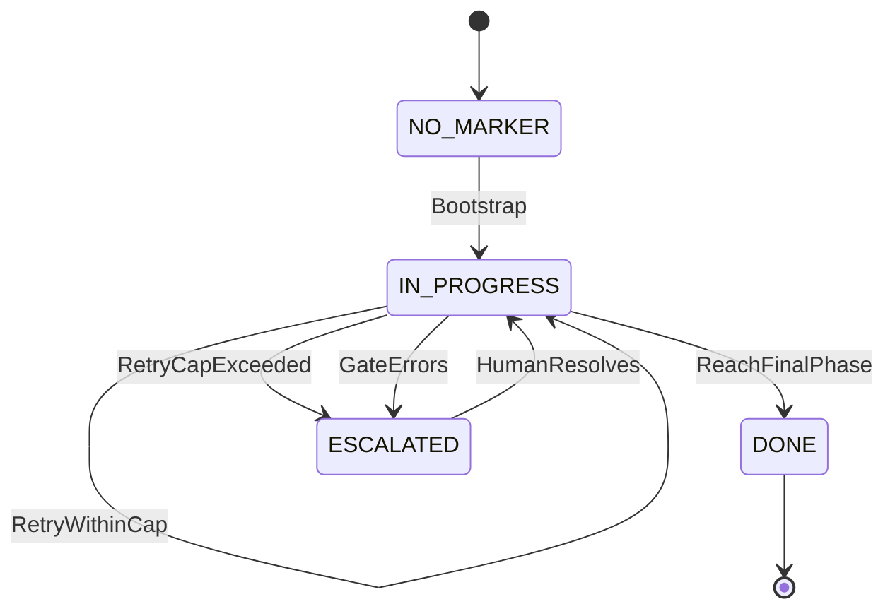
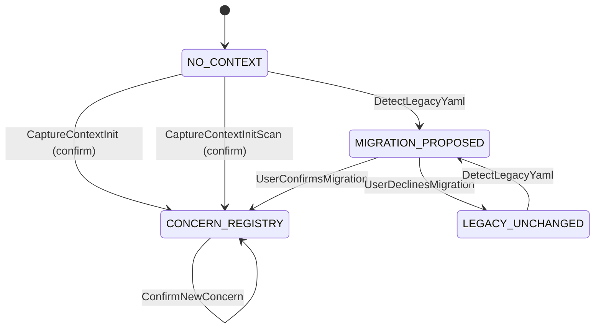
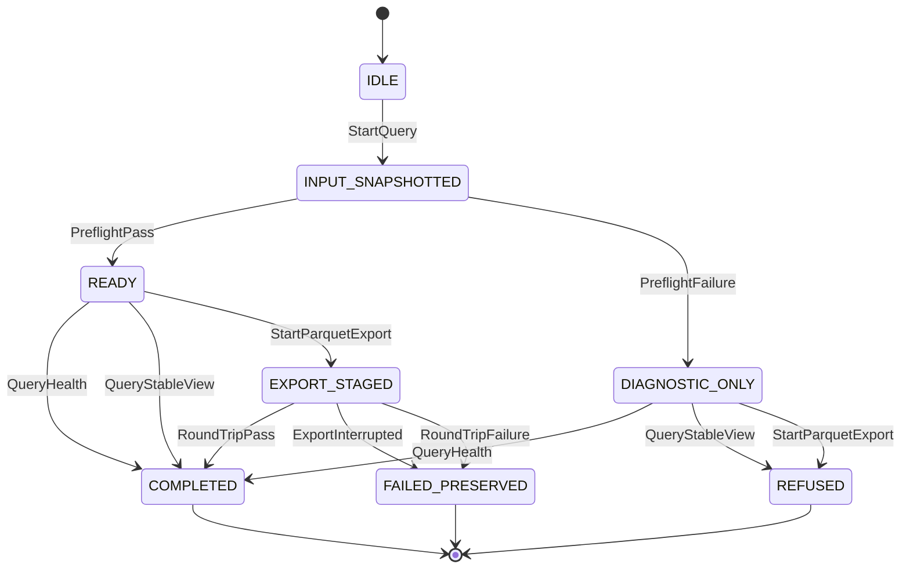
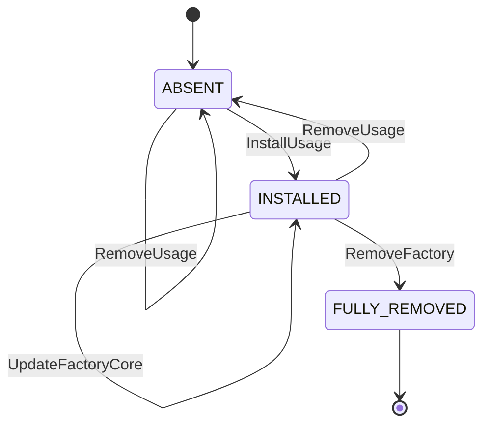

# State Machines — Factory Flow Control

The marker's own lifecycle — common to any playbook that adopts the harness, distinct from a specific playbook's own `.fsm.yml` (e.g. [`greenfield-development.fsm.yml`](../../../factory/playbooks/greenfield-development.fsm.yml), which encodes that playbook's concrete phases and is itself authored per this same convention). Written per [state-machine-notation.md § Canonical Format](../../../factory/rulebooks/conventions/state-machine-notation.md#canonical-format): pseudocode is authoritative, Mermaid is derived.

## Pseudocode

```text
State: NO_MARKER
On Bootstrap:
  ChangeState(IN_PROGRESS)

State: IN_PROGRESS
On AdvancePhase:
  ChangeState(IN_PROGRESS)
On ReachFinalPhase:
  ChangeState(DONE)
On RetryWithinCap:
  ChangeState(IN_PROGRESS)
On RetryCapExceeded:
  ChangeState(ESCALATED)
On GateErrors:
  ChangeState(ESCALATED)

State: ESCALATED
On HumanResolves:
  ChangeState(IN_PROGRESS)

State: DONE
  # terminal — no outbound transitions
```

## Derived Mermaid



## Notes

- **NO_MARKER** covers both "no file exists yet" and, in effect, any playbook whose `.fsm.yml` is absent — `phase advance` treats both as "bootstrap at the root state" (see [UC-01 § Extension 1a](../../~archive/spec/use_cases/UC-01-advance-a-playbook-phase.md#extensions)).
- **`AdvancePhase`** is a self-transition: it collapses every concrete phase-to-phase move in an actual playbook FSM (e.g. `PHASE_1_REQUIREMENTS -> PHASE_1_GATE -> PHASE_2_ARCHITECTURE`) into one abstract step, because this diagram documents the marker's lifecycle *shape*, not any one playbook's concrete phase sequence — that belongs in the playbook's own `.fsm.yml`.
- **`RetryWithinCap`** is likewise a self-transition, standing in for [UC-03](../../~archive/spec/use_cases/UC-03-retry-a-phase-within-the-iteration-cap.md)'s allowed retry, which leaves the marker at the same `state` with an incremented `iteration`.
- **`RetryCapExceeded`** and **`GateErrors`** both lead to `ESCALATED` because [UC-05](../../~archive/spec/use_cases/UC-05-resume-an-interrupted-playbook-run.md) treats them identically at the resume-decision level: stop, do not re-dispatch, tell the actor. They remain distinct events because their causes differ (a capped loop vs. a broken gate script) even though the resulting action is the same.
- **`HumanResolves`** is a helper action standing for whatever out-of-band fix lets the actor safely re-run `run-step` — filing a missing finding, fixing a broken gate script, or manually deciding to proceed. It has no corresponding script; the next `run-step` invocation simply re-evaluates from disk (see [UC-05 § Main Success Scenario](../../~archive/spec/use_cases/UC-05-resume-an-interrupted-playbook-run.md#main-success-scenario)).
- **DONE** is terminal here only in the sense that this generic diagram stops modeling further transitions; a concrete playbook's own final state (e.g. `greenfield-development.fsm.yml`'s `DONE`) may itself require all of its own `entry_conditions` to hold, per that FSM's `final: true` state.

## Concern Registry Lifecycle

The lifecycle of the single `docs/agent-context.md` concern registry. Written per [state-machine-notation.md § Canonical Format](../../../factory/rulebooks/conventions/state-machine-notation.md#canonical-format): pseudocode is authoritative, Mermaid is derived.

### Pseudocode

```text
State: NO_CONTEXT
On CaptureContextInit[user_confirms]:
  ChangeState(CONCERN_REGISTRY)
On CaptureContextInitScan[user_confirms]:
  ChangeState(CONCERN_REGISTRY)
On DetectLegacyYaml:
  ChangeState(MIGRATION_PROPOSED)

State: MIGRATION_PROPOSED
On UserConfirmsMigration:
  ChangeState(CONCERN_REGISTRY)
On UserDeclinesMigration:
  ChangeState(LEGACY_UNCHANGED)

State: CONCERN_REGISTRY
On DirectRegistryEdit:
  ChangeState(CONCERN_REGISTRY)
On ConfirmNewConcern:
  ChangeState(CONCERN_REGISTRY)

State: LEGACY_UNCHANGED
On DetectLegacyYaml:
  ChangeState(MIGRATION_PROPOSED)
```

### Derived Mermaid



### Notes

- **NO_CONTEXT** means the concern registry is absent. Initialization proposes concern batches and writes only after user confirmation.
- **MIGRATION_PROPOSED** preserves all legacy files until the user confirms the proposed mapping.
- **CONCERN_REGISTRY** is the current model. The team edits it directly, and new controlled-vocabulary entries require confirmation.
- **LEGACY_UNCHANGED** records a declined migration. A later bare `capture-context` invocation may propose migration again.
- Confirmed migration moves test configuration to `docs/testing.yaml` and removes legacy routing formats. `concern-lint` validates the resulting single-format state.

## Referenced from

- [entity-model.md](entity-model.md)
- [UC-01](../../~archive/spec/use_cases/UC-01-advance-a-playbook-phase.md)
- [UC-03](../../~archive/spec/use_cases/UC-03-retry-a-phase-within-the-iteration-cap.md)
- [UC-05](../../~archive/spec/use_cases/UC-05-resume-an-interrupted-playbook-run.md)
- [agent-context.feature](../agent-context.feature)

## Usage Query Lifecycle

### Pseudocode

```text
State: IDLE
On StartQuery:
  ChangeState(INPUT_SNAPSHOTTED)

State: INPUT_SNAPSHOTTED
On PreflightPass:
  ChangeState(READY)
On PreflightFailure:
  ChangeState(DIAGNOSTIC_ONLY)

State: READY
On QueryHealth:
  ChangeState(COMPLETED)
On QueryStableView:
  ChangeState(COMPLETED)
On StartParquetExport:
  ChangeState(EXPORT_STAGED)

State: DIAGNOSTIC_ONLY
On QueryHealth:
  ChangeState(COMPLETED)
On QueryStableView:
  ChangeState(REFUSED)
On StartParquetExport:
  ChangeState(REFUSED)

State: EXPORT_STAGED
On RoundTripPass:
  ChangeState(COMPLETED)
On ExportInterrupted:
  ChangeState(FAILED_PRESERVED)
On RoundTripFailure:
  ChangeState(FAILED_PRESERVED)

State: COMPLETED
  # terminal — no outbound transitions

State: REFUSED
  # terminal — no outbound transitions

State: FAILED_PRESERVED
  # terminal — no outbound transitions
```

### Derived Mermaid



`FAILED_PRESERVED` means a pre-existing Parquet destination remains unchanged.

## Usage-Analysis Component Lifecycle

### Pseudocode

```text
State: ABSENT
On InstallUsage:
  ChangeState(INSTALLED)
On RemoveUsage:
  ChangeState(ABSENT)

State: INSTALLED
On InstallUsage:
  ChangeState(INSTALLED)
On UpdateUsage[compatible]:
  ChangeState(INSTALLED)
On UpdateUsage[incompatible]:
  ChangeState(INSTALLED)
On RemoveUsage:
  ChangeState(ABSENT)
On UpdateFactoryCore:
  ChangeState(INSTALLED)
On RemoveFactory:
  ChangeState(FULLY_REMOVED)

State: FULLY_REMOVED
  # terminal — no outbound transitions
```

### Derived Mermaid



The incompatible-update self-transition represents refusal before replacement. `ABSENT` and `INSTALLED` component transitions preserve raw usage evidence. `FULLY_REMOVED` retains the existing complete-removal semantics and does not preserve it.
