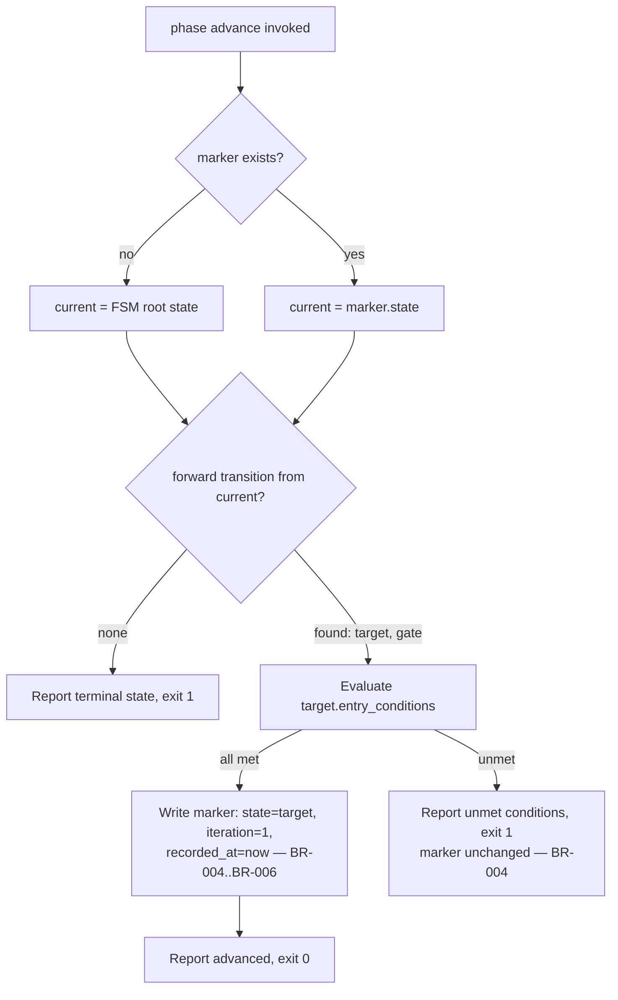

# UC-01 — Advance a Playbook Phase

Realizes: AG-01

## Primary Actor

Human Operator (or Orchestrator-as-Trigger, acting on its behalf)

## Stakeholders & Interests

- **Human Operator** — wants the marker to move forward only when the current phase's work genuinely qualifies, never by hand-editing state.
- **Orchestrator-as-Trigger** — wants the identical guarantee when it calls the same command programmatically; it holds no state of its own to trust instead.
- **Downstream phase's agent** — wants to start from a marker that already proves its own entry conditions hold, so it never has to re-derive them.

## Trigger

The actor runs `factory/scripts/phase advance`, believing the current phase's exit conditions are satisfied.

## Preconditions

- The target playbook has a companion `.fsm.yml` in `factory/playbooks/` (only [`greenfield-development.fsm.yml`](../../../factory/playbooks/greenfield-development.fsm.yml) exists today — see [PRD § NG4](../prd.md#non-goals)).
- If a marker already exists at `.agent-factory/playbook-state.yml`, its `state` field names a state defined in that FSM.

## Main Success Scenario

1. Actor runs `factory/scripts/phase advance`.
2. `phase advance` reads the marker. No marker → bootstraps at the FSM's root state (the state with no incoming transition) instead of reading `state`.
3. `phase advance` finds the current state's forward transition — the `if` branch of a conditional transition, or the plain `to:` transition.
4. `phase advance` evaluates the target state's `entry_conditions` against the `gate_conditions` library (BR-004).
5. Every condition is satisfied.
6. `phase advance` writes the marker: `state` set to the target, `iteration` reset to `1`, `recorded_at` set from its own process clock (BR-006), `gate`/`result`/`open_findings`/`next` filled in from the transition just taken.
7. `phase advance` exits `0` and reports `advanced <from> -> <to>`.

## Extensions

- **4a. One or more entry conditions are unmet**
  - 4a1. `phase advance` refuses: exits `1`, reports every unmet condition by name and reason, leaves the marker unchanged (BR-004).
- **3a. The current state has no forward transition (a terminal state)**
  - 3a1. `phase advance` exits `1`, reports the state is terminal.
- **1a. The marker's `playbook` field names a playbook with no `.fsm.yml`**
  - 1a1. `phase advance` exits `1`, reports the missing FSM file.
- **1b. The marker's `state` field is not defined in the FSM**
  - 1b1. `phase advance` exits `1` (this case is caught by `transition-lint` first in practice, via `TL-STATE`; `phase advance` itself has no separate check for this and would fail resolving the current state's transitions).

## Postconditions

- **Success Guarantee**: the marker's `state` is the target state, `iteration` is `1`, and `recorded_at` reflects the actual advance time — never an actor-supplied timestamp.
- **Minimal Guarantee**: on refusal, the marker is byte-for-byte unchanged, and every unmet condition is named individually.

## Business Rules

- **BR-004**: `phase advance` refuses to advance if any of the target state's `entry_conditions` is unmet; the marker is left unchanged on refusal.
- **BR-005**: a successful advance always resets `iteration` to `1` for the new state.
- **BR-006**: `recorded_at` is taken from the recording script's own process clock, never actor-supplied.
- **BR-007**: an `if`/`else` transition's `if` branch is the sole forward/progress path; its target's own `entry_conditions` decide pass or fail, not an externally supplied `--result` flag.

`no_open_findings` conditions read finding files' frontmatter `status` field under `docs/findings/`, so every finding this mechanism counts must be filed per [finding-format.md § When to file](../../../factory/rulebooks/conventions/finding-format.md#when-to-file).

## Activity Diagram



## Acceptance Criteria

```gherkin
Feature: Advance a playbook phase

  Scenario: Advance succeeds when entry conditions are met
    Given a marker at state PHASE_1_GATE with no_open_spec_findings satisfied
    When the actor runs phase advance
    Then the marker's state becomes PHASE_2_ARCHITECTURE
    And the marker's iteration is reset to 1
    And phase advance exits 0

  Scenario: Advance refuses when entry conditions are unmet
    Given a marker at state PHASE_1_REQUIREMENTS with docs/spec/prd.md missing
    When the actor runs phase advance
    Then phase advance reports spec_exists as unmet
    And the marker file is left unchanged
    And phase advance exits non-zero

  Scenario: No marker bootstraps at the FSM root state
    Given no marker file exists
    When the actor runs phase advance
    Then phase advance evaluates INIT's forward transition
    And a new marker is created if its entry conditions are met
```

## Referenced from

- [actor-goal-list.md](../actor-goal-list.md)
- [factory/scripts/phase](../../../factory/scripts/phase)
