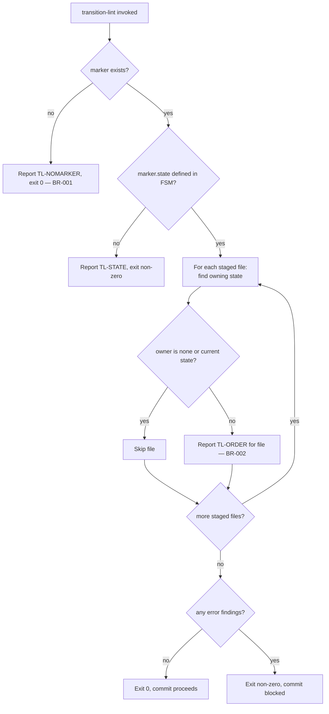

# UC-02 — Block an Out-of-Phase Commit

Realizes: AG-02

## Primary Actor

Human Operator (attempting to stage or commit a file)

## Stakeholders & Interests

- **Human Operator** — wants a mistaken early commit (e.g. staging code before the spec gate clears) caught before it lands, not discovered later in review.
- **CLI-Invoked Agent** — wants the same protection when it stages files on the Human Operator's behalf; it has no memory of the playbook's phase order to rely on instead.
- **The playbook's later phases** — want their own declared `outputs:` never to appear on disk before their state is actually current, so `phase advance`'s `entry_conditions` checks stay trustworthy.

## Trigger

A pre-commit hook (or the actor directly) runs `factory/scripts/transition-lint` against the currently staged files.

## Preconditions

- The repository has `factory/playbooks/` available, so any FSM the marker names can be resolved.

## Main Success Scenario

1. Pre-commit invokes `factory/scripts/transition-lint` with no arguments; it reads `git diff --cached --name-only` for the staged file list.
2. `transition-lint` reads the marker at `.current-work/playbook-state.yml`.
3. `transition-lint` loads the marker's `playbook`'s `.fsm.yml` and computes each state's `outputs:` glob ownership.
4. For every staged file, `transition-lint` finds which state (if any) owns it.
5. Every staged file is either ungoverned (owned by no state) or owned by the marker's current state.
6. `transition-lint` reports zero error-severity findings and exits `0`; the commit proceeds.

## Extensions

- **2a. No marker exists**
  - 2a1. `transition-lint` reports one info-severity finding (`TL-NOMARKER`) and exits `0` — a project not using the harness sees no behaviour change (BR-001).
- **3a. The marker's `state` is not defined in the FSM**
  - 3a1. `transition-lint` reports an error (`TL-STATE`) and exits non-zero.
- **5a. A staged file is owned by a state other than the current one**
  - 5a1. `transition-lint` reports an error (`TL-ORDER`) naming the file and its owning state.
  - 5a2. If the owning state is a successor of the current one, the message points at `phase advance` as the correct next step (BR-002).
  - 5a3. If the owning state is not a successor (out of order in either direction), the message says so without the `phase advance` hint.
  - 5a4. The commit is blocked — pre-commit's own exit-code convention rejects a non-zero hook.

## Postconditions

- **Success Guarantee**: every staged file that matches a state's `outputs:` glob belongs to the marker's current state.
- **Minimal Guarantee**: on rejection, the actor is told exactly which staged file is out of order and, where applicable, what command resolves it.

## Business Rules

- **BR-001**: a missing marker is a no-op — `transition-lint` does not gate a project or commit that is not using the harness.
- **BR-002**: `transition-lint` blocks a staged file if its owning state differs from the marker's current state, even when the file's owning state is a successor state reachable from the current one — advancing the marker via `phase advance` is the only way to unblock it.
- **BR-003**: `transition-lint` never evaluates `entry_conditions` — that is `phase advance`'s job alone (see [UC-01 § Business Rules](UC-01-advance-a-playbook-phase.md#business-rules)); this use case only checks whether a staged file belongs to the current state.

## Activity Diagram



## Acceptance Criteria

```gherkin
Feature: Block an out-of-phase commit

  Scenario: A file belonging to the current state is allowed
    Given a marker at state PHASE_1_REQUIREMENTS
    And docs/spec/prd.md is staged
    When transition-lint runs
    Then it reports zero error findings
    And it exits 0

  Scenario: A file belonging to a later state is blocked
    Given a marker at state PHASE_1_REQUIREMENTS
    And src/app.py is staged, which belongs to PHASE_4_IMPLEMENTATION
    When transition-lint runs
    Then it reports a TL-ORDER error for src/app.py
    And it exits non-zero

  Scenario: No marker is a no-op
    Given no marker file exists
    And any file is staged
    When transition-lint runs
    Then it reports only a TL-NOMARKER info finding
    And it exits 0
```

## Referenced from

- [actor-goal-list.md](../actor-goal-list.md)
- [factory/scripts/transition-lint](../../../factory/scripts/transition-lint)
