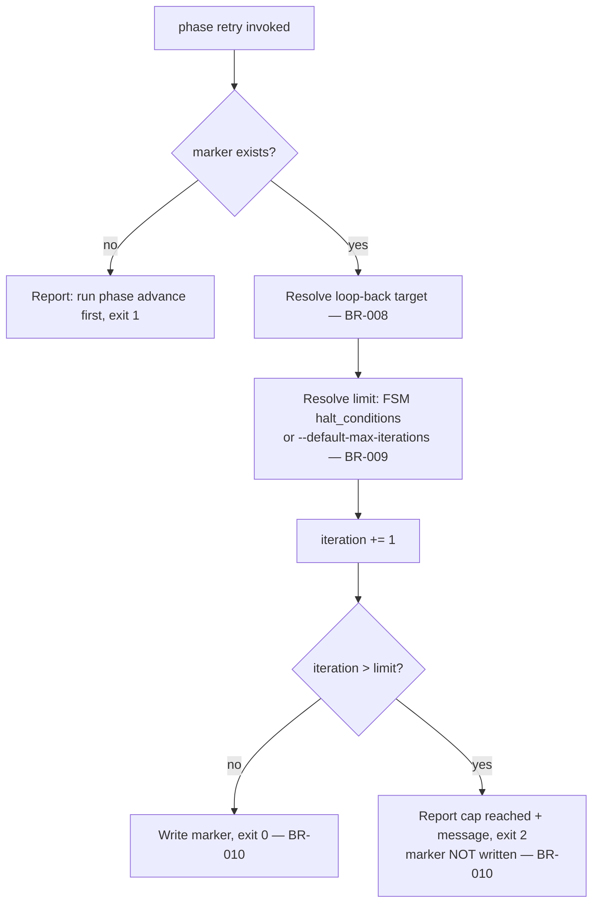

# UC-03 — Retry a Phase Within the Iteration Cap

Realizes: AG-03

## Primary Actor

Human Operator (or Orchestrator-as-Trigger, acting on its behalf)

## Stakeholders & Interests

- **Human Operator** — wants a stuck review loop to stop and escalate, not churn forever, while still allowing enough genuine attempts to converge.
- **Orchestrator-as-Trigger** — wants the identical cap enforced when it drives the loop programmatically, without maintaining its own counter.
- **The playbook's `.fsm.yml` author** — wants a per-state `halt_conditions` declaration to actually take effect, not sit unenforced (the exact gap this mechanism closes — see [factory-guide.md § Playbook phase gates](../../../factory/docs/factory-guide.md#playbook-phase-gates)).

## Trigger

The actor is about to re-dispatch the same state's author agent because its gate reported open findings, and runs `factory/scripts/phase retry` first.

## Preconditions

- A marker already exists at `.agent-factory/playbook-state.yml` (created by a prior `phase advance`).
- The marker's `state` is one whose gate has just reported open findings — not a fresh state and not one that already passed.

## Main Success Scenario

1. Actor runs `factory/scripts/phase retry`.
2. `phase retry` reads the marker and resolves the loop-back target: the current state's `else` transition target if one exists, otherwise the current state itself (BR-008).
3. `phase retry` resolves the iteration limit for that target state: the FSM's `halt_conditions` entry of type `max_iterations` naming it, if one exists; otherwise `--default-max-iterations` (default `5`) (BR-009).
4. `phase retry` increments the marker's `iteration` count.
5. The incremented count does not exceed the limit.
6. `phase retry` writes the marker with the new `iteration` and a fresh `recorded_at`, exits `0`, and reports `<state>: retry <n>/<limit> recorded`.
7. The actor re-dispatches the same state's author agent, which reads the open findings and addresses them — this is the loop the [review loop discipline rulebook](../../../factory/rulebooks/conventions/review-loop-discipline.md) requires: re-run the deterministic check, and re-run the full inspection fresh, on every repeat pass.

## Extensions

- **5a. The incremented count exceeds the limit**
  - 5a1. `phase retry` refuses: exits `2`, reports the state has reached its cap, includes the FSM's own `message` if one was declared (BR-010).
  - 5a2. The marker is **not** written — the iteration count that triggered the refusal is not persisted twice.
  - 5a3. The actor stops re-dispatching and escalates to a human, per [run-step § Iteration cap](../../../factory/skills/run-step/SKILL.md#iteration-cap).
- **1a. No marker exists**
  - 1a1. `phase retry` exits `1`, reports that `phase advance` must run first.

## Postconditions

- **Success Guarantee**: the marker's `iteration` for the current state reflects exactly how many retries have been recorded, and every recorded retry was actually allowed under the cap.
- **Minimal Guarantee**: a refused retry never silently proceeds — the actor is told the cap was hit and given the configured escalation message.

## Business Rules

- **BR-008**: the iteration-cap lookup resolves against the loop-back target state named in the current state's `else` transition, not the gate state's own name — `halt_conditions` are declared against the author state being retried (e.g. `PHASE_1_REQUIREMENTS`), not its gate (`PHASE_1_GATE`).
- **BR-009**: the iteration cap for a given state is the FSM's own `halt_conditions` entry of type `max_iterations` naming that state, if one exists; otherwise `--default-max-iterations` (default `5`).
- **BR-010**: `phase retry` writes the marker only when the retry is allowed; a refused retry leaves the marker's `iteration` count exactly as it was.

## Activity Diagram



## Acceptance Criteria

```gherkin
Feature: Retry a phase within the iteration cap

  Scenario: A retry within the cap is recorded
    Given a marker at state PHASE_1_GATE looping back to PHASE_1_REQUIREMENTS
    And PHASE_1_REQUIREMENTS has a declared cap of 5 with iteration currently 2
    When the actor runs phase retry
    Then the marker's iteration becomes 3
    And phase retry exits 0

  Scenario: A retry beyond the cap is refused
    Given PHASE_1_REQUIREMENTS has a declared cap of 5 with iteration currently 5
    When the actor runs phase retry
    Then phase retry reports the cap of 5 has been reached
    And the marker's iteration remains 5
    And phase retry exits 2

  Scenario: Retry without a prior advance is rejected
    Given no marker file exists
    When the actor runs phase retry
    Then phase retry reports that phase advance must run first
    And it exits non-zero
```

## Referenced from

- [actor-goal-list.md](../actor-goal-list.md)
- [factory/scripts/phase](../../../factory/scripts/phase)
- [review-loop-discipline.md § Rule](../../../factory/rulebooks/conventions/review-loop-discipline.md#rule)
