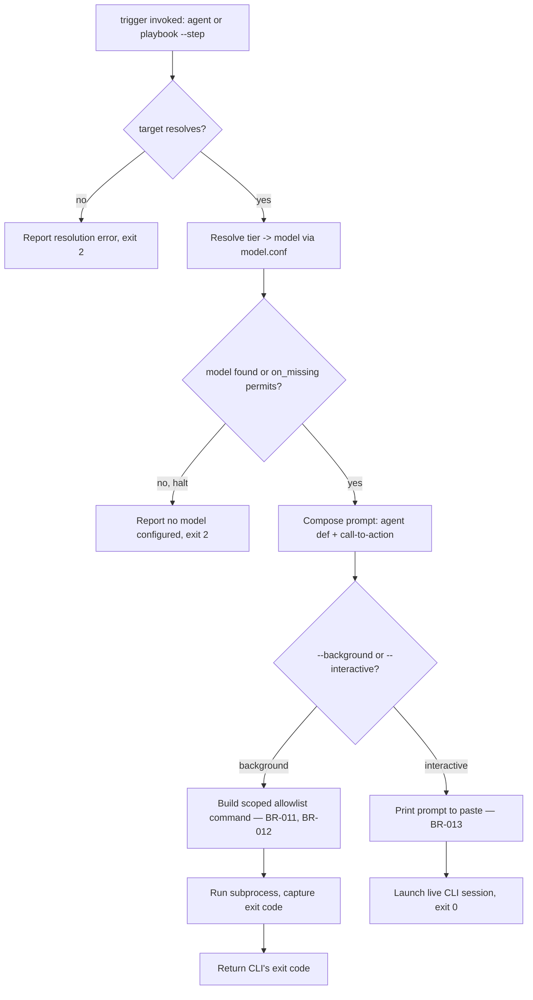

# UC-04 — Dispatch an Agent via Trigger

Realizes: AG-04

## Primary Actor

Human Operator (or Orchestrator-as-Trigger, acting on its behalf)

## Stakeholders & Interests

- **Human Operator** — wants to launch an agent session without hand-composing the prompt or remembering which model tier maps to which CLI.
- **Orchestrator-as-Trigger** — wants an identical, scriptable dispatch surface, since it has no dispatch logic of its own to fall back on.
- **CLI-Invoked Agent** — wants a scoped permission grant wide enough to do its declared job, and no wider — a background session that hits a permission wall it should have been granted is as much a defect as one with too much power.

## Trigger

The actor runs `factory/scripts/trigger agent <name>` or `factory/scripts/trigger playbook <name> --step <agent-name-or-index>`, with `--background` or `--interactive`.

## Preconditions

- The named agent exists in `factory/agents/`, or the named playbook exists in `factory/playbooks/` and its derived agent sequence contains the requested step.
- `config/model.conf` declares a model for the agent's tier under the target CLI, or `on_missing` permits proceeding without one.

## Main Success Scenario

1. Actor runs `factory/scripts/trigger agent <name> --background --cli claude --cwd <project-root>`.
2. `trigger` resolves the agent from `factory/INDEX.yaml`'s own source data (reusing `index-lint`'s `load_agents()`).
3. `trigger` resolves the agent's declared `tier` to a concrete model via `config/model.conf` (reusing `matrix-lint`'s `parse_matrix()`).
4. `trigger` composes the prompt: the full agent definition file, plus a standalone call-to-action section.
5. `trigger` builds the background CLI invocation under the hardcoded, scoped permission allowlist for the target CLI (BR-011, BR-012).
6. `trigger` runs the CLI as a subprocess, captures its exit code, and returns it.

## Extensions

- **1a. `--interactive` is given instead of `--background`**
  - 1a1. `trigger` prints the composed prompt for the actor to paste as the session's first message, then launches a live CLI session in `--cwd` (BR-013).
  - 1a2. `trigger` exits `0` after launch instructions are printed, regardless of the interactive session's own outcome.
- **1b. The invocation names a playbook step instead of a bare agent**
  - 1b1. `trigger` resolves the step by agent name if given a name already in the playbook's sequence, or by 1-based index otherwise (BR-014).
  - 1b2. Resolution then proceeds identically to step 2 onward, using the resolved agent name.
- **2a. The named agent or playbook is unknown, or the named step is not in the playbook's sequence**
  - 2a1. `trigger` exits `2` and reports the resolution error; no subprocess is launched.
- **3a. `config/model.conf` has no model for the agent's tier under the target CLI**
  - 3a1. If `on_missing: halt`, `trigger` exits `2` and reports no model is configured.
  - 3a2. If `on_missing` permits it, `trigger` proceeds with no explicit `--model` flag, letting the target CLI use its own default.

## Postconditions

- **Success Guarantee**: in background mode, the CLI ran under the scoped allowlist for its target CLI and never under a blanket permission bypass; `trigger`'s own exit code is the CLI's exit code.
- **Minimal Guarantee**: on a resolution error, no subprocess is launched at all — the actor is never left wondering whether a partially-configured session is running.

## Business Rules

- **BR-011**: `trigger`'s background-mode permission allowlist is hardcoded and scoped — never `--dangerously-skip-permissions` / `--allow-all-tools`, and never a bare interpreter wildcard (`Bash(python3 *)` and similar), since scoping the outer command while leaving the interpreter open is not scoping at all.
- **BR-012**: every entry in the background-mode allowlist is derived from a command literally observed in this repo's own playbooks, skills, agents, or config — never guessed ahead of a real invocation, per [YAGNI](../../../factory/rulebooks/conventions/foundational-principles.md#yagni). The allowlist's `factory/scripts/mdformat *` entry exists because [markdown-formatting.md § Rule](../../../factory/rulebooks/conventions/markdown-formatting.md#rule) requires every markdown-writing agent to run it, and its `git commit *` entry presumes the resulting message still follows [commit-conventions.md § Story/Bug ID Required](../../../factory/rulebooks/conventions/commit-conventions.md#storybug-id-required).
- **BR-013**: `--interactive` mode never seeds a first message programmatically; it prints the composed prompt for the actor to paste, because neither supported CLI is known to support "seed a message but stay interactive" from the command line.
- **BR-014**: `trigger` resolves a playbook step by agent name, not list position, so a state-name/list-position mismatch never misdispatches (see [run-step § Step 4](../../../factory/skills/run-step/SKILL.md#step-4-dispatch)).
- Neither allowlist includes `git worktree add` — worktree creation happens through the calling CLI's own isolation mechanism, not a raw git command; see [branching-policy.md § Worktree Isolation](../../../factory/rulebooks/conventions/branching-policy.md#worktree-isolation).

## Activity Diagram



## Acceptance Criteria

```gherkin
Feature: Dispatch an agent via trigger

  Scenario: Background dispatch of a known agent
    Given "requirements-agent" exists in factory/agents/
    And config/model.conf declares a model for its tier under claude
    When the actor runs trigger agent requirements-agent --background --cli claude
    Then trigger runs the claude CLI under the scoped allowlist
    And it returns the CLI's own exit code

  Scenario: Interactive dispatch prints a prompt to paste
    When the actor runs trigger agent requirements-agent --interactive --cli claude
    Then trigger prints the composed prompt
    And it launches a live claude session
    And it exits 0

  Scenario: Unknown agent is rejected before any subprocess launches
    Given no agent named "does-not-exist" exists
    When the actor runs trigger agent does-not-exist --background
    Then trigger reports the resolution error
    And it exits 2
    And no subprocess is launched

  Scenario: Playbook step resolves by agent name, not position
    Given playbook "greenfield-development" has agents in a fixed sequence
    When the actor runs trigger playbook greenfield-development --step spec-review-agent
    Then trigger dispatches spec-review-agent regardless of its position in the sequence
```

## Referenced from

- [actor-goal-list.md](../actor-goal-list.md)
- [factory/scripts/trigger](../../../factory/scripts/trigger)
