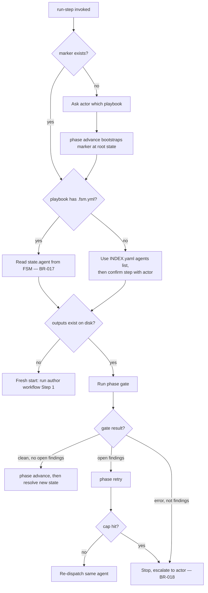

# UC-05 — Resume an Interrupted Playbook Run

Realizes: AG-05

## Primary Actor

Human Operator (or Orchestrator-as-Trigger, acting on its behalf)

## Stakeholders & Interests

- **Human Operator** — wants a crashed session, a closed terminal, or a fresh session to never leave work stranded behind stale state; wants "what's next" answered correctly every time, without trusting a status field that could itself be wrong.
- **Orchestrator-as-Trigger** — wants the same resume guarantee without maintaining a persisted run-status file of its own.
- **`factory/scripts/phase`/`trigger`** — want to stay the sole owners of state mutation and dispatch respectively; this use case only reads what they have already written and decides which of them to call next.

## Trigger

The actor invokes the `run-step` skill (or works through its procedure by hand) to find out what to do next.

## Preconditions

- None beyond an accessible working tree — this use case is defined precisely to work from whatever state is actually on disk, marker present or not.

## Main Success Scenario

1. Actor invokes `run-step`.
2. `run-step` reads `.agent-factory/playbook-state.yml`. A marker exists, naming a playbook and a state.
3. `run-step` checks whether that playbook has a companion `.fsm.yml` (via `factory/INDEX.yaml`'s `fsm:` field). One exists; `run-step` reads the current state's `agent:` field directly from the FSM — not a position in `INDEX.yaml`'s derived `agents:` list, which carries no state names (BR-017).
4. `run-step` checks the current state's declared `outputs:` glob against what is actually on disk, and runs that phase's own gate.
5. The outputs do not yet exist.
6. `run-step` dispatches the resolved agent via `factory/scripts/trigger`, running that state's author workflow from its own Step 1.

## Extensions

- **2a. No marker exists**
  - 2a1. `run-step` asks the actor which playbook to run.
  - 2a2. `run-step` bootstraps a marker by calling `factory/scripts/phase advance` with no prior marker — see [UC-01 § Main Success Scenario, step 2](UC-01-advance-a-playbook-phase.md#main-success-scenario).
- **3a. The playbook has no companion `.fsm.yml`**
  - 3a1. `run-step` uses `INDEX.yaml`'s `agents:` array for that playbook, in order.
  - 3a2. `run-step` asks the actor to confirm which step they are on the first time, since nothing on disk names it.
- **5a. Outputs exist, the gate passes clean, and no open findings remain for this phase**
  - 5a1. The step is done. `run-step` calls `factory/scripts/phase advance` (see [UC-01](UC-01-advance-a-playbook-phase.md)), then repeats step 3 for the new state.
- **5b. Outputs exist and the gate reports open findings**
  - 5b1. `run-step` calls `factory/scripts/phase retry` first (see [UC-03](UC-03-retry-a-phase-within-the-iteration-cap.md)).
  - 5b2. The cap is not yet hit — `run-step` re-dispatches the same agent; its own workflow reads the open findings and addresses them.
  - 5b3. The cap is hit — `run-step` stops and escalates to the actor rather than re-dispatching (BR-018).
- **5c. Outputs exist but the gate errors, rather than reporting findings**
  - 5c1. `run-step` stops and escalates to the actor — an error is not "findings to address," and guessing at a fix here is out of scope (BR-018).
- **3b. No playbook with a `.fsm.yml` (fallback state from 3a)**
  - 3b1. `run-step` skips the outputs/gate check entirely and asks the actor whether the current step is done.
  - 3b2. `phase retry` also has nothing to check against in this fallback — the actor tracks loop count directly and escalates if it does not look like it is converging.

## Postconditions

- **Success Guarantee**: the dispatched action (fresh start, advance, or retry) is the one the current marker, gate result, and open findings actually justify — never a stale or assumed status.
- **Minimal Guarantee**: on an error condition, the actor is told to stop and escalate rather than having `run-step` guess at a resolution.

## Business Rules

- **BR-017**: `run-step` derives the current agent from the FSM's own `state.agent` field when a companion `.fsm.yml` exists for the playbook, not from `INDEX.yaml`'s derived, state-name-blind `agents:` list.
- **BR-018**: `run-step` treats "outputs exist but the gate errors" as a stop-and-escalate condition, distinct from "outputs exist, gate reports open findings" (which resumes via retry) — the two are never handled the same way.

## Activity Diagram



## Acceptance Criteria

```gherkin
Feature: Resume an interrupted playbook run

  Scenario: Fresh start when outputs do not exist
    Given a marker at state PHASE_1_REQUIREMENTS
    And none of that state's declared outputs exist on disk
    When the actor invokes run-step
    Then run-step dispatches requirements-agent from its own Step 1

  Scenario: Advance when the gate is clean
    Given a marker at state PHASE_1_REQUIREMENTS
    And that state's outputs exist and spec-lint reports no open findings
    When the actor invokes run-step
    Then run-step calls phase advance
    And resolves the next state's agent

  Scenario: Retry when the gate has open findings, within the cap
    Given a marker at state PHASE_1_REQUIREMENTS with iteration 2 of a cap of 5
    And that state's outputs exist but spec-lint reports open findings
    When the actor invokes run-step
    Then run-step calls phase retry
    And re-dispatches requirements-agent

  Scenario: Escalate when the iteration cap is hit
    Given a marker at state PHASE_1_REQUIREMENTS with iteration 5 of a cap of 5
    And that state's gate still reports open findings
    When the actor invokes run-step
    Then phase retry refuses
    And run-step stops and escalates to the actor
```

## Referenced from

- [actor-goal-list.md](../actor-goal-list.md)
- [factory/skills/run-step/SKILL.md](../../../factory/skills/run-step/SKILL.md)
