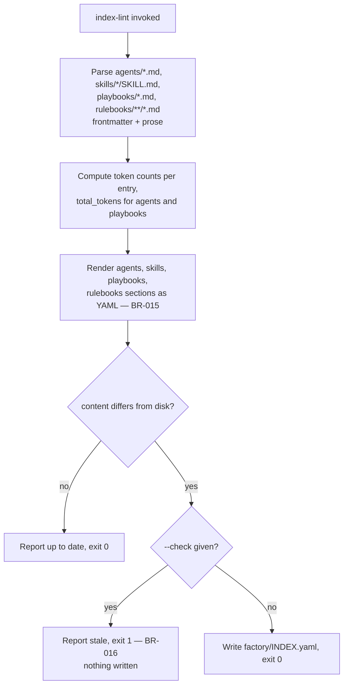

# UC-06 — Regenerate the Catalog

Realizes: AG-06

## Primary Actor

Human Operator (or Orchestrator-as-Trigger, or a CI job, acting on its behalf)

## Stakeholders & Interests

- **Human Operator** — wants `factory/INDEX.yaml` to always describe what actually exists in `factory/agents/`, `factory/skills/`, `factory/playbooks/`, and `factory/rulebooks/`, without maintaining it by hand.
- **`trigger`** — depends on `INDEX.yaml`'s data indirectly, by importing `index-lint`'s own `load_agents()`/`load_playbooks()` functions rather than re-parsing frontmatter itself; a stale or hand-edited catalog would desynchronize the two.
- **`run-step`** — reads `INDEX.yaml`'s `fsm:` field to decide whether a playbook has a state machine, and its `agents:` field as the fallback ordering when it does not.

## Trigger

The actor runs `factory/scripts/index-lint`, either to regenerate the catalog or (with `--check`) to verify it is current.

## Preconditions

- None — `index-lint` reads `factory/agents/*.md`, `factory/skills/*/SKILL.md`, `factory/playbooks/*.md`, and `factory/rulebooks/**/*.md` (excluding templates), all of which are ordinary tracked files.

## Main Success Scenario

1. Actor runs `factory/scripts/index-lint`.
2. `index-lint` parses every agent's frontmatter (including `skills:` and `inputs:` lists), grouping by `phase`/`phase-name`.
3. `index-lint` parses every skill's frontmatter, grouping by `category`.
4. `index-lint` parses every playbook's frontmatter and derives its ordered agent sequence from its own `**Agent**: `x\`\` prose lines — never from a separately maintained list (BR-015).
5. `index-lint` scans every rulebook (excluding templates) for its token count.
6. `index-lint` computes `tokens` for every entry (tiktoken cl100k_base, chars ÷ 4 fallback), `total_tokens` for agents (body + skills + rulebooks) and playbooks (body + unique agent totals).
7. `index-lint` renders the four sections (agents, skills, playbooks, rulebooks) as YAML and compares them against the current `factory/INDEX.yaml`.
8. The rendered content differs from what is on disk.
9. `index-lint` writes the new content and reports what changed.

## Extensions

- **1a. `--check` is given**
  - 1a1. `index-lint` performs steps 2–7 but never writes.
  - 1a2. If the rendered content differs from disk, it exits `1` and reports the catalog is stale (BR-016).
  - 1a3. If the rendered content matches disk, it exits `0` and reports the catalog is up to date.
- **8a. The rendered content already matches what is on disk**
  - 8a1. `index-lint` writes nothing and reports "already up to date, no changes" (BR-016).
- **2a. An agent declares `phase` but no `phase-name`**
  - 2a1. `index-lint` emits a warning and falls back to `Phase <N>` as the display name; the entry is still written.
- **3a. A skill declares no `category`**
  - 3a1. `index-lint` emits a warning; the entry is still written, sorted after every categorized skill.

## Postconditions

- **Success Guarantee**: after a successful run, `factory/INDEX.yaml`'s content is byte-for-byte what `index-lint` would generate from the current frontmatter — running it again immediately makes no further change. Every entry carries a `tokens` field; agents and playbooks carry `total_tokens`.
- **Minimal Guarantee**: `--check` never mutates `factory/INDEX.yaml`, regardless of whether the catalog is stale.

## Business Rules

- **BR-015**: `factory/INDEX.yaml` is never hand-edited; regenerating it with `index-lint` is the only way its content changes. A playbook's agent sequence is derived from its own `**Agent**: `x\`\` prose lines, the same principle this repo applies to Mermaid diagrams under [state-machine-notation.md § Canonical Format](../../../factory/rulebooks/conventions/state-machine-notation.md#canonical-format) — the source of truth is authored once, and every derived view is generated from it, never hand-duplicated.
- **BR-016**: `index-lint --check` exits `1` without writing when the generated content differs from what is on disk; an unqualified run only writes when content actually changed, and reports "no changes" otherwise.

## Activity Diagram



## Acceptance Criteria

```gherkin
Feature: Regenerate the catalog

  Scenario: Regeneration writes an up-to-date catalog
    Given an agent's frontmatter changed since the last index-lint run
    When the actor runs index-lint
    Then factory/INDEX.yaml is rewritten to reflect the change
    And index-lint exits 0

  Scenario: A clean re-run changes nothing
    Given factory/INDEX.yaml already matches current frontmatter
    When the actor runs index-lint
    Then it reports no changes
    And it does not rewrite the file

  Scenario: --check detects a stale catalog without writing
    Given a playbook's agent sequence changed since the last regeneration
    When the actor runs index-lint --check
    Then it reports the catalog is stale
    And it exits 1
    And factory/INDEX.yaml is left unchanged
```

## Referenced from

- [actor-goal-list.md](../actor-goal-list.md)
- [factory/scripts/index-lint](../../../factory/scripts/index-lint)
