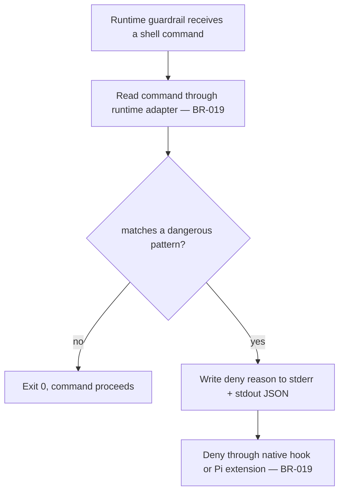

# UC-07 — Block a Dangerous Git Command

Realizes: AG-07

## Primary Actor

CLI-Invoked Agent (attempting to run a shell command), or the Human Operator using the same CLI session

## Stakeholders & Interests

- **Human Operator** — wants an under-pressure or confused agent stopped from discarding history or bypassing this repo's own commit gates, before the command runs, not after.
- **CLI-Invoked Agent** — wants the deny reason back immediately and in a form its own session can read, so it can choose a different, safe command instead of retrying blindly.
- **Repository history** — wants to never be force-pushed, hard-reset, or cleaned by an automated session without a human explicitly choosing to do so outside the guarded path.

## Trigger

A supported runtime receives a `Bash`/shell tool call, before the command
executes.

## Preconditions

- `init-factory` has wired `block-dangerous-git.sh` into the calling native-hook
  CLI, or installed the equivalent Pi extension (see
  [UC-08](UC-08-initialize-agent-factory-into-a-project.md)).

## Main Success Scenario

1. The actor's session attempts to run a shell command.
2. Claude Code, GitHub Copilot CLI, or Codex invokes
   `block-dangerous-git.sh` through its `PreToolUse` hook, passing command JSON
   on stdin; Pi invokes the equivalent extension check.
3. The guardrail adapter reads the command from the runtime's supported input
   shape (BR-019).
4. `block-dangerous-git.sh` checks the command against its fixed list of dangerous patterns.
5. The command matches none of them.
6. `block-dangerous-git.sh` exits `0`; the command proceeds.

## Extensions

- **5a. The command matches a dangerous pattern**
  - 5a1. `block-dangerous-git.sh` writes the reason to stderr and prints a `permissionDecision: deny` JSON object to stdout, naming the exact matched pattern.
  - 5a2. `block-dangerous-git.sh` exits `2`.
  - 5a3. A native-hook CLI treats exit `2` as deny, while Pi's extension rejects
    the tool call (BR-019); the command never runs, and the actor's session sees
    the deny reason.

## Postconditions

- **Success Guarantee**: no command matching a dangerous pattern in the fixed list ever executes through a hooked CLI session.
- **Minimal Guarantee**: on a denial, the actor's session is told which pattern was matched, so it can choose a different approach rather than retry the same command.

## Business Rules

- **BR-019**: The guardrail denies a command if it matches any pattern in its
  fixed list, regardless of runtime input shape. Claude Code, GitHub Copilot
  CLI, and Codex treat the shell hook's exit code `2` as deny; Pi's extension
  rejects the equivalent tool call.
- **BR-020**: the hook's deny list is a second, independent layer on top of `trigger`'s own `--disallowedTools`/`--deny-tool` (see [UC-04 § Business Rules](UC-04-dispatch-an-agent-via-trigger.md#business-rules)) — belt-and-suspenders, not a single point of failure; a background session denied by one layer is denied before the verb is even offered as available, not merely rejected after asking.
- The pattern list covers three groups:
  1. Commands that discard or overwrite work or history (`git push`, `git reset --hard`, `git clean -f`/`-fd`, `git branch -D`, `git checkout .`, `git restore .`, bare `push --force`/`reset --hard` fragments)
  2. Commands that bypass this repo's own commit gates (`--no-verify`, `git commit -n`, reassigning `core.hooksPath`, `pre-commit uninstall`, `SKIP=...` on `git commit`/`pre-commit`)
  3. Bare test commands that bypass the project's charter-declared test entrypoints (see [UC-09](UC-09-run-tests-via-hook.md) / BR-024)
- This is a backstop, not a security boundary: it catches an accidental or under-pressure bypass, not a determined one — a user with shell access outside the CLI, or anyone who edits the CLI's own configuration, can always route around it.

## Activity Diagram



## Acceptance Criteria

```gherkin
Feature: Block a dangerous git command

  Scenario: A safe command proceeds
    Given a shell command "git status"
    When the PreToolUse hook fires
    Then block-dangerous-git.sh exits 0
    And the command runs

  Scenario: A history-discarding command is denied
    Given a shell command "git push --force origin main"
    When the PreToolUse hook fires
    Then block-dangerous-git.sh reports the matched pattern
    And it exits 2
    And the command never runs

  Scenario: A gate-bypassing command is denied
    Given a shell command "git commit -n -m fix"
    When the PreToolUse hook fires
    Then block-dangerous-git.sh reports the matched pattern
    And it exits 2
    And the command never runs
```

## Referenced from

- [actor-goal-list.md](../actor-goal-list.md)
- [factory/config/hooks/block-dangerous-git.sh](../../../factory/config/hooks/block-dangerous-git.sh)
