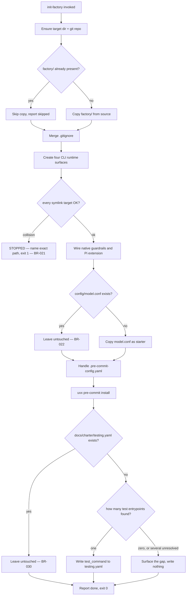

# UC-08 — Initialize Agent Factory into a Project

Realizes: AG-08

## Primary Actor

Human Operator

## Stakeholders & Interests

- **Human Operator** — wants `factory/`, the guardrail hook, and the gate config wired into a project — new or with its own history — in one idempotent run, and wants to be told exactly what stopped it if something cannot proceed safely.
- **Existing project files** — want to be left alone; `init-factory` must never overwrite a `.gitignore`, `.pre-commit-config.yaml`, or `config/model.conf` that the project has already customized.
- **Every other use case in this spec** — depends on `init-factory` having run at least once (see [PRD § Assumptions](../prd.md#7-assumptions)); none of `transition-lint`, `phase advance`/`retry`, `trigger`, or the guardrail hook works without `factory/` and the wiring this use case produces.

## Trigger

The actor runs `factory/scripts/init-factory`, optionally with `--target` and `--source`.

## Preconditions

- None for a brand-new target — `init-factory` creates the directory and initializes git itself if needed.
- For an existing project, the actor accepts that any collision stops the whole run before touching anything later.

## Main Success Scenario

01. Actor runs `init-factory --target <project-dir>`.
02. `init-factory` creates the target directory if missing, and runs `git init` if it is not already a repo.
03. `init-factory` copies `factory/` from the source checkout into the target, since `--target/factory` does not yet exist.
04. `init-factory` merges the required lines into `--target/.gitignore`, appending only what is missing.
05. `init-factory` creates the Claude Code, GitHub Copilot CLI, Codex, and Pi
    runtime directories.
06. `init-factory` installs the generated agents, skills, playbooks, rulebooks,
    scripts, index, and orientation files in each runtime's native layout, and
    stops at the first path that is neither missing nor already the expected
    link (BR-021).
07. `init-factory` wires `block-dangerous-git.sh` into the Claude Code,
    GitHub Copilot CLI, and Codex hook configurations, and installs Pi's
    equivalent project-local extension.
08. `init-factory` copies `config/model.conf` from `factory/config/model.conf`, since `--target/config/model.conf` does not yet exist.
09. `init-factory` symlinks `.pre-commit-config.yaml` to `factory/config/pre-commit-config.yaml`, since the target has none yet.
10. `init-factory` runs `uvx pre-commit install`.
11. `init-factory` scans the target for an existing test entrypoint (Makefile, package.json, tox, nox, Justfile, Taskfile, pytest config) and, if exactly one is found, records it as `test_command` in `docs/charter/testing.yaml` — the deterministic core of the `detect-test-regime` skill (BR-030).
12. `init-factory` exits `0` and reports the target is set up.

## Extensions

- **6a. A destination path exists and is not a symlink to the expected source**
  - 6a1. `init-factory` raises a `Collision`, prints `STOPPED — <path>` naming the exact path, and exits `1` without touching anything later in the run (BR-021).
- **8a. `--target/config/model.conf` already exists**
  - 8a1. `init-factory` leaves it untouched and reports so — the file is meant to diverge per project (BR-022).
- **9a. `--target/.pre-commit-config.yaml` already exists as a real file (not a symlink)**
  - 9a1. `init-factory` hands off to `factory/scripts/merge-precommit-config`, which splices Agent Factory's hooks into the existing `repos:` list without disturbing what was already there.
  - 9a2. If the merge script cannot handle the existing file's structure, `init-factory` raises a `Collision` and exits `1`, naming the path.
- **3a. `--target/factory` already exists**
  - 3a1. `init-factory` skips the copy entirely and reports so — refreshing an existing `factory/` is the update script's job (`factory/scripts/update-factory`), not `init-factory`'s.
- **7a. `--target/.claude/settings.json` exists but is not valid JSON, or its top-level value is not an object, or `hooks`/`hooks.PreToolUse` is not the expected shape**
  - 7a1. `init-factory` raises a `Collision`, names the exact path, and asks the actor to wire the guardrail hook in by hand.
- **11a. `--target/docs/charter/testing.yaml` already exists**
  - 11a1. `init-factory` leaves it untouched and reports so — it may carry a prior scan or hand-edited content (BR-030).
- **11b. No test entrypoint is found, or several are found with no interactive answer to disambiguate**
  - 11b1. `init-factory` surfaces the gap in its report and writes nothing — it never guesses a `test_command` (BR-030). The run still exits `0`; a missing test regime is not a collision.

## Postconditions

- **Success Guarantee**: on a clean run, `factory/` is present, all four runtime
  surfaces are installed with their native guardrail integration,
  `config/model.conf` exists, `.pre-commit-config.yaml` is in place, and
  `pre-commit` is installed.
- **Minimal Guarantee**: on any collision, the run stops immediately — nothing later in the step order is left partially applied, and the actor is told the exact colliding path.

## Business Rules

- **BR-021**: `init-factory` stops the entire run at the first step that finds an unexpected file at a destination path — it never partially applies a run past a collision.
- **BR-022**: `init-factory` never touches `config/model.conf` once it exists — the file is meant to diverge per project.
- **BR-030**: `init-factory` scans for an existing test entrypoint and records exactly one unambiguous match as `test_command` in `docs/charter/testing.yaml`. It never injects a test-related hook into `.pre-commit-config.yaml` (see [UC-09 § BR-029](UC-09-run-tests-via-hook.md#business-rules)), never overwrites an existing `testing.yaml`, and never guesses when zero or several entrypoints are found — it surfaces the gap instead. This is the deterministic subset of the `detect-test-regime` skill, run because `init-factory` itself has no AI in the loop.
- `init-factory` is idempotent: re-running it against an already-initialized target reports "nothing to do" everywhere except the one thing it never diffs (an existing `factory/` directory, per Extension 3a).

## Activity Diagram



## Acceptance Criteria

```gherkin
Feature: Initialize Agent Factory into a project

  Scenario: Fresh project is fully wired
    Given an empty target directory
    When the actor runs init-factory --target that directory
    Then factory/ is copied in
    And Claude Code, GitHub Copilot CLI, Codex, and Pi surfaces are installed
    And each runtime has its native guardrail integration
    And init-factory exits 0

  Scenario: Existing model.conf is left untouched
    Given the target already has a customized config/model.conf
    When the actor runs init-factory
    Then that file is not modified
    And init-factory reports it as already present

  Scenario: A real symlink collision stops the run
    Given .claude/agents already exists as a real directory, not a symlink
    When the actor runs init-factory
    Then init-factory reports STOPPED naming .claude/agents
    And it exits 1
    And no later step runs

  Scenario: Re-running against an already-initialized target is a clean no-op
    Given init-factory has already run successfully once
    When the actor runs init-factory again
    Then every step reports "already present" or "already linked"
    And init-factory exits 0

  Scenario: A single test entrypoint is detected and recorded
    Given the target has a pyproject.toml with a [tool.pytest.ini_options] section
    And the target has no docs/charter/testing.yaml
    When the actor runs init-factory
    Then docs/charter/testing.yaml is created with test_command "pytest"
    And .pre-commit-config.yaml carries no test-related hook

  Scenario: No test entrypoint surfaces a gap instead of guessing
    Given the target has no Makefile, package.json, tox, nox, Justfile, Taskfile, or pytest config
    When the actor runs init-factory
    Then docs/charter/testing.yaml is not created
    And init-factory reports the gap
    And init-factory still exits 0

  Scenario: An existing testing.yaml is left untouched
    Given the target already has a docs/charter/testing.yaml
    And the target also has a Makefile with a test target
    When the actor runs init-factory
    Then docs/charter/testing.yaml is not modified
    And init-factory reports it as already present
```

## Referenced from

- [actor-goal-list.md](../actor-goal-list.md)
- [factory/scripts/init-factory](../../../factory/scripts/init-factory)
