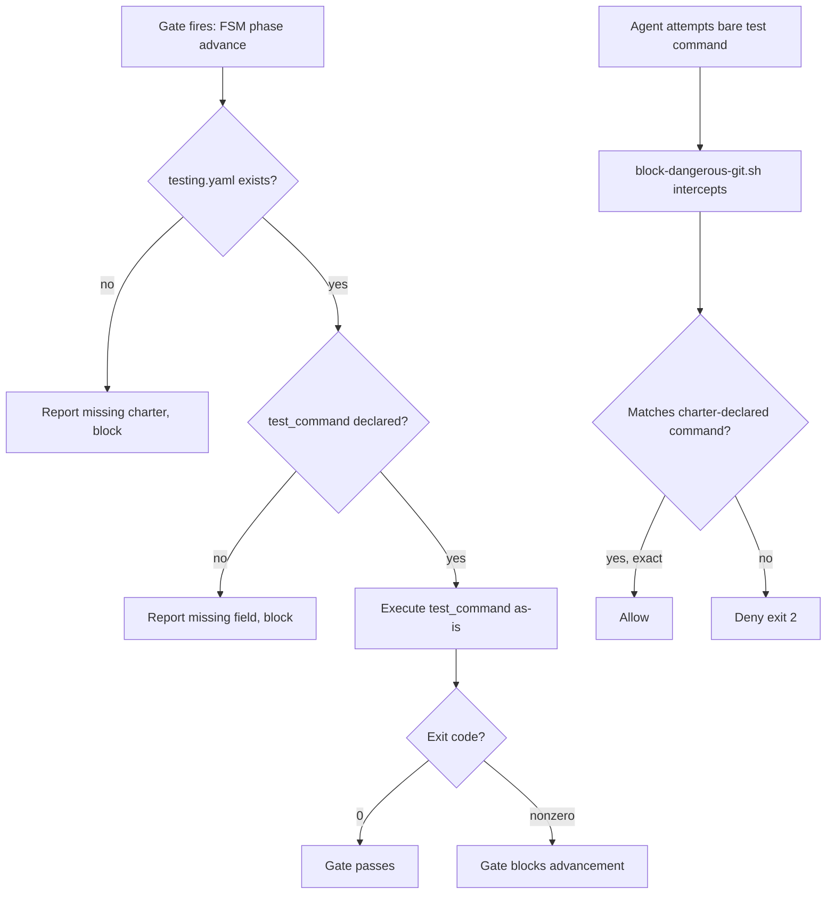

# UC-09 — Ensure Project-Owned Test Gates Exist

Realizes: AG-09

## Primary Actor

Human Operator — wants test infrastructure that the project owns, that runs deterministically, and that survives `remove-factory`.

## Stakeholders & Interests

- **Human Operator** — wants test failures caught immediately and deterministically via the project's own test commands, before work leaves the local machine or advances to the next phase; wants test infrastructure that belongs to the project, not to Factory.
- **CLI-Invoked Agent** — wants bare test commands blocked entirely, with only the project's charter-declared test commands permitted through the guardrail allowlist.
- **Downstream phase's agent** — wants the guarantee that code reaching its phase has already passed the project's declared test gate; never has to decide whether to re-run tests itself.

## Trigger

One of three events:

- A project-owned pre-commit or pre-push hook fires, executing the charter-declared test command.
- FSM `phase advance` evaluates a `script_exit_zero` gate condition, resolving `test_command` from `docs/charter/testing.yaml`.
- An agent attempts a bare test command, and `block-dangerous-git.sh` evaluates it against the charter-declared allowlist.

## Preconditions

- `docs/charter/testing.yaml` exists and declares at least `test_command`.
- The declared test command is runnable from the repository root (dependencies installed, infrastructure available).
- For agent test iteration: `test_staged_command` is declared in `docs/charter/testing.yaml`.
- For FSM gate evaluation: the playbook's `.fsm.yml` declares a `script_exit_zero` entry condition that resolves `test_command` from the charter.

## Main Success Scenario

1. The project declares its test commands in `docs/charter/testing.yaml` (required: `test_command`; optional: `test_staged_command`, `test_changed_command`).
2. Factory's FSM gate conditions resolve `test_command` from the charter when evaluating `script_exit_zero` entry conditions.
3. The project's own pre-commit and pre-push hooks invoke the declared test commands. Factory does not inject test hooks — the project owns its hooks.
4. `block-dangerous-git.sh` reads the charter and allowlists all declared test commands (exact match). Bare test commands remain blocked for agents.
5. When the declared test command exits `0`, the gate passes. When it exits nonzero, the gate blocks advancement.
6. Factory ensures the gate exists; the project decides what runs inside it.

## Extensions

- **1a. `docs/charter/testing.yaml` is absent**
  - 1a1. FSM gate evaluation reports the missing charter and blocks advancement.
  - 1a2. `block-dangerous-git.sh` finds no charter-declared commands; no agent test commands are allowlisted. Bare test commands remain blocked.
- **1b. `testing.yaml` is malformed or missing `test_command`**
  - 1b1. FSM gate evaluation reports the missing field and blocks advancement.
- **4a. Agent attempts a bare test command (e.g., `pytest .`)**
  - 4a1. `block-dangerous-git.sh` intercepts the command at `PreToolUse` (before execution).
  - 4a2. The command does not match any charter-declared test command (exact match).
  - 4a3. Hook denies (exit `2`), reports: "Test execution blocked. Use the charter-declared test command."
  - 4a4. CLI surfaces the denial; command never executes (BR-024).
- **4b. Agent runs a charter-declared test command**
  - 4b1. The command exactly matches a field from `docs/charter/testing.yaml`.
  - 4b2. `block-dangerous-git.sh` allows the command (exit `0`).
- **5a. Declared test command fails (exit nonzero)**
  - 5a1. FSM gate reports `test_command` as unmet.
  - 5a2. Phase advance is blocked; the operator fixes the test failures.

## Postconditions

- **Success Guarantee**: when the charter-declared test command exits `0`, the project's test suite passed at the moment of invocation; the FSM gate or hook allows the operation to proceed.
- **Minimal Guarantee**: on failure (nonzero exit or missing charter), the operation is blocked, the reason is reported, and the operator or FSM knows validation is unmet.

## Business Rules

- **BR-023**: Factory does not detect or construct test commands. The project declares its test commands in `docs/charter/testing.yaml`. Factory reads that declaration; it does not guess, detect, or override.
- **BR-024**: Bare test commands (`pytest`, `npm test`, `go test`, `cargo test`, and variants) are blocked for agents via `block-dangerous-git.sh` deny patterns. The agent allowlist is populated from `docs/charter/testing.yaml`: all declared command fields (`test_command`, `test_staged_command`, `test_changed_command`) are allowlisted with exact-string matching. No prefix matching.
- **BR-025**: The `test_changed_command` field in `docs/charter/testing.yaml` is optional. When present, it is the command the project uses for fast feedback on changed files. Factory does not engineer mode flags; the project owns its mode story.
- **BR-026**: The `test_command` field in `docs/charter/testing.yaml` is required. It is the full test suite command used by FSM `script_exit_zero` gate conditions and pre-push hooks. Factory calls it as-is.
- **BR-027**: Factory does not parse structured test output. The gate contract is exit-code-only: zero means pass, nonzero means fail. Structured test counts, JSON summaries, and reporting are the project's concern.
- **BR-028**: The `test_staged_command` field is optional. When present, it is the command agents may use for TDD iteration on staged files. It is allowlisted in `block-dangerous-git.sh` with exact matching.
- **BR-029**: Factory does not inject test hooks into `.pre-commit-config.yaml`. Test hooks are project-owned infrastructure. The project decides when and how tests trigger on commit, push, or other events.

## Activity Diagram



## Acceptance Criteria

```gherkin
Feature: Project-owned test gates via charter declaration

  Scenario: FSM gate resolves test command from charter
    Given a project with docs/charter/testing.yaml declaring test_command
    And the FSM declares a script_exit_zero entry condition
    When phase advance evaluates the gate
    Then it resolves test_command from the charter
    And executes it from the repository root
    And the gate passes when the command exits 0

  Scenario: FSM gate blocks when charter is absent
    Given a project with no docs/charter/testing.yaml
    When phase advance evaluates a test gate
    Then it reports the missing charter
    And blocks advancement

  Scenario: Agent allowed to run charter-declared test command
    Given docs/charter/testing.yaml declares test_staged_command
    When an agent runs the exact declared command
    Then block-dangerous-git.sh allows the command

  Scenario: Agent blocked from bare test command
    Given an agent session
    When the agent attempts to execute a bare test command
    Then block-dangerous-git.sh intercepts at PreToolUse
    And the command is denied with exit 2
    And the agent sees a message directing it to the charter-declared command

  Scenario: Charter-declared commands use exact matching
    Given docs/charter/testing.yaml declares test_command as "make test"
    When an agent runs "make test --verbose"
    Then block-dangerous-git.sh denies the command
    Because it does not exactly match the declared command
```

## Referenced from

- [actor-goal-list.md](../actor-goal-list.md)
- [prd.md § FR-I](../prd.md#fr-i--project-owned-test-gates-testing-declaration)
- [docs/proposals/test-gate-presence-over-test-execution.md](../../proposals/test-gate-presence-over-test-execution.md)
