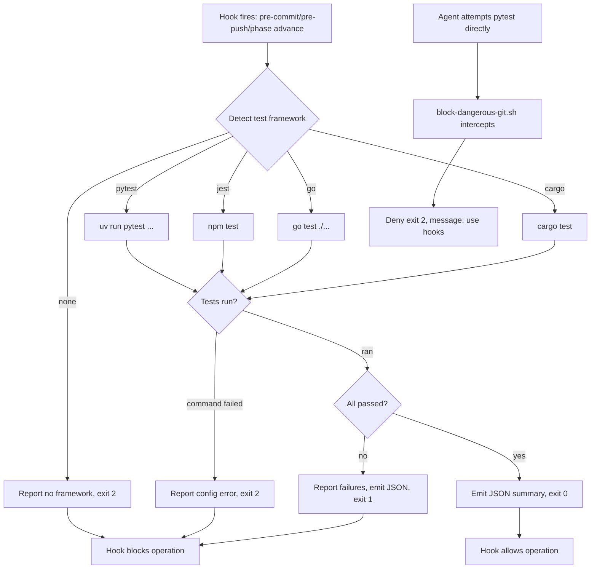

# UC-09 — Run Tests via Hook

Realizes: AG-09

## Primary Actor

git / pre-commit (supporting actor — invoked mechanically by git commit, git push, or `phase advance`)

## Stakeholders & Interests

- **Human Operator** — wants test failures caught immediately and deterministically, before work leaves the local machine or advances to the next phase; never wants to rely on agents correctly running test commands.
- **CLI-Invoked Agent** — wants test commands blocked entirely, so it cannot accidentally skip tests, misinterpret results, or run partial suites believing them complete.
- **Downstream phase's agent** — wants the guarantee that code reaching its phase has already passed full test validation; never has to decide whether to re-run tests itself.

## Trigger

One of three mechanical hooks fires:

- `pre-commit` (git commit) — runs changed-file subset for fast feedback
- `pre-push` (git push) — runs full suite as the "ready to share" gate
- `phase advance` evaluates `script_exit_zero: factory/scripts/run-tests --full` as an entry condition *(requires T-03 implementation)*

## Preconditions

- The project has a detectable test framework (`pyproject.toml` with pytest, `package.json` with jest, `go.mod`, or `Cargo.toml`).
- The test framework is runnable (dependencies installed, no config errors).
- For `phase advance` invocation: the FSM declares a `script_exit_zero` entry condition referencing `factory/scripts/run-tests`.

## Main Success Scenario

1. Hook invokes `factory/scripts/run-tests` with `--changed-only` (pre-commit) or `--full` (pre-push, phase advance).
2. `run-tests` detects the test framework from project structure markers (BR-023).
3. `run-tests` constructs the appropriate test command (`uv run pytest`, `npm test`, `go test ./...`, or `cargo test`) with framework-specific quiet/fast flags.
4. `run-tests` runs the command, streaming stderr to the terminal for real-time progress.
5. All tests pass.
6. `run-tests` emits JSON summary on stdout: `{"passed": N, "failed": 0, "skipped": K, "duration_ms": T}`.
7. `run-tests` exits `0`.
8. Hook allows the git operation (commit/push) or phase advance to proceed.

## Extensions

- **2a. No test framework detected**
  - 2a1. `run-tests` reports `ERROR: No test framework detected` on stderr, listing checked markers.
  - 2a2. `run-tests` exits `2`.
  - 2a3. Hook blocks the operation; phase advance refuses with "script_exit_zero unmet".
- **3a. Test framework detected but command fails (config error, missing dependencies)**
  - 3a1. `run-tests` reports the command's stderr output directly.
  - 3a2. `run-tests` exits `2`.
  - 3a3. Hook blocks; operator must fix config or install dependencies.
- **5a. One or more tests fail**
  - 5a1. `run-tests` streams test failures to stderr as they occur (framework-native output).
  - 5a2. `run-tests` emits JSON summary: `{"passed": N, "failed": M, "skipped": K, "duration_ms": T}` where M > 0.
  - 5a3. `run-tests` exits `1`.
  - 5a4. Hook blocks the operation with clear error message: "Tests failed. Fix failures and retry."
- **1a. Agent attempts to run test command directly (e.g., `pytest .`)**
  - 1a1. `block-dangerous-git.sh` intercepts the command at `PreToolUse` (before execution).
  - 1a2. Hook denies (exit `2`), reports: "Test execution blocked. Tests run via hooks only (pre-commit/pre-push/phase advance)."
  - 1a3. CLI surfaces the denial to the agent; command never executes (BR-024).
- **1b. Human operator commits with failing tests**
  - 1b1. Pre-commit hook runs `--changed-only` mode, fails (extension 5a).
  - 1b2. Commit is blocked; operator sees test output and failure count.
  - 1b3. Operator can use `git commit --no-verify` to bypass (discouraged but available for WIP).
- **1c. Human operator pushes with failing tests**
  - 1c1. Pre-push hook runs `--full` mode, fails (extension 5a).
  - 1c2. Push is blocked; no bypass flag available — pre-push is the "ready to share" boundary.
  - 1c3. Operator must fix tests locally before push succeeds.
- **1d. Human operator commits only documentation changes**
  - 1d1. Pre-commit hook inspects staged files.
  - 1d2. No files in `src/` or `test/`/`tests/` directories are present.
  - 1d3. Test hook is skipped; commit proceeds without running tests (BR-029).
  - 1d4. This avoids wasteful test execution on docs/config-only commits.

## Postconditions

- **Success Guarantee**: when `run-tests` exits `0`, the test suite (full or subset) passed at the moment of invocation; the git operation or phase advance is allowed.
- **Minimal Guarantee**: on failure (exit `1` or `2`), the operation is blocked, stderr shows which tests failed or what error occurred, and the operator/FSM knows validation is unmet.

## Business Rules

- **BR-023**: Framework detection checks in order: `pyproject.toml` (pytest), `package.json` (jest/npm test), `go.mod` (go test), `Cargo.toml` (cargo test). First match wins; no framework → exit `2`.
- **BR-024**: Test commands (`pytest`, `npm test`, `go test`, `cargo test`, and their common variants) are added to `block-dangerous-git.sh`'s deny patterns; agents receive an exit `2` denial before execution, with a message directing them to rely on hook output instead.
- **BR-025**: `--changed-only` mode uses framework-specific fast filters (pytest `--lf` for last-failed, jest `--onlyChanged`, etc.); exact implementation per framework.
- **BR-026**: `--full` mode runs the complete suite with no filtering; used by pre-push and phase advance gates where partial runs are insufficient.
- **BR-027**: JSON summary format is `{"passed": int, "failed": int, "skipped": int, "duration_ms": int}` on stdout; all progress/error output goes to stderr only, never mixed with JSON.
- **BR-029**: Pre-commit hook only triggers test execution when files in `src/` or `test/`/`tests/` directories are modified; documentation-only or configuration-only commits skip test execution entirely.

## Activity Diagram



## Acceptance Criteria

```gherkin
Feature: Run tests via unavoidable hooks

  Scenario: Pre-commit runs changed-file tests and passes
    Given a project with pytest configured
    And all changed files have passing tests
    When the operator runs git commit
    Then run-tests is invoked with --changed-only
    And pytest runs the subset of tests
    And run-tests exits 0
    And the commit succeeds

  Scenario: Pre-commit blocks commit on test failure
    Given a project with pytest configured
    And one changed file has a failing test
    When the operator runs git commit
    Then run-tests is invoked with --changed-only
    And pytest reports the failing test on stderr
    And run-tests exits 1
    And the commit is blocked

  Scenario: Pre-push runs full suite and blocks on failure
    Given a project with jest configured
    And the full test suite has 2 failing tests
    When the operator runs git push
    Then run-tests is invoked with --full
    And npm test runs the complete suite
    And run-tests exits 1
    And the push is blocked

  Scenario: Phase advance refuses when tests fail
    Given a marker ready to advance to IMPLEMENTATION
    And the target state has entry_conditions: tests_pass (script_exit_zero)
    And the full test suite has failures
    When phase advance evaluates entry conditions
    Then run-tests is invoked with --full
    And run-tests exits 1
    And phase advance reports tests_pass as unmet
    And the marker is left unchanged

  Scenario: Agent blocked from running tests directly
    Given an agent session with pytest available
    When the agent attempts to execute pytest .
    Then block-dangerous-git.sh intercepts at PreToolUse
    And the command is denied with exit 2
    And the agent sees message: "Tests run via hooks only"
    And pytest never executes

  Scenario: No test framework detected
    Given a project with no pyproject.toml, package.json, go.mod, or Cargo.toml
    When run-tests is invoked
    Then run-tests reports "No test framework detected" on stderr
    And run-tests exits 2
    And the invoking hook blocks the operation
```

## Referenced from

- [actor-goal-list.md](../actor-goal-list.md)
- [prd.md § FR-I](../prd.md#fr-i--test-execution-run-tests)
- [docs/proposals/implemented/test-execution-via-hooks.md](../../proposals/implemented/test-execution-via-hooks.md)
