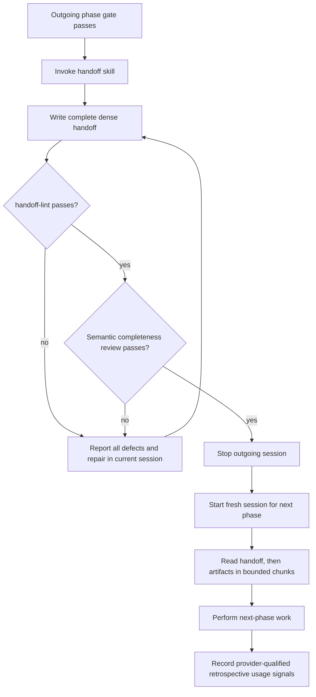

# UC-11 — Cross a Phase Boundary Without Transcript Replay

Realizes: AG-11

## Primary Actor

Phase Participant — the human or factory agent completing the outgoing phase.

## Stakeholders & Interests

- **Outgoing phase participant** — wants to finish with a compact restart contract that loses no material information.
- **Incoming phase participant** — wants only the durable context required for its phase, not the prior transcript.
- **Human Operator** — wants multi-phase input cost bounded and omissions caught mechanically before the old session stops.
- **Parent agent** — wants child results available in full when needed without injecting their full text into every later turn.
- **Handoff Semantic Reviewer** — wants a structurally valid document and the outgoing phase's durable evidence available for a focused completeness comparison.

## Trigger

The current Factory workflow phase has met its exit gate and the next action belongs to a different phase.

## Preconditions

- The outgoing phase's required artifacts and gate evidence exist on disk.
- Any child result needed downstream has been persisted in canonical tracked report or finding artifacts.
- The repository's current branch and exact 40-character HEAD SHA can be determined.

## Main Success Scenario

1. The outgoing participant invokes the Factory-owned `handoff` skill.
2. The skill writes the outgoing phase's artifact paths, decisions, open items, exact HEAD SHA, branch/upstream state, gate and verification evidence, and the next phase's entry action in dense, unambiguous prose (BR-037).
3. `handoff-lint` validates mechanically observable structure, declared fields, SHA syntax, and referenced artifact paths (BR-038).
4. The designated Handoff Semantic Reviewer compares the handoff with the outgoing phase artifacts, decisions, open items, and evidence, and confirms that no material information was omitted or distorted (BR-049).
5. The outgoing session stops; it does not enter the next phase (BR-039).
6. A fresh session starts for the next phase and reads the handoff first.
7. The incoming participant reads referenced artifacts in bounded chunks, requesting further chunks only when its task requires them (BR-041).
8. When a child agent is used, the child persists its complete result before returning; the parent receives only the bounded result envelope (BR-040).
9. At session end, usage capture records provider-qualified retrospective cache and early/late-phase input signals (BR-042).

## Extensions

- **3a. The handoff is structurally incomplete, contains a malformed SHA, or references a missing artifact**
  - 3a1. `handoff-lint` exits non-zero and reports every detected defect.
  - 3a2. The current session remains responsible for correction and does not close the phase.
- **4a. Semantic review finds an omitted or distorted decision, open item, evidence item, or artifact reference**
  - 4a1. The reviewer rejects semantic completeness and identifies the omission or distortion.
  - 4a2. The current session corrects the handoff and repeats structural validation and semantic review before stopping.
- **5a. The next work remains in the same Factory phase**
  - 5a1. No handoff or restart is required; the participant continues in the current session.
- **8a. A child cannot persist its complete result**
  - 8a1. The child returns a failure disposition identifying the missing artifact obligation; its full prose is not substituted into the parent transcript.
- **9a. The runtime exposes no cache metric**
  - 9a1. Capture records the unavailable metric as unavailable and retains CLI/provider identity; it does not infer a value or alter the live session.

## Postconditions

- **Success Guarantee**: the next phase begins in a fresh session from a mechanically lint-clean handoff whose semantic completeness has been reviewed against durable phase evidence; no prior transcript or verbatim child result is replayed.
- **Minimal Guarantee**: if validation or artifact persistence fails, the outgoing session does not claim the boundary is complete.

## Business Rules

- **BR-037**: handoff compression removes wording, never informational detail; all decisions, open items, artifact paths, exact 40-character SHAs, branch/upstream state, gate results, verification evidence, and the next action survive.
- **BR-038**: `handoff-lint` is deterministic and blocks phase closure for mechanically observable defects: missing required sections or declared fields, missing declared referenced paths, malformed full SHAs, malformed or absent declared repository-state and verification fields, or a missing next action. It does not claim to infer undeclared decisions, evidence, or references.
- **BR-049**: a designated Handoff Semantic Reviewer compares the lint-clean handoff with outgoing phase artifacts, decisions, open items, and evidence. Only that semantic review may confirm the losslessness invariant or reject an omission or distortion.
- **BR-039**: every Factory phase transition is a hard stop/restart boundary; only work that stays within one phase is exempt.
- **BR-040**: a child persists its complete result in canonical tracked artifacts before returning a bounded envelope containing disposition, finding counts by severity, the complete artifact-path list, and a one-to-three-sentence next action.
- **BR-041**: large-file reads are chunked and on demand; the workflow defines no prose-only cache-restabilisation ritual.
- **BR-042**: cache-miss count, cache-miss input, and late/early input ratio are session-end, retrospective-only signals qualified by CLI/provider; they never trigger live control in the first release.

## Activity Diagram



## Acceptance Criteria

```gherkin
Feature: Cross a Factory phase boundary without transcript replay

  Scenario: A validated handoff starts the next phase in a fresh session
    Given the requirements phase gate passed
    And all required artifacts are tracked
    When the outgoing participant invokes handoff
    Then handoff-lint validates required structure, declared paths, exact HEAD SHA syntax, declared repository-state and verification fields, and next-action presence
    And a designated semantic reviewer compares the handoff with the phase artifacts, decisions, open items, and evidence
    And the outgoing session stops
    And a fresh review session begins by reading the handoff and referenced artifacts

  Scenario: Missing information blocks phase closure
    Given a handoff references a missing artifact
    When handoff-lint validates it
    Then handoff-lint exits non-zero and reports the defect
    And the outgoing session remains responsible for correction

  Scenario: Structural validation cannot certify an undeclared omission
    Given a handoff satisfies every structural rule
    But it omits a material decision recorded in the outgoing phase artifacts
    When handoff-lint validates it
    Then handoff-lint may pass because the omission is not mechanically observable
    But the designated semantic reviewer rejects semantic completeness
    And the outgoing session corrects and revalidates the handoff before stopping

  Scenario: A child result enters the parent as a bounded envelope
    Given a child agent has completed a review
    When the child returns to its parent
    Then its complete result already exists in canonical tracked artifacts
    And the parent receives disposition, severity counts, every artifact path, and a one-to-three-sentence next action
    And the parent does not receive the full finding text in the envelope

  Scenario: Cache evidence stays retrospective and provider-qualified
    Given a CLI session ends with usage data available
    When usage capture derives session signals
    Then it records cache-miss turns, cache-miss input, late-to-early input ratio, and CLI/provider identity
    And none of those values interrupts or controls the completed session

  Scenario: Full cache capability yields deterministic metrics
    Given provider "p" exposes complete per-turn input and cache-read tokens
    And chronological eligible turns are (100 input, 0 cache), (120 input, 20 cache), (300 input, 0 cache), and (400 input, 40 cache)
    When usage capture derives session signals
    Then cache-miss turn count is 2
    And cache-miss input-token total is 400
    And the early partition is the first turn
    And the late partition is the last turn
    And late-versus-early input ratio is 4.0

  Scenario: Input-only capability leaves cache signals null
    Given a provider exposes complete per-turn input but no per-turn cache-read field
    And chronological eligible turn inputs are 100, 200, and 300
    When usage capture derives session signals
    Then cache-miss turn count is null
    And cache-miss input-token total is null
    And late-versus-early input ratio is 3.0

  Scenario: No complete per-turn input leaves every derived signal null
    Given a provider exposes only session-total input or has a missing per-turn input value
    When usage capture derives session signals
    Then cache-miss turn count, cache-miss input-token total, and late-versus-early input ratio are null

  Scenario: Full cache capability with no misses stores zeros
    Given a provider exposes complete eligible turns (100 input, 10 cache) and (200 input, 20 cache)
    When usage capture derives session signals
    Then cache-miss turn count is 0
    And cache-miss input-token total is 0
    And late-versus-early input ratio is 2.0

  Scenario: A zero early denominator makes only the ratio null
    Given a provider exposes complete eligible turns (0 input, 0 cache) and (200 input, 0 cache)
    When usage capture derives session signals
    Then late-versus-early input ratio is null
```

## Referenced Artifacts

- [PRD § FR-K](../prd.md#fr-k--session-transcript-token-control)
- [System use cases](system-use-cases.md#phase-boundary-and-context-control)
- [Interface contracts](../supplementary_specs/interface-contracts.md#factoryscripts-handoff-lint)
- [Validation rules](../supplementary_specs/validation-rules.md#phase-handoff-and-result-envelope-br-037br-042)
- [Accepted session-control proposal](../../proposals/proposal-session-transcript-token-control.md)
