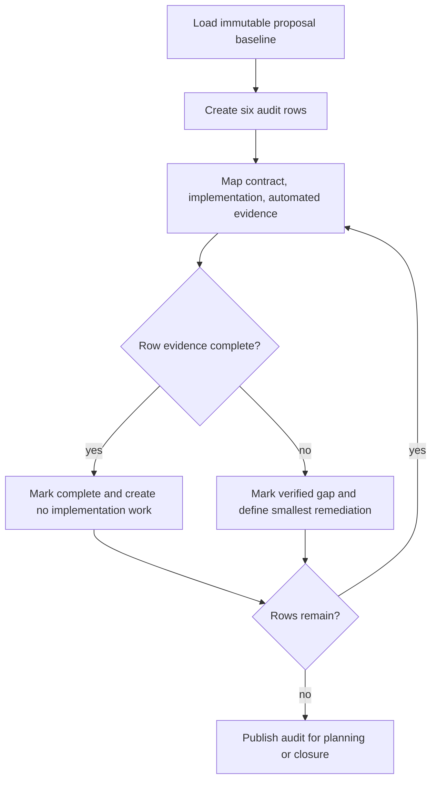

# UC-12 — Audit Dispatch Safeguard Assurance

Realizes: AG-12

## Primary Actor

Assurance Auditor — a requirements, planning, or quality participant evaluating the accepted dispatch baseline.

## Stakeholders & Interests

- **Human Operator** — wants proof that doomed child runs are stopped early and contaminated work cannot merge.
- **Implementation planner** — wants stories only for verified gaps, never retrospective reimplementation of delivered behavior.
- **Dispatched agent** — wants one consistent contract for base verification, reply routing, permissions, scope, checkpoints, and merge readiness.

## Trigger

The accepted dispatch-efficiency proposal enters feature planning or completion review.

## Preconditions

- Immutable proposal baseline `5219c64b6586b7606df346cac668d128bd3c21fe` is available.
- Current rulebooks, runtime implementations, and automated tests are inspectable.
- Existing behavior is treated as the delivered baseline, not presumed missing.

## Main Success Scenario

1. The auditor creates one audit-matrix row for each of the six accepted mechanisms (BR-043).
2. For each row, the auditor records the shipped contract, runtime implementation point, and automated evidence.
3. The auditor verifies exact full-SHA handling, halt-before-work behavior, pre-merge blocking modes, nested reply routing, unattended argv and deny lists, and scope/checkpoint evidence as applicable (BR-044…BR-047).
4. Every row with complete evidence is marked `complete` and creates no implementation work (BR-048).
5. Every row missing contract, implementation, or adequate evidence is marked `verified gap`, with the smallest remediation needed to complete that row.
6. Contradictory documentation is corrected to observable behavior; the accepted design origin remains unchanged.
7. The auditor publishes the completed traceability audit for planning or closure.

## Extensions

- **3a. A base preflight allows source access before rejecting a stale or wrong base**
  - 3a1. The row is a verified gap because halt-before-work evidence is incomplete (BR-045).
- **3b. Pre-merge tests do not cover one accepted blocking mode**
  - 3b1. The row is a verified evidence gap limited to the missing stale, scope, blowout, or target-revert case (BR-046).
- **3c. Scope or checkpoint discipline cannot be mechanically enforced**
  - 3c1. The auditor records enforceable automated evidence where feasible and contract evidence for the remainder; inability to automate prose judgment does not imply reimplementation (BR-048).
- **4a. Documentation says a complete safeguard is absent**
  - 4a1. The auditor amends the contradictory documentation and leaves implementation untouched.
- **5a. Evidence is ambiguous**
  - 5a1. The row remains `verified gap`; the auditor does not infer completion or prescribe broader work than the missing evidence justifies.

## Postconditions

- **Success Guarantee**: every accepted mechanism has an auditable `complete` or `verified gap` disposition backed by exact evidence, and only verified gaps can enter planning.
- **Minimal Guarantee**: no already-complete safeguard is converted into retrospective implementation work.

## Business Rules

- **BR-043**: the audit contains one evidence row for each accepted mechanism.
- **BR-044**: machine-consumed SHAs are exact 40-character object names.
- **BR-045**: base-preflight evidence proves halt before source reads, writes, or commits.
- **BR-046**: pre-merge evidence covers stale, out-of-scope, blowout, and target-reverting diffs.
- **BR-047**: nested addressing and unattended permission evidence exercise resolvable identities and actual launch arguments.
- **BR-048**: complete rows create no reimplementation work; verified gaps receive only the smallest remediation.

Canonical detail is in [validation-rules.md § Dispatch safeguard assurance](../supplementary_specs/validation-rules.md#dispatch-safeguard-assurance-br-043br-048).

## Activity Diagram



## Acceptance Criteria

```gherkin
Feature: Audit delivered dispatch safeguards without retrospective reimplementation

  Scenario: A delivered safeguard is closed by evidence
    Given a safeguard has a shipped contract and implementation
    And automated tests cover its accepted failure modes
    When the auditor evaluates its row
    Then the row is marked complete
    And no implementation story is created for that safeguard

  Scenario: Missing negative-path coverage becomes a narrow verified gap
    Given premerge-check implements all accepted blocking modes
    But automated evidence omits target-reverting diffs
    When the auditor evaluates the pre-merge row
    Then the row is marked verified gap
    And the remediation is limited to the missing target-revert coverage

  Scenario: A wrong declared base halts before work
    Given a child receives an exact 40-character expected base SHA that is not its actual base
    When the base preflight runs as its first action
    Then it fails before source reads, writes, or commits
    And the audit records the contract, implementation point, and passing evidence

  Scenario: Non-mechanical scope discipline uses contract evidence
    Given a checkpoint rule is documented but not fully machine-enforceable
    When the auditor evaluates its row
    Then the row records contract evidence and available automated evidence
    And the auditor does not infer that the safeguard must be reimplemented
```

## Referenced Artifacts

- [PRD § FR-L](../prd.md#fr-l--dispatch-safeguard-assurance-audit)
- [System use cases](system-use-cases.md#dispatch-safeguard-assurance)
- [Validation rules](../supplementary_specs/validation-rules.md#dispatch-safeguard-assurance-br-043br-048)
- [Accepted dispatch-efficiency proposal](../../proposals/implemented/agent-dispatch-token-efficiency.md)
