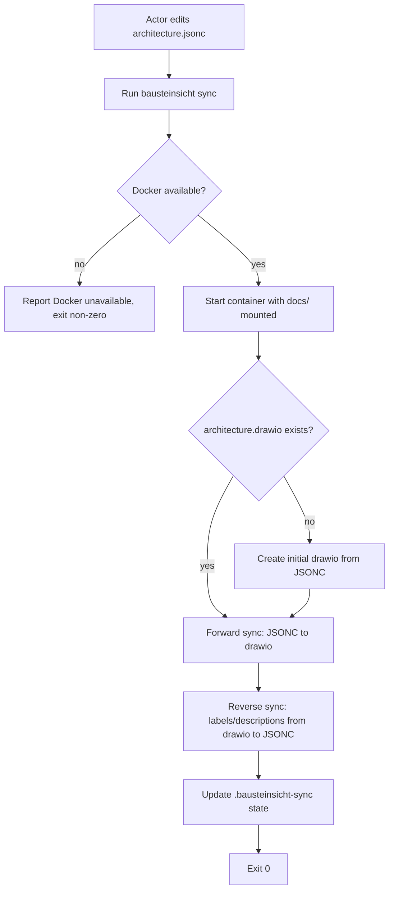

# UC-13 — Synchronize Model and Diagram

Realizes: AG-13

## Primary Actor

Architecture Author

## Stakeholders & Interests

- **Architecture Author** — wants the draw.io diagram to reflect the current JSONC model after structural edits, and wants any label or description fixes made in draw.io to flow back into the JSONC model, without manual reconciliation.
- **Human Reviewer** — wants layout adjustments and label fixes made in draw.io to persist in the JSONC model after the next sync, so the visual artifact and the source of truth stay aligned.
- **Architecture Reviewer** — wants to see the current model state rendered in draw.io after proposing structural changes via JSONC patches.

## Trigger

The actor runs `factory/scripts/bausteinsicht sync` after editing the JSONC model, or after a Human Reviewer has edited the draw.io file.

## Preconditions

- `factory/` is present in the project (via `init-factory`).
- Docker daemon is running on the host.
- `docs/arc42/architecture.jsonc` exists.
- `docs/arc42/architecture.drawio` exists (or will be created on first sync from a JSONC-only state).

## Main Success Scenario

1. Actor edits `docs/arc42/architecture.jsonc` — adds, renames, or removes elements, relationships, or views.
2. Actor runs `factory/scripts/bausteinsicht sync`.
3. The wrapper script starts the Docker container with `docs/` volume-mounted.
4. Bausteinsicht performs a forward sync: structural changes from the JSONC model propagate to the draw.io diagram.
5. Bausteinsicht performs a reverse sync: label and description text edits from the draw.io diagram propagate back to the JSONC model (BR-051).
6. The sync state file (`.bausteinsicht-sync`) is updated to record the synchronization point.
7. The wrapper script exits `0`.
8. Actor verifies the draw.io diagram reflects the structural changes and the JSONC model contains any label corrections.

## Extensions

- **3a. Docker daemon is not running**
  - 3a1. The wrapper script reports that Docker is unavailable and exits non-zero.
- **4a. First sync from a JSONC-only state (no draw.io file)**
  - 4a1. Bausteinsicht creates an initial `architecture.drawio` from the JSONC model.
  - 4a2. The sync continues normally from step 6.
- **5a. A Human Reviewer has added a structural element in draw.io (not just labels)**
  - 5a1. Reverse sync carries back any label and description changes.
  - 5a2. The structural addition remains in draw.io only; it does not appear in JSONC (BR-051).
  - 5a3. `bausteinsicht validate` (run separately or via the pre-commit hook) will report the structural inconsistency between draw.io and JSONC.

## Postconditions

- **Success Guarantee**: the JSONC model and draw.io diagram are structurally consistent with respect to the JSONC-as-source-of-truth invariant (BR-050). Label and description text matches between both files. The sync state file records the synchronization point.
- **Minimal Guarantee**: on any failure, the JSONC model is unchanged from its state before the sync attempt. The draw.io file may be partially updated; the next successful sync will reconcile.

## Business Rules

- **BR-050**: The JSONC model (`architecture.jsonc`) is the single source of truth for architectural structure: elements, relationships, views, and constraints. The draw.io file (`architecture.drawio`) owns layout and visual arrangement.
- **BR-051**: Reverse sync carries back only label and description text from draw.io to JSONC. Element creation, deletion, and structural renaming flow forward only, from JSONC to draw.io. Known limitation: no `--reverse-mode=labels-only` flag in the first release; enforcement via `bausteinsicht validate` detecting structural inconsistencies.
- **BR-052**: Factory agents work in the JSONC model exclusively. An agent never edits the draw.io file directly.
- **BR-053**: All Bausteinsicht operations run inside a Docker container via the `factory/scripts/bausteinsicht` wrapper. The Factory does not install the Bausteinsicht binary directly on the host.

## Activity Diagram



## Acceptance Criteria

```gherkin
Feature: Synchronize architecture model and diagram

  Scenario: Forward sync after adding a component
    Given architecture.jsonc contains a new component "PaymentGateway"
    And architecture.drawio does not yet contain "PaymentGateway"
    When the actor runs bausteinsicht sync
    Then architecture.drawio contains "PaymentGateway"
    And the wrapper exits 0

  Scenario: Reverse sync carries back a label edit
    Given architecture.drawio has been edited to rename "PaymentGateway" label to "Payment Gateway"
    And architecture.jsonc still has the label "PaymentGateway"
    When the actor runs bausteinsicht sync
    Then architecture.jsonc contains the label "Payment Gateway"
    And the wrapper exits 0

  Scenario: Structural addition in drawio does not create JSONC element
    Given a Human Reviewer has drawn a new component "Audit" in architecture.drawio
    And architecture.jsonc has no element named "Audit"
    When the actor runs bausteinsicht sync
    Then architecture.jsonc still has no element named "Audit"
    And bausteinsicht validate reports a structural inconsistency

  Scenario: First sync creates initial drawio
    Given architecture.jsonc exists with a valid model
    And architecture.drawio does not exist
    When the actor runs bausteinsicht sync
    Then architecture.drawio is created
    And it contains all elements from architecture.jsonc

  Scenario: Docker unavailable
    Given Docker daemon is not running
    When the actor runs bausteinsicht sync
    Then the wrapper reports Docker is unavailable
    And it exits non-zero
```

## Referenced from

- [actor-goal-list.md](../actor-goal-list.md)
- [prd-architecture-modeling.md](../prd-architecture-modeling.md)
