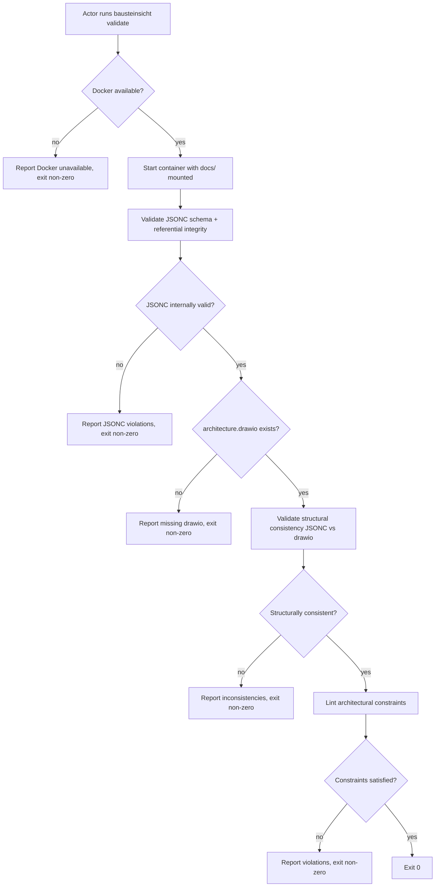

# UC-14 — Validate Model Consistency

Realizes: AG-14

## Primary Actor

Architecture Author, Architecture Reviewer

## Stakeholders & Interests

- **Architecture Author** — wants to know whether the JSONC model is internally consistent, whether it agrees with the draw.io diagram, and whether declared architectural constraints hold, before committing or handing off for review.
- **Architecture Reviewer** — wants to verify model correctness and constraint satisfaction as part of the architecture review workflow.
- **`arch-lint`** (downstream consumer) — delegates model-specific validation to `bausteinsicht validate` and `bausteinsicht lint` while retaining its own Factory-specific checks (BR-059).

## Trigger

The actor runs `factory/scripts/bausteinsicht validate` explicitly, or `arch-lint` invokes it as a delegate.

## Preconditions

- `docs/arc42/architecture.jsonc` exists.
- Docker daemon is running on the host.

## Main Success Scenario

1. Actor runs `factory/scripts/bausteinsicht validate`.
2. The wrapper script starts the Docker container with `docs/` volume-mounted.
3. Bausteinsicht validates the JSONC model's internal consistency (well-formed JSON, valid schema, referential integrity of relationships and views).
4. Bausteinsicht validates structural consistency between the JSONC model and `architecture.drawio` (every JSONC element present in draw.io, no orphaned draw.io elements not in JSONC).
5. Bausteinsicht runs `lint` to check architectural constraints declared in the `constraints` array of the JSONC model (BR-056).
6. Both checks pass. The wrapper exits `0`.
7. Actor proceeds with confidence that the model is consistent and constraints are satisfied.

## Extensions

- **3a. The JSONC model has schema violations or referential integrity errors**
  - 3a1. Bausteinsicht reports every violation with the element or relationship in error.
  - 3a2. The wrapper exits non-zero.
- **4a. Structural inconsistency between JSONC and draw.io**
  - 4a1. Bausteinsicht reports the specific inconsistencies: elements in one file but not the other, relationships that do not match.
  - 4a2. The wrapper exits non-zero.
- **5a. One or more architectural constraints are violated**
  - 5a1. Bausteinsicht reports each constraint violation with the violating element or relationship.
  - 5a2. The wrapper exits non-zero.
- **4b. `architecture.drawio` does not exist**
  - 4b1. Bausteinsicht reports that the draw.io diagram is missing.
  - 4b2. The wrapper exits non-zero (the actor should run `sync` first to create it).
- **2a. Docker daemon is not running**
  - 2a1. The wrapper script cannot start the Docker container (BR-053).
  - 2a2. The wrapper reports Docker is unavailable and exits non-zero without modifying any files.
  - 2a3. The actor starts Docker and retries.
- **6a. `arch-lint` invoked instead of `bausteinsicht validate` directly**
  - 6a1. `arch-lint` runs `bausteinsicht validate` and `bausteinsicht lint` as delegates (BR-059).
  - 6a2. `arch-lint` then runs its own Factory-specific checks (arc42 chapter coupling, ADR format, image staleness).
  - 6a3. The overall result is the union of both: `arch-lint` fails if either Bausteinsicht validation or its own checks fail.

## Postconditions

- **Success Guarantee**: the JSONC model is internally consistent, structurally consistent with the draw.io diagram, and all declared constraints are satisfied.
- **Minimal Guarantee**: on failure, every detected violation is reported in one run; no silent partial validation.

## Business Rules

- **BR-053**: All Bausteinsicht operations run inside a Docker container via the `factory/scripts/bausteinsicht` wrapper. The Factory does not install the Bausteinsicht binary directly on the host.
- **BR-056**: `bausteinsicht validate` checks structural consistency between the JSONC model and the draw.io diagram. `bausteinsicht lint` checks architectural constraints declared in the JSONC model's `constraints` array. Both must pass for validation to succeed.
- **BR-059**: `arch-lint` delegates model-specific checks to `bausteinsicht validate` and `bausteinsicht lint`, retaining its own Factory-specific checks (arc42 chapter coupling, ADR format, image staleness).

## Activity Diagram



## Acceptance Criteria

```gherkin
Feature: Validate architecture model consistency

  Scenario: Consistent model passes validation
    Given architecture.jsonc is well-formed and complete
    And architecture.drawio matches the JSONC structure
    And all declared constraints are satisfied
    When the actor runs bausteinsicht validate
    Then the wrapper exits 0

  Scenario: JSONC schema violation is reported
    Given architecture.jsonc has a relationship referencing a nonexistent element
    When the actor runs bausteinsicht validate
    Then the output reports the referential integrity error
    And the wrapper exits non-zero

  Scenario: Structural drift between JSONC and drawio is caught
    Given a Human Reviewer added a component in architecture.drawio
    And that component does not exist in architecture.jsonc
    When the actor runs bausteinsicht validate
    Then the output reports the orphaned draw.io element
    And the wrapper exits non-zero

  Scenario: Constraint violation is reported
    Given architecture.jsonc declares a constraint forbidding direct dependencies on a database component
    And a relationship violates that constraint
    When the actor runs bausteinsicht validate
    Then the output reports the constraint violation
    And the wrapper exits non-zero

  Scenario: arch-lint delegates to bausteinsicht
    Given architecture.jsonc exists
    When the actor runs arch-lint
    Then arch-lint runs bausteinsicht validate and bausteinsicht lint
    And arch-lint also runs its own Factory-specific checks

  Scenario: Docker unavailable blocks validation
    Given architecture.jsonc exists
    And Docker daemon is not running
    When the actor runs bausteinsicht validate
    Then the wrapper reports Docker is unavailable
    And the wrapper exits non-zero
```

## Referenced from

- [actor-goal-list.md](../actor-goal-list.md)
- [prd-architecture-modeling.md](../prd-architecture-modeling.md)
