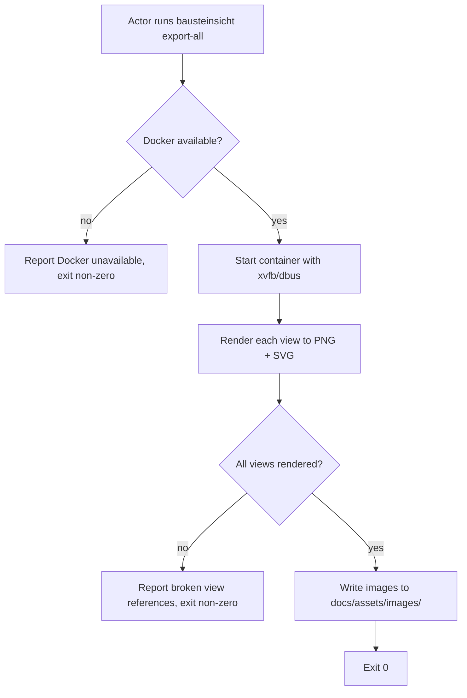

# UC-15 — Export Architecture Views

Realizes: AG-15

## Primary Actor

Architecture Author

## Stakeholders & Interests

- **Architecture Author** — wants every view defined in the JSONC model rendered as PNG and SVG images in the standard location, so arc42 chapters can embed them with stable image references.
- **Arc42 chapters** — depend on images at `docs/assets/images/` with predictable filenames derived from view names.

## Trigger

The actor runs `factory/scripts/bausteinsicht export-all`, `export-png`, or `export-svg` after model edits and a successful sync.

## Preconditions

- `docs/arc42/architecture.jsonc` exists with at least one view defined.
- `docs/arc42/architecture.drawio` exists and is synced with the JSONC model.
- Docker daemon is running on the host.

## Main Success Scenario

1. Actor runs `factory/scripts/bausteinsicht export-all`.
2. The wrapper script starts the Docker container with `docs/` volume-mounted and the draw.io headless environment (xvfb, dbus) initialized.
3. Bausteinsicht renders each view defined in the JSONC model to both PNG and SVG.
4. The rendered images are written to `docs/assets/images/`, overwriting any previous exports for those views (BR-057).
5. The wrapper exits `0`.
6. Actor verifies the images match the current model and commits them alongside the JSONC and draw.io files.

## Extensions

- **1a. Actor runs `export-png` or `export-svg` instead of `export-all`**
  - 1a1. Only the single requested format is rendered; the other format's images are not touched.
  - 1a2. The rest of the scenario proceeds identically from step 2.
- **3a. A view references elements that do not exist in the model**
  - 3a1. Bausteinsicht reports the broken view reference and skips that view.
  - 3a2. The wrapper exits non-zero if any view could not be rendered.
- **2a. Docker daemon is not running**
  - 2a1. The wrapper reports Docker is unavailable and exits non-zero.

## Postconditions

- **Success Guarantee**: every view in the JSONC model has a corresponding PNG and SVG (or the requested single format) in `docs/assets/images/`. The images reflect the current model state.
- **Minimal Guarantee**: on failure, existing images are untouched for views that could not be rendered; successfully rendered views are written to disk.

## Business Rules

- **BR-053**: All Bausteinsicht operations run inside a Docker container via the wrapper script.
- **BR-057**: Exported images are written to `docs/assets/images/`. Arc42 chapters embed them with relative image references to this path.

## Activity Diagram



## Acceptance Criteria

```gherkin
Feature: Export architecture views as images

  Scenario: All views exported as PNG and SVG
    Given architecture.jsonc defines views "SystemContext" and "Containers"
    And architecture.drawio is synced
    When the actor runs bausteinsicht export-all
    Then docs/assets/images/ contains SystemContext.png, SystemContext.svg, Containers.png, Containers.svg
    And the wrapper exits 0

  Scenario: Single-format export produces only that format
    Given architecture.jsonc defines a view "SystemContext"
    When the actor runs bausteinsicht export-png
    Then docs/assets/images/ contains SystemContext.png
    And no SVG file is written for that view
    And the wrapper exits 0

  Scenario: Broken view reference is reported
    Given architecture.jsonc defines a view referencing a deleted element
    When the actor runs bausteinsicht export-all
    Then the output reports the broken view
    And the wrapper exits non-zero
```

## Referenced from

- [actor-goal-list.md](../actor-goal-list.md)
- [prd-architecture-modeling.md](../prd-architecture-modeling.md)
