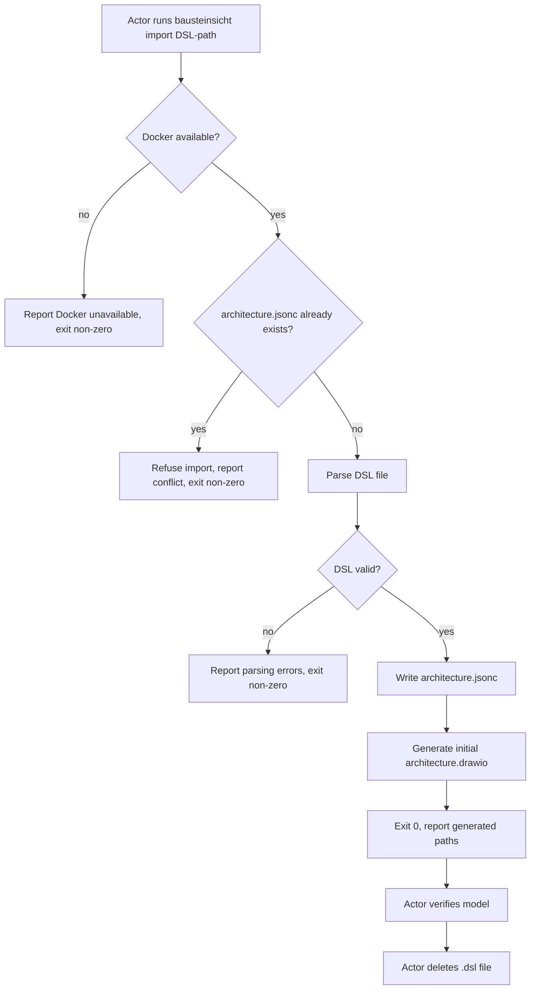

# UC-16 — Migrate from Structurizr DSL

Realizes: AG-16

## Primary Actor

Human Operator

## Stakeholders & Interests

- **Human Operator** — wants to migrate an existing Factory project from the Structurizr DSL pipeline to the JSONC + draw.io workflow in one step, with a clear verification point before deleting the DSL file.
- **Architecture Author** — wants the migrated model to be complete and valid, so ongoing architecture work can proceed on the JSONC model immediately after migration.

## Trigger

The actor runs `factory/scripts/bausteinsicht import <path-to-dsl-file>`.

## Preconditions

- An existing `architecture.dsl` file exists (typically at `docs/arc42/architecture.dsl`).
- `docs/arc42/architecture.jsonc` does not yet exist (the import produces it).
- Docker daemon is running on the host.

## Main Success Scenario

1. Actor runs `factory/scripts/bausteinsicht import docs/arc42/architecture.dsl`.
2. The wrapper script starts the Docker container with `docs/` volume-mounted.
3. Bausteinsicht reads the Structurizr DSL file and converts the model (elements, relationships, views, deployment nodes) to JSONC format.
4. Bausteinsicht writes `docs/arc42/architecture.jsonc`.
5. Bausteinsicht generates an initial `docs/arc42/architecture.drawio` from the new JSONC model.
6. The wrapper exits `0` and reports the paths of the generated files.
7. Actor verifies the migrated model: reviews the JSONC for completeness, opens the draw.io file to inspect the initial layout, and runs `bausteinsicht validate` to confirm consistency.
8. After successful verification, actor manually deletes the `.dsl` file (BR-058).

## Extensions

- **3a. The DSL file has syntax errors or unsupported constructs**
  - 3a1. Bausteinsicht reports the specific parsing errors.
  - 3a2. The wrapper exits non-zero.
  - 3a3. No output files are written.
- **4a. `architecture.jsonc` already exists at the target path**
  - 4a1. The wrapper refuses the import to avoid overwriting an existing model.
  - 4a2. The wrapper exits non-zero with a message naming the conflicting file.
- **7a. Validation after import reports issues**
  - 7a1. The actor fixes the JSONC model manually or re-runs import with a corrected DSL.
  - 7a2. This is a manual verification step; the import itself does not automatically validate.

## Postconditions

- **Success Guarantee**: `architecture.jsonc` and `architecture.drawio` exist and are structurally consistent. The JSONC model contains all elements, relationships, and views from the original DSL. The `.dsl` file still exists until the actor deletes it after verification.
- **Minimal Guarantee**: on failure, no output files are written; the original `.dsl` file is untouched.

## Business Rules

- **BR-053**: All Bausteinsicht operations run inside a Docker container via the wrapper script.
- **BR-058**: Migration via `bausteinsicht import` is a one-time operation. After verification, the `.dsl` file is deleted manually by the actor; the import command does not delete it.

## Activity Diagram



## Acceptance Criteria

```gherkin
Feature: Migrate from Structurizr DSL

  Scenario: Successful migration from DSL
    Given docs/arc42/architecture.dsl exists with a valid model
    And docs/arc42/architecture.jsonc does not exist
    When the actor runs bausteinsicht import docs/arc42/architecture.dsl
    Then docs/arc42/architecture.jsonc is created
    And docs/arc42/architecture.drawio is created
    And bausteinsicht validate exits 0 against the new files
    And the wrapper exits 0

  Scenario: DSL with syntax errors
    Given architecture.dsl has a syntax error
    When the actor runs bausteinsicht import architecture.dsl
    Then the output reports the parsing error
    And no output files are written
    And the wrapper exits non-zero

  Scenario: Import refused when JSONC already exists
    Given docs/arc42/architecture.jsonc already exists
    When the actor runs bausteinsicht import docs/arc42/architecture.dsl
    Then the wrapper reports the conflict
    And it exits non-zero
    And the existing architecture.jsonc is not modified

  Scenario: Original DSL file is not deleted by import
    Given a successful import has completed
    Then docs/arc42/architecture.dsl still exists
    And the actor deletes it manually after verification
```

## Referenced from

- [actor-goal-list.md](../actor-goal-list.md)
- [prd-architecture-modeling.md](../prd-architecture-modeling.md)
