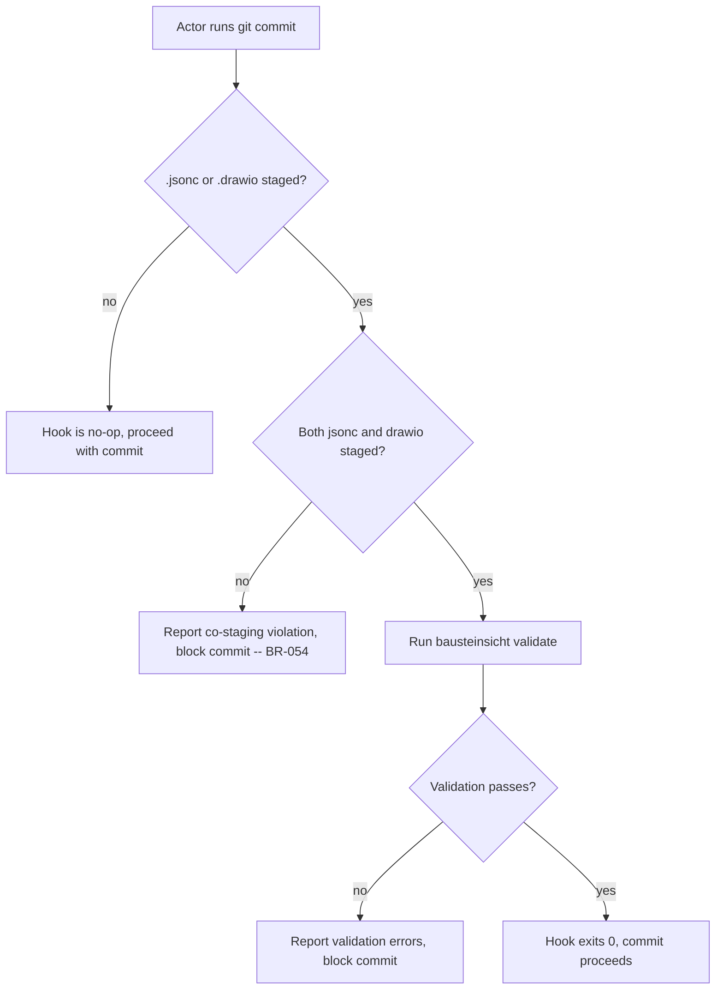

# UC-17 — Validate Architecture Artifacts at Commit Time

Realizes: AG-17

## Primary Actor

Architecture Author, Human Reviewer

## Stakeholders & Interests

- **Architecture Author** — wants to be stopped before committing JSONC and draw.io files that are out of sync or violate constraints, catching problems at commit time rather than in review.
- **Human Reviewer** — wants layout and label edits made in draw.io to be validated against the JSONC model before committing, ensuring the draw.io changes do not introduce structural drift.
- **Architecture Reviewer** — wants the guarantee that every committed architecture snapshot is internally consistent, because review begins from a consistent baseline.

## Trigger

The actor runs `git commit` with `.jsonc` or `.drawio` files in the staging area. The pre-commit hook fires automatically.

## Preconditions

- `init-factory` has been run, which installs the pre-commit hook configuration (see [UC-08](UC-08-initialize-agent-factory-into-a-project.md)).
- Docker daemon is running on the host.

## Main Success Scenario

1. Actor stages `architecture.jsonc` and `architecture.drawio` together.
2. Actor runs `git commit`.
3. The pre-commit hook fires, detects `.jsonc` or `.drawio` files in the staging area (BR-055).
4. The hook verifies co-staging: both `architecture.jsonc` and `architecture.drawio` are staged (BR-054).
5. The hook runs `bausteinsicht validate` to verify structural consistency and constraint satisfaction (BR-056).
6. Validation passes.
7. The hook exits `0`, allowing the commit to proceed.

## Extensions

- **3a. No `.jsonc` or `.drawio` files are staged**
  - 3a1. The architecture validation hook does not fire (BR-055).
  - 3a2. Other pre-commit hooks proceed normally; this hook is a no-op.
- **4a. Only `architecture.jsonc` is staged without `architecture.drawio` (or vice versa)**
  - 4a1. The hook reports the co-staging violation, naming the missing file (BR-054).
  - 4a2. The hook exits non-zero, blocking the commit.
  - 4a3. The actor stages the missing file and retries the commit.
- **5a. `bausteinsicht validate` reports structural inconsistencies**
  - 5a1. The hook reports every validation error from Bausteinsicht.
  - 5a2. The hook exits non-zero, blocking the commit.
  - 5a3. The actor runs `bausteinsicht sync` to reconcile, then retries the commit.
- **5b. `bausteinsicht validate` reports constraint violations**
  - 5b1. The hook reports every constraint violation.
  - 5b2. The hook exits non-zero, blocking the commit.
  - 5b3. The actor fixes the constraint violations in the JSONC model, syncs, and retries.
- **5c. Docker daemon is not running**
  - 5c1. The hook cannot run `bausteinsicht validate` (BR-053).
  - 5c2. The hook reports Docker is unavailable and exits non-zero, blocking the commit.
  - 5c3. The actor starts Docker and retries the commit.

## Postconditions

- **Success Guarantee**: the commit contains architecture artifacts that are co-staged, structurally consistent between JSONC and draw.io, and satisfy all declared constraints.
- **Minimal Guarantee**: on any validation failure, the commit is blocked. No inconsistent architecture snapshot enters the repository.

## Business Rules

- **BR-054**: The pre-commit hook rejects a commit when `architecture.jsonc` is staged without `architecture.drawio`, or vice versa (co-staging enforcement).
- **BR-055**: The pre-commit hook fires conditionally — only when files matching `*.jsonc` or `*.drawio` under `docs/arc42/` appear in the staging area. Files with those extensions outside `docs/arc42/` do not trigger the hook. Commits without architecture files pass through without invoking Bausteinsicht validation.
- **BR-056**: `bausteinsicht validate` checks structural consistency between the JSONC model and the draw.io diagram. `bausteinsicht lint` checks architectural constraints declared in the JSONC model's `constraints` array. Both must pass for the pre-commit hook to allow the commit.

## Activity Diagram



## Acceptance Criteria

```gherkin
Feature: Validate architecture artifacts at commit time

  Scenario: Properly co-staged and consistent artifacts pass
    Given architecture.jsonc and architecture.drawio are both staged
    And the two files are structurally consistent
    And all constraints are satisfied
    When the actor runs git commit
    Then the pre-commit hook exits 0
    And the commit succeeds

  Scenario: Missing co-staged file blocks commit
    Given architecture.jsonc is staged
    And architecture.drawio is not staged
    When the actor runs git commit
    Then the pre-commit hook reports that architecture.drawio must be co-staged
    And the commit is blocked

  Scenario: Structural inconsistency blocks commit
    Given architecture.jsonc and architecture.drawio are both staged
    But draw.io contains a component not in the JSONC model
    When the actor runs git commit
    Then the pre-commit hook reports the structural inconsistency
    And the commit is blocked

  Scenario: Commits without architecture files are unaffected
    Given only docs/arc42/01_introduction.md is staged
    And no .jsonc or .drawio files are staged
    When the actor runs git commit
    Then the architecture validation hook does not fire
    And the commit proceeds normally

  Scenario: Constraint violation blocks commit
    Given architecture.jsonc declares a layering constraint
    And a relationship violates that constraint
    And both files are co-staged
    When the actor runs git commit
    Then the pre-commit hook reports the constraint violation
    And the commit is blocked

  Scenario: Docker unavailable blocks commit
    Given architecture.jsonc and architecture.drawio are both staged
    And Docker daemon is not running
    When the actor runs git commit
    Then the pre-commit hook reports Docker is unavailable
    And the commit is blocked
```

## Referenced from

- [actor-goal-list.md](../actor-goal-list.md)
- [prd-architecture-modeling.md](../prd-architecture-modeling.md)
- [UC-08](UC-08-initialize-agent-factory-into-a-project.md) — flow-control spec: `init-factory` wires the pre-commit hook
