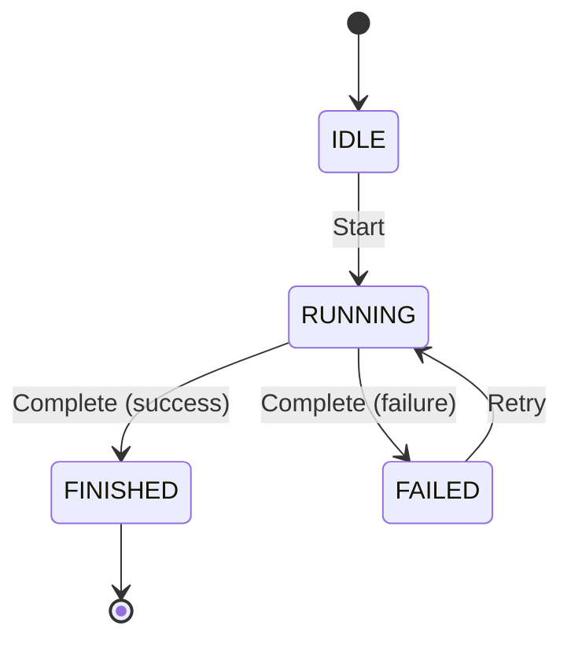

# State Machine Notation

## Canonical Format

Canonical statement: [rules.md § State machine notation](../rules.md#state-machine-notation).

### Required Structure

Skeleton: [state-machine.md template](../templates/state-machine.md).

## Rules

Detail behind the two canonical statements above:

- Every `ChangeState(X)` becomes one edge in the Mermaid diagram, and vice versa — no mismatches, no omitted guards/conditions.
- Pseudocode is authoritative — write it first; never draft Mermaid first and reverse-engineer pseudocode from it, and never use freeform state-transition prose in place of either.
- One `State:` declaration per state, one `On EventName:` per event (guards use `if/else`), Mermaid rendered as `stateDiagram-v2` throughout.

## Enforcement

Pre-commit hook: `statemachine-lint`

- Parses pseudocode blocks
- Extracts all `ChangeState(X)` calls
- Parses corresponding Mermaid `stateDiagram-v2` blocks
- Verifies every transition appears in both
- **Blocks commit** if inconsistent

## Example: Correct Format

### Pseudocode

```text
State: IDLE
On Start:
  ChangeState(RUNNING)

State: RUNNING
On Complete:
  if success
    ChangeState(FINISHED)
  else
    ChangeState(FAILED)

State: FINISHED
  # terminal — no outbound transitions

State: FAILED
On Retry:
  ChangeState(RUNNING)
```

### Derived Mermaid



## Notes

- **Helper actions** (`CleanWorkingTree`, `IngestFindings`, etc.) are domain operations that do NOT affect state — omit from Mermaid
- **Initial/final pseudostates** `[*]` in Mermaid are diagram conventions — no pseudocode equivalent required
- **`RestoreState(var)`** expands to one edge per `SetHaltedFrom(X)` value in the same block
- **Guards** appear as edge labels in Mermaid (e.g., `: Complete (success)`)

## Why This Format?

1. **Deterministic** — Linting can verify consistency
2. **Single source of truth** — Pseudocode drives diagram, not vice versa
3. **LLM-friendly** — Clear, structured format for generation and validation
4. **Version control** — Textual diffs show state transition changes clearly
5. **Executable** — Can be compiled to state machine implementations

## References

- Enforcement: `factory/scripts/statemachine-lint`
- Hook: `.git/hooks/pre-commit` (if configured)

## Referenced from

- [rules.md § State machine notation](../rules.md#state-machine-notation)
- [architecture-agent.md § Workflow](../../agents/architecture-agent.md#workflow)
- [maintain-architecture § Step 5 — Maintain state machine pseudocode](../../skills/maintain-architecture/SKILL.md#step-5--maintain-state-machine-pseudocode)
- [brownfield-onboarding § Step 3.7 — Document State Machines](../../playbooks/brownfield-onboarding.md#step-37--document-state-machines)
