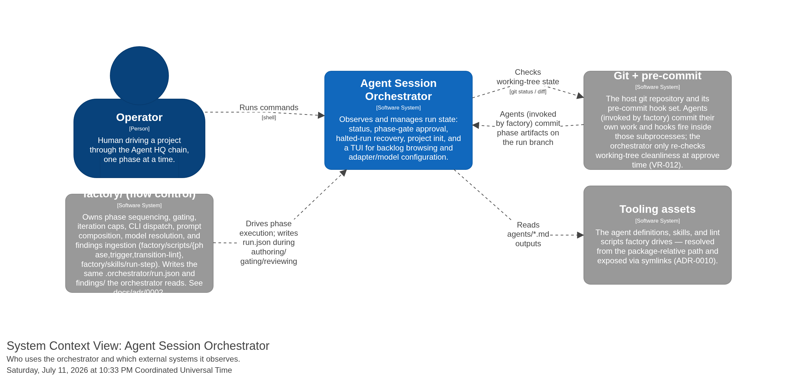

[back to index](README.md)

# 3. System Scope and Context

## 3.1 Business Context

The orchestrator sits between the humans who drive the Agent HQ workflow and the external systems that do the actual work — the AI CLIs, the git/pre-commit gate, and the tooling assets.

| Actor / System                        | Role                                                                                                                                | Interaction                                                                                                                                                                                                                                                                                                     |
| ------------------------------------- | ----------------------------------------------------------------------------------------------------------------------------------- | --------------------------------------------------------------------------------------------------------------------------------------------------------------------------------------------------------------------------------------------------------------------------------------------------------------- |
| **Operator** (person)                 | Observes a run and manages its state; approves at phase gates.                                                                      | Runs `status` / `approve` / `reject` / `abort` / `release` / `init` as direct-mode subcommands, or drives the same functions through the interactive TUI menu (bare `orchestrate`); answers the approval prompt at phase gates. Phase execution (`run-step`/`run-phase`/`resume`) is driven through `factory/`. |
| **AI CLI** (external)                 | Copilot / Claude / Gemini, the engine that runs an agent.                                                                           | `factory/` invokes it non-interactively in a fresh subprocess; the CLI writes phase artifacts to the working tree. The orchestrator does not invoke the CLI — it records the chosen adapter as an operator default.                                                                                             |
| **Git + pre-commit** (external)       | The version-control host and its hook set — the gate bus.                                                                           | `factory/` drives the phase's commits and gate; `pre-commit` runs the hooks (starting with `spec-lint`) as the deterministic gate. The orchestrator re-runs the working-tree gate only to check artifact staleness at approval (VR-012).                                                                        |
| **Tooling assets** (package-relative) | Agent definitions, skills, and lint scripts, resolved from the package path and exposed in target projects via symlinks (ADR-0010). | The orchestrator reads agent front-matter (author/reviewer, `outputs`, `tier`, `interactive`) for registry lookups and display; `factory/` composes prompts and runs the lint scripts as gate hooks.                                                                                                            |

## 3.2 Technical Context

The orchestrator is a single Python CLI process. It reaches the outside world through several channels, each isolated behind a **port** so the core stays CLI-, VCS-, terminal-, and filesystem-agnostic:

| Boundary                  | Direction | Mechanism                                                                                                                                            | Port                             |
| ------------------------- | --------- | ---------------------------------------------------------------------------------------------------------------------------------------------------- | -------------------------------- |
| AI CLI                    | —         | Execution moved to `factory/`; the orchestrator no longer spawns agent subprocesses or dispatches a CLI                                              | —                                |
| Git + pre-commit          | out       | `git` commands: create/select run branch, stage declared paths, commit → hooks run; hook exit code + output map to a `GateResult`                    | `GateRunner`                     |
| Findings store            | in/out    | filesystem directory `findings/`, one JSON file per finding, validated on write                                                                      | `FindingsStore`                  |
| Run state                 | in/out    | filesystem `.orchestrator/run.json` + `run.lock`, written atomically                                                                                 | `RunStateStore`, `RunLock`       |
| Config + adapter registry | in/out    | filesystem `.orchestrator/config.toml` — operator defaults, registered adapters, per-adapter model dictionaries; atomic write-then-rename            | `ConfigStore`, `AdapterRegistry` |
| Terminal (menu mode)      | in/out    | renders one menu/display node at a time; reads keypresses normalised to `KeyEvent`s; framework deferred (T-29)                                       | `MenuRenderer`                   |
| Agent registry            | in        | resolves agents from the package-relative `agents/` path for author/reviewer mapping, declared `outputs`, and `tier`/`interactive`/`skills` metadata | `AgentRegistry`                  |

### Mapping of domain input/output to channels

- A phase's **staged artifact paths** and **completion check** are the author (and reviewer) agent's declared `outputs:` — a single source of truth read via `AgentRegistry`, never a duplicated list (system-use-cases §Phase artifacts, FR-H1, BR-016).
- **Deterministic findings** (`spec-lint --format json`) and **semantic findings** (the reviewer agent) are ingested by `factory/` into the same `Finding` shape and land in the same store; the orchestrator reads that store for its status views (FR-E3).
- The state the orchestrator manages is `.orchestrator/` (run state, lock, config); it reads the shared findings store that `factory/` writes. Everything else (the spec, the arc42 docs, the code) is produced by the agents into the git working tree.

## 3.3 Scope boundary

**Inside** the system: persisting and projecting run state, browsing the backlog, recording approvals at phase gates, re-gating on artifact staleness at approval, and persisting operator defaults. Phase sequencing, the loop policy, prompt composition, CLI dispatch, model resolution, finding IDs and lifecycle, and driving the gate moved to `factory/` (see the repo-root [`docs/spec/prd.md`](../../docs/spec/prd.md) and [ADR-0002](../../docs/adr/0002-factory-owns-flow-control-orchestrator-is-a-trigger.md)).

**Inside**, additionally: an interactive **text** TUI menu that exposes the same functions as direct mode over the same core (UC-08 through UC-12), plus persisted operator defaults and a local adapter registry.

**Outside** the system (explicitly, per NG1–NG5): the agents' and skills' behaviour, general-purpose CI, external ticket trackers, any **graphical** UI (the menu mode is a terminal text UI, not a GUI), and — in the MVP — the full eight-agent chain (the walking skeleton is the requirements phase; see [chapter 4](04_solution_strategy.md)).
