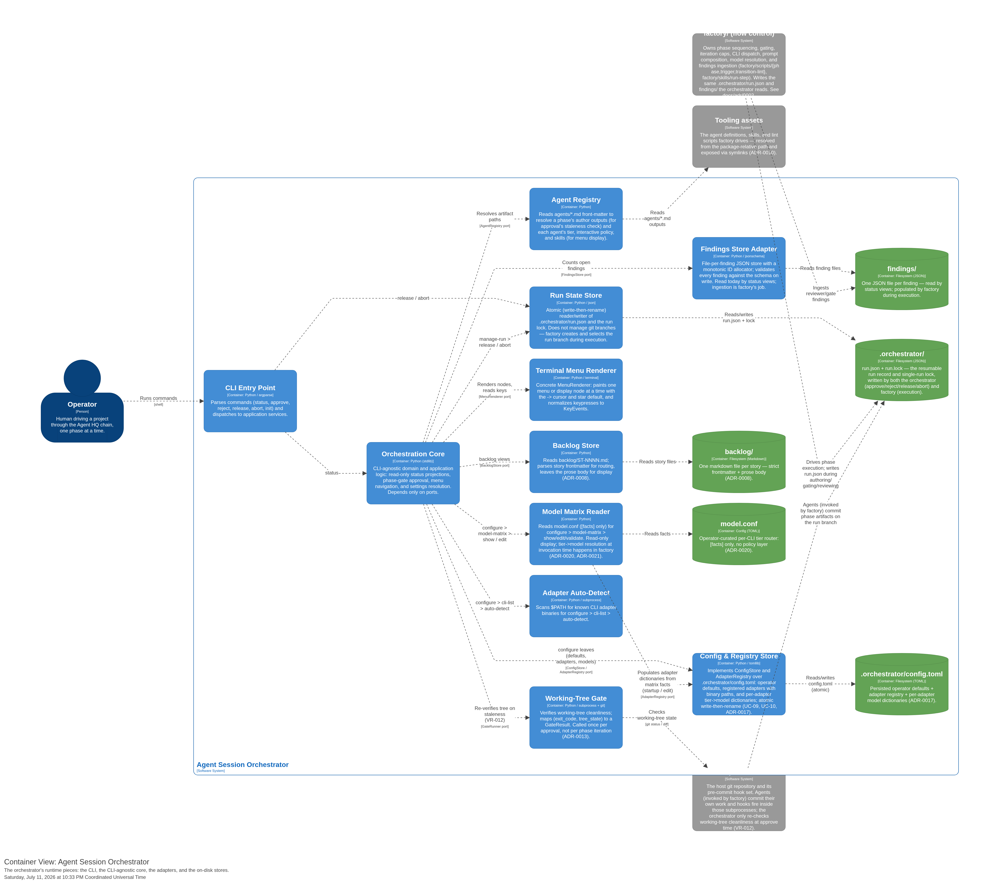
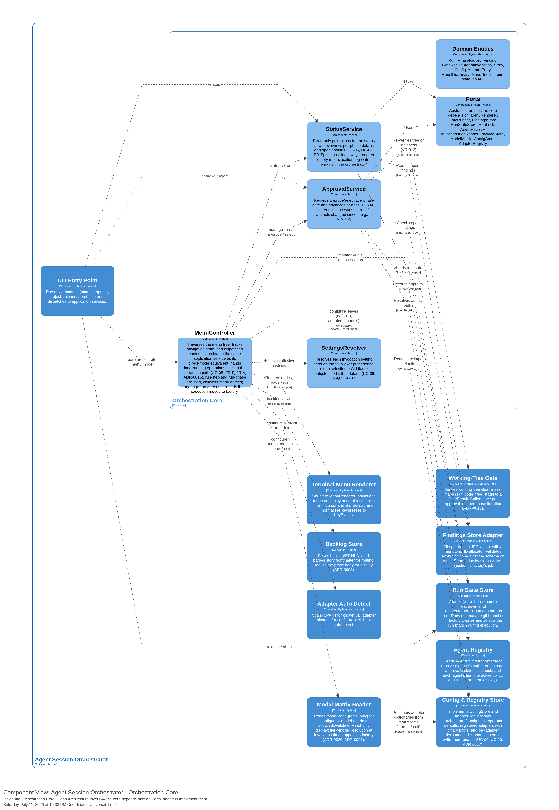

[back to index](README.md)

# 5. Building Block View

## 5.1 Whitebox — Level 1 (Containers)

The orchestrator is one Python process plus its on-disk stores. Internally it is layered per Clean Architecture: the CLI is the composition root, the Orchestration Core holds all decision logic, and the adapters translate the core's ports to concrete CLIs, the terminal, git, and the filesystem. The same process serves two interaction modes — direct-mode subcommands and an interactive TUI menu — over one shared core (ADR-0016).

| Building block              | Responsibility                                                                                                                                                                                                         | Depends on         |
| --------------------------- | ---------------------------------------------------------------------------------------------------------------------------------------------------------------------------------------------------------------------- | ------------------ |
| **CLI Entry Point**         | Parse commands, validate arguments, own exit codes, wire adapters to the core (composition root).                                                                                                                      | Orchestration Core |
| **Orchestration Core**      | CLI-agnostic domain + application logic: run-state projection (status), approval transitions, backlog browsing, settings resolution, and menu navigation. Phase sequencing and the loop moved to `factory/`.           | Ports only         |
| **Working-Tree Gate**       | Verify working-tree cleanliness and map `(exit_code, tree_state)` to a `GateResult` (passed / confabulation / failed). The orchestrator uses it to re-gate at approval; `factory/` uses it inside the phase loop.      | Git                |
| **Findings Store Adapter**  | File-per-finding JSON store; monotonic ID allocator; schema-validate every write.                                                                                                                                      | `findings/`        |
| **Run State Store**         | Atomic read/write of `run.json` + `run.lock`; run-branch management.                                                                                                                                                   | `.orchestrator/`   |
| **Agent Registry**          | Resolve each phase's author/reviewer, their declared `outputs`, and the agent's `tier`, `interactive`, and `skills` metadata from agent front-matter, using the package-relative `agents/` path.                       | Tooling assets     |
| **Terminal Menu Renderer**  | Concrete `MenuRenderer`: paint one menu or display node at a time with the `-> ` cursor and `★` default; normalise keypresses to `KeyEvent`s. Terminal framework deferred (T-29).                                      | —                  |
| **Config & Registry Store** | Implement `ConfigStore` and `AdapterRegistry` over `.orchestrator/config.toml`: operator defaults, registered adapters with binary paths, and per-adapter tier→model dictionaries; atomic write-then-rename.           | `.orchestrator/`   |
| **`findings/`** (data)      | One JSON file per finding — source of truth for findings + loop state; a projection of `docs/findings/*.md`, not a second independent store ([ADR-0019](adr/0019-findings-store-remains-the-loop-source-of-truth.md)). | —                  |
| **`.orchestrator/`** (data) | `run.json` (resumable run record) + `run.lock` (single-run lock) + `config.toml` (operator defaults, adapter registry, model dictionaries).                                                                            | —                  |

The **dependency rule**: arrows from the core to an adapter are dependencies on the adapter's *port*, satisfied at runtime by the concrete adapter injected at the composition root. No core building block imports an adapter.

## 5.2 Whitebox — Orchestration Core (Components)

| Component            | Responsibility                                                                                                                                                                                                                                                                                                                                                                                     | Key rules                                   |
| -------------------- | -------------------------------------------------------------------------------------------------------------------------------------------------------------------------------------------------------------------------------------------------------------------------------------------------------------------------------------------------------------------------------------------------- | ------------------------------------------- |
| **StatusService**    | Read-only projections for the status views — overview, per-phase details, open findings, and the invocation log. Must not mutate state.                                                                                                                                                                                                                                                            | UC-05, UC-08; FR-T; VR-008                  |
| **ApprovalService**  | Records an `approve`/`reject` at a paused gate; approval re-gates if artifacts changed (VR-012), then pauses with `current_phase` advanced to the next phase (whose execution runs in `factory/`) or sets `COMPLETE` on the last phase. Accepts empty-commit phases without requiring a passing gate (FAGAN-0038). Depends on `RunStateStore`, `FindingsStore`, `GateRunner`, and `AgentRegistry`. | UC-04; BR-007/012/013                       |
| **MenuController**   | Traverses the menu tree, holds the navigation state (root → submenu → display), and dispatches each function leaf to the same application service its direct-mode command uses. Mutates no run state during navigation. The `run-step`/`run-phase` nodes are inert — execution moved to `factory/`.                                                                                                | UC-08; FR-P, FR-V; ADR-0016                 |
| **SettingsResolver** | Resolves each invocation setting through the fixed four-layer precedence `menu selection > CLI flag > config.toml > built-in default`, so direct mode and menu mode produce identical effective settings.                                                                                                                                                                                          | UC-09; FR-Q3; SF-07                         |
| **Domain Entities**  | `Run`, `Phase`, `Finding`, `GateResult`, `Approval`, `Story`, `Config`, `AdapterEntry`, `ModelDictionary`, `MenuNode` — pure state, no I/O (see [entity model](spec/supplementary_specs/entity-model.md)). The phase-lifecycle vocabulary (`PhaseStatus`: authoring/gating/reviewing/awaiting-approval) persists as observed state written into `run.json` by `factory/`.                          | SOLID SRP                                   |
| **Ports**            | Abstract interfaces the components call: `GateRunner`, `FindingsStore`, `RunStateStore`, `RunLock`, `AgentRegistry`, `BacklogStore`, `ModelMatrix`, `MenuRenderer`, `ConfigStore`, `AdapterRegistry`, and the read-only `InvocationLogReader`.                                                                                                                                                     | Dependency Inversion, Interface Segregation |

### Phase execution moved to `factory/`

The author→gate→review→loop that drove one phase — prompt composition, CLI dispatch, model resolution, the iteration cap, and findings ingestion — is no longer in the orchestrator. It lives in `factory/`; see the repo-root [`docs/spec/prd.md`](../../docs/spec/prd.md) and [ADR-0002](../../docs/adr/0002-factory-owns-flow-control-orchestrator-is-a-trigger.md). The phase state machine is specified in [`spec/supplementary_specs/state-machines.md`](spec/supplementary_specs/state-machines.md).

The orchestrator observes and manages that lifecycle. It observes: the `authoring`/`gating`/`reviewing`/`awaiting-approval` states persist in `run.json` and back the status views. It mutates the subset it owns: `approve`, `reject`, `release`, and `abort`. When a phase reaches `awaiting-approval` (`mode: paused`), the operator approves through the orchestrator, then runs the next phase through `factory/` (UC-03); there is no automated chain sequencer (`run-all` and unattended auto-approval are deferred, NG6).

## 5.3 Building blocks outside the core (Adapters)

| Adapter                                       | Implements                       | Notes                                                                                                                                                                                                                                                                                                                                               |
| --------------------------------------------- | -------------------------------- | --------------------------------------------------------------------------------------------------------------------------------------------------------------------------------------------------------------------------------------------------------------------------------------------------------------------------------------------------- |
| **FileInvocationLogReader**                   | `InvocationLogReader`            | Reads `.orchestrator/log.jsonl` for the `status > log` view. No adapter writes the log anymore — `factory/` owns invocation logging — so the view degrades to empty when the file is absent. Never read to drive control flow.                                                                                                                      |
| **MarkdownBacklogStore**                      | `BacklogStore`                   | Reads/writes `backlog/ST-NNNN.md` — parses only the YAML frontmatter for routing (id, deps, tier, status, outputs); the prose body is left for the agent (ADR-0008).                                                                                                                                                                                |
| **FileModelMatrix**                           | `ModelMatrix`                    | Reads `model.conf`, the operator-curated per-CLI tier router (`[facts]` only, no policy layer). `factory/` reads it at resolution time; the orchestrator reads it for menu-mode display, and the per-adapter dictionary is a separate local cache for that display, populated on a gap-fill basis (ADR-0020, ADR-0021). Validated by `matrix-lint`. |
| **TomlConfigStore** / **TomlAdapterRegistry** | `ConfigStore`, `AdapterRegistry` | One `.orchestrator/config.toml` holds operator defaults, the adapter registry (name → binary path), and each adapter's tier→model dictionary. Atomic write-then-rename; `unregister()` drops an adapter and its dictionary in one change (ADR-0017). TOML parsing follows the Python-baseline decision (T-28).                                      |
| **TerminalMenuRenderer**                      | `MenuRenderer`                   | Renders `render_menu()`/`render_display()` and returns normalised `KeyEvent`s from `get_keypress()`; the concrete terminal framework is deferred (T-29, ADR-0016). Menu mode falls back to a direct-mode diagnostic on a non-interactive terminal (T-30).                                                                                           |
| **WorkingTreeGate**                           | `GateRunner`                     | Runs `git status --porcelain` and maps `(exit_code, tree_state)` to `GateResult`; can clean a dirty tree (`git checkout . && git clean -fd`). The orchestrator uses it to re-gate at approval; `factory/` drives it inside the phase loop (ADR-0013, VR-026).                                                                                       |
| **FilesystemFindingsStore**                   | `FindingsStore`                  | One JSON file per finding; monotonic ID allocator (`FND-NNNN`); validates against the finding schema on write; supports supersede + open-count queries. Written by `factory/` ingestion; read by the orchestrator's status views.                                                                                                                   |
| **JsonRunStateStore**                         | `RunStateStore`, `RunLock`       | Atomic write-then-rename of `run.json`; lockfile for the single-run invariant; creates/selects the run branch.                                                                                                                                                                                                                                      |
| **MarkdownAgentRegistry**                     | `AgentRegistry`                  | Resolves agents from the package-relative `agents/` path; parses front-matter for `author`/`reviewer`, `outputs`, `tier`, and `interactive`. Rejects an unknown agent name (VR-011).                                                                                                                                                                |

## 5.4 Presentation layer and dual-mode entry

The TUI is a **presentation layer over the existing core, not a second orchestration engine** (NFR-10). A bare `orchestrate` invocation on an interactive terminal enters menu mode; any subcommand runs direct mode unchanged (FR-V). The composition root inspects the terminal and the argument vector, then dispatches either to the `Command Dispatcher` (direct) or the `MenuController` (menu).

Inside menu mode, the `MenuController` walks the menu tree defined by [`cli_specification.md`](spec/cli_specification.md), rendering through the `MenuRenderer` port and resolving effective settings through the `SettingsResolver`. Every **function leaf dispatches to the same application service its direct-mode command uses** (FR-V3), so exit codes, gate behaviour, and run-state mutation are identical across both modes. Navigation, display viewing, and exit gestures mutate no run state (VR-030); only a dispatched leaf may. The `run-step`/`run-phase` nodes are inert — phase execution moved to `factory/`. The concrete terminal framework is deferred (T-29); the architecture commits only to the `MenuRenderer` seam (ADR-0016).
