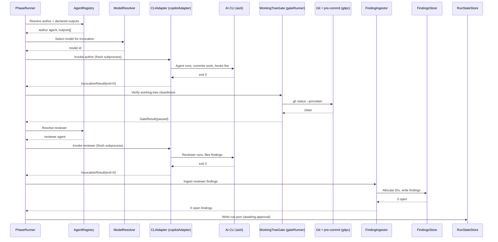
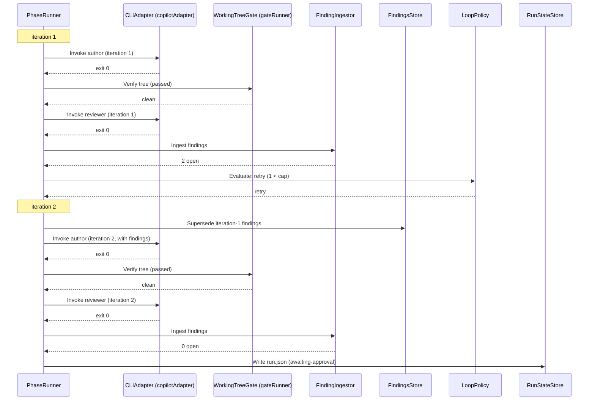
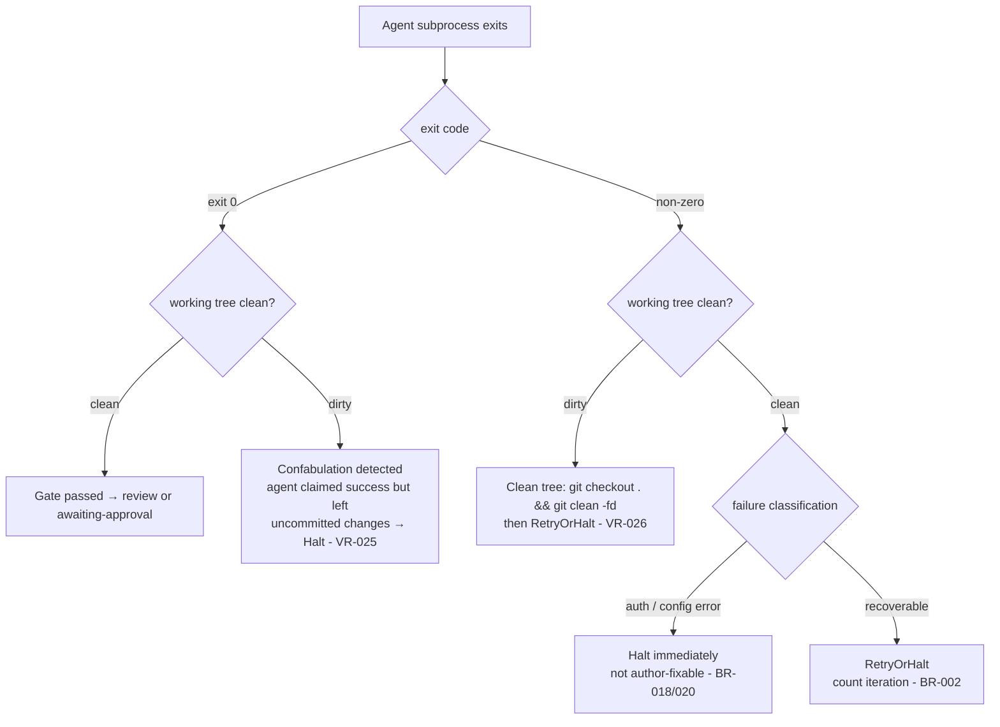
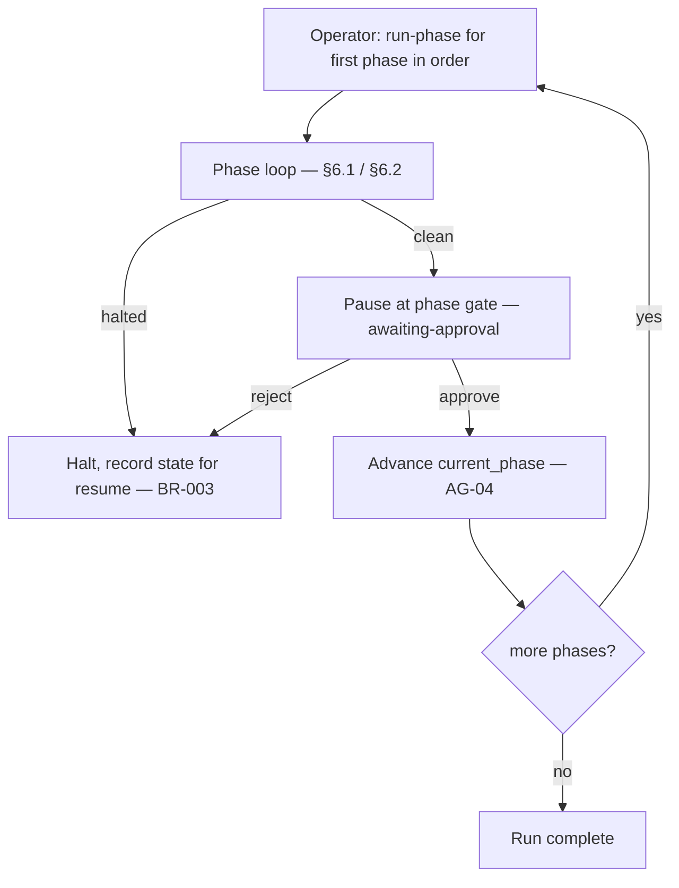
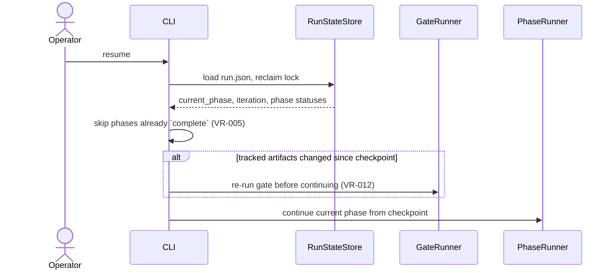
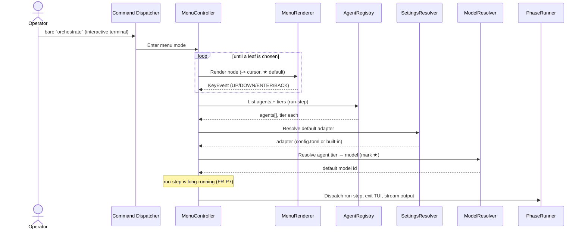

[back to index](README.md)

# 6. Runtime View

The scenarios that exercise the architecture's control flow. The authoritative behaviour is in [`spec/use_cases/`](spec/use_cases/) and the phase state machine in [`spec/supplementary_specs/state-machines.md`](spec/supplementary_specs/state-machines.md).

> **Note.** Scenarios §6.1–§6.5 and the run-step dispatch in §6.7 describe phase execution, which moved out of the orchestrator into `factory/` (see the repo-root [`docs/spec/prd.md`](../../docs/spec/prd.md) and [ADR-0002](../../docs/adr/0002-factory-owns-flow-control-orchestrator-is-a-trigger.md)). The diagrams are retained as the record of that flow; regenerating them for `factory/` is tracked separately. The orchestrator's own runtime is the read-only status projection (§6.6) and the approval, release, and abort transitions it applies to `run.json`.

## 6.1 Run a phase — clean on the first pass (UC-02 main success)

Derived from dynamic view `RunPhaseClean` in [`architecture.dsl`](architecture.dsl).

## 6.2 Loop back on open findings, then clean (UC-02 ext. 8a)

Derived from dynamic view `RunPhaseLoop` in [`architecture.dsl`](architecture.dsl).

## 6.3 Gate outcomes — working-tree verification (ADR-0013)

The working-tree gate replaces the old pre-commit-output-parsing gate. Agents commit inside their subprocess; `pre-commit` hooks fire on each `git commit` within the agent process. The gate only checks the final tree state — it never stages, commits, or parses hook output (ADR-0013). In the phase loop this check runs in `factory/`; the orchestrator re-runs the same working-tree gate only to check artifact staleness at approval.

## 6.4 Drive the chain phase by phase (UC-03)

There is no automated chain sequencer (`run-all` and unattended execution are deferred, NG6). The **Operator** drives the chain manually: run a phase through `factory/` (§6.1/§6.2), `approve` its gate through the orchestrator, then run the next phase through `factory/`. Each phase is one execution of the state machine above; the human is the sequencer between phases.

Each phase reuses the same gate and loop policy in `factory/`; nothing about driving the chain manually changes a phase's internal behaviour. Automated and unattended chain execution return with a messaging channel or Web-UI (NG6, T-36).

## 6.5 Resume an interrupted run (UC-06)

The `resume` command moved to `factory/`; the diagram below records the historical orchestrator flow (repo-root [ADR-0002](../../docs/adr/0002-factory-owns-flow-control-orchestrator-is-a-trigger.md)). The orchestrator retains the run-state store and lock that a resume reads.

## 6.6 Check status (UC-05, read-only)

`status` loads `run.json` through `RunStateStore` and counts `open` findings of the latest iteration through `FindingsStore`, then reports current phase, iteration, open-findings count, last gate result, and run mode. It **must not** mutate run state or the store (VR-008). An absent `run.json` is reported as `idle` — `idle` is never a persisted mode. In menu mode the same projection backs `status > overview`, and `StatusService` adds three further read-only views — per-phase details, open findings, and the invocation log (FR-T) — none of which mutate state (VR-030).

## 6.7 Navigate the TUI to a run-step leaf (UC-08)

Derived from dynamic view `NavigateMenuToRunStep` in [`architecture.dsl`](architecture.dsl). The navigation state machine (root → submenu → display → executing → exited) is specified in [`spec/supplementary_specs/state-machines.md`](spec/supplementary_specs/state-machines.md#tui-menu-navigation-state-machine); this sequence shows one happy path through it. The key invariant: a function leaf reaches the **same** service a direct-mode command would, so behaviour is identical across modes (FR-V3). Note: the `run-step` leaf is now inert — phase execution moved to `factory/` — so the final dispatch runs no agent; the navigation mechanics are unchanged and equally illustrate a status or approval leaf.

Navigation, display viewing, and `q`/`Esc`/`qq` gestures dispatch nothing and mutate no run state (VR-030); only the final leaf does. A non-interactive terminal never enters this flow — the dispatcher prints a direct-mode diagnostic and exits cleanly (FR-V4, T-30).
