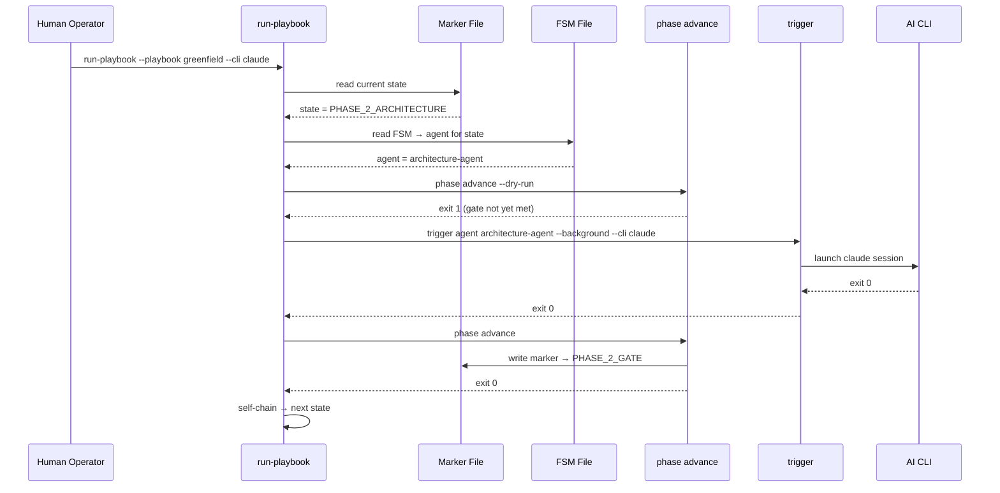
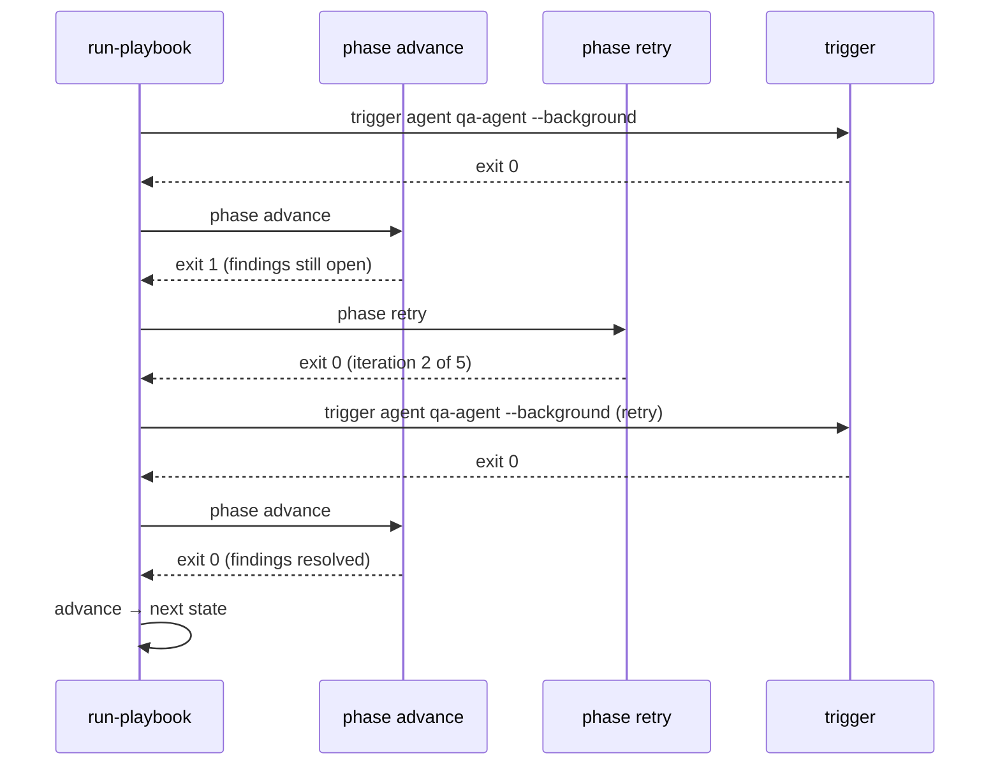
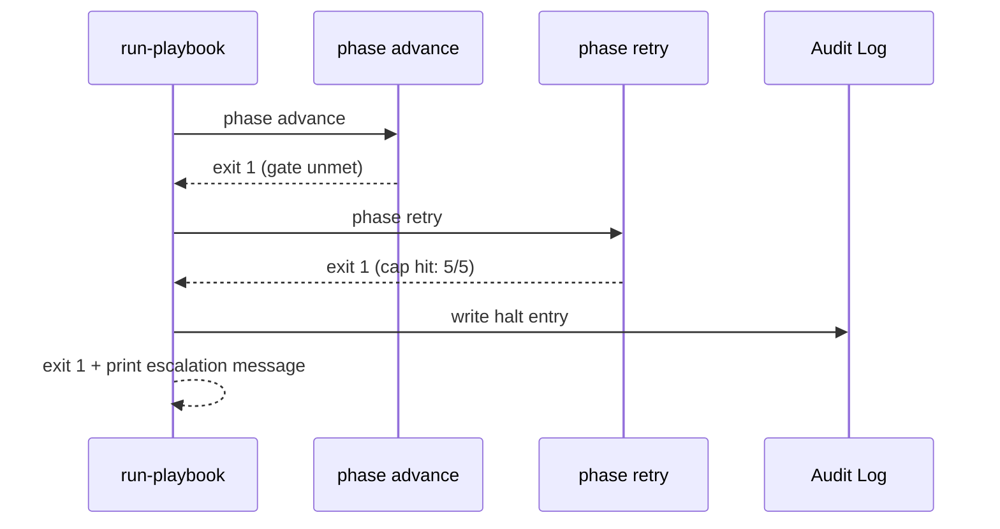
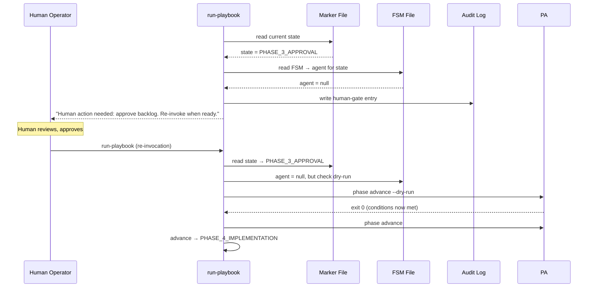

# 6 — Runtime View

## Scenario 1: Normal step (dispatch, gate passes, advance)

```mermaid
sequenceDiagram
    participant H as Human Operator
    participant O as run-playbook
    participant M as Marker File
    participant F as FSM File
    participant PA as phase advance
    participant TR as trigger
    participant CLI as AI CLI

    H->>O: run-playbook --playbook greenfield --cli claude
    O->>M: read current state
    M-->>O: state = PHASE_2_ARCHITECTURE
    O->>F: read FSM → agent for state
    F-->>O: agent = architecture-agent
    O->>PA: phase advance --dry-run
    PA-->>O: exit 1 (gate not yet met)
    O->>TR: trigger agent architecture-agent --background --cli claude
    TR->>CLI: launch claude session
    CLI-->>TR: exit 0
    TR-->>O: exit 0
    O->>PA: phase advance
    PA->>M: write marker → PHASE_2_GATE
    PA-->>O: exit 0
    O->>O: self-chain → next state
```

## Scenario 2: Gate fails, retry allowed

```mermaid
sequenceDiagram
    participant O as run-playbook
    participant PA as phase advance
    participant PR as phase retry
    participant TR as trigger

    O->>TR: trigger agent qa-agent --background
    TR-->>O: exit 0
    O->>PA: phase advance
    PA-->>O: exit 1 (findings still open)
    O->>PR: phase retry
    PR-->>O: exit 0 (iteration 2 of 5)
    O->>TR: trigger agent qa-agent --background (retry)
    TR-->>O: exit 0
    O->>PA: phase advance
    PA-->>O: exit 0 (findings resolved)
    O->>O: advance → next state
```

## Scenario 3: Halt on iteration cap

```mermaid
sequenceDiagram
    participant O as run-playbook
    participant PA as phase advance
    participant PR as phase retry
    participant A as Audit Log

    O->>PA: phase advance
    PA-->>O: exit 1 (gate unmet)
    O->>PR: phase retry
    PR-->>O: exit 1 (cap hit: 5/5)
    O->>A: write halt entry
    O-->>O: exit 1 + print escalation message
```

## Scenario 4: Human gate

```mermaid
sequenceDiagram
    participant H as Human Operator
    participant O as run-playbook
    participant M as Marker File
    participant F as FSM File
    participant A as Audit Log

    O->>M: read current state
    M-->>O: state = PHASE_3_APPROVAL
    O->>F: read FSM → agent for state
    F-->>O: agent = null
    O->>A: write human-gate entry
    O-->>H: "Human action needed: approve backlog. Re-invoke when ready."
    Note over H: Human reviews, approves
    H->>O: run-playbook (re-invocation)
    O->>M: read state → PHASE_3_APPROVAL
    O->>F: agent = null, but check dry-run
    O->>PA: phase advance --dry-run
    PA-->>O: exit 0 (conditions now met)
    O->>PA: phase advance
    O->>O: advance → PHASE_4_IMPLEMENTATION
```
