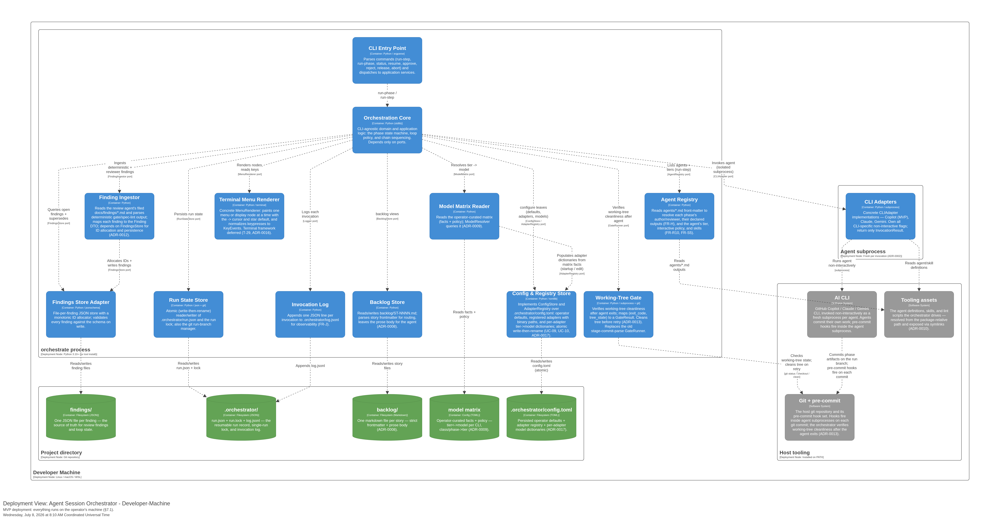

[back to index](README.md)

# 7. Deployment View

## 7.1 MVP — local developer machine

The MVP runs entirely on the operator's machine (NFR-5). There is no server, no container, no network service — the orchestrator is a Python process that spawns CLI subprocesses and reads/writes the local git repository.



The deployment model from [`architecture.dsl`](architecture.dsl) shows three deployment nodes on the developer machine:

- **orchestrate process** (Python 3.10+) — the CLI entry point, orchestration core, and all adapters run in one process. Installed globally via `uv tool install` (ADR-0010).
- **Agent subprocess** — each agent invocation is a fresh OS process (ADR-0002). The CLI adapter spawns it; the agent commits its work; pre-commit hooks fire inside the subprocess (ADR-0013).
- **Project directory** — the git repository containing `findings/`, `.orchestrator/` (including `run.json`, `run.lock`, and `config.toml`), `backlog/`, and the model matrix. All on-disk stores are plain files.

The **host tooling** node shows the external systems: the AI CLI (Copilot/Claude/Gemini), Git + pre-commit, and the tooling assets (agent definitions, skills, scripts).

| Node / Artifact       | Technology                                               | Notes                                                                                                 |
| --------------------- | -------------------------------------------------------- | ----------------------------------------------------------------------------------------------------- |
| `orchestrate` process | Python 3.10+, stdlib + `jsonschema`                      | The whole orchestrator; installed globally as a console entry point via `uv tool install` (ADR-0010). |
| AI CLI binary         | Copilot CLI (MVP), authenticated in the environment (C3) | Invoked non-interactively; a fresh process per agent.                                                 |
| `pre-commit` + git    | host-installed, configured with the phase's hooks (C2)   | `spec-lint` is the requirements-phase hook; later phases add `ruff`/`pytest`.                         |
| `findings/`           | filesystem, JSON files                                   | Committed with the run's artifacts; git-diffable.                                                     |
| `.orchestrator/`      | filesystem, JSON + lockfile                              | Run state and single-run lock; `run.lock` is not committed.                                           |

**Prerequisites** (preconditions from UC-02/UC-03): the host is a git repo with `pre-commit` configured; a CLI adapter is installed and authenticated; the phase's input artifacts exist. Docker is required only for the *architecture* phase's Structurizr diagram export, not for the orchestrator runtime.

## 7.2 Bootstrap from a pristine machine

Getting from a bare laptop to a running `orchestrate` involves three tiers of prerequisite. **`uv`** (see [ADR-0007](adr/0007-uv-environment-and-packaging.md)) provides the entire Python tier; the system tier is irreducibly manual. There is deliberately **no `orchestrate doctor` command in this version** — the operator verifies the system tier against the checklist below (this preflight command was considered and deferred; see [chapter 11](11_risks_and_technical_debt.md)).

### Tier A — System prerequisites (manual — uv cannot provide these)

| Prerequisite                                          | Why                                                                                     | How to verify                                                                                  |
| ----------------------------------------------------- | --------------------------------------------------------------------------------------- | ---------------------------------------------------------------------------------------------- |
| `git`                                                 | The host and every target project is a git repo; the gate is a commit (BR-016).         | `git --version`                                                                                |
| **AI CLI + authentication** (Copilot for the MVP, C3) | The engine that runs each agent; a fresh subprocess per invocation.                     | The CLI's own auth-status check; the adapter surfaces an `auth_error` halt if absent (BR-018). |
| **Docker**                                            | Runs the Structurizr export (`scripts/structurizr`) and lint-script diagram validation. | `docker info`                                                                                  |

### Tier B — Install Agent HQ and the orchestrator (provided by uv)

```bash
# 1. Install uv itself (one step; or via Homebrew / pipx)
curl -LsSf https://astral.sh/uv/install.sh | sh

# 2. Clone Agent HQ
git clone https://github.com/matthiasdaues/agent_hq.git ~/agent_hq

# 3. Install the orchestrator globally
cd ~/agent_hq/orchestrator
uv tool install .             # exposes `orchestrate` as a global command

orchestrate --help             # verify
```

Updating the tooling:

```bash
cd ~/agent_hq && git pull
cd orchestrator && uv tool install .
```

### Tier C — Bootstrap a target project

```bash
orchestrate init my-project --cli copilot
cd my-project
orchestrate --interactive run-phase requirements
```

`orchestrate init` creates the project directory, runs `git init`, creates symlinks (`agents/`, `skills/`, `scripts/` → package-relative paths), scaffolds `docs/spec/`, `docs/adr/`, `docs/reviews/`, `backlog/`, copies `model-matrix.conf`, creates the CLI instruction file, and updates `.gitignore`. See [ADR-0010](adr/0010-separate-tooling-from-project-directory.md) for the full design.

Once Tiers A–C are satisfied, `orchestrate run-phase <phase>` is ready. A missing Tier-A item does not corrupt state: an unauthenticated adapter or a missing/erroring gate hook halts the run with a surfaced reason (BR-015, BR-018), rather than proceeding.

## 7.3 Beyond the MVP — CI / container (deferred, T-08)

Running unattended in CI or a container (the deferred Scheduler actor, NG6) is explicitly out of scope for now — it returns with a messaging channel or Web-UI for remote observation and approval. The architecture keeps this open:

- The `CLIAdapter` port already hides how the CLI is invoked and authenticated, so a CI environment differs only in the concrete adapter's auth handling.
- Bounded cost (NFR-6: per-invocation timeout) and the iteration cap make unattended runs safe by construction.
- Open concerns tracked in T-08: auth in a headless environment, cost ceilings, and how autonomous a run may safely be. These affect deployment and adapter configuration, not the core.
