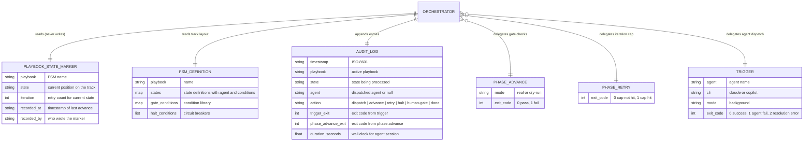

# Entity Model — Orchestrator

The orchestrator reads three external entities and calls three external scripts. It owns no persistent state of its own — the marker is the single source of truth for execution position, and only `phase` writes it.

## Entity responsibilities

| Entity                | Single responsibility                                                   |
| --------------------- | ----------------------------------------------------------------------- |
| Playbook state marker | Where the run currently is (position on the track)                      |
| FSM definition        | What the track looks like (states, transitions, conditions, halts)      |
| Audit log             | What happened during this run (append-only event stream)                |
| phase advance         | Whether a transition is allowed (gate evaluation + marker write)        |
| phase retry           | Whether a retry is allowed (iteration cap enforcement)                  |
| trigger               | How to dispatch an agent (resolution + prompt composition + CLI launch) |

## What the orchestrator does NOT own

- Sequencing logic (owned by `phase advance` via FSM transitions)
- Gate evaluation (owned by `phase advance` via `gate_conditions`)
- Agent resolution and prompt composition (owned by `trigger`)
- The marker file format and writes (owned by `phase`)
- Condition types and their evaluation (owned by `phase`'s `evaluate_condition`)
