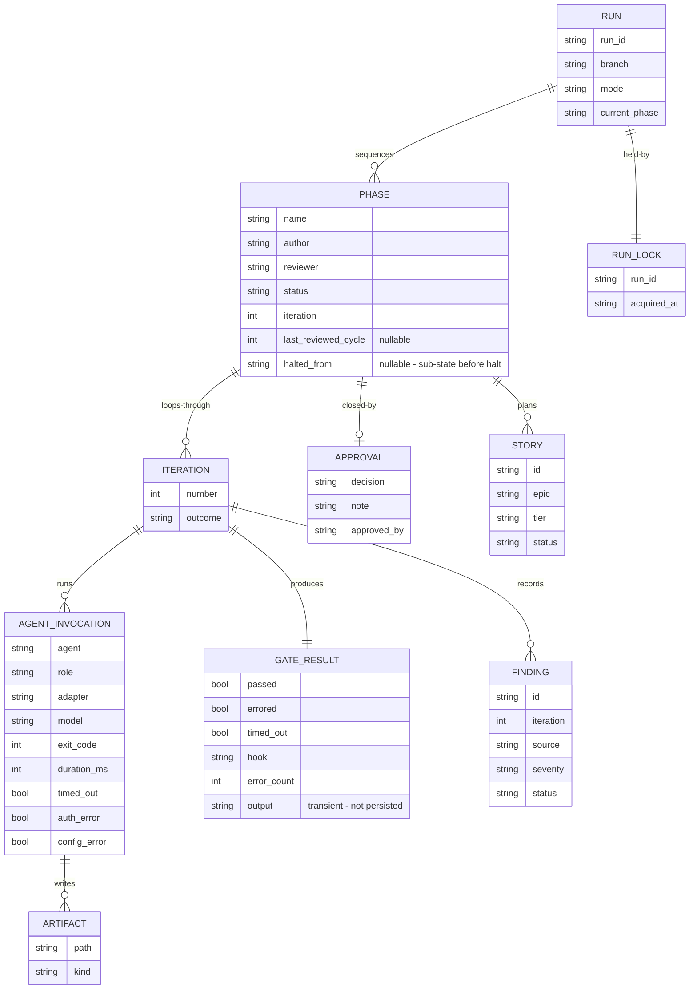
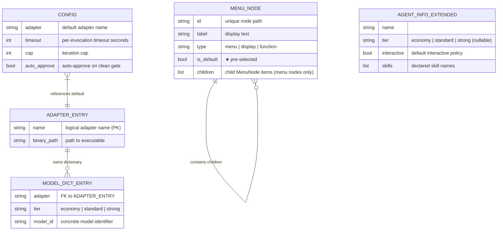

# Entity Model — Agent Session Orchestrator

The domain entities the orchestrator tracks and their relationships. Applying **SOLID** (Single Responsibility): each entity owns one concern of the run's state.

## Notes

- **RUN** is the root; `mode` ∈ {running, paused, halted, complete} — `idle` is the *absence* of a run, never a stored value (UC-05, S-11).
- **RUN_LOCK** enforces the single-active-run invariant (BR-017).
- **PHASE** names its `author` and optional `reviewer` (BR-006); a null reviewer is a gate-only phase. `status` mirrors the lifecycle in [state-machines](state-machines.md). `last_reviewed_cycle` is the review cycle the reviewer most recently ingested for this phase (nullable — null until a review runs); approval and status count open findings on it rather than re-deriving `iteration + 1`, which the empty-commit pause path would otherwise skip past (FAGAN-0040). `halted_from` records the sub-state (authoring, gating, or reviewing) the phase was in before halting; `release` restores this sub-state and resets the iteration count (FR-A7).
- **FINDING** is scoped to the `iteration` that produced it; `status` ∈ {open, superseded, resolved} (BR-014). Full schema in [interface-contracts](interface-contracts.md), rules in [validation-rules](validation-rules.md).
- **GATE_RESULT** represents the working-tree verification after an agent exits. `passed` = working tree clean (all artifacts committed, all pre-commit hooks passed inside the agent). `passed=false` with exit code 0 = confabulation (agent claimed success but left uncommitted work) → halt. `passed=false` with non-zero exit = normal failure → RetryOrHalt. `output` carries the list of dirty files for the failure banner (transient — not persisted to `run.json`).
- **AGENT_INVOCATION** `role` ∈ {author, reviewer}; `auth_error` (BR-018) and `config_error` (BR-020) each drive a halt, distinct from a generic non-zero exit that loops the author.
- **APPROVAL** exists once per phase and only for an approved or rejected gate. Currently represented implicitly by `PhaseRecord.status` transitions (`awaiting-approval → complete` or `halted`) rather than a materialised `Approval` object — the `Approval`, `Artifact`, and `Iteration` dataclasses are defined in `entities.py` for model completeness but are not yet used by application services.
- **STORY** is the planning phase's output unit (one `backlog/ST-NNNN.md` file); its `tier` (`economy | standard | strong`, BR-021) is the model tier for the implementation invocation that builds it — the same field and vocabulary as agent frontmatter's `tier`. Full frontmatter schema in [interface-contracts](interface-contracts.md).
- **AGENT_INVOCATION.model** records the concrete model the invocation ran. At runtime this resolves directly against `model.conf`'s `[facts]` for the declared tier (ADR-0020, ADR-0021), not a run-tracked entity (FR-K). The per-adapter **model dictionary** (`AdapterRegistry.ModelDictionary`) is a local, discoverable cache for menu-mode display, populated from `model.conf` on a gap-fill basis — it is not read at resolution time (ADR-0021 sec 3, T-32).

## TUI Addendum Entities

The TUI addendum introduces persisted operator defaults, a local adapter registry, and an in-memory menu tree used only while the terminal UI is active.

### TUI Addendum

- **CONFIG** is persisted in `.orchestrator/config.toml`; when absent, the orchestrator uses its built-in defaults.
- **ADAPTER_ENTRY** and **MODEL_DICT_ENTRY** together form the adapter registry; the registry is persisted alongside the configuration store.
- **MENU_NODE** is an in-memory abstraction for rendered navigation state and is not persisted. Each menu node holds a list of children; exactly one child per menu may carry `is_default=True` (the pre-selected `★` item). The tree is pure data — no node embeds a service call or terminal logic (ST-0036).
- **AGENT_INFO_EXTENDED** extends the existing `AgentInfo` contract with `tier`, `interactive`, and `skills`, parsed from agent frontmatter.
