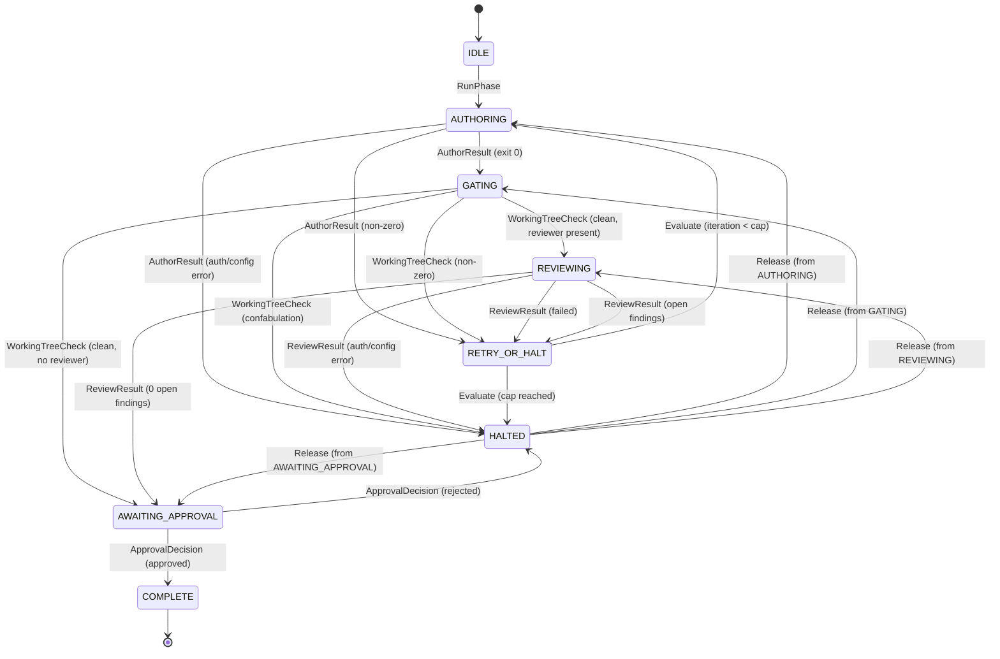
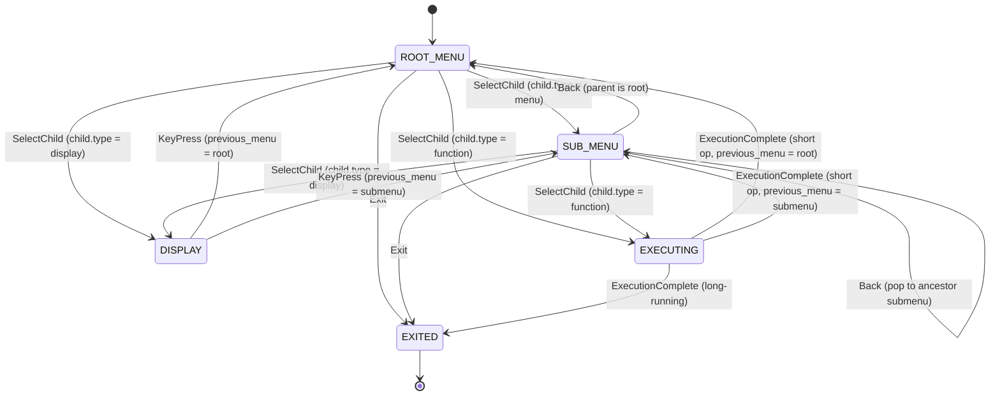

# State Machines — Agent Session Orchestrator

The lifecycle of a single **phase** within a run: the author → gate → review → loop-or-approve control flow from UC-02, including the failure edges (UC-02 extensions) and the reviewer-optional path (BR-006).

> **Scope note (amended 2026-07-12, PhaseRunner collapse):** this state machine is no longer driven by the orchestrator. `PhaseRunner`, which executed exactly this pseudocode, is deleted; `factory/scripts/{phase,trigger}` and `factory/scripts/transition-lint` now drive these transitions. The state vocabulary itself (`AUTHORING`, `GATING`, `REVIEWING`, `RETRY_OR_HALT`, `HALTED`, `AWAITING_APPROVAL`, `COMPLETE`) is unchanged — it is still what `PhaseStatus` persists in `.orchestrator/run.json`, still what `status` reports, and still what the pseudocode and Mermaid diagram below describe (kept in sync per `statemachine-lint`; not edited by this reconciliation pass). The orchestrator's own remaining role in this machine is narrow: `approve`/`reject` transition out of `AWAITING_APPROVAL` and `release` transitions out of `HALTED` — everything else (`RunPhase`, `AuthorResult`, `WorkingTreeCheck`, `ReviewResult`, `Evaluate`) is factory's. See the repo-root `docs/spec/prd.md` and `docs/adr/0002-factory-owns-flow-control-orchestrator-is-a-trigger.md`.

## Notation

State machines use the **canonical event-driven pseudocode** as the single source of truth. Mermaid diagrams MUST be derived from the pseudocode; the `statemachine-lint` pre-commit hook enforces consistency between them.

```
State: STATE_NAME          — declare a state; all following actions belong to it
On EventName:              — event trigger
  if condition             — guard (plain English or domain predicate)
    ChangeState(TARGET)    — explicit transition to TARGET
  else
    ChangeState(OTHER)

SetHaltedFrom(X)           — record X as a possible RestoreState target
RestoreState(var)           — dynamic transition to any state recorded by SetHaltedFrom
RejectCommand("reason")    — refuse the event with a diagnostic
```

Rules:

1. Every `ChangeState(X)` becomes one edge in the Mermaid diagram.
2. `RestoreState(var)` expands to one edge per `SetHaltedFrom(X)` value in the same block.
3. `[*]` initial/final pseudostates in Mermaid are diagram conventions — no pseudocode equivalent.
4. Helper actions (`CleanWorkingTree`, `IngestFindings`, `IncrementIteration`, etc.) are domain operations that do not affect state.

## Pseudocode (Event-Driven State Machine)

```text
State: IDLE
On RunPhase:
  ChangeState(AUTHORING)

State: AUTHORING
On AuthorResult:
  if adapter auth failed
    SetHaltedFrom(AUTHORING)
    ChangeState(HALTED)                    # BR-018, not author-fixable
  else if adapter config error
    SetHaltedFrom(AUTHORING)
    ChangeState(HALTED)                    # BR-020, repeats identically
  else if author exited non-zero
    if working tree dirty
      CleanWorkingTree()                   # preserve commits, discard uncommitted
    ChangeState(RETRY_OR_HALT)
  else
    ChangeState(GATING)                    # author exited 0 → verify tree

State: GATING
On WorkingTreeCheck:
  if exit code 0 and working tree clean
    if phase has reviewer
      ChangeState(REVIEWING)
    else
      ChangeState(AWAITING_APPROVAL)
  else if exit code 0 and working tree dirty
    SetHaltedFrom(GATING)
    ChangeState(HALTED)                    # confabulation — claimed success, didn't commit
  else if exit code non-zero and working tree dirty
    CleanWorkingTree()
    ChangeState(RETRY_OR_HALT)
  else
    ChangeState(RETRY_OR_HALT)             # non-zero, tree clean — infra failure

State: REVIEWING
On ReviewResult:
  if reviewer adapter auth failed
    SetHaltedFrom(REVIEWING)
    ChangeState(HALTED)                    # BR-018
  else if reviewer adapter config error
    SetHaltedFrom(REVIEWING)
    ChangeState(HALTED)                    # BR-020
  else if reviewer failed
    ChangeState(RETRY_OR_HALT)
  else
    IngestFindings(cycle = iteration + 1)  # ADR-0012
    if latest-cycle open findings == 0
      ChangeState(AWAITING_APPROVAL)
    else
      SupersedePriorFindings()             # BR-014
      ChangeState(RETRY_OR_HALT)

State: RETRY_OR_HALT
On Evaluate:
  if iteration < cap
    IncrementIteration()
    ChangeState(AUTHORING)                 # loop back
  else
    SetHaltedFrom(AUTHORING)
    ChangeState(HALTED)                    # BR-003 cap exhausted

State: HALTED
On Release:
  if halted_from is set
    RestoreState(halted_from)
    ResetIteration()
    SetMode(PAUSED)                        # operator runs resume to re-enter
  else
    RejectCommand("no halted_from — cannot release")

State: AWAITING_APPROVAL
On ApprovalDecision:
  if approved
    if more phases in chain
      ChangeState(COMPLETE)
      SetMode(PAUSED)
      AdvanceCurrentPhase()
    else
      ChangeState(COMPLETE)
      SetMode(COMPLETE)
  else
    SetHaltedFrom(AWAITING_APPROVAL)
    ChangeState(HALTED)                    # rejection halts — re-run is fresh (S-13)

State: COMPLETE
  # terminal — no outbound transitions
```

## State Diagram



## Notes

- `RETRY_OR_HALT` is the single decision point for every recoverable failure (author, reviewer, open findings); it enforces the cap (BR-001, BR-003) so the machine cannot cycle forever.
- Halts that bypass `RETRY_OR_HALT` are the failures that are **not author-fixable**: adapter auth failures (BR-018), adapter config errors (BR-020), and **confabulation** (exit 0 + dirty working tree — the agent claimed success but didn't commit). These are checked **before** the generic "author failed" edge.
- **Gating is a working-tree check** (FR-D3), not a pre-commit subprocess. Agents commit their own work; pre-commit hooks fire inside the agent subprocess on each `git commit`. The orchestrator verifies the working tree is clean after the agent exits. A clean tree means all artifacts were committed and all hooks passed.
- **Confabulation detection** (FR-D5): exit code 0 with a dirty working tree means the agent reported success but left uncommitted changes. This is a trust violation — the quality gate (pre-commit hooks) was never exercised on the uncommitted files. The run halts for operator inspection.
- **Clean tree before retry**: on `RETRY_OR_HALT` with a dirty working tree, the orchestrator cleans uncommitted changes (`CleanWorkingTree()` = `git checkout . && git clean -fd`) before re-invoking the agent, preserving session isolation (ADR-0002). Committed work on the run branch survives.
- `halted_from` records the sub-state the phase was in before halting. `Release` restores this sub-state via `RestoreState()` and resets the iteration count, so a halted run can resume without aborting and losing progress (FR-A7).
- `HALTED` is no longer terminal — `Release` transitions it back to the pre-halt sub-state. `COMPLETE` remains terminal.
- **Naming**: the diagram calls the initial state `Idle`; in the persisted JSON schema ([interface-contracts](interface-contracts.md)) the corresponding phase status is `pending`. Both refer to a phase that has not yet started.
- **Parallelism** (FR-M): story-level parallelism during implementation is the CLI agent's responsibility. The orchestrator sees one atomic invocation. The agent internally parallelizes across stories, commits per-story (pre-commit hooks fire per commit), and exits. The orchestrator checks working-tree cleanliness once at the end.
- **Story-commit consistency** (FR-N): `backlog-lint` enforces that `status: done` requires implementation outputs on the branch (error-severity, blocks commit). This ensures that on retry after a dirty-tree failure, the backlog accurately reflects which stories are done.
- **Exit codes (FAGAN-0047)**: the CLI process maps the terminal run mode to its exit status — `0` for success or a paused awaiting-approval gate (both expected), `2` for `halted` (needs operator intervention), `3` for a usage/argument error, `1` for an unexpected internal error.
- A run-level sequence composes these: the Operator enters a fresh phase machine (a `run-phase` invocation) only after the previous phase reaches `Complete` (BR-006).

## TUI Menu Navigation State Machine

The TUI menu system traverses a rooted tree of `MENU_NODE` values. Navigation maintains an implicit menu stack: `ROOT_MENU` is the stack base, `SUB_MENU` represents any non-root menu frame, and `DISPLAY` / `EXECUTING` return control to the previously active menu when appropriate.

### Pseudocode

```text
State: ROOT_MENU
On SelectChild:
  if child.type == menu
    ChangeState(SUB_MENU)
  else if child.type == display
    ChangeState(DISPLAY)
  else if child.type == function
    ChangeState(EXECUTING)
On Exit:
  ChangeState(EXITED)
On Back:
  # no-op at root

State: SUB_MENU
On SelectChild:
  if child.type == menu
    ChangeState(SUB_MENU)  # push onto menu stack
  else if child.type == display
    ChangeState(DISPLAY)
  else if child.type == function
    ChangeState(EXECUTING)
On Back:
  if parent is root
    ChangeState(ROOT_MENU)
  else
    ChangeState(SUB_MENU)  # pop menu stack
On Exit:
  ChangeState(EXITED)

State: DISPLAY
On KeyPress:                    # return to the menu that opened this display
  if previous menu is root
    ChangeState(ROOT_MENU)
  else
    ChangeState(SUB_MENU)

State: EXECUTING
On ExecutionComplete:
  if long_running
    ChangeState(EXITED)        # TUI exited for streaming
  else if previous menu is root
    ChangeState(ROOT_MENU)     # short op returns to the opening menu
  else
    ChangeState(SUB_MENU)

State: EXITED
  # terminal
```

### State Diagram



- `EXECUTING` splits on operation shape: long-running commands such as `run-step` and `run-phase` leave the TUI and stream directly to the terminal, while short configuration actions return to the prior menu.
- `DISPLAY` is intentionally transient and observational; any keypress dismisses it and restores the parent menu context.
